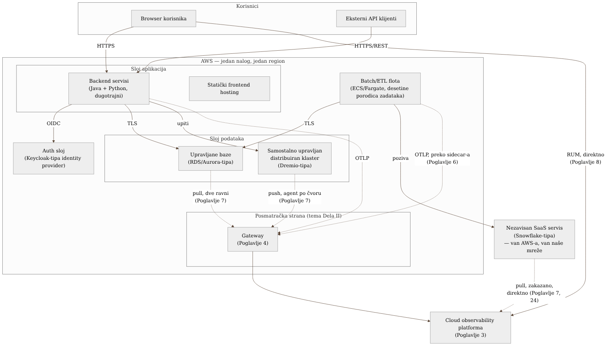

\chapter*{Deo II --- Arhitektura prikupljanja telemetrije}
\addcontentsline{toc}{chapter}{Deo II --- Arhitektura prikupljanja telemetrije}

## Pre nego što krenemo: šta tačno posmatramo

Svako poglavlje u ovom delu knjige uranja u jedan konkretan segment —
gateway, instrumentaciju, sidecar, pull-obrasce, frontend, sintetičko
praćenje — ali nijedno od njih ne staje da pokaže **celu sliku** pre nego
što uroni u detalj. Ovaj kratak, nenumerisan uvod postoji da popuni tu
prazninu: pre nego što pratiš kako se posmatra svaki pojedinačan deo,
vredi videti kako ti delovi uopšte izgledaju zajedno.

Implementacija koju knjiga prati posmatra sistem sastavljen od nekoliko
jasno razdvojenih slojeva, svi na AWS-u osim jednog namernog izuzetka:

- **Sloj aplikacija.** Desetine backend servisa (mešavina Java i Python,
  razlog za dve strategije instrumentacije iz Poglavlja 2 i 5) i frontend
  aplikacija koje korisnici otvaraju u browseru. Backend servisi su
  raspoređeni kao dugotrajni kontejnerski procesi; nijedan ne priča
  direktno sa cloud observability platformom — svi idu kroz gateway iz
  Poglavlja 4.
- **Sloj autentikacije.** Samostalno upravljan identity provider
  (Keycloak-tipa), ispred svega što zahteva prijavu — i sam predmet
  posmatranja (Poglavlje 20), ne samo infrastruktura koja omogućava
  posmatranje drugih delova.
- **Sloj podataka.** Dve različite kategorije, namerno razdvojene u
  Poglavlju 7: upravljane relacione baze (RDS/Aurora-tipa), gde AWS drži
  host i tim nema pristup mašini, i samostalno upravljan distribuiran
  compute klaster (Dremio-tipa), gde tim drži i host i proces.
- **Sloj batch/ETL obrade.** Flota kratkotrajnih kontejnerskih zadataka
  (AWS ECS/Fargate) koja se meri desetinama nezavisnih porodica poslova —
  cacher-i, transformacije, generatori izveštaja — svaki sa sopstvenim
  rasporedom i sopstvenim sidecar kolektorom (Poglavlje 6).
- **Mrežni sloj.** Load balanseri, NAT izlaz, privatne veze ka AWS
  servisima, DNS — infrastruktura koja nosi sve gore navedeno, i sama
  predmet posmatranja (Poglavlje 22).
- **Jedan namerni izuzetak od "sve je na AWS-u".** Nezavisan SaaS servis
  za analitiku podataka (Snowflake-tipa), koji živi potpuno van AWS-a i
  van mreže koju tim kontroliše. Ovaj sloj se pojavljuje prvi put u
  Poglavlju 7 (kao treći pull-obrazac) i dobija punu studiju slučaja u
  Poglavlju 24 — uveden je ovde samo da bi mapa bila kompletna.

Posmatračka strana — gateway, cloud platforma — je namerno tanka na ovom
dijagramu, jer je to tema kojom se bavi ostatak Dela II. Poenta ovog
pregleda je suprotna: pokazati **šta** se posmatra, pre nego što knjiga
objasni **kako**.

{: width="100%" }

Ovaj dijagram nije arhitektura observability sistema — to je arhitektura
sistema **koji** observability sistem posmatra. Razlika je namerna i vredi
je zapamtiti kroz ostatak Dela II: svako poglavlje koje sledi objašnjava
jednu isprekidanu strelicu sa ovog dijagrama u punoj dubini — zašto je baš
takva, zašto nije puna linija kao ostale, i šta bi se promenilo da jeste.
