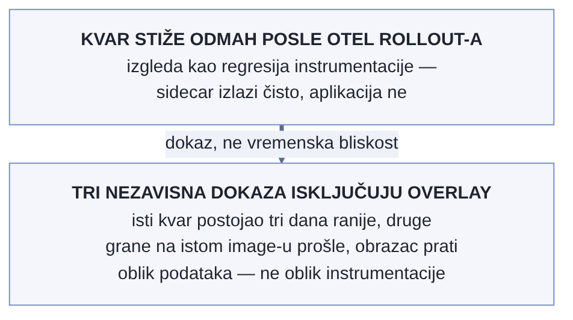

# Poglavlje 2 — OpenTelemetry: mentalni model pre prve linije koda

Pre standardizovanog brodskog kontejnera, transport robe je bio košmar
kombinatorike. Svaka luka je imala sopstvenu opremu za utovar, svaki brod
sopstveni raspored skladišta, svaka vrsta robe sopstveno pakovanje prilagođeno
tom konkretnom putu. Prebacivanje tovara sa broda na voz, pa na kamion, značilo
je da neko fizički prepakuje robu na svakoj tački prelaska — sporo, skupo, i
puno prilika da se nešto izgubi ili ošteti na granici između dva sistema.

Kontejner iz 1956. nije rešio problem tako što je izmislio bolji način
pakovanja robe. Rešio je problem tako što je standardizovao **granicu**:
tačne dimenzije, tačna mesta za kačenje, tačan način na koji se kontejner
podiže i spušta. Šta je *unutra* — čaj, mašinski delovi, tekstil — ostaje
potpuno nebitno za brod, dizalicu i voz. Oni ne znaju niti ih zanima sadržaj;
znaju samo oblik granice.

OpenTelemetry radi istu stvar za telemetriju. Ne propisuje kako aplikacija
treba da bude napisana, niti insistira na jednom jeziku ili frejmvorku. Propisuje
samo **oblik granice**: format u kome telemetrijski podatak putuje (OTLP),
i rečnik imena kojim se ta granica opisuje (semantičke konvencije) — tako da
kolektor, gateway i cloud platforma sa druge strane mogu da rade sa podatkom, a
da nikad nisu morali da znaju u kom je jeziku pisana aplikacija koja ga je
proizvela.

## Pre nego što krenemo dalje: tri pojma koja će se stalno vraćati

- **Instrumentacija** — kod (ili agent koji se kači na kod) koji generiše
  metrike, logove i tragove iz rada aplikacije. Može biti *automatska*
  (biblioteka to radi umesto tebe, bez izmene koda) ili *ručna*
  (eksplicitno dodaješ liniju koda koja emituje raspon ili atribut).
- **SDK** (software development kit) — biblioteka koju aplikacija
  uključuje da bi uopšte mogla da proizvede telemetriju u OpenTelemetry
  formatu; to je ono što Python servisi ispod eksplicitno inicijalizuju, a
  što Java agent radi u njihovo ime kroz bytecode manipulaciju.
- **Eksporter** — deo SDK-a (ili kolektora) čiji je jedini posao da uzme
  već generisanu telemetriju i pošalje je dalje, u OTLP formatu, ka
  sledećoj tački u lancu (kolektoru, gateway-u ili direktno cloud
  platformi).

## 2.1 Pitanje na koje ovo poglavlje odgovara

Pre nego što se napiše prva linija instrumentacije za bilo koju konkretnu
aplikaciju, mora se odgovoriti na pitanje koje određuje sve što dolazi posle:
**šta tačno OpenTelemetry standardizuje, a šta namerno ostavlja otvoreno da ga
svaki jezik i svaki tim reše na sebi svojstven način?**

Ovo pitanje nije akademsko. Odgovor direktno objašnjava zašto ista
organizacija, u istom sistemu, sasvim legitimno instrumentira Java servise na
jedan način, a Python servise na potpuno drugačiji način — i zašto to *nije*
nedoslednost, nego tačno onoliko slobode koliko OpenTelemetry namerno
dozvoljava iznad zajedničke granice koju svi moraju da poštuju.

## 2.2 Kako je to urađeno — praktičan pregled

U implementaciji koju knjiga prati, dva jezika dominiraju portfoliom aplikacija
— Java i Python — i instrumentacija je urađena na dva vidljivo različita
načina, svesnom odlukom, ne slučajno.

**Java servisi** koriste **auto-instrumentacioni agent**
(`opentelemetry-javaagent.jar`) koji se kači na JVM kroz `-javaagent` opciju
pri pokretanju, bez ijedne izmene u izvornom kodu aplikacije. Agent u runtime-u
prepoznaje poznate biblioteke (HTTP klijente, JDBC drajvere, poznate frejmvorke)
i automatski ubacuje instrumentaciju u njih preko bytecode manipulacije. Za tim
koji održava desetine Java servisa, ovo je bio odlučujući argument: nova
aplikacija dobija tragove, metrike i propagaciju konteksta prvog dana, bez
ijedne linije koda posvećene observability-ju, i bez rizika da neko zaboravi da
je doda.

**Python servisi** idu drugim putem — **SDK distribucija sa entrypoint
shim-om**. Ovde ne postoji ekvivalent Java agenta koji bi bio podjednako
pouzdan preko cele Python ekosistema (Python-ova auto-instrumentacija
funkcioniše kroz monkey-patching poznatih biblioteka pri startu procesa, što je
strukturno krhkije nego JVM-ov bytecode-manipulacioni pristup, i osetljivije na
verzije biblioteka). Umesto oslanjanja na tu krhkost, svaki Python servis ima
eksplicitnu, malu inicijalizacionu tačku — entrypoint shim — koji se pokreće
pre glavnog koda aplikacije, ručno postavlja OpenTelemetry SDK, provajdere i
eksportere, i tek onda predaje kontrolu aplikaciji. Instrumentacija je i dalje
uglavnom automatska za poznate biblioteke (kroz `opentelemetry-instrument`
sloj), ali je *inicijalizacija* eksplicitna i vidljiva u repozitorijumu, umesto
skrivena u startnom flagu.

Ono što ostaje **potpuno isto** za oba jezika, i to je suština ovog poglavlja:

- Format u kome oba tipa servisa šalju podatke dalje je **OTLP** (OpenTelemetry
  Protocol) preko HTTP-a, ka istom gateway-u iz Poglavlja 4.
- Imena atributa koje oba jezika koriste za iste koncepte (HTTP metoda, status
  kod, naziv baze, naziv servisa) dolaze iz **istog rečnika** — semantičkih
  konvencija — tako da upit u Grafana Cloud-u koji filtrira po
  `http.response.status_code` radi identično nad podacima iz Java i Python
  servisa, bez ijedne posebne logike po jeziku.
- Oba tipa servisa postavljaju isti minimalan skup resurs-atributa pri startu
  (naziv servisa, verzija, okruženje, instanca) — dogovor koji je nezavisan od
  jezika i propisan je kroz zajedničku internu konvenciju obrađenu u Poglavlju
  5.

Drugim rečima: **kako** se telemetrija proizvodi razlikuje se po jeziku i
razlogu koji taj jezik nameće. **Šta** telemetrija znači, kad stigne na
gateway, identično je bez obzira odakle je došla. To je tačno linija na kojoj
kontejner iz uvoda ovog poglavlja razdvaja "šta je unutra" od "kako izgleda
granica".

### Kvar odmah posle uvođenja OTel-a ne znači da ga je OTel izazvao

Uvođenje instrumentacije preko cele flote postojećih servisa nosi sopstveni
rizik da se svaki naredni kvar automatski pripiše novododatom sloju — a taj
refleks je greška podjednako često koliko je i koristan. Kad je jedna
porodica prognostičkih zadataka prešla na OTel (sidecar plus
auto-instrumentacija), prvi CRITICAL alarmi na novoj reviziji izgledali su
tačno kao regresija onboarding-a: zadaci su izlazili sa kodom 1 uz sopstvenu
grešku aplikacije, dok je `otel-sidecar` u istom pokretanju izlazio čisto, sa
kodom 0. Trag greške je bio `ValueError` u modelskom kodu — "cannot reindex
on an axis with duplicate labels" — i javljao se samo na jednoj konkretnoj
grani, ansambl varijanti modela za jedan region, dok su druge dve regionalne
grane u istom pokretanju, na istom image-u, prošle bez greške.

Tri nezavisne činjenice su oslobodile instrumentaciju krivice pre nego što je
iko dirao sam rollout: prvo, identičan kvar, ista poruka greške, ista grana,
već je bio zabeležen tri dana ranije — pre nego što je nova OTel revizija
uopšte postojala. Drugo, na istom image-u, u istom pokretanju, ostale dve
grane su prošle bez ijedne greške. Treće, obrazac kvara je bio uzan na način
koji prati *oblik podataka* (samo ansambl model, samo jedan region), ne na
način koji bi pratio *oblik instrumentacije* (što bi pogodilo sve grane
podjednako, ili nijednu). Pravi, pozitivan efekat onboarding-a bio je u tome
što su tek novododati logovi po zadatku, dostupni za pretragu po ID-u
zadatka, omogućili da se ustanovi da se isti kvar ponavlja četiri dana
zaredom — dijagnostička sposobnost koja pre instrumentacije nije postojala,
na grešci koju instrumentacija nije izazvala.

{: width="78%" }

Poenta za mentalni model ovog poglavlja: instrumentacija dodaje vidljivost,
ne dodaje nove načine da aplikativni kod pukne. Dokazivanje da je "vremenska
bliskost" i dalje samo bliskost, ne uzročnost, zahteva istu disciplinu dokaza
bez obzira da li je sumnjivi novi uzrok deploy koda ili rollout
observability-ja — a OTel rollout nije izuzet iz te discipline samo zato što
je "trebalo da bude bezbedan".

### Dodavanje instrumentacije ume da povuče štetu koja nema veze sa telemetrijom

Suprotan slučaj pokazuje drugu stranu iste lekcije: nekad kvar *jeste*
direktna posledica OTel rollout-a — ali ne same instrumentacije, nego
mehanike kojom je uvedena. Uključivanje OTel-a preko postojeće flote
zakazanih zadataka značilo je registrovanje nove revizije definicije svakog
zadatka — kloniranje stare definicije i dodavanje sidecar kontejnera.
Alokacija privremenog diska za zadatak deklariše se kao polje na istom nivou
kao lista kontejnera, ne unutar nje — a proces kloniranja korišćen za OTel
rollout to susedno polje nije preneo dalje. Tri zadatka u celoj floti su
imala eksplicitno postavljenu veću alokaciju diska od podrazumevane; sva tri
su tiho vraćena na podrazumevanu vrednost platforme u trenutku kad je
registrovana njihova OTel revizija.

Konkretna posledica: jedan od ta tri zadatka (veliki posao treniranja
modela, nedeljne učestalosti) udario je u podrazumevani limit dok je
upisivao velike privremene fajlove i pao sa greškom "nema više prostora na
disku" na svom prvom pokretanju na novoj reviziji — tri dana posle
registracije, jer se taj zadatak pokreće samo jednom nedeljno. Verifikacija
onboarding-a je proveravala zdravlje telemetrije (kolektor dostupan, nula
grešaka pri izvozu, serije stižu) — ne poklapanje definicije zadatka sa
prethodnom revizijom, polje po polje. Takvo poklapanje bi izbačeno polje
otkrilo za par sekundi; provera zdravlja telemetrije to strukturno ne može,
jer izbačeno polje nema nikakve veze sa telemetrijom.

Lekcija: uvođenje instrumentacije preko postojeće flote je promena
deploy-a, sa sopstvenim dometom štete nezavisnim od toga šta sama
instrumentacija radi — a provera da li telemetrijska cev radi jeste drugo
pitanje od provere da li je deploy koji tu cev nosi tiho promenio nešto
nepovezano.

## 2.3 Analitički deo — zašto je OTLP uopšte morao da postoji, i šta znače "semantičke konvencije"

### Problem koji je OpenTelemetry rešavao nije bio nedostatak alata, nego njihova nekompatibilnost

Pre OpenTelemetry-ja (nastalog spajanjem dva ranija projekta, OpenTracing i
OpenCensus, 2019. godine), organizacija koja je htela metrike, logove i
tragove birala je zaseban format i zaseban SDK za svaki od njih, često po
dobavljaču: Zipkin format za tragove, StatsD za metrike, sopstveni log format
za logove, svaki sa sopstvenim klijentskim bibliotekama po jeziku. Kad bi
organizacija htela da promeni dobavljača posmatračke platforme, morala je da
menja instrumentaciju u svakoj aplikaciji — jer je sam **format podatka** bio
vezan za dobavljača, ne samo destinacija kojoj se šalje.

OTLP rešava taj problem na isti način na koji standardni kontejner rešava
problem transporta: definiše jedan protokol (Protocol Buffers preko gRPC-a ili
HTTP-a) sa jasno definisanom šemom za sva tri tipa signala, nezavisan od bilo
kog konkretnog dobavljača. Aplikacija govori OTLP; kolektor i gateway prevode
OTLP u šta god konkretna cloud platforma očekuje sa svoje strane. Ovo je razlog
zašto je promena dobavljača u sistemu koji knjiga prati (da je do nje ikad
došlo) posao gateway sloja iz Poglavlja 4, ne posao ijedne pojedinačne
aplikacije — tačno onako kako promena luke u koju brod pristaje ne zahteva da
se roba u kontejneru prepakuje.

### Semantičke konvencije: rečnik, ne implementacija

Semantičke konvencije su, po zvaničnoj OpenTelemetry dokumentaciji, dogovoren
skup imena i tipova za atribute koji opisuju uobičajene koncepte — HTTP zahtev,
baza podataka, sistem za razmenu poruka, resurs koji generiše telemetriju. Cilj
nije da propišu *kako* se telemetrija generiše (to ostaje posao SDK-a i
instrumentacione biblioteke za svaki jezik), nego da garantuju da, kad dva
različita sistema oba emituju "HTTP status kod odgovora", koriste isto ime
atributa (`http.response.status_code`) i isti tip vrednosti — tako da upit,
dashboard ili alarm napisan protiv tog imena radi identično bez obzira odakle
podatak dolazi.

Ovo izgleda kao sitna administrativna pojedinost dok se ne suoči sa
alternativom: sistem sa desetinama servisa u dva jezika, gde svaki tim
samostalno bira imena atributa, neizbežno završava sa `status_code`,
`statusCode`, `http_status` i `response_code` kao četiri različita imena za
istu stvar u četiri različita servisa — što znači da svaki dashboard koji želi
da prikaže grešku *preko svih servisa* mora ili da broji četiri puta, ili da
neko ručno normalizuje podatak posle činjenice, obično upravo u trenutku kad je
brzina najbitnija — usred incidenta.

**Resursni atributi** (koji opisuju *odakle* telemetrija dolazi — servis,
verzija, okruženje, instanca — za razliku od atributa na pojedinačnom rasponu
ili merenju, koji opisuju *šta se dogodilo*) igraju posebno bitnu ulogu iz
zvanične dokumentacije: oni se prilažu jednom, pri inicijalizaciji SDK-a, i
automatski prate svaki signal koji taj proces emituje otad — što ih čini
prirodnim mestom da se reši baš problem iz prethodnog pasusa, jednom, na jednom
mestu po servisu, umesto da se ponavlja u svakoj instrumentacionoj tački.

### Zašto ovo opravdava različit pristup po jeziku, umesto da ga čini rizikom

Vredi eksplicitno primetiti šta bi se dogodilo da je odlučeno suprotno — da
oba jezika moraju da koriste identičan mehanizam instrumentacije (recimo,
oba prisiljena na eksplicitan SDK setup, ili oba prisiljena na
auto-instrumentacioni agent bez obzira na zrelost te tehnike u datom jeziku).

Da su Python servisi prisiljeni na potpuno automatski, "zero-code" pristup po
ugledu na Java agent, tim bi nasledio krhkost koju Python-ov
monkey-patching pristup ima u odnosu na Java-in bytecode pristup — tiha
neuspešna instrumentacija kad se ažurira verzija biblioteke, bez jasnog
signala da se to dogodilo, otkrivena tek kad neko primeti da nedostaju tragovi
za servis koji je "trebalo" da bude instrumentiran. Obrnuto, da su Java servisi
prisiljeni na eksplicitan SDK setup po ugledu na Python, tim bi žrtvovao baš
onu prednost koja Java agent čini vrednim — trenutnu instrumentaciju nove
aplikacije bez ijedne linije koda — bez ijedne realne koristi zauzvrat, jer Java
agent nema onu strukturnu krhkost koju Python monkey-patching pristup ima.

Poenta za čitaoca: OpenTelemetry namerno standardizuje granicu (OTLP,
semantičke konvencije, resursni atributi), a namerno *ne* standardizuje
mehanizam po jeziku — jer bi taj drugi izbor prisilio bar jedan jezik u
implementacionu tehniku koja mu ne odgovara. Kada standard ostavlja nešto
otvoreno, vredi proveriti da li je to prostor namerno ostavljen za lokalnu
odluku, pre nego što se protumači kao nedostatak standarda.

## 2.4 Skupljena pravila iz ovog poglavlja

- Odaberi mehanizam instrumentacije (auto-instrumentacioni agent naspram
  eksplicitnog SDK setup-a) po zrelosti te tehnike u konkretnom jeziku, ne po
  dosluednosti sa drugim jezicima u portfoliju.
- Nikad ne izmišljaj sopstveno ime atributa za koncept koji već ima ime u
  semantičkim konvencijama — proveri prvo, čak i kad "izgleda" da tvoj slučaj
  nije pokriven.
- Resursne atribute postavi jednom, na inicijalizaciji, i tretiraj ih kao
  ugovor koji svaki servis u sistemu mora da poštuje identično — to je
  najjeftinije mesto da se spreči četiri različita imena za istu stvar.
- OTLP je razlog zašto promena posmatračke platforme treba da bude posao
  gateway sloja, ne posao svake pojedinačne aplikacije — proveri da li je
  tvoj sistem stvarno tako organizovan, ili je ta pretpostavka samo
  deklarativna.
- Kad standard ostavlja nešto otvoreno (kao mehanizam instrumentacije po
  jeziku), pretpostavi da je to namerno, i traži razlog pre nego što
  pokušaš da to "poravnaš" radi doslednosti.
- Kad se nešto pokvari odmah posle uvođenja instrumentacije, ne pretpostavljaj
  automatski da je instrumentacija uzrok — proveri da li se isti kvar javljao
  i pre, i da li obrazac kvara prati oblik podataka ili oblik rollout-a.
- Kad instrumentaciju uvodiš preko postojeće flote kloniranjem definicije
  zadatka, uporedi novu definiciju polje-po-polje sa starom — telemetrijski
  "zdrav" rollout ume da tiho izbriše nešto što nema nikakve veze sa
  telemetrijom.

## 2.5 Vežba za čitaoca

Uzmi dva servisa u svom sistemu pisana u različitim jezicima i uporedi kojim
imenom svaki od njih beleži isti koncept — HTTP status kod, naziv baze kojoj se
obraća, ili trajanje poziva. Ako se imena razlikuju, potraži odgovarajuće ime u
zvaničnim semantičkim konvencijama i proveri da li bar jedan od dva servisa
već odstupa od njih bez razloga — to je konkretan, malen popravak koji odmah
plaća sledeći dashboard koji pokušaš da napraviš preko oba servisa.

---

### Izvori korišćeni u analitičkom delu

- [OpenTelemetry Protocol (OTLP) Specification](https://opentelemetry.io/docs/specs/otlp/)
- [Semantic Conventions — OpenTelemetry](https://opentelemetry.io/docs/specs/semconv/)
- [Resource Semantic Conventions — OpenTelemetry](https://opentelemetry.io/docs/specs/semconv/resource/)
- [OpenTelemetry Java Agent — Zero-code instrumentation](https://opentelemetry.io/docs/zero-code/java/agent/)
- [OpenTelemetry Python — Zero-code instrumentation](https://opentelemetry.io/docs/zero-code/python/)
- [History of OpenTelemetry — CNCF](https://opentelemetry.io/docs/what-is-opentelemetry/)
