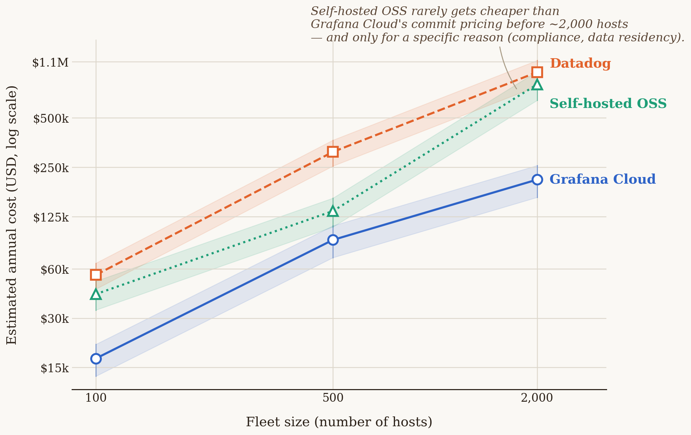

# Chapter 3 — Choosing a platform: why Grafana Cloud

Picture a small delivery company just opening for business in a new city.
The first decision isn't "which truck should we buy" — the first decision is
whether to buy anything at all. Leasing a fleet means: you pay per mile and
per day, someone else worries about servicing it, fueling it, sourcing spare
parts and a mechanic, and when business slows down in January, you simply
hand back half the vans and stop paying for them. Buying a fleet means the
opposite: a large upfront cost, your own garage, your own mechanics on
payroll twelve months a year regardless of season — but the cost per mile
driven, at high volume, eventually drops below the cost of leasing.

Neither of these two decisions is universally "better." It depends entirely
on volume: a company with five vans almost never needs its own garage; a
company with five hundred trucks driving the same routes every day almost
always does. The mistake both types of companies make is basing the decision
on company size instead of on volume and predictability of spend.

The exact same decision, in the exact same shape, awaits every team rolling
out observability: whether to **lease** a managed platform (Grafana Cloud,
Datadog, and similar — you pay by data volume and by seat, someone else
runs the infrastructure), or to **build and run your own** LGTM stack (Loki,
Grafana, Tempo, Mimir — free software, but your own EKS cluster, your own
disks, your own engineer getting paged at 3 a.m. when Mimir stops accepting
writes). This chapter is that calculation, done honestly, with real prices.

## 3.1 The question this chapter answers

Before the book gets into the technical details of the LGTM stack — Loki for
logs, Tempo for traces, Mimir for metrics, Grafana for visualization, all as
one product in the chapters that follow — it's worth answering the question
every reader asks first, and one that rarely gets an honest answer in any
vendor's documentation: **does it even pay to buy this as a service, or is
it cheaper to run your own?** And, while we're at it, **why Grafana Cloud
specifically, and not Datadog, ServiceNow, or some third option?**

## 3.2 How it was actually done — a practical walkthrough

In the implementation this book follows, the decision was made in two
separate steps, months apart — which is itself an important lesson: **this
isn't one decision, it's two different decisions that are easy to conflate.**

**Step one — which platform, if leasing.** Before any instrumentation was
rolled out, a price comparison was done across several managed observability
platforms (Grafana Cloud, Datadog, ServiceNow Cloud Observability, New
Relic) based on expected telemetry volume and team size. The result of that
comparison — worked out with real, publicly available price lists in this
chapter's analytical section — favored Grafana Cloud on total cost at the
team's actual scale, with the added advantage that the free tier lets you
*try* the system in production before signing any contract at all.

**Step two — lease or build.** Separately from the vendor choice, a
strategic decision was made **not** to build a self-hosted LGTM stack on
EKS, for one reason that recurs throughout this book: the company this
implementation was built for **is not an enterprise-scale corporation** — it
has no tens of thousands of hosts, no existing platform team whose sole job
is maintaining internal observability infrastructure. The estimated cost of
adding that responsibility to an existing, small infrastructure team came
out higher than the cost of a Grafana Cloud subscription. This calculation —
with real numbers, not just intuition — is worked out in § 3.3.

**What actually happened afterward.** The decision wasn't "set it once and
forget it." As the number of instrumented services grew, the system at one
point **blew through the free tier in a single weekend** — metric
cardinality consumption exceeded the quota faster than anyone had planned
for. The response to that moment wasn't "let's switch to self-hosted to
avoid the bill" (Chapter 11 shows in detail why that would have been a
panicked, not a rational, decision at that point), but two parallel moves:
upgrading to the paid **Pro** tier (so the system would immediately stop
dropping data), and kicking off a multi-phase cardinality-reduction project
(native histograms, aggregation at the gateway, tuning the Tempo
metrics-generator — all covered in Chapter 11) that brought the monthly bill
back to a predictable level. This is an important departure from how this
decision is often portrayed in vendor marketing: moving from a free to a
paid tier wasn't a defeat, it was an expected, planned step — the system was
doing exactly what it was supposed to; it just found its limit sooner than
anyone expected.

**What was actually adopted, technically.** The result of both steps is
Grafana Cloud as the managed version of four open-source components:

| Component | Role | What the self-hosted equivalent would be |
| --- | --- | --- |
| **Mimir** | Metrics storage and querying (Prometheus-compatible) | Your own Mimir/Prometheus cluster |
| **Loki** | Log storage and querying | Your own Loki cluster + object storage |
| **Tempo** | Trace storage and querying | Your own Tempo cluster + object storage |
| **Grafana** | Visualization, alerting, dashboards | Your own Grafana OSS deployment |

All four components are, individually, **free open-source software**. What
you pay for with Grafana Cloud isn't the software — it's the *operation*:
scaling, backups, upgrades, multi-tenant isolation, 24/7 on-call over
someone else's infrastructure. That's exactly what § 3.3 measures in
dollars.

## 3.3 Analytical section — what the price comparison actually shows

### Price lists, as they really are

Observability platform pricing is deliberately hard to compare directly —
each one measures a different unit (host, GB, active series, seat, span).
The table below reduces four real platforms to what each actually charges
for, per published price lists:

| Platform | How it's billed | Concrete numbers (published) |
| --- | --- | --- |
| **Grafana Cloud** (Pro) | Platform + per seat + per volume | $19/month platform + $8/active user (3 free) + $6.50 per 1,000 active metric series above 10K free + ~$0.45/GB for logs and traces (processing + ingestion) + $0.10/GB/month retention |
| **Datadog** | Per host + per feature + per volume | $15/host/month (infra, annual) + $31/host/month (APM) + $0.10/GB indexed logs + $1.27 per million ingested log events + $1.70 per million indexed spans |
| **New Relic** | Per volume + per seat | 100 GB/month free, then $0.40/GB; $49/seat (Core) up to $99–349/seat (Full Platform, depending on tier) |
| **ServiceNow Cloud Observability** (formerly Lightstep) | Not publicly published | No price list available without talking to sales — which itself says something about the target buyer (a large enterprise procurement, not a self-serve team of a few engineers) |

**A first, often overlooked line item: Grafana Cloud also charges per seat,
not just by data volume.** A team that budgets purely on expected
metric/log/trace volume and forgets that every additional engineer with
Grafana access beyond the first three carries $8/month will end up with a
bill higher than planned — a small amount per head, but linear with team
growth, and easy to miss because it isn't a "telemetry" cost in the narrow
sense.

At a realistic small-to-midsize company scale (say, around thirty
instrumented services, a team of about ten engineers with dashboard access,
moderate log volume), this comparison consistently favors Grafana Cloud over
Datadog — the biggest reason being Datadog's "per host" model, which doesn't
map well onto containerized, ephemeral infrastructure (dozens of
short-lived batch jobs starting and stopping on a schedule look like dozens
of "hosts" in a model designed for stable, long-running servers). New Relic
is more competitive at low volume (100 GB free is generous), but the
per-seat price climbs fast once the team outgrows a few people on the Full
Platform tier. ServiceNow's unpublished price is, paradoxically,
information in itself: platforms that require "contact sales" before showing
a single number tend to target budgets a small team doesn't have.

### Self-hosted OSS: where leasing stops paying off

This is a question standard vendor comparisons deliberately avoid, since no
vendor has any interest in showing you the point where its product stops
being the cheapest option. An independent analysis of that question — one
that accounts for both your own infrastructure *and* engineering time, not
just server cost — gives a clearer picture than the intuition of "bigger
company = self-hosted pays off":

{: width="95%" }

The data in the chart (estimated annual cost at three infrastructure-scale
control points, from an independent mid-market cost analysis) shows three
things worth calling out:

1. **At small and mid scale (up to roughly 500 hosts), Grafana Cloud is
   clearly cheaper than both Datadog and self-hosted OSS** — even when
   self-hosted is counted purely on infrastructure cost, let alone once you
   add the salary of the engineer maintaining that infrastructure.
2. **Self-hosted OSS "looks cheap" only as long as you count server cost
   alone, and always looks more expensive the moment you add the real cost
   of engineering time.** One FTE (a full-time engineer) dedicated solely to
   maintaining the observability platform easily exceeds $300,000 a year in
   total cost (salary + benefits + overhead) — a figure that has to enter
   the calculation, not just the cost of EBS volumes and EC2 instances.
3. **The crossover point is much farther out than the "we're a big
   company" intuition suggests.** The self-hosted option only starts
   approaching the price of Grafana Cloud's negotiated (commit) pricing at a
   scale of several thousand hosts — and even then, the right call for
   self-hosted rarely comes from savings alone; it comes from a **specific
   reason** a cloud option can't satisfy: an air-gapped environment, a
   regulatory requirement for data residency in your own data center, or a
   contractual ban on sending telemetry outside your own infrastructure.
   Without such a reason, "we're big enough to run our own LGTM stack" is,
   based on these numbers, often the wrong conclusion — not because
   self-hosted is bad, but because the break-even point sits farther out
   than it looks at first glance.

**Recommendation for a reader running enterprise-scale infrastructure:** if
your company already has thousands of hosts, an existing platform team, and
— crucially — a concrete reason telemetry must never leave your own network,
a self-hosted Grafana OSS LGTM stack on EKS stops being the "cheaper
alternative" and becomes a **rational, documented choice**, not a risk taken
for the sake of thrift. For everyone below that line — and most companies
are below that line — Grafana Cloud (or a comparable managed platform) is
the more rational starting point, with the self-hosted option staying open
for later, once the numbers genuinely justify it.

### Back to the fleet

A leased van follows similar logic to Grafana Cloud's free tier: low entry
cost, you pay for exactly what you use, and if your volume estimate turns
out wrong, the mistake shows up immediately as a bigger bill — not as a
catastrophe, because the van rental company doesn't stop operating when you
blow through your monthly mileage limit, exactly the way Grafana Cloud
doesn't stop working when you blow through your quota — it just starts
charging more. Your own garage only makes sense once volume is predictable
enough and large enough that the mechanic's fixed cost stops being a risk
and becomes a saving — which is exactly that several-thousand-host threshold
from the chart above, not "the company has more than fifty employees."

## 3.4 Rules collected from this chapter

- These are **two separate decisions**, not one: (1) which platform to
  lease, if leasing, and (2) whether to lease at all or build your own.
  Don't measure them with the same argument.
- When comparing platform prices, convert everything to the same unit before
  comparing — "per host" and "per GB" and "per active series" aren't
  comparable without translating them to your actual scale.
- Don't forget to include the per-seat cost alongside the per-volume cost —
  on some platforms (Grafana Cloud, New Relic) that grows linearly with team
  size, not with telemetry volume.
- Self-hosted "free software" is never free — factor in the full cost of at
  least one FTE (~$300k+/year total cost) before comparing it to a managed
  platform's price.
- "We're a big company" isn't a sufficient reason for self-hosted. A
  sufficient reason is concrete: a scale of several thousand hosts **and** a
  clear operational or regulatory reason telemetry can't leave your own
  network.
- Blowing through a free tier isn't a defeat — it's a signal the system has
  reached its next phase, and needs a planned response (upgrade + cardinality
  control), not a panicked migration.

## 3.5 Exercise for the reader

Take your system's current (or planned) telemetry volume — number of
instrumented services, number of hosts/jobs, estimated log volume in
GB/month, and the size of the team that needs dashboard access. Translate
that volume into a price at at least two of the platforms in the § 3.3
table, including the per-seat cost. Then, separately, estimate the real
annual cost of one FTE on your team who would be partially (say, 20%)
dedicated to maintaining a self-hosted alternative. Compare all three
numbers. If the difference is under 20%, the decision probably shouldn't be
made on price — you should look for a different criterion (operational
risk, regulatory requirement, existing team expertise).

---

### Sources used in the analytical section

- [Grafana Cloud Pricing In 2026: What It Really Costs — CloudZero](https://www.cloudzero.com/blog/grafana-cloud-pricing/)
- [Grafana Cloud Pricing 2026 — MonitoringCost.com](https://monitoringcost.com/grafana-cloud-pricing)
- [Datadog Pricing 2026: Full Cost Breakdown & How to Save — Last9](https://last9.io/blog/datadog-pricing-all-your-questions-answered/)
- [New Relic Pricing 2026 — MonitoringCost.com](https://monitoringcost.com/new-relic-pricing)
- [ServiceNow Cloud Observability Pricing — TrustRadius](https://www.trustradius.com/products/servicenow-cloud-observability/pricing)
- [Datadog vs Grafana Cloud vs self-hosted Grafana: the mid-market observability cost decision — Optivulnix](https://optivulnix.com/blog/datadog-vs-grafana-cloud-self-hosted-grafana-mid-market/)
