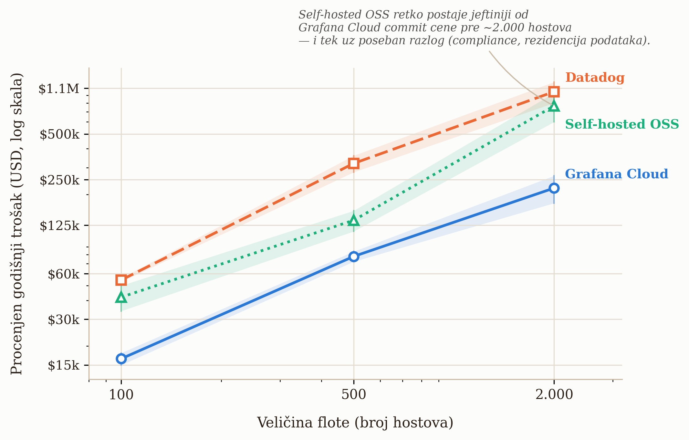

# Poglavlje 3 — Izbor platforme: zašto Grafana Cloud

Zamisli malu dostavnu firmu koja tek otvara posao u novom gradu. Prva odluka
nije "koji kamion da kupimo" — prva odluka je da li uopšte da se kupuje bilo
šta. Iznajmljivanje voznog parka znači: platiš po kilometru i po danu, neko
drugi brine o servisu, gorivu za rezervne delove i mehaničaru, i kad posao
opadne u januaru, jednostavno vratiš pola kombija i prestaneš da plaćaš za
njih. Kupovina voznog parka znači suprotno: veliki početni trošak, sopstvena
radionica, sopstveni mehaničari na platnom spisku dvanaest meseci godišnje bez
obzira na sezonu — ali cena po pređenom kilometru, na velikom obimu, na kraju
padne ispod cene iznajmljivanja.

Nijedna od te dve odluke nije univerzalno "bolja". Zavisi isključivo od obima:
firma sa pet kombija skoro nikad ne treba sopstvenu radionicu; firma sa pet
stotina kamiona koja vozi svaki dan po istim rutama, skoro uvek treba. Greška
koju prave i jedni i drugi je da odluku donesu na osnovu veličine firme, umesto
na osnovu obima i predvidljivosti potrošnje.

Ista odluka, u istom obliku, čeka svaki tim koji uvodi observability: da li da
se **iznajmi** upravljana platforma (Grafana Cloud, Datadog i slično — plaćaš po
zapremini podataka i po korisniku, neko drugi drži infrastrukturu), ili da se
**izgradi i vodi sopstveni** LGTM stack (Loki, Grafana, Tempo, Mimir — besplatan
softver, ali sopstveni EKS klaster, sopstveni disk, sopstveni inženjer koji ga
budi u tri ujutru kad Mimir prestane da prima upise). Ovo poglavlje je taj
proračun, urađen pošteno, sa realnim cenama.

## 3.1 Pitanje na koje ovo poglavlje odgovara

Pre nego što knjiga uđe u tehničke detalje LGTM stacka — Loki za logove, Tempo
za trejsove, Mimir za metrike, Grafana za vizuelizaciju, sve kao jedan proizvod
u sledećim poglavljima — vredi odgovoriti na pitanje koje svaki čitalac
postavlja prvo, i koje retko dobija pošten odgovor u dokumentaciji bilo kog
dobavljača: **da li se ovo uopšte isplati platiti kao uslugu, ili je jeftinije
voditi sopstveno?** I, usput, **zašto baš Grafana Cloud, a ne Datadog,
ServiceNow ili neko treći?**

## 3.2 Kako je to urađeno — praktičan pregled

U implementaciji koju knjiga prati, odluka je doneta u dva odvojena koraka, u
razmaku od nekoliko meseci — što je samo po sebi važna lekcija: **ovo nije
jedna odluka, nego dve različite odluke koje se lako pobrkaju.**

**Prvi korak — koju platformu, ako se iznajmljuje.** Pre uvođenja bilo kakve
instrumentacije, urađeno je poređenje cena kod nekoliko upravljanih
observability platformi (Grafana Cloud, Datadog, ServiceNow Cloud
Observability, New Relic) na osnovu očekivane zapremine telemetrije i veličine
tima. Rezultat tog poređenja — razrađen sa realnim, javno dostupnim cenovnicima
u analitičkom delu ovog poglavlja — favorizovao je Grafana Cloud po ukupnoj
ceni na obimu tima koji je u pitanju, uz dodatnu prednost da besplatan tier
dozvoljava da se sistem prvo *proba* u produkciji pre nego što se potpiše bilo
kakav ugovor.

**Drugi korak — iznajmiti ili graditi.** Zasebno od izbora dobavljača, doneta
je strateška odluka da se **ne** gradi sopstveni self-hosted LGTM stack na
EKS-u, iz jednog razloga koji se ponavlja kroz celu ovu knjigu: firma na kojoj
je implementacija rađena **nije enterprise-obima korporacija** — nema
desetine hiljada hostova, nema postojeći platformski tim čiji je posao
isključivo održavanje interne posmatračke infrastrukture. Trošak dodavanja
te odgovornosti postojećem, malom infrastrukturnom timu bio je proceniv veći
od cene Grafana Cloud pretplate. Ovaj proračun — sa realnim brojevima, ne samo
intuicijom — razrađen je u § 3.3.

**Šta se zapravo desilo posle.** Odluka nije bila "podesi jednom i zaboravi".
Kako je broj instrumentisanih servisa rastao, sistem je u jednom trenutku
**probio besplatni tier za jedan vikend** — potrošnja kardinalnosti metrika — broja jedinstvenih kombinacija labela
koje metrike proizvode, detaljno u Poglavlju 11 — je premašila kvotu brže
nego što je iko planirao. Reakcija na taj trenutak nije
bila "pređimo na self-hosted da izbegnemo račun" (Poglavlje 11 detaljno
pokazuje zašto bi to u tom trenutku bila panična, ne racionalna odluka), nego
dva paralelna poteza: nadogradnja na plaćeni **Pro** tier (da sistem odmah
prestane da gubi podatke), i pokretanje višefaznog projekta smanjenja
kardinalnosti (native histogrami, agregacija na gateway-u, podešavanje Tempo
metrics-generatora — sve razrađeno u Poglavlju 11) koji je mesečni račun
vratio na predvidljiv nivo. Ovo je važna razlika u odnosu na to kako se ova
odluka često prikazuje u marketingu dobavljača: prelazak sa besplatnog na
plaćeni tier nije bio poraz, nego očekivan, planiran korak — sistem je radio
tačno ono što je trebalo, samo je otkrio granicu ranije nego što je iko
očekivao.

**Šta je tehnički usvojeno.** Rezultat oba koraka je Grafana Cloud kao
upravljana verzija četiri open-source komponente:

| Komponenta | Uloga | Šta bi bio self-hosted ekvivalent |
| --- | --- | --- |
| **Mimir** | Skladištenje i upit nad metrikama (Prometheus-kompatibilan) | Sopstveni Mimir/Prometheus klaster |
| **Loki** | Skladištenje i upit nad logovima | Sopstveni Loki klaster + object storage |
| **Tempo** | Skladištenje i upit nad trejsovima | Sopstveni Tempo klaster + object storage |
| **Grafana** | Vizuelizacija, alarmiranje, dashboard-i | Sopstveni Grafana OSS deployment |

Sve četiri komponente su, pojedinačno, **besplatan open-source softver** — ono
što se plaća kod Grafana Cloud-a nije softver, nego *operacija*: skaliranje,
backup, nadogradnje, multi-tenant izolacija, 24/7 dežurstvo nad tuđom
infrastrukturom. To je tačno ono što se u § 3.3 meri u dolarima.

## 3.3 Analitički deo — šta zaista pokazuje poređenje cena

### Cenovnici, onakvi kakvi zaista jesu

Cenovnici observability platformi su namerno teški za direktno poređenje —
svaka meri drugu jedinicu (host, GB, aktivna serija, korisnik, span). Tabela
ispod svodi četiri realne platforme na ono što svaka zaista naplaćuje, po
objavljenim cenovnicima, tačnim na dan pisanja ovog poglavlja (2026) —
dobavljači menjaju cenovnike bez najave, pa konkretne brojeve ispod tretiraj
kao ilustraciju metode poređenja, ne kao aktuelnu ponudu; proveri zvaničan
cenovnik pre bilo koje odluke:

| Platforma | Kako se naplaćuje | Konkretni brojevi (objavljeno) |
| --- | --- | --- |
| **Grafana Cloud** (Pro) | Platforma + po korisniku + po zapremini | $19/mesec platforma + $8/aktivni korisnik (3 besplatna) + $6.50 po 1.000 aktivnih serija metrika iznad 10K besplatnih + ~$0.45/GB za logove i trejsove (obrada + upis) + $0.10/GB/mesec zadržavanje |
| **Datadog** | Po hostu + po funkciji + po zapremini | $15/host/mesec (infra, godišnje) + $31/host/mesec (APM) + $0.10/GB indeksiran log + $1.27 po milion unetih log događaja + $1.70 po milion indeksiranih spanova |
| **New Relic** | Po zapremini + po korisniku | 100 GB/mesec besplatno, zatim $0.40/GB; $49/korisnik (Core) do $99–349/korisnik (Full Platform, zavisno od nivoa) |
| **ServiceNow Cloud Observability** (bivši Lightstep) | Nije javno objavljeno | Cenovnik nije dostupan bez razgovora sa prodajom — samo po sebi govori ko je ciljni kupac (velika enterprise nabavka, ne samoposlužni tim od par inženjera) |

**Prva, često zanemarena stavka: Grafana Cloud se naplaćuje i po korisniku, ne
samo po zapremini podataka.** Tim koji planira budžet isključivo na osnovu
očekivane zapremine metrika/logova/trejsova, a zaboravi da svaki dodatni
inženjer sa pristupom Grafani iznad prva tri nosi $8/mesec, dobiće račun veći
od plana — mali iznos po glavi, ali linearan sa rastom tima, i lako se
previdi jer nije "telemetrijski" trošak u užem smislu.

Na realističnom obimu male-do-srednje firme (recimo, tridesetak instrumentisanih
servisa, tim od desetak inženjera sa pristupom dashboard-ima, umerena zapremina
logova) ovo poređenje dosledno favorizuje Grafana Cloud nad Datadog-om — najveći
razlog je Datadog-ov model "po hostu" koji se ne poklapa dobro sa kontejnerskom,
efemernom infrastrukturom (desetine kratkotrajnih batch zadataka koji se pale i
gase po rasporedu izgledaju kao desetine "hostova" u modelu koji je zamišljen za
stabilne, dugotrajne servere). New Relic je konkurentniji na maloj zapremini
(100 GB besplatno je velikodušno), ali se cena po korisniku brzo penje čim tim
preraste par ljudi na Full Platform nivou. ServiceNow-ova neobjavljena cena je,
paradoksalno, sama po sebi informacija: platforme koje traže "kontaktirajte
prodaju" pre nego što pokažu ijedan broj, po pravilu ciljaju budžete koje mali
tim nema.

### Self-hosted OSS: kad se iznajmljivanje prestaje isplatiti

Ovo je pitanje koje standardna poređenja dobavljača namerno izbegavaju, jer
nijedan dobavljač nema interes da ti pokaže tačku u kojoj njegov proizvod
prestaje biti najjeftinija opcija. Nezavisna analiza tog pitanja — koja
uključuje i sopstvenu infrastrukturu *i* inženjersko vreme, ne samo cenu
servera — daje jasniju sliku nego intuicija "veća firma = self-hosted se
isplati":

{: width="95%" }

Podaci na grafikonu (procenjeni godišnji trošak na tri kontrolne tačke obima
infrastrukture, iz nezavisne analize troškova za srednje tržište) pokazuju tri
stvari koje vredi izdvojiti:

1. **Na malom i srednjem obimu (do otprilike 500 hostova), Grafana Cloud je
   jasno jeftiniji i od Datadog-a i od self-hosted OSS-a** — čak i kad se
   self-hosted računa samo po ceni infrastrukture, a kamoli kad se doda plata
   inženjera koji tu infrastrukturu održava.
2. **Self-hosted OSS "izgleda jeftino" dok se računa samo cena servera, i
   uvek izgleda skuplje čim se doda realna cena inženjerskog vremena.** Jedan
   FTE (inženjer sa punim radnim vremenom) posvećen isključivo održavanju
   observability platforme lako prelazi $300.000 godišnje ukupnog troška
   (plata + benefiti + overhead) — cifra koja mora ući u proračun, ne samo
   cena EBS diskova i EC2 instanci.
3. **Crossover tačka je mnogo dalje nego što intuicija "mi smo velika firma"
   sugeriše.** Self-hosted opcija tek na obimu od nekoliko hiljada hostova
   počinje da se približava ceni Grafana Cloud-ovih pregovorenih (commit)
   cena — i čak i tada, prava odluka za self-hosted retko dolazi samo iz
   uštede; dolazi iz **specifičnog razloga** koji cloud opcija ne može da
   zadovolji: air-gapped okruženje, regulatorni zahtev za rezidenciju
   podataka u sopstvenom data centru, ili ugovorna zabrana slanja
   telemetrije van sopstvene infrastrukture. Bez takvog razloga, "mi smo
   dovoljno veliki da sami vodimo LGTM stack" je, na osnovu ovih brojeva,
   često pogrešan zaključak — ne zato što je self-hosted loš, nego zato što
   se prag isplativosti pomera dalje nego što izgleda na prvi pogled.

**Preporuka za čitaoca koji vodi enterprise-obimu infrastrukturu:** ako tvoja
firma već ima hiljade hostova, postojeći platformski tim, i — što je ključno —
konkretan razlog zašto telemetrija ne sme napustiti sopstvenu mrežu, self-hosted
Grafana OSS LGTM stack na EKS-u prestaje biti "jeftinija alternativa" i postaje
**racionalan, dokumentovan izbor**, ne rizik koji se prihvata iz štedljivosti.
Za sve ispod te linije — a većina firmi je ispod te linije — Grafana Cloud (ili
uporediva upravljana platforma) je racionalniji početak, sa self-hosted opcijom
koja ostaje otvorena za kasnije, kad brojevi zaista to opravdaju.

### Vratimo se na vozni park

Kombi koji se iznajmljuje ima sličnu logiku kao Grafana Cloud besplatni tier:
nizak ulazni trošak, plaćaš tačno ono što potrošiš, i ako procena obima bude
pogrešna, greška se oseti odmah kroz veći račun — ne kroz katastrofu, jer
firma za iznajmljivanje kombija ne prestaje da radi kad ti probiješ svoj
mesečni kilometražni limit, baš kao što Grafana Cloud ne prestaje da radi kad
se probije kvota, samo počne da naplaćuje više. Sopstvena radionica ima smisla
tek kad je obim toliko predvidljiv i toliko velik da fiksni trošak mehaničara
prestane da bude rizik i postane ušteda — što je tačno onaj prag od nekoliko
hiljada hostova sa grafikona iznad, ne "firma ima više od pedeset zaposlenih".

## 3.4 Skupljena pravila iz ovog poglavlja

- Ovo su **dve odvojene odluke**, ne jedna: (1) koju platformu iznajmiti, ako
  se iznajmljuje, i (2) da li uopšte iznajmiti ili graditi sopstveno. Ne meriti
  ih istim argumentom.
- Kad poredite cenu platformi, prevedite sve na istu jedinicu pre poređenja —
  "po hostu" i "po GB" i "po aktivnoj seriji" nisu uporedivi bez prevoda na
  vaš stvarni obim.
- Ne zaboravite da uračunate cenu po korisniku (sedištu) uz cenu po zapremini
  podataka — kod nekih platformi (Grafana Cloud, New Relic) to raste linearno
  sa veličinom tima, ne sa količinom telemetrije.
- Self-hosted "besplatan softver" nikad nije besplatan — uračunajte punu cenu
  bar jednog FTE-a (~$300k+/godišnje ukupnog troška) pre poređenja sa cenom
  upravljane platforme.
- "Mi smo velika firma" nije dovoljan razlog za self-hosted. Dovoljan razlog
  je konkretan: obim od nekoliko hiljada hostova **i** jasan operativni ili
  regulatorni razlog zašto telemetrija ne sme napustiti sopstvenu mrežu.
- Probijanje besplatnog tier-a nije poraz — to je signal da je sistem stigao
  do sledeće faze, i treba mu planiran odgovor (nadogradnja + kontrola
  kardinalnosti), ne panična migracija.

## 3.5 Vežba za čitaoca

Uzmi trenutnu (ili planiranu) zapreminu telemetrije svog sistema — broj
instrumentisanih servisa, broj hostova/zadataka, procenjenu zapreminu logova u
GB/mesec, i veličinu tima koji treba pristup dashboard-ima. Prevedi tu
zapreminu na cenu kod bar dve platforme iz tabele u § 3.3, uključujući i
cenu po korisniku. Zatim, odvojeno, proceni realnu godišnju cenu jednog FTE-a
u tvom timu koji bi delimično (recimo 20%) bio posvećen održavanju self-hosted
alternative. Uporedi sva tri broja. Ako je razlika manja od 20%, odluka
verovatno ne treba da bude doneta na osnovu cene — treba tražiti drugi
kriterijum (operativni rizik, regulatorni zahtev, postojeća ekspertiza tima).

---

### Izvori korišćeni u analitičkom delu

- [Grafana Cloud Pricing In 2026: What It Really Costs — CloudZero](https://www.cloudzero.com/blog/grafana-cloud-pricing/)
- [Grafana Cloud Pricing 2026 — MonitoringCost.com](https://monitoringcost.com/grafana-cloud-pricing)
- [Datadog Pricing 2026: Full Cost Breakdown & How to Save — Last9](https://last9.io/blog/datadog-pricing-all-your-questions-answered/)
- [New Relic Pricing 2026 — MonitoringCost.com](https://monitoringcost.com/new-relic-pricing)
- [ServiceNow Cloud Observability Pricing — TrustRadius](https://www.trustradius.com/products/servicenow-cloud-observability/pricing)
- [Datadog vs Grafana Cloud vs self-hosted Grafana: the mid-market observability cost decision — Optivulnix](https://optivulnix.com/blog/datadog-vs-grafana-cloud-self-hosted-grafana-mid-market/)
