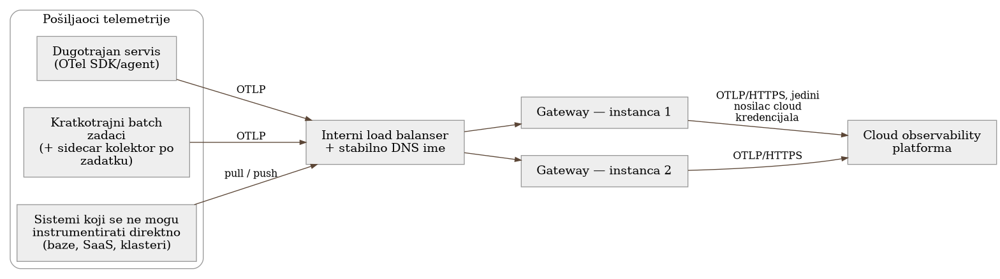

# Chapter 4 — The gateway pattern: a central point for telemetry

Picture a port. Ships arrive from every corner of the world, each with a
different cargo, different papers, different intentions. If every ship
decided for itself where to unload its cargo and issued itself permission to
enter, the port would be chaos within a couple of weeks — not because the
captains would be dishonest, but because consistent enforcement of the rules
requires one place where those rules are applied, not a thousand independent
interpretations. That's why cargo passes through a customs terminal: a
smaller number of controlled points, where the same check is done the same
way, regardless of who the sender is or where they're coming from.

Such a terminal has a cost — if it goes down, all the traffic through it goes
down with it. That's why good ports don't solve that risk by getting rid of
the terminal, but by building more than one, and treating each with full
seriousness, not as an afterthought.

The same logic applies to telemetry — only the cargo is different, and that's
the question this chapter answers.

## 4.1 The question this chapter answers

Every system that sends telemetry to a cloud service (Grafana Cloud, Datadog,
Honeycomb...) has to answer the same architectural problem as the port from
the introduction, before a single line of instrumentation gets written: **does
every sender talk directly to the cloud, or is there something in between?**

That "something in between" — a collector that sits on the path and does
something to the signal before letting it continue — is called, in the
OpenTelemetry world, simply a *gateway*. The question sounds like an
infrastructure detail. It isn't. It determines who holds the credentials for
the cloud, where the processing budget gets spent, what happens when the
cloud service has a short outage, and — as we'll see — how much every new
type of sender added a year from now will end up costing.

## 4.2 How it was actually done — a practical overview

In the implementation this book follows, the decision was: **one central
gateway, in high availability, through which almost all traffic passes.**

Concretely:

- The gateway is **Grafana Alloy** (the distribution of the OpenTelemetry
  Collector maintained by Grafana Labs), run as two independent tasks on a
  container platform (AWS ECS/Fargate), behind an internal load balancer.
- All senders — whether longer-lived services (a backend application) or
  short-lived batch jobs — target **one stable DNS name** that stays the same
  across rebuilds of both the gateway itself and the load balancer. No sender
  knows or cares which of the two gateway instances currently received its
  signal.
- The gateway is **the only place that holds credentials for the cloud** (a
  basic-auth token toward Grafana Cloud). No application, no batch job, no
  sidecar knows that token — which means compromising any single service does
  not compromise access to the observability platform.
- Everything that must be applied consistently across the whole system happens
  at the gateway: cutting out noise (health-check calls), stripping sensitive
  attributes, limiting message size, aggregating high-cardinality dimensions —
  all of it covered in detail in Chapter 10. What matters here is only that
  there is **one place** where those decisions are applied, instead of the
  same logic being copied into every service separately.

Schematically, it looks like this:

{: width="100%" }

What this diagram does *not* show, and matters: there is a small,
**explicitly documented** list of senders that **bypass** the gateway — a
Lambda function that reports job failures, and the browser-based user
interface. Both share the same reason: the gateway lives on a private network
and they physically cannot reach it (the Lambda isn't in the same virtual
network; a user's browser will never have access to internal infrastructure).
Instead of working around those constraints artificially, both components get
their own narrow path straight to the cloud — and that's intentional, not an
oversight. We'll come back to this principle in Chapter 7.

## 4.3 Analytical section — how others do it, and why we (partly) did it differently

### What the official documentation recommends

The OpenTelemetry project officially describes three (in practice four, if you
count "no collector at all") collector deployment patterns:

1. **No collector** — the application sends directly to the cloud. The fewest
   moving parts, but every outage of the cloud service is felt directly in the
   application, and there's no place for centralized processing.
2. **Agent pattern** — a collector per host/pod (e.g., as a DaemonSet in
   Kubernetes), a local "neighbor" of the application that acts as a
   temporary buffer and a place for transformation before forwarding.
3. **Agent-to-gateway pattern** — agents on every node send forward to a
   smaller number of central gateway instances that do the heavy processing
   (tail sampling, redaction, unified policy) and that are the single point
   holding credentials.
4. **Gateway-only pattern** — senders go directly to the central gateway,
   with no local intermediary.

The official recommendation for larger, production systems is
**agent-to-gateway** (pattern #3) — that's what the OpenTelemetry
documentation, Datadog's guide to choosing an architecture, and several
independent analyses (SigNoz, OneUptime) describe as the "industry standard"
for growing systems. The reason is concrete: a local agent provides a buffer
if the central gateway fails, captures host-specific data (operating-system
metrics, Kubernetes attributes) that nothing else naturally sees, and scales
independently of the gateway layer — the number of agents tracks the number
of nodes, the number of gateway instances tracks telemetry volume, and those
two curves rarely grow together.

### Where we consciously took a different path

The implementation we're analyzing **has no general agent layer**. Most
senders go directly to the gateway — which, by the taxonomy above, is closer
to pattern #4 (gateway-only), with one significant exception: for short-lived
containerized jobs, a **per-job sidecar** is used (a collector harnessed to
the application within the same task, but not a persistent agent on a node —
a "node" in the serverless container world doesn't even exist in the sense the
official documentation imagines). The third piece — pull-based sources
(databases, self-managed clusters, SaaS) — doesn't resemble any of the four
standard patterns at all, because there *the gateway itself* does the job an
agent would normally do, only in the direction of pulling rather than pushing
data.

Why this deviation, and is it a mistake? Three reasons, each verifiable:

**1. The "node" an agent would install onto often doesn't exist.** The
official agent pattern assumes a stable host — a VM or a Kubernetes node — on
which a DaemonSet lives for days or weeks and naturally captures host-level
metrics. For short-lived serverless container jobs (a batch job that lives for
a couple of minutes and then disappears), that assumption doesn't hold: there
is no stable node, only an ephemeral task. A per-job sidecar isn't a "poorer
version" of an agent — it's the *correct* translation of the same principle
(a local companion that captures resource-specific data and provides room for
graceful shutdown) into an environment where a classic DaemonSet has
physically nothing to attach to. This is an important distinction for the
reader: when the standard pattern doesn't fit your infrastructure, the right
question isn't "how do I force it to fit" but "what is the principle behind
the pattern, and what does that principle look like in my environment."

It's worth making this explicit here rather than leaving it implicit in
the paragraph above: the system this book follows doesn't run Kubernetes
**anywhere** — not for this gateway, not for anything else in the system
(the container platform is services without managed nodes, plus a handful
of classic virtual machines, serverless functions, and a managed batch
service). This isn't a gap in the book's coverage but a carried-over, real
architecture, and it's worth keeping in mind through the rest of the book:
an entire category of tooling that assumes a Kubernetes cluster exists —
whether network tools built on direct access to the operating system
kernel, or operator-style agents that expect a cluster they manage —
simply doesn't apply to infrastructure shaped like this, not for lack of
quality but because of a structural assumption the tool itself carries. A
reader whose system **is** on Kubernetes gets the reverse advantage from
that same fact: that entire category of tooling is available to them in a
way it never will be to this implementation — worth keeping in mind
whenever a later chapter says some tool was considered and rejected: the
reason is often exactly this, not the quality of the tool itself.

**2. The cost of the local hop isn't always worth paying.** The official
advantage of the agent layer — a local buffer that survives a brief gateway
outage — has a real cost: an additional process per instance, an additional
image to maintain, an additional point that can fail. For a system where the
number of long-lived services is small (a handful of app instances, not
thousands), and the gateway is already in HA (two independent instances
behind a load balancer, with a DNS name resilient to rebuilds), the marginal
risk that an agent layer removes is small, while the operational cost —
another artifact to build, version, and monitor for every service — is real
and constant. This is a calculation that has to be made explicitly, not
assumed: "industry standard" is a good starting point, not an automatic
decision.

**3. Tail sampling — the main reason *for* the agent-to-gateway pattern in the
official documentation — isn't in play here at all.** This is the most
valuable finding of this comparison. The official agent-to-gateway pattern
makes the most sense when the gateway has to perform *tail-based sampling* —
the decision "should I keep this trace" made only after all of its parts have
been seen. For that decision, the load-balancing exporter has to hash by
trace ID so that all parts of a single trace land on the **same** gateway
instance — without that, tail sampling doesn't work correctly. That's a
non-trivial requirement that shapes how the gateway layer is load-balanced.
The implementation being analyzed **explicitly rejected** tail sampling at
the gateway level (detailed in Chapter 12) in favor of server-side adaptive
sampling on the cloud side. The result: the constraint that would have
justified a more complex, trace-aware load-balancing layer simply doesn't
exist here. A plain L4 load balancer is enough, because no decision at the
gateway depends on whether all parts of a single trace arrive at the same
place. **When you drop one requirement from the textbook solution, part of
the architecture that existed only to satisfy that requirement naturally
falls away too** — a good general lesson for the reader when comparing their
own system against a reference architecture.

### The cost of the choice: what would have happened if we'd gone "by the book"

It's worth playing out the opposite scenario too, because that's what
distinguishes an engineering decision from blind copying of a recommendation.

Had a full agent-to-gateway layer been introduced, with a DaemonSet on every
container "node": in a serverless Fargate environment that would mean an
additional companion process per task (which in practice amounts to the same
thing as the sidecar that already exists for the batch fleet — just renamed),
but *also* for the long-lived services that today go directly to the gateway.
For that handful of long-lived services, an additional local collector would
mean: one more image that has to keep up with OpenTelemetry Collector
versions, one more process consuming memory alongside the application itself,
and — most expensive of all — one more component whose failure has to be
diagnosed when something's off ("is the problem in the application, in the
local agent, in the gateway, or in the network between them?"). The real
benefit would be small: the gateway is already in HA, and the one scenario
where a local buffer would actually help — a complete simultaneous failure of
*both* gateway tasks — is already covered by another, cheaper mechanism
(synthetic external monitoring from Chapter 9, which doesn't depend on the
gateway at all).

Conversely, had a pure "no-collector" pattern been chosen (every application
straight to the cloud, nothing in between): every application would have to
carry cloud credentials, every change in processing policy (e.g., "hide this
attribute across the whole fleet") would require an edit in every repository
individually, and — particularly relevant to the cost topic in Chapter 11 —
there would be no single place where cardinality and cost can be intercepted
before they reach the billable end of the pipeline. In practice, the gateway
layer pays for itself very quickly through a single intervention of that
kind.

### Why Grafana Alloy, and not a "plain" OpenTelemetry Collector

A second decision worth analyzing: the gateway isn't run as a vanilla
`opentelemetry-collector-contrib` distribution, but as Grafana Alloy —
Grafana Labs' own distribution of the same collector core, with its own
configuration syntax (the River/Alloy language instead of the standard YAML
pipeline description) and built-in components for pulling metrics (e.g.,
directly from CloudWatch or Postgres).

Independent analyses of this choice (including critical ones, not just
promotional material) cite a real risk: Alloy introduces **its own,
non-standard syntax** and by default nudges the user toward the Grafana
ecosystem (Loki for logs, Mimir/Prometheus for metrics), which makes a later
migration to a different vendor harder — a mild, classic form of vendor
lock-in, despite the fact that the protocol used to forward data (OTLP)
remains standard.

In the implementation being analyzed, that risk was consciously accepted for
two reasons that only make sense *in context* — this isn't a general rule
that "Alloy is better," but an example of how such a decision gets justified:

1. **The downstream is already Grafana Cloud.** The cost of collector-level
   vendor attachment is marginal when the entire observability platform
   behind it is already with the same vendor — lock-in on the collector's
   configuration syntax doesn't add a new risk on top of the one already
   accepted by choosing the platform.
2. **The built-in pull exporters replace an entire category of
   infrastructure.** Had a plain OpenTelemetry Collector been chosen, pulling
   CloudWatch and Postgres metrics (Chapter 7) would have required *separate*
   Prometheus infrastructure with `remote_write` to the same destination —
   one more component, one more layer to operate and monitor. Alloy does
   this in the same process, the same pipeline, the same monitoring layer as
   everything else.

The point for the reader isn't "choose Alloy" — the point is that every
decision about a specific tool has to be justified through *what that
decision changes downstream*, not through the tool's reputation on its own.

Let's return to the port from the start of the chapter. A terminal doesn't
solve the risk of downtime by being eliminated, but by building more than one
and treating each with full seriousness — exactly what the gateway in this
chapter does with two independent instances instead of one.
**Centralization isn't the opposite of reliability — it's an admission that
it's easier to make one controlled place reliable than a thousand
uncontrolled ones**, on the condition that this one place is actually treated
with full seriousness. The measure of that seriousness will come back
throughout the book: whether the place has enough redundancy, whether its
failure has an independent way of being noticed, and whether anyone outside
it can keep working when it goes down.

## 4.4 Rules collected from this chapter

- The standard pattern (agent + gateway) is a good starting assumption, but
  check whether the node an agent would run on *even exists* in your
  environment before you copy it.
- When you drop one requirement from the reference architecture (e.g., tail
  sampling), check what *in that architecture* existed only because of that
  requirement — you can often simplify that part too.
- A gateway that holds cloud credentials must be explicitly treated as
  critical infrastructure: HA, a stable address, and an independent way for
  someone to notice when it's down (not just "alerts stop arriving" — that's
  silent and easy to miss, as we'll see why in Chapter 14).
- Every tool decision ("why this particular collector/this particular
  vendor") should be justified through what that decision changes
  *downstream* (which other components become unnecessary or necessary), not
  through the tool's general reputation.
- Deliberately bypassing the gateway (for components that physically cannot
  reach it) should be a **documented list with a reason**, not an accidental
  deviation someone discovers six months later.
- Know explicitly whether your infrastructure assumes Kubernetes or not —
  an entire category of tooling (kernel-based network tools, operator
  agents) is either available or structurally inapplicable depending on
  that one answer, independent of the quality of the tool itself.

## 4.5 Exercise for the reader

Draw a diagram of your own system as telemetry actually travels through it
today — every application, every database, every external service. For every
arrow pointing to a cloud service, ask three questions: (1) does this
component hold cloud credentials directly, (2) what would happen if the cloud
service were unavailable for 5 minutes, and (3) who would be the first to
notice if this arrow stopped working. If the answer to (3) is "nobody, until
someone notices something else is off" — that's your first candidate for a
gateway.

---

### Sources used in the analytical section

- [Agent-to-gateway deployment pattern — OpenTelemetry](https://opentelemetry.io/docs/collector/deploy/other/agent-to-gateway/)
- [Gateway deployment pattern — OpenTelemetry](https://opentelemetry.io/docs/collector/deploy/gateway/)
- [Agent deployment pattern — OpenTelemetry](https://opentelemetry.io/docs/collector/deploy/agent/)
- [How to select your OpenTelemetry deployment — Datadog](https://www.datadoghq.com/blog/otel-deployments/)
- [OpenTelemetry Deployment Patterns Explained — SigNoz](https://signoz.io/blog/opentelemetry-deployment-patterns/)
- [How to Set Up High-Availability Collector Deployments with Agent-Gateway Pattern — OneUptime](https://oneuptime.com/blog/post/2026-02-06-high-availability-collector-agent-gateway-pattern/view)
- [Grafana Alloy: OpenTelemetry, With Some Abstraction Issues — Coralogix](https://coralogix.com/blog/the-grafana-alloy-dilemma/)
