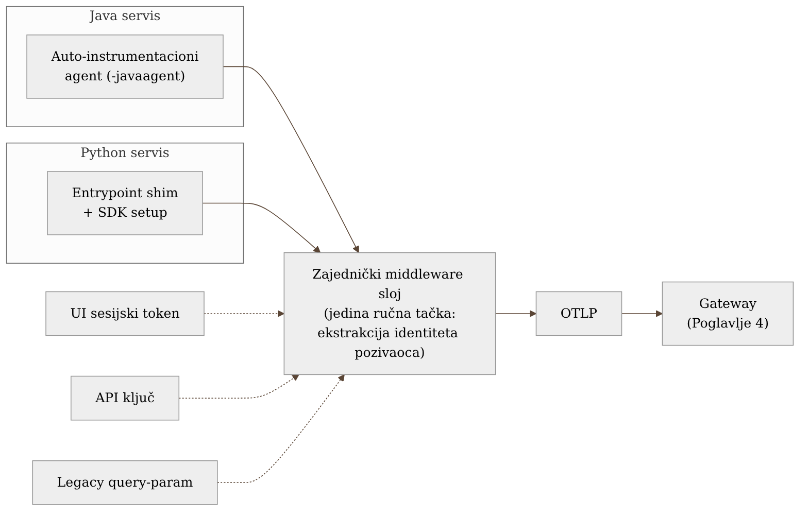

# Poglavlje 5 — Instrumentacija aplikacije: dve strategije

Odelo kupljeno u prodavnici je skrojeno za prosečnu figuru — ramena, struk,
dužina rukava, sve je podešeno da odgovara najvećem broju kupaca dovoljno
dobro. Za devedeset posto prilika, to je sasvim dovoljno: obučeš ga i izgleda
uredno. Ali za jednu konkretnu priliku — svadbu, važan nastup — krojač uzima
baš to odelo i menja samo ono što je specifično za tebe: dužinu rukava, širinu
u ramenima, mesto gde dugme zaista treba da stoji. Krojač ne pravi novo odelo
od nule. Uzima ono što fabrika već dobro radi, i dodaje samo onaj jedan detalj
koji fabrika ne može da zna unapred, jer je specifičan za tebe.

Instrumentacija aplikacije radi po istoj logici. Auto-instrumentacija je
odelo iz prodavnice — pokriva ono što je zajedničko gotovo svakoj aplikaciji
istog tipa (HTTP pozivi, upiti ka bazi, redovi za poruke) i to radi dobro, bez
ijedne linije koda u samoj aplikaciji. Ono što auto-instrumentacija ne može da
zna je specifično za tebe: ko je pozvao ovaj konkretan zahtev, i preko kog
kanala. To se dodaje ručno, na tačno jednom mestu, kao krojačev jedan ubod
igle — ne kao novo odelo od nule.

## 5.1 Pitanje na koje ovo poglavlje odgovara

Kad se auto-instrumentacija iz Poglavlja 2 postavi i proradi, prirodno pitanje
je: da li je posao gotov? Da li aplikacija sada ima "svu" telemetriju koja joj
treba, ili postoji kategorija podataka koju auto-instrumentacija strukturno ne
može da vidi, bez obzira koliko dobro radi za HTTP pozive i upite ka bazi?

Odgovor određuje gde tim troši preostalo vreme: da li se ono ulaže u širenje
auto-instrumentacije na još biblioteka (marginalna korist, jer većina bitnih
biblioteka je već pokrivena), ili u malen broj ciljanih, ručnih dopuna na
mestima gde auto-instrumentacija po definiciji ne može da pomogne.

## 5.2 Kako je to urađeno — praktičan pregled

Auto-instrumentacija iz Poglavlja 2 (Java agent, Python SDK sa
entrypoint shim-om) hvata ono što je **strukturno vidljivo iz poznatih
biblioteka**: dolazni i odlazni HTTP pozivi, upiti ka bazi, pozivi ka redu za
poruke, standardni resursni atributi postavljeni pri startu. Ovo pokriva
ogromnu većinu onoga što se ikad pogleda na dashboard-u ili u trejsu tokom
istrage — i namerno se ne dira ili duplira ručnom instrumentacijom, jer bi to
bio posao bez koristi.

Postoji tačno jedna kategorija podataka koju tim u implementaciji koju knjiga
prati dosledno dodaje ručno, na svakom servisu: **identitet pozivaoca i kanal
kojim je stigao.** Razlog je strukturan, ne stilski — auto-instrumentacija vidi
da je stigao HTTP zahtev, vidi putanju i metodu, ali ne zna, i ne može da zna,
*ko* stoji iza tog zahteva u poslovnom smislu, jer to zavisi od autorizacione
logike specifične za svaku aplikaciju. U sistemu koji knjiga prati, isti
endpoint može biti pozvan na tri različita načina:

- korisnik ulogovan preko UI-ja, nosi kratkotrajni sesijski token,
- eksterni klijent koji koristi dugotrajan API ključ,
- legacy integracija koja identitet i dalje šalje kao query-parametar (poznat,
  dokumentovan dug tehnički dug, ne slučajni previd).

Za svaki od ova tri puta, mala funkcija u zajedničkom middleware sloju
ekstrahuje identitet — bez obzira odakle je stigao — i postavlja ga kao span
atribut (`enduser.id` po semantičkoj konvenciji, plus interni
`auth.channel` atribut koji beleži *kojim* od tri puta je identitet stigao).
Ovo je **jedina** ručna instrumentaciona tačka u celom sistemu koja se svesno
održava kao takva — sve ostalo ostaje na auto-instrumentaciji. Namerno je
smeštena na jedno mesto (middleware), ne razmazana po svakom endpointu
posebno — tako da promena logike ekstrakcije (npr. dodavanje četvrtog kanala)
zahteva izmenu na jednom mestu, ne pretragu kroz ceo repozitorijum.

Bitna posledica: pošto identitet postaje resursni/span atribut na *svakom*
zahtevu, upit "koji korisnik je pogodio ovaj spor endpoint" ili "koliko grešaka
dolazi od ovog specifičnog API ključa" postaje trivijalan filter u Grafana
Cloud-u — bez toga, taj podatak bi postojao samo u aplikacionim logovima, van
domašaja trejsova i metrika izvedenih iz njih (span metrics, obrađeno u
Poglavlju 6).

{: width="92%" }

## 5.3 Analitički deo — kada ručna instrumentacija zaista vredi truda

### Šta auto-instrumentacija strukturno ne može da vidi

Nezavisne analize ovog izbora (uključujući Elastic-ov vodič za dobru praksu
instrumentacije) navode dve kategorije gde auto-instrumentacija ostaje slepa,
bez obzira na to koliko je zrela: **čist aplikativni/poslovni kod koji ne
prolazi kroz nijednu poznatu biblioteku** (auto-instrumentacija se kači na
poznate biblioteke — sopstvena poslovna logika prosto nije njena teritorija),
i **kontekst koji zahteva poslovno znanje** — ko je korisnik, koji je tenant,
koja je poslovna kategorija zahteva — jer ništa u samom HTTP pozivu to
strukturno ne nosi bez logike specifične za aplikaciju. Ista analiza
preporučuje da svaka organizacija ima **dosledan dogovor o resursnim
atributima** (`service.name`, `service.version`, `deployment.environment`, i
po potrebi tenant/organizacioni identifikator) primenjen kroz celu flotu —
tačno princip koji je ovaj sistem već usvojio u Poglavlju 2, samo ovde
proširen na *span* nivo za identitet pozivaoca, ne samo *resource* nivo za
identitet servisa.

### Gde smo svesno stali, i zašto nismo išli dalje

Vredi eksplicitno primetiti šta implementacija **nije** uradila, jer je to
podjednako bitna odluka kao i ono što jeste. Tim nije pokušao da ručno
instrumentira "sve što bi moglo biti korisno" — nema ručnih spanova oko svake
poslovne funkcije, nema ručno dodatih atributa "za svaki slučaj" van
middleware sloja opisanog gore. Razlog je direktna posledica prakse otkrivene
u Poglavlju 1 (cacher incident): bogaćenje konteksta "za svaki slučaj" je
vredno, ali samo kad je jeftino da se održava. Ručni span oko svake poslovne
funkcije nije jeftin — svaki od njih je linija koda koja mora da se piše,
review-uje i održava zauvek, i koja zastari čim se logika promeni a
instrumentacija ne prati. Jedna, dobro plasirana tačka enrichmenta (middleware
sloj za identitet) daje najveći deo koristi po jedinici truda; deseta,
dvadeseta ručno dodata tačka daje sve manje koristi za isti trud.

### Šta bi se desilo suprotnim izborom

Da je tim otišao u drugu krajnost — oslonio se isključivo na
auto-instrumentaciju i nikad ne dodao identitet ručno — svaka istraga o tome
"ko je pogodio ovaj endpoint" bi zahtevala da se trejs ili metrika ukrste sa
aplikativnim logom po vremenskom pečatu i ID-ju zahteva, ako taj log uopšte
postoji i ako nosi identitet u parsibilnom obliku. To je tačno vrsta posla
koji se radi *usred* incidenta, pod pritiskom, umesto da postoji kao gotov
filter unapred — cena koja se, kao i u Poglavlju 1, ne vidi dok ne zatreba, a
onda se vidi u punom obimu.

Obrnuto, da je tim otišao u ekstremnu ručnu instrumentaciju svuda —
efektivno duplirajući ono što auto-instrumentacija već radi, plus ručne
spanove oko svake poslovne funkcije — rezultat bi bio veći obim koda posvećen
observability-ju nego samoj poslovnoj logici, veći rizik da instrumentacija
zastari kad se kod promeni (jer ručni span ne prati refaktorisanje automatski,
za razliku od auto-instrumentacije koja se kači na stabilan interfejs
biblioteke), i, paradoksalno, teže dashboard-e — jer bi svaki tim ručno birao
sopstvena imena atributa umesto da se drži zajedničke konvencije, tačno onaj
problem sa četiri različita imena za isti koncept iz Poglavlja 2.

Vratimo se na krojača s početka poglavlja. On ne prepravlja svaki šav na
odelu — to bi koštalo koliko i novo odelo, i uništilo bi upravo ono što
fabrika radi dobro. Menja tačno onaj jedan detalj koji fabrika ne može da zna
unapred. **Ručna instrumentacija koja pokušava da zameni auto-instrumentaciju
je gubljenje vremena; ručna instrumentacija koja dopunjuje auto-instrumentaciju
na tačno jednom, dobro izabranom mestu je gotovo uvek vredna truda.** Veština
nije u tome koliko ručno instrumentiraš, nego u tome da li si prepoznao *koji*
je to jedan detalj za tvoj sistem.

## 5.4 Skupljena pravila iz ovog poglavlja

- Ne pokušavaj da ručno instrumentiraš ono što auto-instrumentacija već
  pokriva — potraži umesto toga šta auto-instrumentacija strukturno ne može
  da vidi (poslovni identitet, poslovna kategorija zahteva).
- Postavi dogovor o resursnim atributima (naziv, verzija, okruženje) kroz
  celu flotu pre nego što bilo koji tim počne da dodaje sopstvene, ad-hoc
  atribute istog značenja.
- Ako imaš više od jednog kanala kojim identitet ili kontekst stiže (token,
  API ključ, legacy parametar), normalizuj ih na jednom mestu (middleware),
  ne u svakom endpointu posebno.
- Postavi sebi pitanje pre svakog novog ručnog spana: "da li ovo dopunjuje
  auto-instrumentaciju, ili je pokušavam zameniti?" — drugi odgovor je gotovo
  uvek znak da vreme ide na pogrešno mesto.
- Ručna instrumentacija koja nije jeftina za održavanje neće biti održavana —
  planiraj je tako od početka, ne kao naknadnu nadu.

## 5.5 Vežba za čitaoca

Pronađi jedan endpoint ili zadatak u svom sistemu gde bi, usred incidenta,
morao ručno da ukrstiš trejs sa aplikativnim logom da bi saznao *ko* je
pokrenuo problematičan zahtev. Ako takav korak postoji, to je tvoj kandidat
za tačno onu vrstu ciljane ručne instrumentacije opisane u ovom poglavlju —
jedna tačka, jedno mesto u kodu, dosledna kroz sve puteve kojima taj identitet
može da stigne.

---

### Izvori korišćeni u analitičkom delu

- [Best practices for instrumenting OpenTelemetry — Elastic Observability Labs](https://www.elastic.co/observability-labs/blog/best-practices-instrumenting-opentelemetry)
- [Manual vs. auto instrumentation OpenTelemetry: Choose what's right — Cribl](https://cribl.io/blog/manual-vs-auto-instrumentation-opentelemetry-choose-whats-right/)
- [How to Compare OpenTelemetry Auto-Instrumentation vs Manual Instrumentation — OneUptime](https://oneuptime.com/blog/post/2026-02-06-compare-opentelemetry-auto-vs-manual-instrumentation/view)
- [OpenTelemetry Instrumentation: Manual vs. Automatic — Lumigo](https://lumigo.io/opentelemetry/opentelemetry-instrumentation-manual-vs-automatic-with-examples/)
- [Semantic Conventions for General Attributes (enduser.*) — OpenTelemetry](https://opentelemetry.io/docs/specs/semconv/registry/attributes/enduser/)
