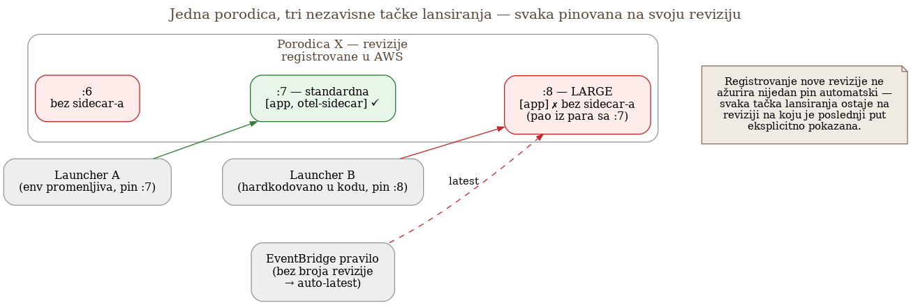

# Chapter 6 — Containerized/batch workloads: the sidecar pattern

On a high mountain, a climber never goes alone — they go roped to a partner.
That partner isn't sitting at base camp waiting for someone to come back with
a problem; they climb *with* you, step by step, and when you come down off
the mountain, they come down too, at the same time, at the same pace. Base
camp, on the other hand, has a doctor who waits for every climber equally —
useful, but physically unable to follow you up the cliff face, and with no
exact idea where you are the moment you need help.

When a workload is short-lived — it starts, does its work, disappears within
a few minutes — it needs a companion that shares exactly its own lifespan,
not a permanent guardian waiting at base camp and hoping to arrive in time.
That's the difference between a sidecar and an agent, and it's the question
this chapter answers.

## 6.1 The question this chapter answers

Chapter 4 introduced the gateway as a central point, and Chapter 2 covered
auto- and manual instrumentation for long-running services. But what happens
when the sender of telemetry isn't a long-running service but a short-lived
batch job — a process that's born, does its work, and disappears within a
few minutes, maybe even seconds? Does such a job need the same treatment as
a long-running service (a direct connection to the gateway), or does it need
something structurally different?

This chapter's answer is: something structurally different — **a sidecar
collector, harnessed to each job, sharing exactly its lifespan.** The reason
isn't stylistic but lifecycle-driven, and it shows up most clearly in exactly
what happens when the job disappears.

## 6.2 How it was done — a practical overview

Every batch/ETL job in the system this book follows runs as an AWS
ECS/Fargate task definition with **two containers**: the main container that
does the work, and a sidecar container — a lightweight OpenTelemetry
Collector distribution (ADOT — AWS Distro for OpenTelemetry) — which receives
telemetry from the main container over `localhost`, performs minimal
processing (batching, adding resource attributes), and forwards it to the
central gateway from Chapter 4.

The job and its sidecar share the **same task lifecycle**: they start
together, they shut down together. When the main container finishes its
work, the ECS task definition is configured so the sidecar gets a short but
explicit window to flush whatever it's still holding in its buffer before
the whole task shuts down — without that window, the last few seconds of
telemetry would simply vanish along with the container that produced them.

{: width="85%" }

This pattern, brought into production after an initial pilot on two jobs
(covered in detail in Chapter 30), surfaced a catalog of real-world pitfalls
that no "quickstart" documentation mentions:

- **The sidecar doesn't set `service.name` on its own.** Unlike a
  long-running service, where the SDK knows its own name from the code, the
  sidecar collector has no idea which job was launched alongside it — the
  name has to be explicitly injected through an environment variable in the
  task definition. Without that, dozens of different batch jobs would show
  up in the cloud looking like a single unnamed source, and a dashboard
  filtering by job name would simply have nothing to filter.
- **The OTLP→Prometheus translation adds unit suffixes that aren't
  obvious.** A metric that's called `queue_depth` in code, with unit
  "items", arrives in Mimir as something like `queue_depth_items_total`, or
  with a similar suffix depending on its type — which means the "obvious"
  metric name, the one someone would intuitively type into a query, simply
  doesn't exist. Every new team first has to discover the real name, usually
  through `list_prometheus_metric_names` or a similar tool, before writing
  its first PromQL query.
- **Mimir doesn't promote every resource attribute to a label.** By
  default, only explicitly listed attributes get promoted — if a new
  resource attribute isn't added to that list, it still reaches Mimir, but
  it stays invisible for filtering. A practical trick for checking that a
  signal made it through the whole pipeline at all (not just that it exists
  on the application side): query the `target_info` metric, which the
  collector generates automatically from resource attributes and which
  exists independent of whether the application sent a single metric of its
  own that minute.
- **Some libraries emit only spans, not metrics.** For such components, the
  only operational signal at the metric level is the `traces_spanmetrics_*`
  series that the Tempo metrics-generator derives from the traces
  themselves (covered in more detail in Chapter 11) — without understanding
  that this mechanism exists, a team would conclude the library "has no
  metrics," when in fact it does, just indirectly.

### When a new sidecar looks like the cause of a failure — three facts that cleared it

The first wave of critical alerts after rolling out the sidecar on one of the
batch fleets looked like a classic regression: jobs started shutting down
with an error right after the new job-definition revision was introduced,
the main container exited with a failed status while the sidecar exited
clean. The first instinct — "the new revision broke something" — was wrong,
and proven wrong, not merely assumed.

Three independent facts cleared the sidecar of blame. First, the identical
error, with identical messages, existed in the logs three days before the
sidecar was even added — only, before that, nobody could see it in one place
by job identifier, because the observability platform didn't yet have
visibility into that fleet. Second, the same build, the same model run, the
same job definitions — some variants of the job passed without error that
day, while others, with an identical container image, failed. Third, the
error only affected one narrowly defined combination of input parameters,
not the fleet in general — a failure shape tied to the data that job
processes, not to the infrastructure running it.

The irony is that the very act of rolling out the sidecar made this problem
visible as a **pattern** for the first time, not as an isolated incident:
because error logs were now queryable by job identifier, the team could
confirm the identical error had been recurring day after day, proving the
cause predated any change made that week. The sidecar didn't cause the
problem — it uncovered a problem that already existed, invisible.

General lesson: the first suspicious change after any rollout is almost
always the rollout itself, because it's freshest in memory — but correlation
with the moment of introduction isn't proof of cause. Before declaring a new
component guilty, it's worth checking whether the same symptom exists
outside its presence too: in older logs, on the build that preceded the
change, on comparable jobs that haven't received that change yet.

### The flush window the sidecar gets doesn't cover the whole path

The sidecar gets an explicit, short window before shutdown to flush whatever
it's holding in its own buffer — that's described above, and it's accurate,
but it describes only **half** of the path telemetry travels between the
main container and the gateway.

The path has two separate hops. First: the main container to the sidecar,
over `localhost`. Second: the sidecar to the gateway, over the network. The
shutdown window the ECS task definition guarantees covers **only the second
hop** — the time the sidecar gets to flush what it's already holding before
the infrastructure kills it. It guarantees nothing about the first hop: if
the SDK in the main container uses the default, **asynchronous** buffering
mechanism for spans and log records (sending them in periodic background
batches, not immediately as they're created), and if the whole job shuts
down before that mechanism reaches its next periodic send, whatever is
sitting in the main container's buffer at that moment simply disappears
along with the process that produced it — regardless of how long a window
the sidecar gets, because the sidecar never even saw that data.

This hits hardest exactly the class of jobs the sidecar pattern was
primarily introduced for: short-lived ones that shut down seconds after
starting. A longer-lived service has enough time for periodic sending to
naturally happen before shutdown; a job that runs for a couple of seconds
might shut down before even one buffering cycle completes.

The fix isn't in the sidecar or in the length of its shutdown window — it
has to happen on the main-container side: explicit, synchronous buffer
flushing before the process exits (or switching to a simpler, synchronous
sending mode that doesn't buffer in the background), so nothing is left
unsent at the moment the process ends. The sidecar's shutdown window still
serves a purpose — it protects the second hop — but it can't recover what
was lost before it ever reached the sidecar at all.

{: width="75%" }

### Drift through revisions: three concrete failures and how they're caught now

All the traps listed so far in this chapter happen **within** a single
version of the task definition — how it's configured, how it shuts down,
what it receives. There's a completely different class of failure, one
that has nothing to do with the content of any single revision: **the same
task family can be launched from more than one place, and each of those
places remembers its own revision number.** Registering a new, correct
revision with the sidecar doesn't mean anyone has actually started using
it — it's only recorded in AWS as a possibility, while every launcher keeps
running whatever revision number it was last explicitly pointed at.

{: width="90%" }

Three real cases of this pattern, each different:

1. **A size pair, one half forgotten.** One task family exists in two
   sizes — the standard variant and a "LARGE" variant for a particularly
   demanding daily window — registered as adjacent revisions of the same
   pair. When the sidecar was added, the new standard revision was
   registered correctly — but the LARGE half of the same pair was
   registered **without** the sidecar, missed because the pair was
   treated as one change instead of two. The result: the LARGE variant
   ran completely blind to observability for days — no metrics, no logs,
   no traces — until the fleet-wide weekly check (described later in this
   chapter) caught it. The full course of this specific incident —
   including exactly how long the detection lag was and why it was
   exactly that long — is worked out as the central example in Chapter 29.
2. **A family that never even entered the onboarding wave.** One family
   has a launcher that hardcodes **two** separate pinned revisions for
   two different operating modes, not one. The onboarding wave that
   systematically went through every family and added the sidecar simply
   skipped this one, on the assumption "one family = one pin" — the
   failure wasn't in the execution, it was in the premise. Several
   failures a day went unnoticed for weeks, not because the alert wasn't
   working, but because the family never even produced a signal the
   alert could read.
3. **A change unrelated to observability that erased the sidecar
   anyway.** The third case wasn't even an attempt to add or remove
   anything related to telemetry — a new revision was registered purely
   to double the family's CPU limit, but in the process, by cloning from
   the wrong starting revision, the image tag was silently reverted to
   `:latest` — and `:latest` is the version without the sidecar. This
   case stayed a potential harm rather than an actual one, because no
   launcher had yet been moved to that revision — but it was caught as a
   trap waiting for the first person who decides to "move to the latest
   version" without checking whether that latest version is actually
   still instrumented.

The common thread across all three cases: **registering a revision and
launching a revision are two separate acts, and the drift between them is
invisible until someone explicitly checks for it.** Hence the rule that
now applies to every change to a family: a new revision is created by
cloning the revision that is **currently actually pinned** by the
launcher, never the latest one in the console and never an arbitrary older
one — forward, never backward, never sideways. And since one family can
have more than one launcher (an environment variable, a hardcoded number
in code, even an EventBridge rule with no revision number that
automatically picks the latest active one), every pin has to be found and
explicitly repointed — never assume that the one pin you found is the only
one that exists.

Checking that a new revision has actually reached traffic, not just the
AWS registry, uses the same tool already mentioned earlier in the
chapter — `target_info` — just broken down by revision number:

```promql
count by (aws_ecs_task_revision) (last_over_time(target_info{service_name="family-name"}[24h]))
```

If the expected new revision number doesn't show up in the result, no
launcher has been moved yet — the dashboard can look "green" based on
stale data until the pins are checked one by one. Alongside this
per-family check, the system today also has an automated, weekly
fleet-wide check that compares every family against its own revision
history and flags when a newer revision drops out of the sidecar's
keep-list, or when two revisions in the same size pair differ on whether
they carry the sidecar. That check has one structural limitation worth
remembering: **it compares a family against itself — it doesn't know
which revision the launcher is actually running.** A report that a newer
revision lost the sidecar can mean either "harmless, the launcher is still
on the good old revision" or "active outage, the launcher has already
moved" — telling the two apart requires manually checking the pin; the
tool only points to where to look.

### Being on the "instrumented" list doesn't mean anything actually goes out

The weekly fleet coverage check, already described above, maintains a
list of families considered instrumented — any family that emits at least
a basic identity to the observability platform gets added to that list
and dropped from the "not yet onboarded" list. A review of the whole
list, carried out with that same check, found that the list was measuring
the wrong thing for six families: five of the six had simply never been
mentioned at all — not present on any registered revision, not a case of
falling out of a pair. The sixth was subtler and more interesting: a
family that **is** on the list, whose sidecar container runs reliably and
reliably reports `service.name` — everything the presence check verifies.
What the check doesn't verify: whether the application container has
anywhere to send anything at all. This particular family was missing the
environment variable for the collector's destination address entirely,
and the image it runs didn't even carry the OpenTelemetry library — the
result is no traces, no logs, not even application metrics, nothing
except what the sidecar container itself measures about itself.

The obvious fix — add the missing variable and call it done — was
deliberately **not** made. The reason: adding just the variable would
make the family *look* fully instrumented on the coverage list, while the
image would still have nothing to export even once it knew where to send
it. The result would be worse than the current state, not better — the
current state at least openly admits something is missing; a "fixed"
state would hide that behind a green checkmark on the list, while the
real fix (adding the SDK to the image) stays out of scope for this
particular round of changes. The coverage list measures **the presence of
the mechanism**, not **the output of the mechanism** — two things that
coincide in nine cases out of ten, often enough that the difference goes
unnoticed until someone deliberately looks for it.

## 6.3 Analytical section — sidecar versus agent, and the boundary where sidecar stops paying off

### Why sidecar, not node-agent, for this class of workload

Independent analyses of this choice (including Last9's comparison of
sidecar vs. agent patterns) name exactly the criterion that decided this
case: sidecar provides **strong process isolation** and guarantees that
"the application and the sidecar shut down together" — critical for batch
workloads, where a job disappears within a few minutes and where an orphaned
telemetry flow (data that arrives after the job that generated it is gone,
or, conversely, lost data because the job disappeared before the sidecar got
around to sending it) would be a worse outcome than a somewhat higher
resource footprint. The node-agent, on the other hand, has an **independent
lifecycle** — it stays alive even as the jobs on it change — which is an
advantage for stable, long-running services (exactly as in the
agent-to-gateway pattern from Chapter 4, had it been applied here), but
creates a mismatch precisely at the boundary that hurts most in this case:
short-lived jobs disappear, the agent stays, and the link between "which job
produced which piece of data" becomes harder to guarantee.

The cost of this choice is real and acknowledged in the same analysis:
sidecar means higher resource consumption per job (every job carries its own
copy of the collector), versus a single shared agent instance per node. For
the system this book follows, that cost was accepted knowingly — the number
of concurrent batch jobs is small enough that the extra CPU/memory per job
isn't a problem, while the alternative (a shared agent) would introduce
exactly the kind of orphan-data risk that a sidecar eliminates by
definition.

### The boundary where sidecar stops being the right choice

It's worth looking explicitly at when this pattern **stops** paying off,
because that's just as valuable a lesson as the choice itself. AWS's own
material on migrating from sidecar to a centralized gateway pattern (for
telemetry that crosses multiple AWS account boundaries) names three concrete
reasons why per-job sidecar stops scaling: the sidecar collector is a
Linux-only image, so it can't ride along with Windows/.NET Framework jobs,
which then either stay uninstrumented or carry a collector that collects
nothing; per-job costs grow linearly with the number of jobs, while a
central gateway has a near-constant cost regardless of the number of
senders; and configuration "drift" — every copy of the sidecar changes
independently, with no single central point for admission policy, exactly
the opposite of the principle from Chapter 4 ("one place where the same
check is done the same way").

This isn't a contradiction of the decision made in this chapter — it's the
boundary of its applicability. The implementation this book follows
operates at a scale (tens, not thousands, of concurrent batch jobs, within a
single AWS account) where the sidecar's advantages (lifecycle isolation)
clearly outweigh its disadvantages (resource consumption, lack of central
policy). Had the scale grown by an order of magnitude, or had the batch
fleet expanded across multiple accounts, the same analysis that justified
sidecar here would justify moving to a gateway pattern for that class of
workload — which is exactly an instance of the principle from Chapter 4:
every tooling decision is justified by context, not by the tool's absolute
correctness.

Back to the climber and the rope. A partner who climbs with you makes sense
while it's just the two of you — add fifty more climbers to the same rope,
and a system that worked perfectly for two becomes an unmanageable burden.
Sidecar is the right choice at the scale this system operates on today;
**the real skill isn't remembering "sidecar is better than agent," but
recognizing at what scale that claim stops holding.**

## 6.4 Rules collected from this chapter

- For short-lived, ephemeral workloads, prioritize the pattern that shares
  the job's lifecycle (sidecar) over the pattern with an independent
  lifecycle (agent) — orphan telemetry is a worse outcome than higher
  resource consumption.
- Explicitly inject `service.name` and other identifying attributes into the
  sidecar via env variables — never assume the sidecar will "just know"
  them.
- Before writing your first PromQL query against a new metric, check its
  real name after the OTLP→Prometheus translation — unit suffixes are
  almost never intuitive.
- Use `target_info` (or its equivalent) as a quick test for whether a
  signal is making it through the whole pipeline at all, independent of
  whether the application happens to be sending its own metrics at that
  exact moment.
- The sidecar pattern has a scaling boundary (Linux-only, per-job costs,
  configuration drift) — know in advance at what scale your system would
  cross that boundary, instead of discovering it once it's already painful.
- Correlation with the moment a change was introduced isn't proof that
  change is the cause — before declaring it guilty, check whether the same
  symptom exists outside its presence too (older logs, the previous build,
  comparable cases that haven't received the change yet).
- The shutdown window infrastructure guarantees the sidecar covers only the
  hop from the sidecar onward — it guarantees nothing about the
  asynchronous buffer in the main container that still has to reach the
  sidecar over localhost. For short-lived processes, the fix has to happen
  on the application side: explicit buffer flushing before exit, not
  relying on someone else's shutdown window.
- A task family can be launched from more than one place (an env
  variable, a hardcoded number in code, an EventBridge rule) — before
  declaring a change complete, find EVERY pin, not just the first one
  you come across.
- Always create a new revision by cloning the revision that's currently
  actually pinned by the launcher — never the latest one in the console,
  never an arbitrary older one. Forward, never backward, never sideways.
- After every change, verify that the new revision number has actually
  reached traffic (`target_info` broken down by `aws_ecs_task_revision`),
  not just that it was successfully registered in AWS — registering and
  launching are two separate acts.
- A coverage check that only looks at the presence of the mechanism
  (sidecar is running, reports identity) doesn't guarantee the mechanism
  has anything to export — don't add missing variables just to make a
  family pass the check if the image behind them still lacks the SDK;
  that hides the gap instead of closing it.

## 6.5 Exercise for the reader

Find one short-lived job in your system (a batch job, a cron job, a Lambda)
that currently sends telemetry directly, with no local companion at all. Ask
the question: what happens to the last few seconds of telemetry if the job
gets killed (timeout, OOM kill) before it manages to close the connection?
If the answer is "it's probably lost" — that's your candidate for the
sidecar pattern from this chapter.

---

### Sources used in the analytical section

- [Sidecar or Agent for OpenTelemetry: How to Decide — Last9](https://last9.io/blog/opentelemetry-sidecar-vs-agent/)
- [Centralize cross-account Amazon ECS telemetry with an ADOT gateway — AWS](https://aws.amazon.com/blogs/containers/centralize-cross-account-amazon-ecs-telemetry-with-an-adot-gateway/)
- [Setting up AWS Distro for OpenTelemetry Collector in Amazon ECS — AWS](https://aws-otel.github.io/docs/setup/ecs/)
- [Collect Amazon ECS/Fargate OpenTelemetry data — Grafana Alloy docs](https://grafana.com/docs/alloy/latest/collect/ecs-opentelemetry-data/)
- [Monitoring ECS Fargate using OpenTelemetry Collection Agents — SigNoz](https://signoz.io/docs/opentelemetry-collection-agents/ecs/sidecar/user-guides/get-started/)
