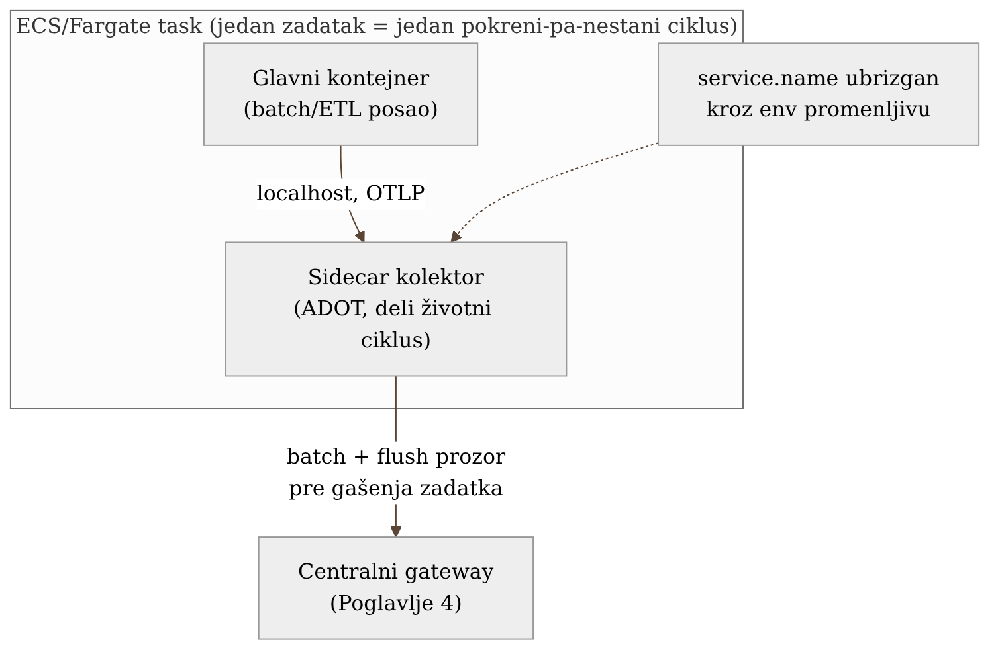

# Poglavlje 6 — Kontejnerska/batch radna opterećenja: sidecar obrazac

Na visokoj planini, penjač nikad ne ide sam — ide vezan konopcem za partnera.
Taj partner se ne nalazi u baznom logoru čekajući da se neko vrati sa
problemom; on se penje *sa* tobom, korak po korak, i kad ti siđeš sa planine,
silazi i on, u isto vreme, istim tempom. Bazni logor, s druge strane, ima
lekara koji čeka sve penjače podjednako — koristan, ali fizički ne može da te
prati na liticu, i ne zna tačno gde si u trenutku kad ti zatreba pomoć.

Kad je radno opterećenje kratkotrajno — pokrene se, uradi posao, nestane za
par minuta — ono treba pratioca koji deli tačno njegov životni vek, ne
stalnog čuvara koji čeka u bazi i nada se da će stići na vreme. To je razlika
između sidecar-a i agenta, i to je pitanje na koje ovo poglavlje odgovara.

## 6.1 Pitanje na koje ovo poglavlje odgovara

Poglavlje 4 je uvelo gateway kao centralnu tačku, a Poglavlje 2 auto- i
ručnu instrumentaciju za dugotrajne servise. Ali šta se dešava kad pošiljalac
telemetrije nije dugotrajan servis nego kratkotrajan batch zadatak — proces
koji se rodi, odradi posao, i nestane za par minuta, možda i sekundi? Da li
takav zadatak treba isti tretman kao dugotrajan servis (direktna veza ka
gateway-u), ili mu treba nešto strukturno drugačije?

Odgovor ovog poglavlja je: nešto strukturno drugačije — **sidecar kolektor,
upregnut uz svaki zadatak, koji deli tačno njegov životni vek.** Razlog nije
stilski nego životno-ciklusni, i vidi se najjasnije baš na onome što se
dešava kad zadatak nestane.

## 6.2 Kako je to urađeno — praktičan pregled

Svaki batch/ETL zadatak u sistemu koji knjiga prati pokreće se kao AWS
ECS/Fargate task definicija sa **dva kontejnera**: glavni kontejner koji radi
posao, i sidecar kontejner — lagana OpenTelemetry Collector distribucija
(ADOT — AWS Distro for OpenTelemetry) — koji prima telemetriju od glavnog
kontejnera preko `localhost`, radi minimalnu obradu (batch, dodavanje
resursnih atributa), i prosleđuje je ka centralnom gateway-u iz Poglavlja 4.

Zadatak i njegov sidecar dele **isti task lifecycle**: pokreću se zajedno,
gase se zajedno. Kad glavni kontejner završi posao, ECS task definicija je
podešena da sidecar dobije kratak, ali eksplicitan prozor da isprazni (flush)
sve što još drži u baferu pre nego što se ceo zadatak ugasi — bez tog
prozora, poslednjih par sekundi telemetrije bi jednostavno nestalo zajedno sa
kontejnerom koji ih je proizveo.

{: width="85%" }

Ovaj obrazac, uveden u produkciju posle prvobitnog pilot-a na dva zadatka
(razrađeno u Poglavlju 30), otkrio je katalog stvarnih zamki koje nijedna
"quickstart" dokumentacija ne pominje:

- **Sidecar ne postavlja `service.name` sam od sebe.** Za razliku od
  dugotrajnog servisa gde SDK zna sopstveni naziv iz koda, sidecar kolektor
  nema pojma koji je zadatak pokrenut pored njega — mora mu se eksplicitno
  ubrizgati kroz promenljivu okruženja u task definiciji. Bez toga, deseci
  različitih batch zadataka bi u cloud-u izgledali kao jedan neimenovani
  izvor, i dashboard koji filtrira po nazivu zadatka jednostavno ne bi imao
  šta da filtrira.
- **OTLP→Prometheus prevod dodaje sufikse jedinica koji nisu očigledni.**
  Metrika koja u kodu nosi ime `queue_depth` i jedinicu "items" stiže u
  Mimir kao nešto poput `queue_depth_items_total` ili sa sličnim sufiksom u
  zavisnosti od tipa — što znači da "očigledan" naziv metrike, onaj koji bi
  neko intuitivno otkucao u upitu, prosto ne postoji. Svaki novi tim mora
  prvo da otkrije stvarno ime, obično kroz `list_prometheus_metric_names`
  ili sličan alat, pre nego što napiše prvi PromQL upit.
- **Mimir ne promoviše svaki resursni atribut u lejbl.** Podrazumevano se
  promovišu samo eksplicitno navedeni atributi — ako novi resursni atribut
  nije dodat na tu listu, on stiže do Mimir-a, ali ostaje nevidljiv za
  filtriranje po njemu. Praktičan trik za proveru da je signal uopšte prošao
  kroz ceo pipeline (a ne samo da postoji na strani aplikacije): upit protiv
  `target_info` metrike, koju kolektor generiše automatski iz resursnih
  atributa i koja postoji nezavisno od toga da li je aplikacija poslala ijednu
  sopstvenu metriku tog minuta.
- **Neke biblioteke emituju samo spanove, ne i metrike.** Za takve
  komponente, jedini operativni signal na nivou metrike su
  `traces_spanmetrics_*` serije koje Tempo metrics-generator izvodi iz
  samih trejsova (obrađeno detaljnije u Poglavlju 11) — bez razumevanja da
  taj mehanizam postoji, tim bi zaključio da biblioteka "nema metrike", kad u
  stvari ima, samo indirektno.

### Kad novi sidecar izgleda kao uzrok pada — tri činjenice koje su ga oslobodile

Prvi talas kritičnih alarma posle uvođenja sidecar-a na jednu od batch flota
izgledao je kao klasična regresija: zadaci su počeli da se gase sa greškom
odmah po uvođenju nove verzije definicije zadatka, glavni kontejner je
izlazio sa neuspešnim statusom dok je sidecar izlazio čisto. Prvi instinkt —
"nova verzija je nešto pokvarila" — bio je pogrešan, i dokazano pogrešnim, ne
samo pretpostavljeno.

Tri nezavisne činjenice su oslobodile sidecar krivice. Prvo, identična greška
sa identičnim porukama postojala je u logovima tri dana pre nego što je
sidecar uopšte dodat — samo, pre toga, niko je nije mogao videti na jednom
mestu po identifikatoru zadatka, jer platforma za posmatranje još nije imala
uvid u tu flotu. Drugo, isti build, isto pokretanje modela, iste definicije
zadatka — neke varijante posla su tog dana prošle bez greške, dok su druge,
sa identičnim kontejnerskim otiskom, pale. Treće, greška je pogađala samo
jednu uzano definisanu kombinaciju ulaznih parametara, ne flotu uopšte —
oblik kvara vezan za podatke koje taj zadatak obrađuje, ne za infrastrukturu
koja ga pokreće.

Ironija je da je sam čin uvođenja sidecar-a taj problem prvi put učinio
vidljivim kao **obrazac**, ne kao izolovan incident: pošto su logovi grešaka
sad bili upitljivi po identifikatoru zadatka, tim je mogao da potvrdi da se
identična greška ponavljala iz dana u dan, i time dokaže da je uzrok stariji
od bilo koje promene te nedelje. Sidecar nije izazvao problem — otkrio je
problem koji je već postojao, nevidljiv.

Opšta pouka: prva sumnjiva promena posle bilo kakvog rollout-a je gotovo
uvek sama ta promena, jer je najsvežija u sećanju — ali korelacija sa
trenutkom uvođenja nije dokaz uzroka. Pre nego što se nova komponenta
proglasi krivom, vredi proveriti da li isti simptom postoji i van njenog
prisustva: u starijim logovima, na build-u koji je prethodio promeni, na
uporedivim zadacima koji tu promenu još nisu dobili.

### Flush prozor koji sidecar dobija ne pokriva ceo put

Sidecar dobija eksplicitan, kratak prozor pre gašenja da isprazni sve što
drži u sopstvenom baferu — to je opisano iznad, i tačno je, ali opisuje samo
**polovinu** puta koji telemetrija prelazi između glavnog kontejnera i
gateway-a.

Put ima dva odvojena skoka. Prvi: glavni kontejner do sidecar-a, preko
`localhost`. Drugi: sidecar do gateway-a, preko mreže. Prozor za gašenje koji
ECS task definicija garantuje pokriva **samo drugi skok** — vreme koje
sidecar dobija da isprazni ono što već drži pre nego što ga infrastruktura
prekine. Ne garantuje ništa o prvom skoku: ako SDK u glavnom kontejneru
koristi podrazumevani, **asinhroni** mehanizam za baferovanje raspona i
log zapisa (šalje ih u pozadinskim, periodičnim talasima, ne odmah kako
nastanu), i ako se ceo zadatak ugasi pre nego što taj mehanizam stigne do
svog sledećeg periodičnog slanja, ono što je u tom trenutku u baferu
glavnog kontejnera jednostavno nestaje zajedno sa procesom koji ga je
proizveo — nezavisno od toga koliko dug prozor sidecar dobija, jer sidecar
nikad nije ni video te podatke.

Ovo najviše pogađa baš onu klasu zadataka za koju je sidecar obrazac
prvenstveno i uveden: kratkotrajne, koji se gase sekundama posle pokretanja.
Duže-živeći servis ima dovoljno vremena da periodično slanje prirodno
stigne pre gašenja; zadatak koji traje par sekundi možda se ugasi pre nego
što je i jedan ciklus baferovanja završen.

Popravka nije u sidecar-u niti u dužini njegovog prozora za gašenje — mora
ići na strani glavnog kontejnera: eksplicitno, sinhrono pražnjenje bafera pre
izlaska iz procesa (ili prelazak na jednostavniji, sinhroni način slanja koji
ne baferuje u pozadini), tako da ništa ne ostane neposlato u trenutku kad
proces završi. Sidecar-ov prozor za gašenje i dalje ima svrhu — štiti drugi
skok — ali ne može nadoknaditi ono što se izgubilo pre nego što je uopšte
stiglo do njega.

{: width="75%" }

## 6.3 Analitički deo — sidecar naspram agenta, i granica gde sidecar prestaje da se isplati

### Zašto sidecar, a ne node-agent, za ovu klasu opterećenja

Nezavisne analize ovog izbora (uključujući Last9-ovo poređenje sidecar vs.
agent obrazaca) navode tačno onaj kriterijum koji je odlučio ovaj slučaj:
sidecar daje **snažnu izolaciju procesa** i garantuje da se "aplikacija i
sidecar gase zajedno" — kritično za batch opterećenje, gde zadatak nestaje
za par minuta i gde bi orphan telemetrijski tok (podaci koji stignu posle
nestanka zadatka koji ih je generisao, ili obrnuto, izgubljeni podaci jer je
zadatak nestao pre nego što ih je sidecar stigao da pošalje) bio gori ishod
od malo veće potrošnje resursa. Node-agent, s druge strane, ima **nezavisan
životni ciklus** — ostaje aktivan i kad se zadaci na njemu menjaju — što je
prednost za stabilne, dugotrajne servise (baš kao u agent-to-gateway obrascu
iz Poglavlja 4, da je tamo bio primenjen), ali stvara neusklađenost tačno na
granici koja ovde najviše boli: kratkotrajni zadaci nestaju, agent ostaje, i
veza između "koji zadatak je proizveo koji podatak" postaje teža da se
garantuje.

Cena ovog izbora je realna i priznata u istoj analizi: sidecar znači veću
potrošnju resursa po zadatku (svaki zadatak nosi sopstvenu kopiju kolektora),
naspram jedne deljene instance agenta po čvoru. Za sistem koji knjiga prati,
ta cena je prihvaćena svesno — broj istovremenih batch zadataka je dovoljno
mali da dodatni CPU/memorija po zadatku ne predstavlja problem, dok bi
alternativa (deljeni agent) uvela tačno onu vrstu orphan-podataka rizika koju
sidecar eliminiše po definiciji.

### Granica gde sidecar prestaje da bude dobar izbor

Vredi eksplicitno pogledati kad ovaj obrazac **prestaje** da se isplati, jer
to je podjednako vredna lekcija kao i sam izbor. AWS-ov sopstveni materijal o
migraciji sa sidecar-a na centralizovani gateway obrazac (za telemetriju koja
prelazi granice više AWS naloga) navodi tri konkretna razloga zašto sidecar
po-zadatku prestaje da skalira: sidecar kolektor je linux-only slika, pa ne
radi kao pratilac uz Windows/.NET Framework zadatke, koji onda ili ostaju
neinstrumentirani ili nose kolektor koji ništa ne prikuplja; troškovi
po-zadatka rastu linearno sa brojem zadataka, dok centralni gateway ima
gotovo konstantnu cenu bez obzira na broj pošiljalaca; i konfiguracija
"drifta" — svaka kopija sidecar-a menja se nezavisno, bez jedne centralne
tačke za politiku prijema, tačno suprotno principu iz Poglavlja 4 ("jedno
mesto gde se ista provera radi na isti način").

Ovo nije kontradikcija sa odlukom u ovom poglavlju — to je granica primene.
Implementacija koju knjiga prati radi na obimu (desetine, ne hiljade
istovremenih batch zadataka, u jednom AWS nalogu) gde prednosti sidecar-a
(izolacija životnog ciklusa) jasno nadmašuju njegove mane (potrošnja
resursa, nedostatak centralne politike). Da je obim narastao za red veličine,
ili da se batch flota proširila na više naloga, ista analiza koja je ovde
opravdala sidecar bi opravdala prelazak na gateway obrazac za tu klasu
opterećenja — što je tačno primer principa iz Poglavlja 4: svaka odluka o
alatu se opravdava kroz kontekst, ne kroz apsolutnu ispravnost samog alata.

Vratimo se na penjača i konopac. Partner koji se penje sa tobom ima smisla
dok ste vas dvoje — dodaj još pedeset penjača na isti konopac, i sistem koji
je savršeno radio za dvoje postaje neuporediv teret. Sidecar je pravi izbor
za obim na kome ovaj sistem danas radi; **prava veština nije u tome da se
zapamti "sidecar je bolji od agenta", nego da se prepozna na kom obimu ta
tvrdnja prestaje da važi.**

## 6.4 Skupljena pravila iz ovog poglavlja

- Za kratkotrajna, efemerna radna opterećenja, prioritizuj obrazac koji deli
  životni ciklus zadatka (sidecar) nad obrascem sa nezavisnim životnim
  ciklusom (agent) — orphan telemetrija je gori ishod od veće potrošnje
  resursa.
- Eksplicitno ubrizgaj `service.name` i druge identifikacione atribute u
  sidecar preko env promenljivih — nikad ne pretpostavljaj da će ih sidecar
  "sam znati".
- Pre nego što napišeš prvi PromQL upit protiv nove metrike, proveri stvarno
  ime posle OTLP→Prometheus prevoda — sufiksi jedinica gotovo nikad nisu
  intuitivni.
- Koristi `target_info` (ili ekvivalent) kao brz test da li signal uopšte
  prolazi kroz ceo pipeline, nezavisno od toga da li aplikacija baš tog
  trenutka šalje sopstvene metrike.
- Sidecar obrazac ima granicu skaliranja (linux-only, troškovi po-zadatku,
  drift konfiguracije) — znaj unapred na kom obimu bi tvoj sistem prešao tu
  granicu, umesto da to otkriješ kad već bude bolno.
- Korelacija sa trenutkom uvođenja neke promene nije dokaz da je ta promena
  uzrok — pre nego što je proglasiš krivom, proveri da li isti simptom
  postoji i van njenog prisustva (stariji logovi, prethodni build, uporedivi
  slučajevi koji promenu još nisu dobili).
- Prozor za gašenje koji infrastruktura garantuje sidecar-u pokriva samo
  skok od sidecar-a nadalje — ne garantuje ništa o asinhronom baferu u
  glavnom kontejneru koji tek treba da stigne do sidecar-a preko localhost-a.
  Za kratkotrajne procese, popravka mora ići na strani aplikacije: eksplicitno
  pražnjenje bafera pre izlaska, ne oslanjanje na tuđi prozor za gašenje.

## 6.5 Vežba za čitaoca

Pronađi jedan kratkotrajan zadatak u svom sistemu (batch posao, cron, Lambda)
koji trenutno šalje telemetriju direktno, bez ikakvog lokalnog pratioca.
Postavi pitanje: šta se dešava sa poslednjih par sekundi telemetrije ako
zadatak bude prekinut (timeout, OOM kill) pre nego što stigne da zatvori
konekciju? Ako je odgovor "verovatno se izgubi" — to je tvoj kandidat za
sidecar obrazac iz ovog poglavlja.

---

### Izvori korišćeni u analitičkom delu

- [Sidecar or Agent for OpenTelemetry: How to Decide — Last9](https://last9.io/blog/opentelemetry-sidecar-vs-agent/)
- [Centralize cross-account Amazon ECS telemetry with an ADOT gateway — AWS](https://aws.amazon.com/blogs/containers/centralize-cross-account-amazon-ecs-telemetry-with-an-adot-gateway/)
- [Setting up AWS Distro for OpenTelemetry Collector in Amazon ECS — AWS](https://aws-otel.github.io/docs/setup/ecs/)
- [Collect Amazon ECS/Fargate OpenTelemetry data — Grafana Alloy docs](https://grafana.com/docs/alloy/latest/collect/ecs-opentelemetry-data/)
- [Monitoring ECS Fargate using OpenTelemetry Collection Agents — SigNoz](https://signoz.io/docs/opentelemetry-collection-agents/ecs/sidecar/user-guides/get-started/)
