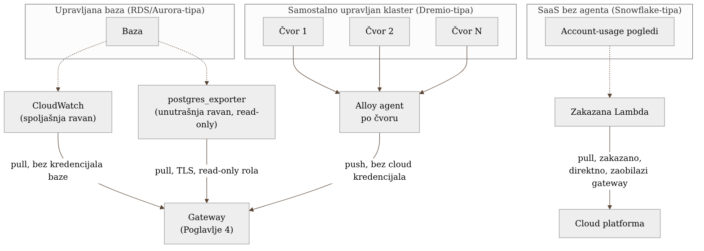

# Chapter 7 — When you can't instrument the source: pull-based patterns

A doctor has three completely different levels of access to a patient, and
chooses a method according to how deep they're allowed and able to go. For a
patient in their own office, they can draw blood and send it for analysis —
invasive, fully under control, seeing internal values directly. For a patient
who has gone home with a wearable monitor, they get only what an external
sensor can measure — pulse, blood pressure, oxygen saturation — without a
single incision, but also without any view of what's happening beneath the
skin. And for a patient being treated at a clinic abroad, they get only
whatever that clinic voluntarily decides to send them, once a week, in a
report shaped by someone else's judgment, not their own request.

All three approaches are legitimate forms of observing the patient. The
difference isn't which one is "better" — the difference is **how much
control the doctor has over the patient**, and that amount of control
directly determines which method they're even allowed to choose.

The same holds for systems you can't instrument from the inside — databases
run by a cloud provider, clusters you maintain yourself but whose code you
don't write, and SaaS services over which you have no operational control at
all. This chapter covers all three levels.

## 7.1 The question this chapter answers

Every chapter so far has assumed there's a process you can drop an SDK or an
agent into — Chapter 2 (applications), Chapter 6 (batch jobs). But what do
you do when the source of telemetry **isn't a process you control**? When
it's a managed database you can't install anything on the host of, a system
you maintain yourself but whose code isn't yours, or a SaaS service that
lives entirely outside your network?

The answer changes the direction of data flow itself: instead of waiting for
the source to **push** telemetry to you, you have to actively **pull** it —
and how deep you can pull depends exactly on how much control you have, just
like the doctor from the introduction.

## 7.2 How it was actually done — a practical walkthrough

The implementation this book follows uses three different pull-based
patterns, each fitted exactly to the level of control that particular type
of source allows.

**A managed database (RDS/Aurora-type) — two layers.** For every managed
database there are **two independent** sources of telemetry, deliberately,
not accidentally, duplicated:

- **The external view** — CloudWatch metrics, pulled without a single
  credential belonging to the database itself, straight from the AWS API.
  These are infrastructure signals AWS measures from its own side: CPU,
  memory, disk I/O, `ReplicaLag` in seconds, free disk space.
- **The internal view** — `postgres_exporter`, using a read-only role over a
  TLS connection, querying the database's own system statistics views
  (`pg_stat_user_tables`, `pg_stat_user_indexes`, `pg_stat_bgwriter`) and
  exposing them in Prometheus format, which the gateway then scrapes.

These two layers deliberately **do not replace** one another — they fail in
different ways. The external layer (CloudWatch) survives even when the
database stops accepting connections entirely, because it doesn't depend on
a connection to the database to function. The internal layer stops working
at exactly the moment it would be needed most — when the database is
refusing connections — but while it's running, it sees things CloudWatch
never sees: which query is burning the most time, which index is never
used, how the shared buffer drains by process type. One layer without the
other leaves a blind spot exactly at the moment of critical failure, or
exactly at the depth that would explain *why* the failure happened.

Here's what that data looks like once it lands on a dashboard — two layers,
side by side, each showing something the other can't:

{: width="95%" }

**A self-managed distributed cluster (Dremio-type) — an agent per node.**
Unlike a managed database, here the team has full control over the host — it
can install whatever it needs. The solution: Grafana Alloy installed as an
agent on every node of the cluster, which locally scrapes host-level metrics
(CPU, memory, disk), JVM/application metrics exposed over a local endpoint,
and local logs, and **pushes** all of it to a central gateway. A key
architectural decision: no cloud credential lives on a cluster node — the
agent only knows where the gateway is (an internal address), not how to talk
to Grafana Cloud directly. This is the same principle from Chapter 4 (the
gateway as the only place that holds credentials), applied here to
infrastructure that isn't physically an application but is under the team's
full operational control.

**Agentless SaaS (Snowflake-type) — a scheduled function that pulls from
outside.** This is the level of least control, and the pattern is
structurally different from the first two: a scheduled Lambda function
periodically queries the system "account usage" views that the SaaS service
voluntarily exposes (analogous to the "report from the clinic abroad" from
the introduction), and pushes the result **directly** into the cloud
observability platform — not through the internal gateway. This is a
deliberate decision, not an oversight: a watcher observing a system outside
your network has to survive even when your own internal infrastructure
(including the gateway) is down — otherwise it wouldn't be able to tell "the
SaaS service has a problem" apart from "my own gateway has a problem," which
are completely different diagnoses requiring completely different
responses. This pattern is rich enough in its own pitfalls (structural
latency on the order of an hour or two, the cost of querying system views,
the difference between "the watcher is dead" and "the observed system is
dead") that it earns a full case study of its own in Chapter 24.

All three patterns share one principle, important enough to stand as a rule
of the book: **a watcher observing a critical path must not depend on the
infrastructure it's observing.** RDS's external layer doesn't depend on a
connection to the database. The Snowflake watcher doesn't depend on the
internal gateway. If this principle is broken — if the observer shares a
failure mode with what it's observing — you get silence exactly when you
most need a voice.

All three patterns, side by side:

{: width="98%" }

### The cost of pulling is measured per call, not per data point

With push, the marginal cost of an extra signal is roughly linear with data
volume — one extra span is one extra span, regardless of where it came
from. Pulling against a managed cloud service's API has a completely
different economic shape: the vendor bills **per call**, not by the value
that call returns. Concretely, for the external layer on the managed
database, every query for one metric on one dimension in one time window is
one billed call — the cost scales with the product of the number of
metrics, the number of dimensions queried by, and **how often they're
asked**, entirely independent of whether the value has changed since the
last call at all.

This difference shaped two separate decisions in the implementation, not
one. First: instead of automatically discovering every database by tag
(which would silently multiply the number of calls with every new database
added in the future, with no single explicit decision to accept that cost),
the list of monitored databases is **static** — every new database enters
monitoring by an explicit job addition, not automatically. The cost stays
predictable; the cost of that predictability is that a new database doesn't
enter monitoring on its own. Second: when one group of metrics was more
expensive than its actual usefulness justified, the fix wasn't deleting
metrics — it was **lengthening the interval between calls**, on the same set
of metrics, because cost rises with call frequency just as much as with the
number of metrics. For a metric whose default granularity at the source
already runs several minutes, asking every 60 seconds wouldn't return
anything new anyway — it would just pay for a question whose answer hadn't
changed yet.

### When the query window is narrow, the system you're asking may not have answered yet

One CPU-load metric, right after a new metric group was introduced, started
behaving inexplicably asymmetrically: on one database replica it was
perfectly normal, on the other it would occasionally drop to a complete
gap — not to zero, but to an **absence of a data point**, as if that replica
hadn't existed at all for that minute. The first assumption — that something
specific was wrong with that particular replica — was wrong.

The real cause had nothing to do with any replica individually. The cloud
service measuring the data source publishes that specific metric with
additional delay relative to the moment it describes — the value for minute
*N* sometimes doesn't become available until somewhat after minute *N*. A
query asking for a data point in a window exactly as wide as that metric's
default granularity would, statistically, occasionally arrive **before** the
value had even been published — and the pull mechanism, finding no data
point in the requested window, interpreted that as "this series doesn't
exist right now," not as "the value hasn't arrived yet." The asymmetry
between replicas wasn't a real difference in the system — it was a
difference in how often each replica's timing happened to line up with the
edge of the window.

The fix didn't touch anything on the source side — the **query window** was
widened, well beyond the metric's default granularity, so that even a
late-published value still lands inside the window being searched. The
series stayed complete on both replicas after that.

The general lesson goes beyond this CPU metric or this particular service:
for every pull against someone else's API, the window being searched must be
wider than the source's default granularity, not equal to it — otherwise
every call carries the risk of landing exactly in the gap between the
moment being asked about and the moment the answer was actually published,
and that gap manifests as a complete absence of data, not as a slow or
unusual value, which makes it easy to misread as a real failure of the
observed system.

{: width="75%" }

## 7.3 Analytical section — why there's no single universal pull-based pattern

### The official state of things: focus is almost entirely on push

It's worth noting something independent comparisons rarely say explicitly:
the OpenTelemetry ecosystem is designed primarily around a **push** model
(the application sends via SDK, an agent pushes onward) — which makes sense,
since OTel starts from the assumption that you have code you can insert
instrumentation into. Pull-based collection (the Prometheus-style "scrape")
exists as a separate, older pattern that the OTel Collector supports through
receivers like `prometheusreceiver`, but the documentation and most of the
tutorials treat it as an edge case, not an equal, first-class pattern.
That's understandable for the world the ecosystem grew up in — but for a
system that includes managed databases, self-managed clusters, and SaaS
services, pull isn't an edge case. It's the **majority** of sources a team
doesn't control at the code level.

### Why three different pull-based patterns, instead of one consistent one

The natural instinct would be to look for a single, consistent pull
mechanism for all three categories — simpler to maintain, less cognitive
load. But the three categories have three different levels of control, and
trying to impose one mechanism on all of them would mean either too little
(for a cluster where more would be possible) or impossible (trying to
install an agent on a SaaS service you have no host access to). The
criterion that determines the pattern isn't "what's most aesthetically
consistent," it's a literal question: **can I install something on the
host?** If yes (the Dremio cluster) — an agent that pushes. If not, but the
service exposes an API/view that surfaces its state (RDS CloudWatch,
Snowflake account usage views) — pull from outside. If not even that,
without special conditions (a connection to the database that may be
unavailable) — an additional, redundant external layer that doesn't share
that same point of failure.

### The cost of not doing it this way: one invented but realistic scenario

Suppose the team had tried to monitor RDS using only `postgres_exporter`
(the internal layer), without the CloudWatch external layer: at the exact
moment the database starts refusing connections — the single most critical
moment possible — monitoring would go silent exactly when it's needed most,
because the exporter itself depends on the same connection that just failed.
The team would see "no data" and have to guess whether that's because the
database is dead, or because the exporter itself is dead — an ambiguity that
burns precious minutes in the middle of an incident. The external CloudWatch
layer exists precisely to remove that ambiguity: it keeps reporting the
database's infrastructure state regardless of whether anyone can connect to
it at all.

Back to the doctor from the introduction. They don't choose one method for
every patient — they choose a method according to how deep they're allowed
and able to go, and for a patient where they suspect one method might
suddenly fail (a database that can refuse connections), they keep a second,
redundant method ready. **The number of observation methods you use for a
single source shouldn't be one — it should be however many independent ways
that source has of failing in a way that would blind you.**

## 7.4 Rules collected from this chapter

- Before choosing a collection mechanism for a new source, ask: can I
  install something on the host? The answer determines whether you go with
  an agent-that-pushes or a pull-from-outside — not personal preference.
- For every source that can become unavailable in a way that would also take
  down its own monitoring (a database refusing connections), keep a
  redundant, structurally independent external layer.
- A watcher observing a critical path must not share infrastructure
  (network, gateway, credentials) with what it's observing — otherwise you
  lose the ability to tell "the observed system is down" apart from "my
  watcher is down."
- Don't force every pull-based source into one consistent mechanism for the
  sake of tidiness — the level of control you have over the source, not
  aesthetics, determines the correct pattern.
- When you add a new pull-based source, explicitly write down (not just keep
  in your head) what structural latency is acceptable for that source — pull
  rarely means "real time," and alerts have to be tuned to the actual
  latency, not the desired one.
- The cost of pulling against a metered API scales with the number of
  metric×dimension combinations times how often they're asked, not with
  whether the value changed — keep the source list static instead of
  auto-discovering, and when cost becomes disproportionate to value, widen
  the interval first, only then consider deleting the metric.
- When the query window equals the source's default granularity, the system
  you're asking may not have published the value yet — the puller reads
  that as "series doesn't exist," not as "hasn't arrived yet." Widen the
  query window well beyond the source's nominal granularity instead of
  changing the source itself.

## 7.5 Exercise for the reader

Make a list of every telemetry source in your system that you have no
ability to install an agent or SDK on. For each one, answer: (1) is there an
external API/view that source voluntarily exposes, (2) what is that source's
structural latency, and (3) does my existing monitoring of that source share
even one point of failure with the source itself. If the answer to (3) is
"yes" for any critical source — that's your first candidate for adding a
redundant, independent layer.

---

### Sources used in the analytical section

- [Collecting RDS metrics from PostgreSQL databases — Datadog](https://www.datadoghq.com/blog/collect-rds-metrics-for-postgresql/)
- [AWS RDS (PostgreSQL) Metrics and Logs — SigNoz Docs](https://signoz.io/docs/integrations/aws-rds-postgres/)
- [Create an Amazon CloudWatch dashboard to monitor Amazon RDS for PostgreSQL — AWS Database Blog](https://aws.amazon.com/blogs/database/create-an-amazon-cloudwatch-dashboard-to-monitor-amazon-rds-for-postgresql-and-amazon-aurora-postgresql)
- [Prometheus Receiver — OpenTelemetry Collector Contrib](https://github.com/open-telemetry/opentelemetry-collector-contrib/tree/main/receiver/prometheusreceiver)
- [Grafana Alloy documentation — Collecting Prometheus metrics](https://grafana.com/docs/alloy/latest/collect/prometheus-metrics/)
