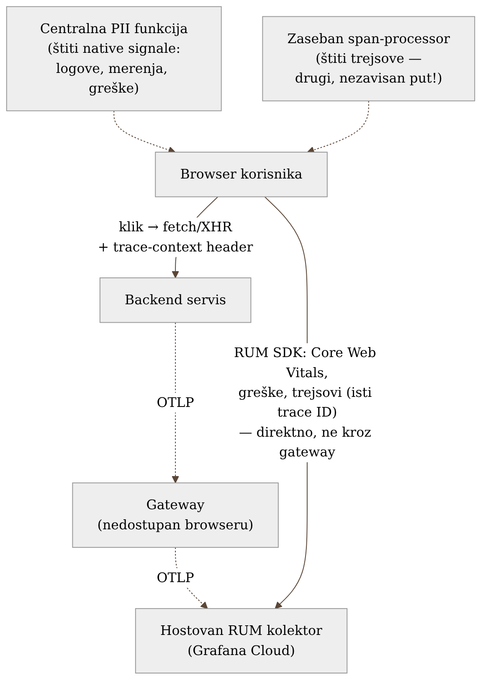
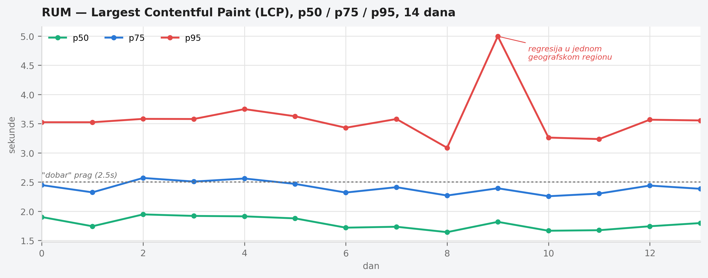

# Poglavlje 8 — Frontend / RUM observability

Ambasada u stranoj zemlji je, tehnički, teritorija matične države — ali ne
funkcioniše kao njena unutrašnja pošta. Pismo poslato iz ambasade ne ide kroz
lokalni poštanski sistem strane zemlje, jer ambasada tom sistemu ni ne
pripada na isti način kao građanska pošta kod kuće; ono ide direktnom,
diplomatskom linijom, jer je to jedini put koji ambasadi uopšte stoji na
raspolaganju. I ambasada nema jedan kanal komunikacije, nego više — redovna
prepiska ide jednim putem, hitni kurirski paketi drugim — a svaki od tih
kanala mora **posebno** da bude proveren pre nego što nešto osetljivo prođe
kroz njega, jer provera na jednom kanalu ne štiti automatski i drugi.

Browser korisnika je, za sistem koji knjiga prati, u sličnoj poziciji.
Fizički živi van interne mreže — ne može, i ne treba, da mu se dozvoli pristup
internom gateway-u iz Poglavlja 4. Mora da ide sopstvenim, direktnim putem. I
baš kao ambasada, ima više od jednog kanala kojim podaci putuju — što znači
da zaštita mora biti primenjena na svakom kanalu posebno, ne jednom, na
jednom mestu, i pretpostavljeno da to pokriva sve.

## 8.1 Pitanje na koje ovo poglavlje odgovara

Sve dosadašnje poglavlje o prikupljanju telemetrije (Poglavlja 4-7)
pretpostavlja da pošiljalac živi unutar mreže koju tim kontroliše — servis,
batch zadatak, baza, čak i klaster. Browser korisnika krši tu pretpostavku na
najosnovniji mogući način: **fizički nikad neće imati pristup internoj
infrastrukturi**, bez obzira koliko dobro ta infrastruktura bude
projektovana. Kako se onda prikuplja telemetrija sa mesta koje po definiciji
ne možeš da uvučeš u sopstvenu mrežu — i šta to menja u odnosu na sve
prethodno u knjizi?

## 8.2 Kako je to urađeno — praktičan pregled

Frontend telemetrija u implementaciji koju knjiga prati ide **direktno** ka
hostovanom RUM kolektoru na strani Grafana Cloud-a — ne kroz interni gateway.
Ovo je jedina kategorija pošiljaoca u celom sistemu koja gateway zaobilazi
namerno, iz razloga eksplicitno pomenutog i u Poglavlju 4: gateway živi u
privatnoj mreži, i browser korisnika joj fizički ne može pristupiti.

Ono što se prikuplja:

- **Core Web Vitals** — standardizovane metrike percepcije performansi
  (vreme do prvog sadržajnog prikaza, stabilnost layout-a, odzivnost na
  interakciju) koje sam browser meri i izlaže.
- **JavaScript greške** — neuhvaćeni izuzeci, odbijeni promisi, sa stack
  trag-om i informacijom o browseru/uređaju.
- **Trejsovi korisničke sesije**, povezani sa backend trejsom preko **istog
  trace ID-ja** — kad korisnik klikne dugme koje pokreće API poziv, RUM SDK
  ubacuje trace-context header u taj poziv, tako da se ceo put (klik u
  browseru → mrežni poziv → backend obrada → odgovor) pojavljuje kao jedan
  kontinuiran trejs, čitljiv u istom Grafana Cloud interfejsu koji već
  koristi backend telemetrija.

Ova poslednja tačka — deljen trace ID kroz ceo put — je razlog zašto frontend
poglavlje uopšte pripada ovoj knjizi, a ne posebnoj, izolovanoj temi: iako
mehanizam transporta strukturno odstupa od svega drugog (direktno umesto kroz
gateway), *semantika* ostaje ista OTel semantika iz Poglavlja 2. Isti trace
ID, ista propagacija konteksta.

{: width="75%" }

**Dve tačke za čišćenje PII, ne jedna.** Ovo je najvrednija praktična lekcija
poglavlja. RUM SDK ima jednu centralnu funkciju koja presreće sve "native"
signale — logove, merenja, greške — i iz njih uklanja poznate osetljive
vrednosti pre slanja (email adrese u porukama grešaka, ID-jevi sesije u
URL-ovima). Ta funkcija radi tačno ono što se od nje očekuje. Problem: **RUM
trejsovi ne prolaze kroz tu istu funkciju.** Trejsovi se generišu i šalju
kroz zaseban deo SDK-a (instrumentacija automatskih fetch/XHR poziva), koji
ima sopstveni, nezavisan put do mreže — i taj put tu istu centralnu funkciju
jednostavno zaobilazi. Otkriveno je da su URL parametri sa identifikatorima
korisnika, koji su uredno uklonjeni iz logova, i dalje završavali u atributima
span-ova, jer je timski mentalni model bio "dodao sam filter za PII" umesto
precizno "dodao sam filter za PII **na ovom konkretnom putu podataka**".
Ispravka je zahtevala eksplicitnu, zasebnu redakciju na nivou span-processora,
ne proširenje postojeće funkcije koja trejsove nikad nije ni videla.

Ovako izgleda Core Web Vitals dashboard u praksi — tri percentila (p50/p75/p95)
umesto jedne linije, jer prosek ili čak medijana lako sakriju baš onaj deo
korisnika koji ima najgore iskustvo:

{: width="95%" }

## 8.3 Analitički deo — zašto direktna veza nije kompromis nego zahtev, i šta znači kad "jedan filter" nije dovoljan

### Zašto zvanična arhitektura RUM-a skoro uvek ide direktno u cloud

Nezavisni pregledi RUM arhitekture dosledno navode da browser telemetrija
ide direktno ka hostovanom kolektoru, ne kroz internu infrastrukturu — iz
prostog razloga što interna infrastruktura po definiciji nije dostupna sa
javnog interneta na način koji bi browser mogao bezbedno da koristi.
Otvaranje interne mreže ka javnom internetu samo da bi RUM SDK mogao da
pošalje podatke kroz "isti gateway kao sve ostalo" bi značilo probijanje baš
onog perimetra koji je Poglavlje 4 pažljivo zatvorilo — cena veća od koristi
koju bi doslednost transportnog puta donela. Ovo je redak slučaj gde
"industrijski standard" i implementacija koju knjiga prati **nisu u
tenziji** — oba idu istim putem, iz istog razloga.

### Zašto RUM naspram sintetičkog praćenja nisu zamena jedno za drugo

Nezavisna poređenja RUM-a i sintetičkog (black-box) praćenja — tema kojom se
detaljno bavi Poglavlje 9 — ističu da RUM zavisi potpuno od stvarnog
saobraćaja: signal postoji samo ako neko korisnik u tom trenutku koristi
aplikaciju. To znači da RUM ima strukturnu slepu tačku u periodima niskog
saobraćaja (noć, period pre lansiranja) — ako se aplikacija pokvari tačno
tada, RUM to jednostavno neće registrovati na vreme, jer nema koga da
registruje. Ova slepa tačka nije nedostatak RUM implementacije — ona je
strukturno svojstvo pasivnog posmatranja stvarnih korisnika, i rešava se
kombinovanjem sa aktivnim probama, ne popravkom RUM-a samog.

### Lekcija iz PII incidenta: zašto "dodao sam filter" retko znači "sve je pokriveno"

Ovo je poglavlje u kome se najjasnije vidi princip koji se provlači kroz celu
knjigu, prvi put eksplicitno imenovan u Poglavlju 1 na drugom primeru: sistem
može da "radi ispravno" po svakoj proveri koju je neko sproveo, a ipak da
propušta nešto što nijedna od tih provera nije ni gledala. PII filter za
logove je bio testiran, radio je, prošao je code review — sve tačno kako
treba. Ono što nije bilo eksplicitno provereno je pitanje "kroz koje **sve**
puteve podataka ovaj SDK šalje nešto ka mreži" — a odgovor je bio dva puta,
ne jedan, i drugi put niko nije aktivno tražio jer se prvi filter "osećao
kao" kompletno rešenje.

Kontrafaktički: da je tim od početka mapirao **sve** izlazne puteve RUM SDK-a
pre nego što je napisao prvi filter (umesto da filter napiše za put koji je
prvi pao na pamet — logove), ovaj incident se verovatno nikad ne bi ni
dogodio. Cena tog mapiranja unapred je bila mala — par sati čitanja
dokumentacije SDK-a. Cena otkrivanja posle činjenice bila je veća: revizija
istorijskih podataka da se proceni koliko dugo je curenje trajalo, dodatna
runda review-a za sličnu klasu bagova na drugim mestima u sistemu.

Vratimo se na ambasadu s početka poglavlja. Ona nema jedan kanal komunikacije
— ima više, i svaki mora biti proveren posebno, jer provera na jednom
kanalu ne prelazi automatski na drugi. **Kad štitiš osetljive podatke,
pitanje nije "da li sam dodao filter" nego "da li sam nabrojao svaki put
kojim podatak može da izađe, i da li svaki od njih ima sopstvenu,
eksplicitnu proveru."**

## 8.4 Skupljena pravila iz ovog poglavlja

- Browser telemetrija ide direktno ka hostovanom kolektoru — ne pokušavaj da
  je forsiraš kroz internu infrastrukturu radi doslednosti transportnog
  puta; to je pogrešna vrsta doslednosti.
- Zadrži isti trace ID i semantiku konteksta (OTel propagacija) čak i kad se
  transportni mehanizam strukturno razlikuje od ostatka sistema — to je ono
  što povezuje frontend i backend u jedan čitljiv trejs.
- Pre nego što napišeš PII filter, mapiraj **sve** izlazne puteve podataka iz
  SDK-a ili biblioteke koju štitiš — logovi, merenja, greške i trejsovi retko
  dele istu funkciju za obradu.
- RUM ne zamenjuje sintetičko praćenje niti obrnuto — RUM zavisi od
  stvarnog saobraćaja i ima slepu tačku u periodima tišine; to nije bag,
  to je razlog da postoji Poglavlje 9.
- Posle svakog "dodao sam filter za X", eksplicitno pitaj: kroz koje sve
  puteve X uopšte može da izađe, i da li ih je filter zaista sve pokrio.

## 8.5 Vežba za čitaoca

Uzmi bilo koju biblioteku ili SDK u svom sistemu koja šalje podatke ka
spoljnom servisu (RUM, analytics, error tracking) i nabroj **svaki** tip
signala koji ta biblioteka šalje (logovi, metrike, greške, trejsovi, session
replay ako postoji). Za svaki tip, proveri nezavisno da li prolazi kroz isti
filter za osetljive podatke kao i ostali, ili ima sopstveni, poseban put.
Ako ne znaš odgovor sa sigurnošću za bar jedan tip signala — to je rupa koju
ovo poglavlje traži da zatvoriš pre nego što je neko drugi otkrije umesto
tebe.

---

### Izvori korišćeni u analitičkom delu

- [What Is Real User Monitoring (RUM)? — Dash0](https://www.dash0.com/faq/what-is-real-user-monitoring)
- [OpenTelemetry for Web RUM — RUM Architecture, Tooling & Self-Hosting](https://www.rum-core-web-vitals.com/rum-architecture-tooling-self-hosting/opentelemetry-for-web-rum/)
- [RUM vs synthetic monitoring: which do you need? — ClickHouse](https://clickhouse.com/resources/engineering/rum-vs-synthetic-monitoring)
- [Performance Monitoring: RUM vs. Synthetic Monitoring — MDN](https://developer.mozilla.org/en-US/docs/Web/Performance/Guides/Rum-vs-Synthetic)
- [Real User Monitoring (RUM) — OneUptime](https://oneuptime.com/product/rum)
