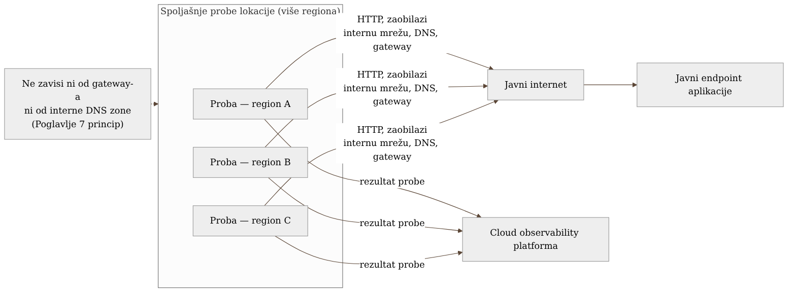
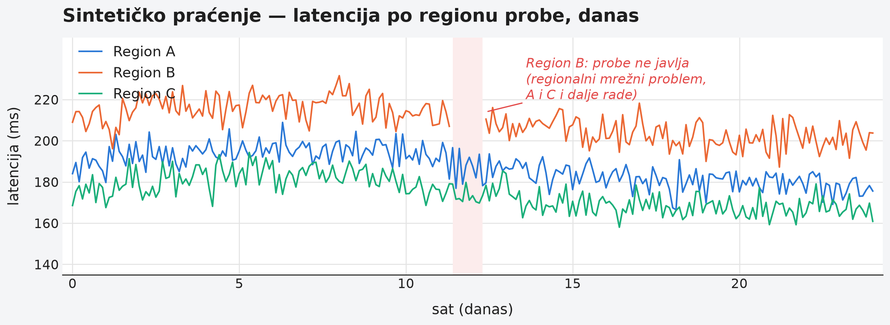

# Chapter 9 — Synthetic (Black-Box) Monitoring

A lighthouse keeper doesn't wait for a ship to appear before checking
whether the light works. Every evening, whether or not anyone is visible on
the horizon, he lights it and checks it — because the very night when no
ship is nearby to witness that the light works is the night he most needs
to trust that it will work, for the one ship that does eventually appear,
in the dark, without warning. Had the keeper waited to see a ship before
checking the light, he would have discovered the failure at exactly the
moment it's most expensive to discover it.

RUM from the previous chapter is like a sailor watching the lighthouse from
a ship — he sees it only while he's there, only while there's traffic
generating the signal. Synthetic monitoring is the keeper checking the
light every night, regardless of whether anyone is watching. Both are
needed; they do different jobs.

## 9.1 The question this chapter answers

RUM from Chapter 8 depends on real user traffic for a signal to exist at
all. What happens during a period when that traffic is absent — in the
middle of the night, in the run-up to a launch, in a region where the user
base is small? Does the system then have **no** way at all to know whether
it's working, until the first user shows up to discover that instead of the
monitoring system?

The answer is synthetic monitoring — active, scheduled probes that don't
wait for a real user, but instead simulate one themselves, on a fixed
schedule, regardless of whether anyone is actually using the system at
that moment.

## 9.2 How this was done — a practical overview

The implementation this book follows uses external HTTP probes that **do
not pass through internal infrastructure** — not through the gateway from
Chapter 4, not through the internal network, not through internal DNS. The
probes are run from external locations (managed by the Grafana Cloud
platform itself), hit the application's public endpoints exactly the way a
real user would from outside, and report the result back to the same
observability platform where every other signal in this book lives.

The probes test two different things, deliberately kept separate:

- **Basic availability** — whether the public endpoint responds at all, and
  how long it takes. This is the simplest form of probe and the cheapest to
  maintain.
- **Critical business flow** — a multi-step probe that simulates an actual
  user journey (log in, a key API call, checking that the response contains
  the expected content, not just a 200 status code). This is an important
  difference from a naive availability check: an endpoint can respond with
  200 and empty or wrong content — exactly the same silent-failure pattern
  from Chapter 1 (the "cacher" incident), just applied here to an external
  check instead of an internal batch job.

The probes run from **multiple geographic locations at once**, which gives
a signal that neither RUM nor an internal health check can give in the same
way: if a probe from one region reports a failure while the others operate
normally, that narrows the diagnosis to a network/DNS problem specific to
that region, rather than a problem in the application itself.

The most important architectural property of this pattern, inherited
directly from the principle introduced in Chapter 7 (**the watcher must not
depend on the infrastructure it's watching**): probes run completely
independently of the internal network, the internal DNS zone, and the
internal gateway. That means synthetic monitoring is the only signal in
the entire system that **survives** the scenario in which the whole
internal observability infrastructure is unreachable — exactly the
scenario in which every other source in this book (RUM going directly to
the cloud is the exception, but it doesn't test business logic in the same
explicit way) would fall silent, not because the application went down,
but because the path to the monitoring system went down.

{: width="92%" }

The multi-region setup pays off in exactly a moment like this — when one
region goes quiet while the other two keep reporting normal operation, the
diagnosis narrows itself, without a single additional investigative step:

{: width="95%" }

## 9.3 Analytical section — why synthetic monitoring isn't "poor man's RUM"

### Synthetic and RUM solve different problems, not the same problem two different ways

Independent comparisons of RUM and synthetic monitoring (including
ClickHouse's and MDN's material on the subject) consistently state that
these are two complementary approaches, not competing ones. RUM is better
for understanding **actual** user experience — real devices, real
networks, real geographic distribution, long-tail problems that no
synthetic scenario would ever hit because nobody imagined them in advance
(the same "unknown unknown" problem from Chapter 1, just now at the level
of performance instead of correctness). Synthetic monitoring is better for
**stable, repeatable** availability checks and for alerts that need to work
independently of traffic — SLA verification, off-hours alerting, regression
testing of critical flows before a change is even released to production.

An attempt to replace one with the other always exposes the same blind
spot: a system that relies on RUM alone knows nothing about its own state
when there's no traffic; a system that relies on synthetic probes alone
doesn't see the real distribution of user experience (probes test a
fixed, small number of scenarios from fixed locations — not the chaos of
the real world).

### Why test the business flow, not just availability

It's worth explicitly noting why the decision to have probes test a
**critical business flow**, not just "does the endpoint respond with 200,"
is a direct consequence of the lesson from Chapter 1. Had the probes in the
implementation this book follows checked only basic availability, the
system could have "passed" every probe for days while quietly returning
incorrect or empty responses in the background — the same silent-failure
pattern, just now unnoticed by a tool specifically designed to catch
failures. The extra cost of a multi-step probe (maintaining a test
account, refreshing test data, a slower probe) is accepted precisely
because a simple availability probe gives a false sense of security — it
looks like something is protecting you, when in fact it doesn't catch the
very class of failure that hurts the most.

### What would be lost without this layer

The counterfactual scenario is straightforward: without synthetic
monitoring, the only signal about the system's availability outside
periods of traffic would be silence — and silence, as Chapter 1 showed for
the "cacher" job and Chapter 7 for a database refusing connections, is not
easily distinguished from "everything is fine." The first sign of trouble
would be the first user complaining, instead of an alert that arrived
before any real user had even tried to reach the system. For a system with
business users across different time zones and quiet traffic periods, this
difference isn't cosmetic — it's the difference between detecting a
failure in two minutes and detecting it in two hours.

Let's return to the lighthouse keeper. He doesn't light it because he
expects a ship that particular night — he lights it because he doesn't
know in advance which night a ship will actually come, and the only way to
be ready for that night is for the light to be tested every night, not
just the ones when someone is there to notice. **The value of synthetic
monitoring isn't measured by how often it finds a problem — it's measured
by the fact that, when a problem exists at exactly the moment nobody is
watching, someone still knows.**

## 9.4 Rules collected from this chapter

- Synthetic monitoring must run completely independently of the internal
  network, DNS zone, and gateway — that's the only way it stays useful
  exactly when that infrastructure fails.
- Don't stop at checking basic availability (status code) — test at least
  one critical business flow end to end, verifying that the content of the
  response is actually correct, not just that a response exists.
- Use probes from multiple geographic locations whenever possible — the
  difference in which location reports a failure is itself diagnostic
  information.
- Don't treat synthetic monitoring as a substitute for RUM, or the other
  way around — one sees actual experience, the other sees availability
  independent of traffic; a system without both has a blind spot it
  doesn't know it has.
- Check that your probes actually run during the periods when traffic is
  lowest (night, weekend) — that's the period when their value shows up,
  and the period it's easiest to forget to test.

## 9.5 Exercise for the reader

Imagine your system stops working at three in the morning, in a time zone
where you currently have no users. Go through every monitoring layer you
have and ask the question: would this layer notice the failure at that
moment, or does it depend on some specific actor (a user, a system that
depends on yours) actively using the system right then? If most of your
layers depend on active traffic, that's a sign you're missing the layer
described in this chapter.

---

### Sources used in the analytical section

- [RUM vs synthetic monitoring: which do you need? — ClickHouse](https://clickhouse.com/resources/engineering/rum-vs-synthetic-monitoring)
- [Synthetic and Real User Monitoring Explained — Catchpoint](https://www.catchpoint.com/guide-to-synthetic-monitoring/rum-vs-synthetic-monitoring)
- [Performance Monitoring: RUM vs. Synthetic Monitoring — MDN](https://developer.mozilla.org/en-US/docs/Web/Performance/Guides/Rum-vs-Synthetic)
- [Synthetic Monitoring vs. Real User Monitoring (RUM) — Kentik](https://www.kentik.com/kentipedia/synthetic-monitoring-vs-real-user-monitoring/)
- [Synthetic Monitoring vs. Real User Monitoring (RUM): A Comparison — DebugBear](https://www.debugbear.com/blog/synthetic-vs-rum)
