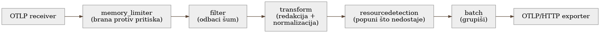

# Poglavlje 10 — Anatomija pipeline-a: šta se radi sa signalom pre nego što ode u cloud

Postrojenje za prečišćavanje vode ne pretvara mutnu reku u pijaću vodu jednim
korakom. Voda prolazi kroz niz stanica, svaka sa tačno jednim zadatkom, tačno
tim redom: prvo grubo sito koje uklanja granje i krupan otpad, pre nego što
bilo šta drugo dobije priliku da se zapuši; zatim taložnik gde sediment
prirodno padne na dno; tek onda hemijska obrada koja cilja specifične
zagađivače; na kraju filter koji uklanja i ono što je ostalo, i tek tada voda
ide u rezervoar. Redosled nije proizvoljan — grubo sito mora biti prvo, jer bi
bez njega svaka naredna stanica bila zatrpana granjem koje nije trebalo da
prođe ni prvi korak.

Telemetrijski pipeline unutar gateway-a radi po istoj logici: signal prolazi
kroz niz stanica, svaka sa tačno jednim zadatkom, tačno tim redosledom, i
redosled je isto toliko namerni izbor koliko i svaka pojedinačna stanica.

## 10.1 Pitanje na koje ovo poglavlje odgovara

Poglavlje 4 je pokazalo *da* gateway radi obradu pre nego što telemetriju
pusti dalje. Ovo poglavlje odgovara na pitanje koje Poglavlje 4 namerno nije
razrađivalo: **šta se tačno dešava unutar gateway-a, korak po korak, i zašto
baš tim redosledom?** Ovo nije kozmetičko pitanje — pogrešan redosled dve
inače ispravne stanice može da poništi svrhu obe, kao što bi hemijska obrada
pre grubog sita samo zapušila hemijsku stanicu granjem.

## 10.2 Kako je to urađeno — praktičan pregled

Pipeline unutar gateway-a iz implementacije koju knjiga prati ima šest
stanica, uvek tim redosledom:

{: width="98%" }

**1. `memory_limiter` — uvek prvo.** Prati potrošnju memorije samog gateway
procesa u kratkim intervalima. Kad potrošnja pređe meki prag, počinje da
odbija nove podatke nazad ka pošiljaocu (umesto da ih tiho baci) — tako da
pošiljalac dobije signal da uspori ili ponovi kasnije. Kad se pređe tvrdi
prag, gateway prisilno pokreće garbage collection. Mora biti prva stanica u
lancu iz jednog razloga: ako bi bilo koja stanica iza nje već potrošila
memoriju obrađujući podatak, backpressure bi stigao prekasno da nešto
spreči.

**2. `filter` — odbaci šum pre nego što bilo šta drugo troši rad na njega.**
Ovde se odbacuju health-check pozivi (interni load balanser proverava
gateway svake par sekundi — taj saobraćaj nema analitičku vrednost i samo
troši budžet) i log linije ispod INFO nivoa. Odbačeno ovde nikad ne stigne do
skupljih stanica dalje u lancu.

**3. `transform` — redakcija i normalizacija, oboje skopirano na pravi deo
flote.** Dva odvojena zadatka žive u ovoj stanici:

- **Redakcija osetljivih atributa** (SQL tekst, connection stringovi) —
  primenjena samo na delove flote gde debug vrednost punog SQL teksta nije
  potrebna. Za deo flote gde je pun SQL tekst i dalje neophodan za dijagnozu
  (obrađeno u Poglavlju 18), redakcija se namerno **ne** primenjuje —
  odluka doneta eksplicitno, po timu/servisu, ne globalno.
- **Normalizacija naziva spanova** — span koji bi inače nosio promenljiv
  datum ili ID u svom imenu (npr. `process-report-2026-08-21`) se
  normalizuje na stabilan obrazac (`process-report`) pre nego što ide dalje.
  Bez ovog koraka, svaki novi dan bi doslovno značio novu vremensku seriju
  po imenu span-a — eksplozija kardinalnosti koja se vidi tek kad račun
  stigne (razrađeno u Poglavlju 11).

**4. `resourcedetection` — popuni, ne prepiši.** Dodaje zajedničke cloud
atribute (region, nalog, tip infrastrukture) **samo tamo gde nedostaju** —
ako je pošiljalac već poslao sopstvenu vrednost, ona se ne dira. Ovo je
namerna odluka: pošiljalac uvek zna više o sebi nego što gateway može da
pogodi iz konteksta u kome prima podatak.

**5. `batch` — grupiši pre slanja.** Umesto da svaki pojedinačan zapis ide
kao zaseban HTTP poziv ka cloud platformi, ova stanica ih grupiše u veće
pakete — drastično manje mrežnih poziva, drastično manji overhead po
zapisu.

Jedna zamka otkrivena u produkciji, van ovog uobičajenog toka: **ograničenje
veličine pojedinačne log poruke.** Jedna aplikacija je jednom prilikom
poslala log red od nekoliko megabajta (serializovan stack trace sa punim
sadržajem neuspešnog batch upisa) — bez gornje granice, ta jedna poruka je
zauzela dovoljno resursa u `batch` stanici da je usporila i na kraju oborila
obradu za ceo prozor, uključujući hiljade drugih, potpuno normalnih poruka
koje su čekale u istom paketu. Posle ovog incidenta, eksplicitna gornja
granica veličine po poruci je dodata u `filter` stanicu — predaleko niz
lanac je bilo prekasno.

## 10.3 Analitički deo — zašto redosled nije stilska odluka

### Zvanična preporuka o redosledu procesora

Zvanična OpenTelemetry Collector dokumentacija eksplicitno preporučuje da
`memory_limiter` bude **prva** stanica u svakom pipeline-u, iz tačno istog
razloga primenjenog ovde: da bi backpressure mogao da stigne do prijemnika
pre nego što išta nizvodno potroši memoriju na podatak koji će ionako biti
odbačen. Nezavisna poređenja (Dash0, OneUptime) dodaju drugu polovinu iste
preporuke: skupe transformacione stanice (kao redakcija ili normalizacija)
treba da dođu **posle** jeftinih filtracionih stanica — obrađivati podatak
koji će sledeći korak ionako baciti je čist gubitak rada.

Implementacija koju knjiga prati sledi ovaj redosled tačno — što je, za
razliku od nekih ranijih poglavlja, slučaj gde nema odstupanja od
"udžbeničkog" recepta. Vredi eksplicitno reći i to: **ne mora svako
poglavlje da priča priču o odstupanju.** Ponekad je standardni recept
standardni upravo zato što rešava realan, opšti problem na najbolji
raspoloživ način, i signal zrelosti je prepoznati kada je to slučaj — ne
izmišljati razlog za odstupanje samo da bi poglavlje imalo dramatičniju
priču.

### Gde implementacija ipak dodaje nešto što recept ne pominje: skopirana redakcija

Zvanični recepti za redakciju osetljivih podataka gotovo uvek pretpostavljaju
**globalnu** politiku — jedno pravilo, primenjeno na sav saobraćaj koji
prolazi kroz pipeline. To je razumna podrazumevana pretpostavka za većinu
sistema. Implementacija koju knjiga prati je svesno odstupila od te
pretpostavke, jer globalna redakcija SQL teksta bi rešila jedan problem
(izlaganje osetljivih upita) tako što bi stvorila drugi, podjednako realan
(deo tima koji dijagnostikuje probleme baš preko punog SQL teksta bi
izgubio tačno onaj podatak koji mu je posao). Rešenje nije bilo "redakcija
da ili ne" kao binarna odluka za ceo sistem, nego eksplicitno skopirana
politika po delu flote — administrativno malo skuplje za održavanje
(dve grane u konfiguraciji umesto jedne), ali izbegava razmenu jedne štete
za drugu.

### Cena da je redosled bio drugačiji: kontrafaktički scenario

Vredi konkretno odigrati šta bi se dogodilo da je `batch` stanica došla
**pre** `memory_limiter`-a, umesto posle. Batch stanica po svojoj prirodi
drži podatke u baferu duže nego bilo koja druga stanica — čeka da se
nakupi dovoljno zapisa ili prođe dovoljno vremena pre nego što pošalje paket
dalje. Da taj bafer dolazi pre provere memorije, gateway bi mogao da
nagomila veliku količinu podataka u batch baferu tačno u trenutku pritiska
kad bi memory_limiter najviše hteo da uspori priliv — brana bi postojala,
ali bi štitila prazan deo cevi, dok bi pravi pritisak već bio nizvodno od
nje, van njenog domašaja. Ovo je isti obrazac viđen i u drugim poglavljima
knjige: zaštitni mehanizam koji tehnički postoji, ali je postavljen na
pogrešno mesto u toku, pruža lažan osećaj sigurnosti bez stvarne zaštite.

Vratimo se na postrojenje za vodu s početka poglavlja. Grubo sito nije prva
stanica zato što je najvažnija — hemijska obrada koja cilja specifične
zagađivače je, po mnogo merila, suptilnija i vrednija stanica. Grubo sito je
prvo zato što bi, da nije, sve stanice iza njega radile posao za koji nisu
projektovane. **Redosled u pipeline-u nije lista prioriteta — to je lanac
pretpostavki, gde svaka naredna stanica pretpostavlja da je prethodna već
odradila svoj deo.** Kad se ta pretpostavka pokvari, cena se ne vidi na
stanici koja je pomerena, nego na svakoj stanici posle nje.

## 10.4 Skupljena pravila iz ovog poglavlja

- `memory_limiter` (ili ekvivalent) uvek prvi u lancu — backpressure koji
  stigne prekasno je isto što i backpressure koji ne postoji.
- Filtriraj šum pre nego što uradiš bilo šta skuplje sa podatkom — svaka
  stanica koja obrađuje podatak koji će sledeća stanica baciti je čist
  gubitak.
- Ne primenjuj globalnu politiku redakcije/transformacije ako različiti
  delovi flote imaju različite, legitimne potrebe — eksplicitno skopiraj
  politiku, čak i po cenu malo veće konfiguracije.
- Postavi gornju granicu veličine po pojedinačnom zapisu što ranije u lancu
  — jedan preveliki zapis ne sme moći da povuče hiljadu ispravnih sa sobom.
- Ne izmišljaj priču o odstupanju od standarda tamo gde standard već rešava
  problem dobro — prepoznaj kad je "sledi recept" ispravan odgovor.

## 10.5 Vežba za čitaoca

Nacrtaj redosled stanica u sopstvenom telemetrijskom pipeline-u (ili,
ako ga nemaš eksplicitno nacrtanog, pretpostavljeni redosled kojim se
podatak zapravo obrađuje). Za svaki par uzastopnih stanica, postavi pitanje:
da li prethodna stanica garantuje pretpostavku na koju se naredna oslanja?
Ako bilo koji par ne prođe taj test — to je tvoj kandidat za preuređenje pre
nego što ga proizvodni saobraćaj otkrije umesto tebe.

---

### Izvori korišćeni u analitičkom delu

- [Memory Limiter Processor — OpenTelemetry Collector](https://github.com/open-telemetry/opentelemetry-collector/blob/main/processor/memorylimiterprocessor/README.md)
- [Mastering the OpenTelemetry Memory Limiter Processor — Dash0](https://www.dash0.com/guides/opentelemetry-memory-limiter-processor)
- [How to configure OpenTelemetry Collector memory limiter for stability — OneUptime](https://oneuptime.com/blog/post/2026-02-09-otel-memory-limiter-stability/view)
- [Batch Processor — OpenTelemetry Collector Contrib](https://github.com/open-telemetry/opentelemetry-collector/tree/main/processor/batchprocessor)
- [Grafana Alloy documentation — Component reference](https://grafana.com/docs/alloy/latest/reference/components/)
