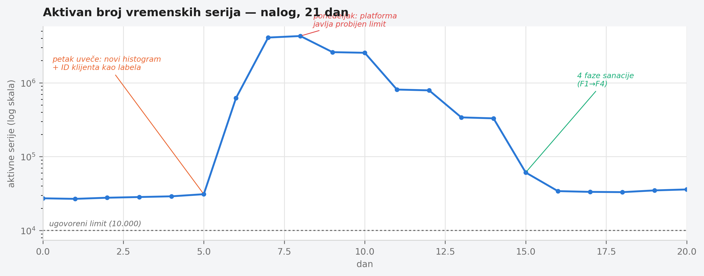

# Chapter 11 — Cardinality and cost: how a system naturally outgrows its budget

A water bill rarely surprises a household all at once. It rises slowly,
month after month — an extra shower, a new boiler, a child who's grown and
now bathes longer — until one day a number arrives that shouldn't surprise
anyone, and yet surprises everyone, because no one tracked it closely enough
while it grew. It's rarely a single leaking tap responsible for a tenfold
jump. Much more often it's ten small, entirely reasonable decisions, each one
individually sound at the moment it was made.

The cost of telemetry rises in exactly the same way — not through one
dramatic event, but through the accumulation of small, individually
justified decisions about what deserves its own time series.

## 11.1 The question this chapter answers

Chapter 3 already mentioned, in passing, that the system this book follows
once blew through its free tier over the course of a single weekend. This
chapter answers the question there wasn't room to unpack there: **how
exactly does a telemetry system, without a single malicious change, grow to
that point — and what concretely does it mean to "bring it back" once it
happens?**

## 11.2 How it was done — a practical walkthrough

### What actually happened that weekend

On a Friday evening, a new histogram was added to one service's code — a
measurement of processing duration per request, intended to track
performance per client. The attribute added to that histogram as a label was
the client ID. At the moment the code was written, this looked like a
perfectly reasonable decision: client ID is useful for filtering, the team
often wanted to see "how is this particular client behaving," and the system
at that moment had a few dozen active clients — a small, harmless number.

What wasn't explicitly considered at the moment the code was written: a
histogram with classic (bucket) representation doesn't create one time
series per label combination — it creates **one series per bucket**,
typically ten or more, multiplied by every unique value of every label. The
number of clients had grown, by Monday morning, to a few thousand (a normal
weekend increase for that type of system, nothing unusual) — but the cost of
that client growth wasn't linear, it was multiplicative through the number
of buckets per histogram. A system that on Friday was generating a few tens
of thousands of active series was, by Monday, generating several million.

The team discovered this not from an alert designed to catch precisely this
problem — no such alert existed at the time — but from the platform itself,
which automatically notified them that the account had exceeded its
contracted limit on active series.

### A four-phase remediation plan

What followed wasn't a single fix, but a plan with four independent
measures, each targeting a different layer of the problem:

**Phase 1 — native histograms as a structural measure.** A classic histogram
pays cardinality per bucket; a native histogram (supported by the
Prometheus/Mimir ecosystem) stores the distribution within a **single** time
series per label combination, with dynamic buckets that adapt without a
predefined set of boundaries. For histograms where the full distribution is
genuinely needed (not just a couple of percentiles), this is the single
biggest lever in the plan — it doesn't reduce the number of clients being
tracked, it removes the multiplier that the classic bucket format was
imposing.

**Phase 2 — aggregation of high-cardinality attributes at the gateway
layer.** For attributes where full precision per individual value isn't
necessary for the dashboard that's actually used (client ID is the classic
example — rarely does anyone look at a dashboard filtered to one specific
client out of thousands), the gateway from Chapter 4 gets a transform step
that groups low-frequency values into a shared category before they reach
storage. This is the same technique Chapter 4 mentions in general terms as
"aggregation of high-cardinality dimensions" at the gateway — here worked
out concretely, applied to a broader set of attributes than just resource
attributes (e.g. `service.instance.id`).

**Phase 3 — tuning Tempo metrics-generator dimensions.** Metrics generated
from traces (span metrics) automatically add intrinsic dimensions (span
type, status code, service name, span name) — all with a bounded, small
number of values. The problem arises when a **custom** attribute is added as
an extra dimension without thinking through how many unique values that
attribute carries: adding a single attribute with thousands of unique values
can multiply the number of active series by two orders of magnitude. The
remediation was to go through every custom dimension that had been added and
keep only the ones some existing dashboard actually uses for filtering — not
"might be useful someday," but "currently in use."

**Phase 4 — keep-list rules for sidecar collectors.** For the fleet of
ECS/Fargate tasks from Chapter 6, every sidecar collector gets an explicit
list of metrics it's allowed to forward, instead of the default "everything
the exporter produces." This is the bluntest of the four measures — it
doesn't target one problematic attribute but entire families of metrics that
no one looks at — but it's also the most reliable, because it doesn't depend
on someone predicting in advance which attribute will explode next.

Here is what that growth looked like measured, with all four remediation
phases shown following it (the logarithmic axis is necessary — without it,
the weekend spike from 34,000 to 4.3 million series would flatten everything
else on the chart into a straight line):

{: width="95%" }

### How you measure whether a change actually removed something

None of the four measures was applied "blindly" — before and after each
one, the team measures the actual number of active series, rather than
assuming it. The basic pattern:

```promql
count({__name__=~".+"})
```

gives the total number of active series at that moment — comparing before
and after a change is the first, crudest check. To locate **which** metrics
contribute most to the total:

```promql
topk(10, count by (__name__)({__name__=~".+"}))
```

And once it's clear which metric is the problem, the next question is which
**label** on that metric carries the most unique values — an attribute with
a thousand values is a hundred times more expensive than one with ten:

```promql
count(count by (label_x)(metric_name))
```

This last query was the one that finally showed client ID as the dominant
culprit behind the histogram from the weekend incident — not a guess,
measured.

### Why the rollback has to be trivial

None of the four measures was shipped to production without a pre-prepared
way back — a single environment variable change, not a redeploy, not a
rollback of the previous image version. The reason is concrete: an
aggressive aggregation or an overly blunt keep-list rule can strip out data
that someone genuinely needed for diagnosis at exactly the moment of an
incident — and the cost of a slow return in that moment is greater than the
cost of a slower rollout of the measure itself. The first keep-list
experiment, applied to one less critical segment of the fleet before wider
rollout, uncovered exactly such a case — one metric that looked unused
turned out to be the only signal for a rare but real problem, and it was put
back on the list that same day.

### Exemplars — a bridge between metric and trace, and why it didn't work here for a long time

The histogram from Phase 1 solves the cost problem — but a histogram,
classic or native, carries a second capability, independent of the bucket
format: every observation that lands in the histogram can carry an
**exemplar** along with it — a single concrete sample, usually the ID of
the trace active at the moment of that observation, attached directly to
the point on the metric's graph. Clicking that point doesn't open
aggregated statistics but one real trace that actually contributed to that
value — the shortest possible path from "I see a spike" to "here's exactly
what was slow in that call."

In the implementation this book follows, this bridge existed for a long
time only as a gap on a list: metrics and traces were both already arriving
through the same gateway, both were already available, and the link
between them simply hadn't been turned on — not because it's technically
hard, but because nothing forced the priority until someone, in the middle
of a real incident, asked "okay, I see a spike, but which call exactly was
slow" and discovered that the answer to that question didn't exist in one
click.

Once it was finally turned on, a trap surfaced that isn't obvious from the
documentation at first glance: **exemplars are retained for much less time
than the metric they're attached to.** While the metric's graph stays
readable for weeks, the exemplar point on that same graph stops leading
anywhere after roughly four hours. A panel that yesterday had a clickable
point on a spike has, today, the same point visually — but clicking it
leads nowhere. This isn't a bug; it's the expected behavior of a short
retention window, and it's worth knowing in advance, not discovering in the
middle of investigating a week-old incident, once the exemplar has long
since expired.

Turning exemplars on by itself isn't a complete solution either, without
one more step: an exemplar is only as useful as the histogram it's attached
to is broken down finely enough for the click to actually lead somewhere
relevant. A duration histogram measured at the level of the whole service,
without breaking it down by individual route, gives an exemplar that's
technically clickable but statistically close to random — a link to one of
hundreds of concurrent calls, not necessarily the one that matters. The
next item on the list (still unbuilt at the time of writing) is a histogram
broken down by route for a couple of especially heavy endpoints, so that an
exemplar from the top of a spike leads to a trace from that exact endpoint,
not just any call to the same service at the same moment.

## 11.3 Analytical section — why cardinality isn't a "storage detail"

### The official recommendation: native histograms as a structural solution

The Prometheus community (including its own documentation on histogram
practices) increasingly treats native histograms as the default choice for
new instruments, not as an advanced option for special cases — precisely
because the classic bucket format has a cardinality cost built into its
definition, not as an implementation oversight but as a consequence of the
format itself. Independent material (including analyses from Last9 and
Logz.io) consistently lists relabeling (`labeldrop`/`labelkeep`),
scrape-level limits (`sample_limit`, `label_limit`), and aggregation through
recording rules as the standard first line of defense — all measures that
the implementation this book follows also uses, just distributed across
layers specific to this system (gateway instead of recording rules,
per-sidecar keep-lists instead of a global scrape config).

### Where the implementation adds something specific: a layered, not a single, measure

Official material rarely proposes the **combination** of all four measures
applied together — usually each document focuses on a single layer
(histograms, or relabeling, or scrape-level limits). The decision to apply
all four in parallel, each at its own layer of the architecture, wasn't
arbitrary: the incident showed that no single layer on its own is
sufficient — a native histogram solves the bucket-multiplication problem,
but doesn't solve custom dimensions added to span metrics; a keep-list on
the sidecar solves metric families no one looks at, but doesn't solve one
histogram exploding on its own. The redundancy of layers here isn't wasted
effort — each layer catches a different class of error.

### The cost of doing none of this: a counterfactual scenario

It's worth playing out the alternative concretely: suppose the team hadn't
measured which label exactly carried the cardinality, and instead reacted to
the number from the platform with a fast, untargeted move — for instance,
turning off the entire histogram until "something better gets figured out."
The cost would indeed have dropped, immediately and drastically. But the
data that histogram carried (per-client performance) would have vanished
entirely, including for those few dozen clients where that data was
genuinely useful and actually used. An untargeted measure trades one problem
(cost too high) for another (visibility lost) instead of solving the first
without creating the second — the same pattern already seen in Chapter 10
with SQL text redaction, now at a different layer of the system.

Let's return to the water bill from the start of this chapter. A household
that gets a frightening bill has two paths: shut off every tap in a panic,
or walk through the house and measure which tap exactly, which appliance
exactly, carries the most consumption — then fix that one. **Cardinality
isn't a cost that gets solved by a feeling that there are "too many
metrics" — it gets solved by measuring which metric exactly, which label
exactly, carries that cost, and fixing precisely that spot, not every spot
at once.**

## 11.4 Rules collected from this chapter

- Before adding any attribute as a label on a histogram or counter, ask how
  many unique values that attribute can carry — not how many it carries
  today, but how many it can realistically grow to.
- Use native histograms instead of classic buckets whenever the full
  distribution is genuinely needed — that removes the multiplier, not just
  the symptom.
- Measure cardinality before and after every change (`count`, `topk`,
  `count by (label)`) — never assume a change removed something without a
  number confirming it.
- Keep only the custom dimensions on trace-derived metrics that some
  existing dashboard actually uses for filtering, not the ones that "might
  possibly be useful."
- Every aggressive measure against cardinality needs a trivial way back (one
  variable, not a redeploy) — the cost of a slow return at the moment
  someone genuinely needs exactly that data is greater than the cost of a
  slower rollout of the measure itself.
- Turn on exemplars as soon as a histogram already exists — the cost is
  negligible, and the payoff (one click from a spike on a graph to the
  actual trace) rarely comes cheaper. But know in advance that exemplar
  retention is much shorter than metric retention: clicking an old point on
  a graph won't lead anywhere, and that's expected behavior, not a bug.

## 11.5 Exercise for the reader

Run `count by (__name__)({__name__=~".+"})` (or the equivalent check in the
system you use) and find your metric with the highest number of active
series. Then run `count(count by (label)(that_metric))` for each of its
labels, one at a time. Do you know, without looking at the result, which
label will turn out to be the biggest contributor? If you don't — that's
your candidate for the next unplanned jump in the bill.

---

### Sources used in the analytical section

- [Histograms and summaries — Prometheus documentation](https://prometheus.io/docs/practices/histograms/)
- [High Cardinality in Prometheus: How to Find and Fix It — Last9](https://last9.io/blog/how-to-manage-high-cardinality-metrics-in-prometheus/)
- [Prometheus Metrics: What Native Histograms Change — Logz.io](https://logz.io/blog/prometheus-metrics-native-histograms/)
- [Cardinality — Grafana Tempo documentation](https://grafana.com/docs/tempo/latest/metrics-from-traces/metrics-generator/cardinality/)
- [Use the span metrics processor — Grafana Tempo documentation](https://grafana.com/docs/tempo/latest/metrics-from-traces/span-metrics/span-metrics-metrics-generator/)
