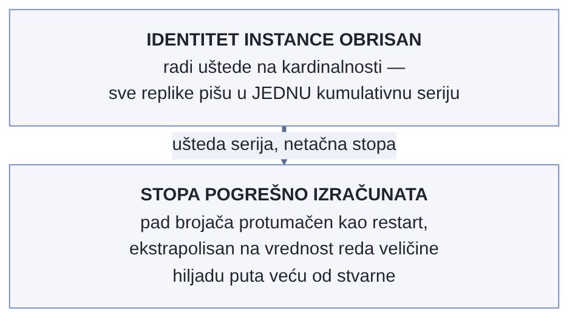

# Poglavlje 11 — Kardinalnost i cena: kako sistem prirodno naraste iznad budžeta

Račun za vodu retko iznenadi domaćinstvo naglo. On raste polako, mesec za
mesecom — dodatni tuš, novi bojler, dete koje je poraslo i duže se kupa — dok
jednog dana ne stigne broj koji nikoga ne bi trebalo da iznenadi, a ipak
iznenadi baš svakoga, jer ga niko nije pratio dovoljno pažljivo dok je rastao.
Retko je jedan slavina koja curi kriva za skok od deset puta. Mnogo češće je
u pitanju deset malih, sasvim opravdanih odluka, od kojih je svaka pojedinačno
bila razumna u trenutku kad je doneta.

Trošak telemetrije raste na potpuno isti način — ne kroz jedan dramatičan
događaj, nego kroz gomilanje malih, pojedinačno opravdanih odluka o tome šta
sve zaslužuje sopstvenu vremensku seriju.

## 11.1 Pitanje na koje ovo poglavlje odgovara

Poglavlje 3 je već pomenulo, u prolazu, da je sistem koji knjiga prati jednom
probio besplatni tier za jedan vikend. Ovo poglavlje odgovara na pitanje koje
tamo nije bilo mesta da se razradi: **kako tačno telemetrijski sistem, bez
ijedne zlonamerne promene, naraste do te tačke — i šta konkretno znači "vratiti
ga nazad" kad se to dogodi?**

## 11.2 Kako je to urađeno — praktičan pregled

### Šta se zapravo desilo tog vikenda

Petkom uveče je u kod jednog servisa dodat novi histogram — merenje trajanja
obrade po zahtevu, sa namerom da se prati performansa po klijentu. Atribut
dodat na taj histogram kao labela bio je ID klijenta. U trenutku kad je kod
pisan, to je delovalo kao potpuno razumna odluka: ID klijenta je koristan za
filtriranje, tim je često želeo da vidi "kako se ponaša baš ovaj klijent", i
sistem je u tom trenutku imao nekoliko desetina aktivnih klijenata — mala,
bezopasna cifra.

Ono što nije bilo eksplicitno razmotreno u trenutku pisanja koda: histogram sa
klasičnim (bucket) predstavljanjem ne stvara jednu vremensku seriju po
kombinaciji labela — stvara **jednu seriju po bucket-u**, tipično desetak ili
više, pomnoženo sa svakom jedinstvenom vrednošću svake labele. Broj klijenata
je do ponedeljka ujutru narastao na nekoliko hiljada (uobičajen vikend rast za
taj tip sistema, ništa neuobičajeno) — ali cena rasta klijenata nije bila
linearna, bila je multiplikativna kroz broj bucket-a po histogramu. Sistem koji
je petkom generisao par desetina hiljada aktivnih serija je ponedeljkom
generisao nekoliko miliona.

Tim je ovo otkrio ne iz alarma dizajniranog da uhvati baš ovaj problem — takav
alarm tada nije postojao — nego iz platforme same, koja je automatski
obavestila da je nalog probio ugovoreni limit aktivnih serija.

### Četvorofazni plan sanacije

Ono što je usledilo nije bila jedna popravka, nego plan sa četiri nezavisne
mere, svaka ciljajući drugi sloj problema:

**Faza 1 — nativni histogrami kao strukturna mera.** Klasičan histogram plaća
kardinalnost po bucket-u; nativni histogram (podržan od strane Prometheus/Mimir
ekosistema) čuva raspodelu unutar **jedne** vremenske serije po kombinaciji
labela, sa dinamičkim bucket-ima koji se prilagođavaju bez unapred definisanog
skupa granica. Za histograme kod kojih je puna raspodela zaista potrebna (ne
samo par percentila), ovo je najveći pojedinačni lever u planu — ne smanjuje
broj klijenata koji se prate, nego uklanja multiplikator koji je klasičan
bucket format nametao.

**Faza 2 — agregacija visoko-kardinalnih atributa na nivou gateway-a.** Za
atribute gde puna preciznost po pojedinačnoj vrednosti nije neophodna za
dashboard koji se zapravo koristi (ID klijenta je klasičan primer — retko ko
gleda dashboard filtriran po jednom konkretnom klijentu od hiljada), gateway iz
Poglavlja 4 dobija transform korak koji grupiše nisko-frekventne vrednosti u
zajedničku kategoriju pre nego što stignu do skladišta. Ovo je ista tehnika
koju Poglavlje 4 pominje uopšteno kao "agregacija visoko-kardinalnih
dimenzija" na gateway-u — ovde razrađena konkretno, primenjena na širi skup
atributa nego samo resursne (npr. `service.instance.id`).

**Faza 3 — podešavanje Tempo metrics-generator dimenzija.** Metrike generisane
iz trejsova (span metrics) automatski dodaju intrinzične dimenzije (tip spana,
status kod, ime servisa, ime spana) — sve sa ograničenim, malim brojem
vrednosti. Problem nastaje kad se **custom** atribut doda kao dodatna dimenzija
bez razmišljanja o tome koliko jedinstvenih vrednosti taj atribut nosi: dodavanje
jednog atributa sa hiljadama jedinstvenih vrednosti može da pomnoži broj aktivnih
serija i za dva reda veličine. Sanacija je bila proći kroz svaku dodatu
custom dimenziju i zadržati samo one koje neki postojeći dashboard zaista
koristi za filtriranje — ne "možda će biti korisno", nego "trenutno se koristi".

**Faza 4 — keep-list pravila za sidecar kolektore.** Za flotu ECS/Fargate
zadataka iz Poglavlja 6, svaki sidecar kolektor dobija eksplicitnu listu
metrika koje sme da prosledi dalje, umesto podrazumevanog "sve što exporter
proizvede". Ovo je najgrublja od četiri mere — ne cilja jedan problematičan
atribut nego čitave porodice metrika koje niko ne gleda — ali je i
najpouzdanija, jer ne zavisi od toga da neko unapred predvidi koji će atribut
sledeći eksplodirati.

Ovako je taj rast izgledao izmeren, sa svim fazama sanacije koje slede
(logaritamska osa je neophodna — bez nje bi vikend skok od 34.000 na 4,3
miliona serija spljoštio sve ostalo na grafiku u ravnu liniju):

{: width="95%" }

### Kako se meri da li je promena zaista nešto uklonila

Nijedna od četiri mere nije primenjena "na slepo" — pre i posle svake, tim
meri stvaran broj aktivnih serija, ne pretpostavlja ga. Osnovni obrazac:

```promql
count({__name__=~".+"})
```

daje ukupan broj aktivnih serija u tom trenutku — poređenje pre i posle
promene je prva, najgrublja provera. Za lociranje **koje** metrike najviše
doprinose ukupnom broju:

```promql
topk(10, count by (__name__)({__name__=~".+"}))
```

A kad je već jasno koja metrika je problem, sledeće pitanje je koja **labela**
na toj metrici nosi najviše jedinstvenih vrednosti — atribut sa hiljadu
vrednosti je sto puta skuplji od atributa sa deset:

```promql
count(count by (labela_x)(ime_metrike))
```

Ovaj poslednji upit je bio taj koji je konačno pokazao ID klijenta kao
dominantnog krivca za histogram iz vikend incidenta — ne pretpostavka, mereno.

### Zašto rollback mora biti trivijalan

Nijedna od četiri mere nije puštena u produkciju bez unapred pripremljenog
puta nazad — jedna promena env promenljive, ne redeploy, ne rollback
prethodne verzije image-a. Razlog je konkretan: agresivna agregacija ili
keep-list pravilo koje je previše grubo može da ukloni podatak koji je nekome
zaista trebao za dijagnozu tačno u trenutku incidenta — i cena sporog povratka
u tom trenutku je veća od cene sporije primene same mere. Prvi keep-list
eksperiment, primenjen na jedan manje kritičan segment flote pre šire
primene, otkrio je baš takav slučaj — jedna metrika koja je izgledala
neiskorišćeno je zapravo bila jedini signal za redak, ali stvaran problem, i
vraćena je na listu istog dana.

### Exemplari — most između metrike i trejsa, i zašto dugo nije radio

Histogram iz Faze 1 rešava trošak — ali histogram, klasičan ili nativan,
nosi i drugu mogućnost, nezavisnu od formata bucket-a: svaka opservacija
koja upadne u histogram može da ponese sa sobom **exemplar** — jedan
konkretan uzorak, obično ID trejsa aktivnog u trenutku te opservacije,
zakačen direktno na tačku na grafiku metrike. Klik na tu tačku ne otvara
agregiranu statistiku nego jedan stvaran trejs koji je doprineo baš toj
vrednosti — najkraći mogući put od "vidim skok" do "evo tačno šta je bilo
sporo u tom pozivu".

Ovaj most je u implementaciji koju knjiga prati dugo postojao samo kao
praznina na listi: metrike i trejsovi su oba već stizala kroz isti gateway,
oba su bila dostupna, a spona između njih nije bila uključena — ne zato što
je tehnički teško, nego zato što ništa nije prisililo prioritet dok neko
nije, usred stvarnog incidenta, pitao "dobro, vidim skok, ali koji je tačno
poziv bio spor" i otkrio da odgovor na to pitanje ne postoji jednim klikom.

Kad je konačno uključen, otkrivena je zamka koja se ne vidi u dokumentaciji
na prvi pogled: **exemplari se čuvaju mnogo kraće od same metrike na koju su
zakačeni.** Dok grafik metrike ostaje čitljiv nedeljama, exemplar tačka na
tom istom grafiku prestaje da vodi ikuda posle otprilike četiri sata. Panel
koji je juče imao klikabilnu tačku na skoku, danas ima istu tačku vizuelno —
ali klik na nju ne vodi nigde. Ovo nije kvar nego očekivano ponašanje kratke
retencije, i vredi ga znati unapred, ne otkriti ga usred istrage
incidenta starog nedelju dana, kad je exemplar davno istekao.

Samo uključivanje exemplar-a takođe nije potpuno rešenje bez još jednog
koraka: exemplar je koristan onoliko koliko je histogram na koji je zakačen
dovoljno raščlanjen da klik zaista vodi ka relevantnom pozivu. Histogram
trajanja meren na nivou celog servisa, bez raščlanjivanja po pojedinačnoj
ruti, daje exemplar koji je tehnički klikabilan ali statistički skoro
nasumičan — spoj sa jednim od stotina istovremenih poziva, ne nužno onim
koji zanima. Sledeći korak na listi (u trenutku pisanja još neizgrađen) je
histogram raščlanjen po ruti za par posebno teških endpoint-a, tako da
exemplar sa vrha skoka vodi ka trejsu zaista tog endpoint-a, ne bilo kog
poziva istog servisa u istom trenutku.

### Kardinalnost koja se namerno vraća nazad

Sve četiri faze plana sanacije iz prethodnog dela idu u istom pravcu —
manje serija. Vredi zabeležiti i suprotan slučaj, jer je jednako poučan:
trenutak kad je tim **namerno povećao** kardinalnost, po ceni od par
desetina novih serija, zato što je serija koju je ranija mera uštedela bila
pogrešna, ne samo skuplja.

Ranija mera za smanjenje kardinalnosti brisala je identifikator instance
procesa (atribut koji razlikuje replike istog servisa) sa metrika jednog
front-end servisa — razumna ušteda u trenutku kad je uvedena. Problem: taj
servis se u produkciji izvršava kroz nekoliko istovremenih replika, i bez
identiteta instance, sve replike su počele da pišu u **istu** vremensku
seriju za brojač koji se akumulira od pokretanja procesa. Kad dve ili više
replika pišu u istu kumulativnu seriju, ta serija povremeno ide unazad (kad
neka replika restartuje i njen brojač krene ponovo od nule) — a standardna
funkcija za izračunavanje stope tumači svaki takav pad kao restart i
ekstrapolira ga, umesto da vidi da je u pitanju mešavina više nezavisnih
brojača. Rezultat: alarm koji prati stopu zahteva je jedne noći pročitao
vrednost reda veličine hiljadu puta veću od stvarne — ne kao kratak skok,
nego trajno, sve dok neko nije primetio neverovatnu brojku.

Popravka nije bila vraćanje na staru, punu granularnost identiteta —
umesto originalnog atributa, postavljen je stabilniji: izveden iz naziva
hosta, jedinstven po instanci, ali stabilan i preko restarta iste instance
(tako da restart ostaje obrađen kao normalan reset brojača, ne kao
potpuno nova serija). Izmerena cena vraćanja identiteta bila je mnogo manja
od očekivane — nešto ispod stotinu novih serija, ispod dolara mesečno po
važećoj ceni po hiljadi serija — jer svaka instanca opslužuje samo podskup
ukupnih ruta, ne sve rute pomnožene brojem instanci.

Prenosiva lekcija: kardinalnost koja štedi novac i kardinalnost koja štiti
**tačnost** nisu uvek isti atribut, a razlika se ne vidi dok neko eksplicitno
ne postavi pitanje da li će više od jednog procesa pisati u istu seriju
kad se identitet ukloni. Atribut koji razlikuje instance istog servisa je
tačno onaj atribut kod koga je odgovor skoro uvek "da".

{: width="78%" }

### Cena nije samo broj serija, nego serija puta učestalost

Sve četiri faze plana sanacije i primer iznad gledaju na cenu kroz jednu
promenljivu — broj aktivnih serija. Platforma koju knjiga prati naplaćuje
po drugoj, manje očiglednoj formuli: broj **naplativih** serija jednak je
broju aktivnih serija pomnoženom odnosom stvarne učestalosti upisa i
uključene učestalosti (jedan upis po minuti je uključen u cenu; svaki upis
iznad toga množi račun, bez obzira što broj *serija* ostaje nepromenjen).

U jednoj reviziji troška, izmerena agregatna učestalost upisa preko celog
naloga bila je oko 1,5 upisa po minuti — iznad uključene jedinice — a uzrok
nije bio u broju serija (te su već bile detaljno pregledane i podrezane),
nego u nekoliko infrastrukturnih izvora podataka koji su i dalje slali
podatke na svakih 20 do 30 sekundi, umesto na svakih 60. Rešenje nije
zahtevalo brisanje nijedne serije, nijednog atributa, nijednog dashboard-a
— samo podešavanje intervala prikupljanja sa 20-30 sekundi na 60 sekundi na
tim mestima. Nijedna metrika nije nestala, samo je vremenska rezolucija
smanjena, a svaki alarm koji zavisi od tih metrika i dalje evaluira preko
prozora od nekoliko minuta do nekoliko sati — dovoljno grubo da razlika u
rezoluciji ne menja nijedan ishod.

Poenta za čitaoca: pre nego što se krene u redukciju kardinalnosti kao
jedini lever, vredi izmeriti i drugu promenljivu u istoj formuli —
učestalost upisa. Za sistem gde nekoliko izvora šalje podatke češće nego
što je stvarno potrebno, taj lever ume da bude i veći i jeftiniji za
primenu od bilo koje pojedinačne mere protiv kardinalnosti, jer ne zahteva
da se bilo šta odluči o tome koji je atribut "dovoljno koristan" da ostane.

## 11.3 Analitički deo — zašto kardinalnost nije "detalj skladištenja"

### Zvanična preporuka: nativni histogrami kao strukturno rešenje

Prometheus zajednica (uključujući i sopstvenu dokumentaciju o praksama
histograma) sve više tretira nativne histograme kao podrazumevan izbor za
nove instrumente, ne kao naprednu opciju za posebne slučajeve — upravo zato
što klasičan bucket format ima cardinality trošak ugrađen u svoju definiciju,
ne kao propust u implementaciji nego kao posledicu formata samog. Nezavisni
materijal (uključujući analize sa Last9 i Logz.io) dosledno navodi relabeling
(`labeldrop`/`labelkeep`), scrape-level granice (`sample_limit`,
`label_limit`) i agregaciju kroz recording rules kao standardni prvi sloj
odbrane — sve mere koje implementacija koju knjiga prati takođe koristi, samo
raspoređene po slojevima specifičnim za ovaj sistem (gateway umesto
recording rules, keep-list po sidecar-u umesto globalnog scrape config-a).

### Gde implementacija dodaje nešto specifično: slojevita, ne jedinstvena mera

Zvanični materijal retko predlaže **kombinaciju** sve četiri mere primenjene
zajedno — obično se svaki dokument fokusira na jedan sloj (histogrami, ili
relabeling, ili scrape-level granice). Odluka da se sve četiri primene
paralelno, svaka na svom sloju arhitekture, nije bila proizvoljna: incident je
pokazao da nijedan pojedinačan sloj sam za sebe nije dovoljan — nativni
histogram rešava problem bucket multiplikacije, ali ne rešava custom
dimenzije dodate na span metrics; keep-list na sidecar-u rešava porodice
metrika koje niko ne gleda, ali ne rešava jedan histogram koji sam po sebi
eksplodira. Redundantnost slojeva ovde nije rasipanje truda — svaki sloj
hvata drugu klasu greške.

### Cena da se ništa od ovoga nije uradilo: kontrafaktički scenario

Vredi konkretno odigrati alternativu: da tim nije izmerio koja labela tačno
nosi kardinalnost, nego je reagovao na broj sa platforme brzim, neciljanim
potezom — na primer, gašenjem celog histograma dok se "ne smisli nešto
bolje". Trošak bi zaista pao, odmah i drastično. Ali podatak koji je taj
histogram nosio (performansa po klijentu) bi nestao u potpunosti, uključujući
i za onih par desetina klijenata gde je taj podatak zaista bio koristan i
korišćen. Neciljana mera menja jedan problem (previsoka cena) za drugi
(izgubljena vidljivost) umesto da reši prvi bez stvaranja drugog — isti
obrazac viđen već u Poglavlju 10 kod redakcije SQL teksta, sada na drugom
nivou sistema.

Vratimo se na račun za vodu s početka poglavlja. Domaćinstvo koje dobije
zastrašujući račun ima dva puta: zatvoriti sve slavine iz panike, ili proći
kroz kuću i izmeriti koja tačno slavina, koji tačno uređaj, nosi najviše
potrošnje — pa popraviti baš taj. **Kardinalnost nije trošak koji se rešava
osećajem da je "previše metrika" — rešava se merenjem koja tačno metrika, koja
tačno labela, nosi taj trošak, i popravkom baš tog mesta, ne svih mesta
odjednom.**

## 11.4 Skupljena pravila iz ovog poglavlja

- Pre dodavanja bilo kog atributa kao labele na histogram ili brojač, postavi
  pitanje koliko jedinstvenih vrednosti taj atribut može da nosi — ne koliko
  ih nosi danas, nego koliko realno može da naraste.
- Koristi nativne histograme umesto klasičnih bucket-a kad god je puna
  raspodela zaista potrebna — to uklanja multiplikator, ne samo simptom.
- Meri kardinalnost pre i posle svake promene (`count`, `topk`,
  `count by (labela)`) — nikad ne pretpostavljaj da je promena nešto uklonila
  bez brojke koja to potvrđuje.
- Zadrži samo custom dimenzije na metrikama generisanim iz trejsova koje
  neki postojeći dashboard zaista koristi za filtriranje, ne one koje bi
  "možda mogle biti korisne".
- Svaka agresivna mera protiv kardinalnosti mora imati trivijalan put nazad
  (jedna promenljiva, ne redeploy) — cena sporog povratka u trenutku kad
  nekom zaista treba upravo taj podatak je veća od cene sporije primene same
  mere.
- Uključi exemplare čim histogram već postoji — trošak je zanemarljiv, a
  korist (jedan klik od skoka na grafiku do stvarnog trejsa) retko dolazi
  jeftinije. Ali unapred znaj da je retencija exemplar-a mnogo kraća od
  retencije same metrike: klik na staru tačku na grafiku neće voditi nigde,
  i to nije kvar nego očekivano ponašanje.
- Pre brisanja atributa koji razlikuje instance istog servisa radi uštede na
  kardinalnosti, proveri da li više od jednog procesa piše u istu seriju bez
  njega — kumulativni brojači sa spojenim identitetom daju netačnu, ne samo
  manje detaljnu, stopu.
- Meri i učestalost upisa po seriji, ne samo broj serija — platforma
  naplaćuje njihov proizvod, i podešavanje intervala prikupljanja ume da
  bude veći i jeftiniji lever od bilo koje pojedinačne mere protiv
  kardinalnosti.

## 11.5 Vežba za čitaoca

Pokreni `count by (__name__)({__name__=~".+"})` (ili ekvivalentnu proveru u
sistemu koji koristiš) i pronađi svoju metriku sa najvećim brojem aktivnih
serija. Zatim pokreni `count(count by (labela)(ta_metrika))` za svaku njenu
labelu, jednu po jednu. Da li znaš, bez gledanja u rezultat, koja će labela
biti najveći doprinosilac? Ako ne znaš — to je tvoj kandidat za sledeći
neplanirani skok u računu.

---

### Izvori korišćeni u analitičkom delu

- [Histograms and summaries — Prometheus documentation](https://prometheus.io/docs/practices/histograms/)
- [High Cardinality in Prometheus: How to Find and Fix It — Last9](https://last9.io/blog/how-to-manage-high-cardinality-metrics-in-prometheus/)
- [Prometheus Metrics: What Native Histograms Change — Logz.io](https://logz.io/blog/prometheus-metrics-native-histograms/)
- [Cardinality — Grafana Tempo documentation](https://grafana.com/docs/tempo/latest/metrics-from-traces/metrics-generator/cardinality/)
- [Use the span metrics processor — Grafana Tempo documentation](https://grafana.com/docs/tempo/latest/metrics-from-traces/span-metrics/span-metrics-metrics-generator/)
