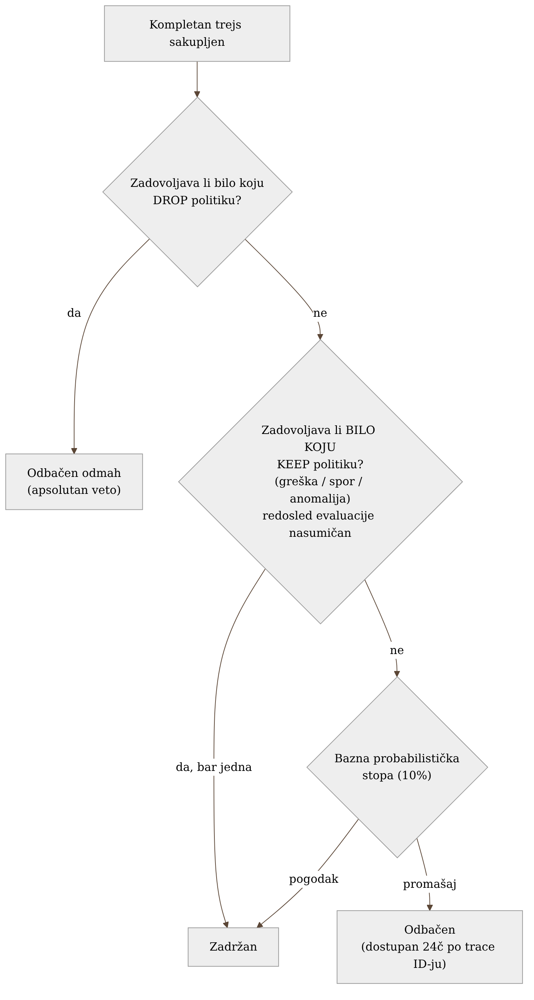
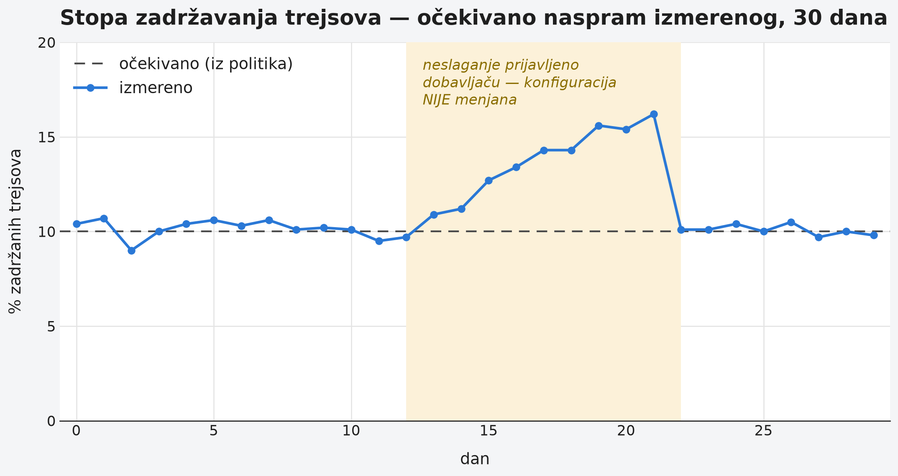

# Chapter 12 — Trace sampling: server-side adaptive sampling versus collector-side

Airport security screening doesn't examine every passenger with the same
attention. Most pass through a standard scanner and move on within seconds.
Some — chosen at random, or because something on the scanner flagged for
extra attention, or because a pattern of behavior deviates from the usual —
get an additional, more thorough inspection. The decision about who gets
that extra attention isn't made at the entrance to the airport, before
anyone has passed through anything — it's made **at the scanner itself**,
with full insight into what was just measured. If the decision were made in
advance, at the gate, before any measurement at all, there would be no basis
for it — it would either be chosen at random or applied to literally
everyone, which turns security screening into a bottleneck nobody could
withstand.

Trace sampling faces the same choice: whether to make the decision "is this
trace worth keeping" early, before the trace has even been fully collected —
or late, after full insight into what actually happened.

## 12.1 The question this chapter answers

Every request in the system generates a trace. Keeping literally every one,
forever, at full storage cost, isn't sustainable for any system of real
size — the question isn't *whether* sampling happens, but **where** the
decision is made and **on what basis**. This chapter answers the question of
why the implementation the book follows chose to leave that decision to the
platform, after the trace has been fully collected, instead of making it
itself, early, at the gateway level from Chapter 4.

## 12.2 How it's actually done — a practical overview

Trace sampling in the implementation the book follows is **server-side and
adaptive** — done by the cloud observability platform itself, not the
gateway. The gateway forwards **all** traces onward, with no sampling logic
of its own; the decision about what gets kept is made only at the platform,
after the platform has already received the complete trace.

The base, default rate is probabilistic — currently **10% base sampling**
(lowered from 25% in an earlier phase, once experience showed that 25% was
carrying more cost than analytical value for this volume of traffic). But
the platform doesn't just apply that base rate — it layers on rules that
**guarantee retention** for certain categories of traces regardless of the
base rate:

- **Traces with an error** — a status code indicating failure is retained
  almost always, since that's precisely the most valuable material for
  diagnosis.
- **Slow traces** — latency above a defined threshold is retained, since
  performance problems rarely leave a trace anywhere except in the trace
  itself.
- **Pattern diversity** — at least one trace per unique fingerprint
  (combination of service, route, and outcome) within the window is
  retained, regardless of the base rate — so a sudden burst of near-identical
  requests (say, the same error repeating a thousand times in a couple of
  minutes) leaves behind at least one representative, instead of the
  probabilistic rate randomly keeping a handful of copies of the same
  pattern, or none at all.

{: width="88%" }

### How the rules are actually evaluated — and why it's surprising

It's worth being precise about the mechanics, because the intuitive mental
model ("rules are checked in order, the first one to decide wins") is only
partly true, and the difference matters for anyone trying to predict
behavior in advance:

- **Drop policies are an absolute veto.** If a trace satisfies any drop
  policy, it's dropped immediately, even if it simultaneously satisfies one
  or more keep policies.
- **Keep policies operate on OR logic.** A trace is retained if it satisfies
  **any** keep policy — not all of them.
- **The evaluation order within keep policies is effectively random** — it
  matches neither the order in the configuration nor the order in the
  interface. The one part of the order that is guaranteed: drop policies are
  always evaluated first, precisely because they carry veto power.

This means "what happens when a trace satisfies two keep policies at once"
has no unambiguous answer in advance — both would retain it, so the outcome
doesn't depend on which one is checked first (both produce the same result:
keep). Where this **does** matter is when debugging "why does this policy
seem to have no effect" — the answer is often that some other policy is
already making the decision before it gets to that one, not that the policy
in question is misconfigured.

Metrics generated from traces (spanmetrics, mentioned in Chapter 11) are
computed **from the raw trace data, before any downsampling** — which means
a dashboard tracking error rate or latency remains accurate and
statistically reliable even when 90% of traces are dropped after
measurement, because the measurement behind the metrics never depended on
which trace ultimately got kept for individual inspection.

### A measurement trap: two things that look like the same number, and aren't

Two measurements in this part of the system look interchangeable, and
aren't:

- `traces_spanmetrics_size_total` **understates the actual volume** by
  roughly 2.2 times — it measures size based on the spanmetrics generator,
  not the actual OTLP payload that physically leaves the system.
- Because spanmetrics are generated **before** downsampling (the point
  above), the `traces_spanmetrics_*` family **cannot measure how much
  downsampling actually saved at all** — it structurally cannot see a
  before/after difference, since it's computed before that point in the
  pipeline. To see the actual savings, read the metric that measures
  dropped bytes after the adaptive policies are applied, not the
  spanmetrics family.

### A dropped trace isn't permanently lost — but almost

A dropped trace isn't deleted the instant it's dropped — it's available **by
trace ID, for exactly 24 hours**, after which it's gone for good. Outside
that window, and outside a search by exact ID, a dropped trace doesn't
appear anywhere: not in a TraceQL search, not in the service graph
visualization, not in aggregations. This hits investigative work hardest —
an engineer trying to reconstruct "what exactly happened last Wednesday" on
a trace that was dropped at the time simply has no access, even knowing
roughly when it happened.

### A case of mismatch: when the number doesn't match the expectation

During one period, the measured trace retention rate didn't match the
expectation calculated from the configured policies — the actual percentage
of retained traces was noticeably different from what the combination of
the base rate and the keep rules should have produced. The team's first
reaction **was not** to immediately change the base rate or add a new rule
to compensate for the difference — that would have fixed the symptom
without understanding the cause, and could have hidden the real problem
instead of surfacing it. Instead, the mismatch was reported to the platform
vendor, with concrete numbers attached, and **nothing was changed** until
the mechanism behind the discrepancy was clarified. The discipline here
wasn't in what was done, but in what **wasn't** done — the reflexive
reaction to a number that doesn't match expectations.

Here's what the mismatch period described above looked like — the measured
retention rate began to drift from the expected value calculated from the
configured policies, and it returned to the expected level only after the
vendor explained the mechanism, not after anyone changed the configuration:

{: width="95%" }

## 12.3 Analytical section — why server-side instead of collector-side

### The official distinction: where the decision is made, and what that means for accuracy

An independent survey of sampling strategies in the OpenTelemetry ecosystem
distinguishes two basic approaches: **head sampling** (the decision is made
early, often at the level of an individual span, before it's known how the
trace will end) and **tail sampling** (the decision is made only after the
complete trace has been collected, with full insight into whether the trace
had an error, how long it took, whether it deviated from the pattern). Head
sampling is cheaper to implement and requires fewer resources on the
collector side, but structurally it cannot guarantee "keep every trace with
an error" — at the moment the decision is made, the error may not even have
happened yet.

The adaptive sampling used by the platform in the implementation the book
follows is a form of tail sampling, with an adaptive component added on top
(the pattern-diversity rule from § 12.2, dynamic adjustment of the base
percentage). This is, officially, exactly the category of problem tail
sampling exists for: a system where rare but critical traces (errors, rare
patterns) are precisely the ones head sampling is most likely to miss,
because their "value" isn't known at the moment head sampling has to
decide.

### Why not at the gateway level — the cost a self-managed tail sampling would carry

The implementation considered, and explicitly rejected, an alternative:
a self-managed tail sampling processor at the gateway itself, instead of
relying on the platform. This option was evaluated and rejected for two
reasons. First, tail sampling requires the collector to **hold the complete
trace in memory** until the decision is made — which, for a gateway already
servicing dozens of senders at once (Chapter 4), represents serious memory
pressure, exactly the kind of pressure the `memory_limiter` from Chapter 10
exists to relieve, not to absorb as an additional source. Second, and more
importantly: a self-managed tail sampling processor would degrade the
dashboards and the alert (specifically, the alert that reads
`traces_spanmetrics_*` metrics) that depend on the full, unsampled flow of
traces before anything is dropped — moving the decision upstream would mean
those dashboards and that alert no longer see what they claim to see.

### The cost of an instant retention decision, without full insight: a counterfactual scenario

It's worth playing out the head sampling alternative concretely on the same
system. Suppose the gateway makes the "keep or drop" decision at the level
of an individual span, the moment it receives it — before it's known whether
that same trace, several steps later, will end in an error. The system would
then have to either keep a much larger percentage "just in case" (driving up
the very cost the whole sampling story was supposed to reduce), or accept
that it will systematically miss exactly the traces that matter most — the
ones with an error that occurs late in the call chain. This isn't a
hypothetical flaw — it's a structural property of head sampling, not an
accidental implementation mistake.

Let's return to the airport security screening from the start of the
chapter. If the decision about additional screening were made at the gate,
before anyone had passed through the scanner, there would be no information
on which that decision could differ from a random choice. A decision is
worth exactly as much as the insight that precedes it. **Sampling that
happens before it's known what actually occurred is a guess with an extra
step; sampling that happens after full insight is a decision.**

## 12.4 Rules collected from this chapter

- Whenever possible, make the sampling decision after the trace has been
  fully collected (tail sampling), not before — errors and rare patterns are
  rarely known at the moment head sampling has to decide.
- Remember that drop policies are an absolute veto, while keep policies
  operate on OR logic with an effectively random evaluation order — don't
  rely on configuration order to predict the outcome.
- Measure trace-derived metrics (spanmetrics) with the understanding that
  they're computed **before** downsampling — they cannot measure the
  savings downsampling produces, only the numbers before that point.
- When a measured number doesn't match expectations, report the mismatch
  and wait for the mechanism to be understood before changing the
  configuration just to make the number "look right."
- A dropped trace isn't permanently unavailable immediately, but the window
  is short (typically measured in hours, not days) — don't count on being
  able to go back to it later if you don't look right away.

## 12.5 Exercise for the reader

Find out where in your system the trace sampling decision is made — at the
level of an individual span at creation time (head), or only after the
entire trace has been collected (tail). If it's head sampling, imagine a
concrete trace that has an error only on its very last step — would your
current configuration retain it, or would the decision already have been
made before the error even existed?

---

### Sources used in the analytical section

- [How policies are evaluated — Adaptive Traces, Grafana Cloud documentation](https://grafana.com/docs/grafana-cloud/adaptive-telemetry/adaptive-traces/guides/example-policies/)
- [Introduction to Adaptive Traces — Grafana Cloud documentation](https://grafana.com/docs/grafana-cloud/adaptive-telemetry/adaptive-traces/introduction/)
- [Best practices for policies — Grafana Cloud documentation](https://grafana.com/docs/grafana-cloud/adaptive-telemetry/adaptive-traces/guides/best-practices-policies/)
- [Sampling strategies for tracing — Grafana Cloud documentation](https://grafana.com/docs/grafana-cloud/send-data/traces/configure/sampling/)
- [Maximize data value and cut costs: Adaptive Telemetry for metrics, logs, traces, and profiles in Grafana Cloud — Grafana Labs blog](https://grafana.com/blog/adaptive-telemetry-suite-in-grafana-cloud/)
