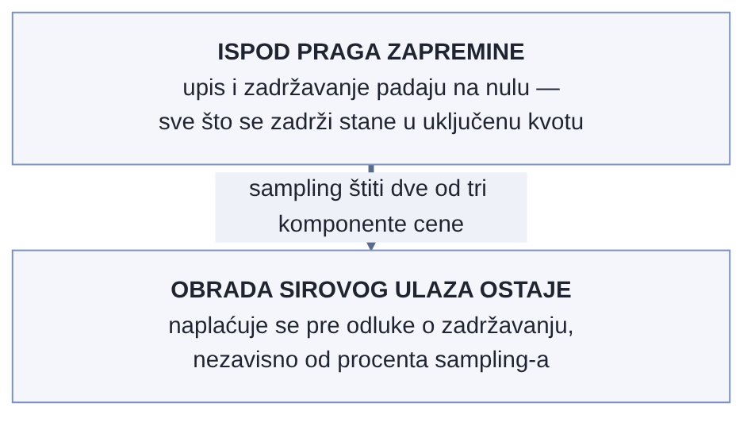

# Poglavlje 12 — Sampling trejsova: server-side adaptivni sampling naspram collector-side

Aerodromska bezbednosna kontrola ne pregleda svakog putnika sa istom pažnjom.
Većina prođe kroz standardan skener i ide dalje za nekoliko sekundi. Neki —
nasumično izabrani, ili zato što je nešto na skeneru zatraženo dodatnu pažnju,
ili zato što obrazac ponašanja odstupa od uobičajenog — dobijaju dodatni,
temeljniji pregled. Odluka o tome ko dobija dodatnu pažnju se ne donosi na
ulazu u aerodrom, pre nego što iko uopšte prođe kroz bilo šta — donosi se **na
samom skeneru**, sa punim uvidom u ono što je upravo izmereno. Da se odluka
donosila unapred, na kapiji, pre bilo kakvog merenja, ne bi bilo osnove za
nju — birala bi se nasumično ili bi se pregledao baš svako, što od bezbednosne
kontrole pravi usko grlo koje niko ne bi mogao da izdrži.

Sampling trejsova stoji pred istim izborom: da li odluku "da li ovaj trejs
vredi zadržati" doneti rano, pre nego što je trejs uopšte sakupljen u
celosti — ili kasno, posle punog uvida u ono što se zapravo dogodilo.

## 12.1 Pitanje na koje ovo poglavlje odgovara

Svaki zahtev u sistemu generiše trejs. Zadržati baš svaki, zauvek, po punoj
ceni skladištenja, nije održivo ni za jedan sistem realne veličine — pitanje
nije *da li* se sampluje, nego **gde** se odluka donosi i **na osnovu čega**.
Ovo poglavlje odgovara na pitanje zašto je implementacija koju knjiga prati
odabrala da tu odluku prepusti platformi, posle punog sakupljanja trejsa,
umesto da je donese sama, rano, na nivou gateway-a iz Poglavlja 4.

## 12.2 Kako je to urađeno — praktičan pregled

Sampling trejsova u implementaciji koju knjiga prati je **server-side i
adaptivan** — radi ga sama cloud observability platforma, ne gateway. Gateway
prosleđuje **sve** trejsove dalje, bez sopstvene sampling logike; odluka o
tome šta se zadržava se donosi tek na platformi, pošto je platforma već
primila kompletan trejs.

Osnovna, podrazumevana stopa je probabilistička — trenutno **10% baznog
uzorkovanja** (spušteno sa 25% u ranijoj fazi, kad je iskustvo pokazalo da
25% nosi više troška nego analitičke vrednosti za ovaj obim saobraćaja). Ali
platforma ne primenjuje samo tu bazu — dodaje slojeve pravila koja
**garantovano zadržavaju** određene kategorije trejsova nezavisno od bazne
stope:

- **Trejsovi sa greškom** — status kod koji ukazuje na neuspeh se zadržava
  gotovo uvek, jer je upravo to najvredniji materijal za dijagnozu.
- **Spori trejsovi** — latencija iznad definisanog praga se zadržava, jer
  performansni problemi retko ostave trag ijednim drugim putem osim kroz sam
  trejs.
- **Raznovrsnost obrazaca** — bar jedan trejs po jedinstvenom otisku
  (kombinacija servisa, rute i ishoda) unutar prozora se zadržava, bez obzira
  na baznu stopu — tako da nagli talas gotovo identičnih zahteva (recimo,
  ista greška koja se ponovi hiljadu puta u par minuta) ostavi bar jednog
  predstavnika, umesto da probabilistička stopa nasumično zadrži šaku kopija
  istog obrasca ili nijednu.

{: width="88%" }

### Kako se pravila zapravo evaluiraju — i zašto je ovo iznenađenje

Vredi biti precizan oko mehanike, jer intuitivan mentalni model ("pravila se
proveravaju redom, prvo koje odluči pobeđuje") je samo delimično tačan, i
razlika je bitna za bilo koga ko pokušava da predvidi ponašanje unapred:

- **Politike odbacivanja (drop) su apsolutan veto.** Ako trejs zadovoljava
  bilo koju drop politiku, odbacuje se odmah, čak i ako istovremeno
  zadovoljava jednu ili više keep politika.
- **Politike zadržavanja (keep) rade po OR logici.** Trejs se zadržava ako
  zadovolji **bilo koju** keep politiku — ne mora sve.
- **Redosled evaluacije unutar keep politika je efektivno nasumičan** — ne
  poklapa se ni sa redosledom u konfiguraciji ni sa redosledom u interfejsu.
  Jedini deo redosleda koji je garantovan: drop politike se uvek evaluiraju
  prve, upravo zato što imaju veto moć.

Ovo znači da "šta se dešava kad trejs zadovolji dve keep politike istovremeno"
nema jednoznačan odgovor unapred — obe bi ga zadržale, tako da ishod ne
zavisi od toga koja se prva proveri (obe daju isti ishod: zadrži). Gde ovo
**jeste** bitno je pri debagovanju "zašto ova politika deluje neaktivno" —
odgovor je često da neka druga politika već donosi odluku pre nje, ne da je
ta konkretna politika loše podešena.

Metrike generisane iz trejsova (spanmetrics, pomenute u Poglavlju 11) se
računaju **iz sirovih podataka trejsa, pre bilo kakvog downsampling-a** — što
znači da dashboard koji prati stopu grešaka ili latenciju ostaje tačan i
statistički pouzdan i kada je 90% trejsova odbačeno posle merenja, jer merenje
za metrike nije zavisilo od toga koji je trejs na kraju zadržan za pojedinačnu
inspekciju.

### Zamka merenja: dve stvari koje izgledaju kao ista brojka, a nisu

Dva merenja u ovom delu sistema izgledaju međusobno zamenljiva, a nisu:

- `traces_spanmetrics_size_total` **potcenjuje stvaran obim** za otprilike
  2,2 puta — meri veličinu na osnovu spanmetrics generatora, ne stvarnog
  OTLP payload-a koji fizički napušta sistem.
- Zato što se spanmetrics generišu **pre** downsampling-a (tačka iznad),
  `traces_spanmetrics_*` porodica **ne može uopšte da izmeri koliko je
  downsampling zapravo uštedeo** — ona strukturno ne vidi razliku pre/posle,
  jer je računata pre te tačke u toku. Za stvarnu uštedu treba čitati
  metriku koja meri odbačene bajtove nakon primene adaptivnih politika, ne
  spanmetrics porodicu.

### Trejs koji je odbačen nije trajno izgubljen — ali skoro

Odbačen trejs nije obrisan istog trenutka — dostupan je **po trace ID-ju,
tačno 24 sata**, posle čega nestaje trajno. Van tog prozora, i van pretrage
po tačnom ID-ju, odbačen trejs se ne pojavljuje nigde: ne u TraceQL pretrazi,
ne u service graph vizualizaciji, ne u agregacijama. Ovo najviše pogađa
istraživački rad — inženjer koji pokušava da rekonstruiše "šta se tačno
dogodilo prošle srede" na trejsu koji je tada odbačen, jednostavno nema
pristup, čak i ako zna okvirno vreme.

### Slučaj neslaganja: kad brojka ne odgovara očekivanju

U jednom periodu, izmerena stopa zadržavanja trejsova nije odgovarala
očekivanju izračunatom iz konfigurisanih politika — stvaran procenat
zadržanih trejsova je bio primetno drugačiji od onoga što bi kombinacija
bazne stope i keep pravila trebalo da proizvede. Prva reakcija tima **nije**
bila da odmah promeni baznu stopu ili doda novo pravilo da nadoknadi razliku
— to bi rešilo simptom bez razumevanja uzroka, i moglo bi da sakrije stvaran
problem umesto da ga otkrije. Umesto toga, neslaganje je prijavljeno
dobavljaču platforme, uz konkretne brojke, i **ništa nije menjano** dok
mehanizam iza razlike nije razjašnjen. Disciplina ovde nije bila u tome šta
je urađeno, nego u tome šta **nije** urađeno — refleksivna reakcija na
brojku koja ne odgovara očekivanju.

Ovako je izgledao period neslaganja opisan iznad — izmerena stopa zadržavanja
je počela da odstupa od očekivane vrednosti izračunate iz konfigurisanih
politika, i vraćena je na očekivani nivo tek pošto je dobavljač objasnio
mehanizam, ne pošto je neko promenio konfiguraciju:

{: width="95%" }

### Trošak zavisi od nelinearnog praga, ne linearno od procenta

Vredi razdvojiti dva pitanja koja se lako mešaju kad se bira bazna
probabilistička stopa (trenutno 10%, ranije 25%, pomenuto u § 12.2): koliko
sampling-a je dovoljno za dijagnostičku vrednost, i koliko sampling-a je
dovoljno da promeni račun. Odgovor na drugo pitanje nije linearan sa
procentom, i to menja koja je odluka zapravo jeftina.

Platforma naplaćuje zadržane trejsove kroz tri odvojene komponente (obrada,
upis, zadržavanje), svaku sa sopstvenom uključenom kvotom po mesecu. Dok god
zadržana zapremina posle sampling-a ostaje **ispod** te kvote, komponente
upisa i zadržavanja padaju na nulu — ne zato što je sampling agresivniji,
nego zato što sve što se zadrži jednostavno stane u već uključeni prostor.
Iznad tog praga, svaki dodatni procenat zadržavanja direktno diže račun.
Ovo znači da postoji tačka, izmeriva za konkretnu zapreminu saobraćaja,
ispod koje spuštanje bazne stope za još par procenata ne štedi skoro ništa
(već je ispod praga), a iznad koje isti potez štedi neproporcionalno mnogo
(upravo prelazi prag).

Jedna komponenta cene je, međutim, potpuno nezavisna od procenta koji se
bira: obrada se naplaćuje na sirov ulaz, **pre** bilo kakve odluke o
zadržavanju, i raste sa obimom flote bez obzira koliko agresivan sampling
bude. Sampling štiti dve od tri komponente cene, ne sve tri — vredi to
znati unapred, umesto da se otkrije kad račun i dalje raste posle
agresivnog spuštanja bazne stope.

{: width="78%" }

Konkretna razlaganja mesečnog računa na tri komponente, izmerena u periodu
kad je ovo pitanje prvi put ozbiljno postavljeno, pokazuje isti princip u
brojkama: obrada je iznosila oko devet procenata ukupnog troška, upis oko
tri četvrtine, a zadržavanje ostatak — omer koji se, jednom izmeren, nije
menjao mesecima, jer prati fiksnu cenu po komponenti, ne obim saobraćaja.
Odatle direktno sledi da je oko devet desetina ukupnog računa za trejsove,
u ovom konkretnom periodu, zaista bilo pod uticajem sampling odluke — a
preostalih devet procenata je bilo tu bez obzira šta sampling uradi,
tačno onoliko koliko je odeljak iznad već najavio kvalitativno.

### Dva brojača, dve različite tačke u istoj cevi

Zamka merenja iz § 12.2 (spanmetrics potcenjuje stvaran obim, i ne može da
izmeri uštedu koju downsampling donosi) ima blizak rođak, na drugom paru
brojača. Platforma izlaže dva merenja obima podataka koja izgledaju kao ista
brojka izmerena dva puta — a mere dve različite tačke u toku: jedno meri
zapreminu **pre** nego što je odluka o zadržavanju doneta, drugo meri ono
što je iz te odluke stvarno preživelo i otišlo dalje ka skladištu.

Deljenje jednog brojkom drugog daje besmislen rezultat čim se pomeša
smer — brojka veća od 100% "pokrivenosti" na prvi pogled izgleda kao greška
u merenju, a zapravo je artefakt deljenja dva broja koja mere različite
tačke u pipeline-u, ne isti trenutak dva puta. Pravilo koje sprečava ovu
zabunu je jednostavno, ali nije očigledno dok se ne naiđe na nju uživo: par
"pre sampling-a" koristi se isključivo za računanje stope odbacivanja, a par
"posle sampling-a" isključivo za naplativu zapreminu — ta dva se nikad ne
dele jedno drugim, čak i kad im imena zvuče zamenljivo.

## 12.3 Analitički deo — zašto server-side umesto collector-side

### Zvanična razlika: gde se donosi odluka i šta to znači za tačnost

Nezavisan pregled sampling strategija u OpenTelemetry ekosistemu razlikuje
dva osnovna pristupa: **head sampling** (odluka se donosi rano, često na
nivou pojedinačnog spana, pre nego što je poznato kako će se trejs završiti)
i **tail sampling** (odluka se donosi tek pošto je kompletan trejs
sakupljen, sa punim uvidom u to da li je trejs imao grešku, koliko je trajao,
da li je odstupao od obrasca). Head sampling je jeftiniji za implementaciju i
zahteva manje resursa na strani kolektora, ali strukturno ne može da
garantuje "zadrži svaki trejs sa greškom" — u trenutku kad se odluka donosi,
greška možda još nije ni nastala.

Adaptivni sampling koji koristi platforma u implementaciji koju knjiga prati
je oblik tail sampling-a, sa dodatom adaptivnom komponentom (pravilo za
raznovrsnost obrazaca iz § 12.2, dinamičko podešavanje baznog procenta). Ovo
je, zvanično, tačno ona kategorija problema za koju tail sampling postoji:
sistem gde su retki, ali kritični trejsovi (greške, retki obrasci) tačno oni
koje head sampling najlakše promaši, jer njihova "vrednost" nije poznata u
trenutku kad head sampling mora da odluči.

### Zašto ne na nivou gateway-a — cena koju bi self-managed tail sampling nosio

Implementacija je razmatrala i eksplicitno odbacila alternativu:
samostalno-upravljan tail sampling procesor na samom gateway-u, umesto
oslanjanja na platformu. Ova opcija je evaluirana i odbačena iz dva razloga.
Prvo, tail sampling zahteva da kolektor **drži kompletan trejs u memoriji**
dok se ne donese odluka — što za gateway koji već servisira desetine
pošiljalaca odjednom (Poglavlje 4) predstavlja ozbiljan memorijski pritisak,
tačno onaj tip pritiska koji `memory_limiter` iz Poglavlja 10 postoji da
ublaži, ne da apsorbuje dodatni izvor. Drugo, i važnije: samostalno upravljan
tail sampling procesor bi degradirao dashboard-e i alarm (konkretno, alarm
koji čita `traces_spanmetrics_*` metrike) koji zavise od punog, nesamplovanog
toka trejsova pre nego što bilo šta bude odbačeno — prebacivanje odluke uzvodno
bi značilo da ti dashboard-i i taj alarm više ne vide ono što tvrde da vide.

### Prepreka koja nije samo memorija: trejs mora stalno da pogađa isti kolektor

Memorijski pritisak iz prethodnog odeljka je stvaran, ali nije jedina, ni
najdublja prepreka koju bi samostalno upravljan tail sampling nosio. Da bi
takav sampler uopšte mogao da donese ispravnu odluku, mora prvo da vidi
**celokupan** trejs na jednom mestu — što znači da svaki span jednog te
istog trejsa mora stalno da pogodi **isti** primerak kolektora, koliko god
ih flota trenutno imala. Ovo se u praksi rešava dvoslojnom topologijom: prvi
sloj raspoređuje dolazne spanove po njihovom ID-ju trejsa ka tačno
određenom primerku drugog sloja, koji tek onda drži trejs u memoriji i
odlučuje. Da bi prvi sloj mogao pouzdano da adresira "baš ovaj, konkretan
primerak", potreban je mehanizam koji svakom primerku dodeljuje sopstvenu,
stabilnu adresu — a gateway ove implementacije, opisan u Poglavlju 4, sedi
iza običnog mrežnog balansera saobraćaja, sa jednom deljenom adresom koja
vodi ka bilo kom trenutno živom primerku, ne ka određenom.

Čak i kad bi se taj deo rešio, ostaje drugi, teži problem: isti taj gateway
se automatski skalira gore-dole u zavisnosti od opterećenja. Svaki takav
događaj skaliranja menja broj živih primeraka kolektora — a promena broja
primeraka nužno pomera koji primerak je zadužen za koji opseg ID-jeva
trejsa. Trejs koji je već u toku, sa nekoliko spanova već pristiglih na
jedan primerak, može odjednom da ima sledeći span preusmeren na sasvim
drugi primerak čim se flota promeni usred njegovog trajanja. Ovo nije redak,
ivičan slučaj koji se dešava jednom u hiljadu trejsova — ovo je rutinsko
ponašanje svaki put kad se flota skalira, a flota se skalira tačno onda kad
je saobraćaj najintenzivniji, što je i trenutak kad su trejsovi
najbrojniji i najverovatnije da će neki od njih preživeti baš kroz taj
prelaz. Server-side pristup ovaj čitav problem uklanja u korenu: pošto
platforma prima kompletan trejs pre nego što bilo šta odluči, ne postoji
nijedna tačka gde bi raspodela spanova po više primeraka uopšte mogla da
naruši celovitost trejsa.

### Kvar koji je već poznat i dokumentovan negde drugde

Drugi razlog iz prethodnog odeljka — da bi samostalno upravljan sampler
degradirao dashboard-e i alarme koji zavise od metrika izvedenih iz
trejsova — ima konkretan, javno dokumentovan mehanizam iza sebe, koji je
neko drugi otkrio i prijavio pre nego što je ova implementacija uopšte
morala da nauči tu lekciju iskustvom. Tail sampler mora da drži trejs u
memoriji kroz fiksan prozor odlučivanja pre nego što donese konačnu odluku
o zadržavanju. Nezavisno od toga, korak koji generiše metrike iz trejsova
ima sopstveni, odvojeno podešen prozor tolerancije — i tiho odbacuje svaki
span čije vreme završetka je starije od tog prozora u trenutku kad stigne.
Kad je prozor odlučivanja samplera blizu ili duži od prozora tolerancije
generatora metrika, spanovi sistematski stižu "prekasno" iz ugla generatora
metrika — ne zato što nešto nije u redu sa samim saobraćajem, nego zato što
se dva nezavisno podešena vremenska prozora sudaraju. Rezultat: metrike
izvedene iz trejsova tiho padaju na nulu, tačno u trenutku kad bi trebalo
da pokazuju stvarno stanje sistema.

Osoba koja je ovaj kvar prvi put prijavila je potvrdila da skraćivanje
prozora odlučivanja samplera vraća metrike u normalu; trajnija, objavljena
popravka je bila na drugoj strani — proširenje prozora tolerancije
generatora metrika. Ova implementacija ne bi mogla sama da primeni tu drugu
popravku, jer taj deo cevovoda ne drži ona nego platforma — što znači da bi
samostalno upravljan sampler ovde bio zaglavljen između dva zahteva koja se
međusobno isključuju: dovoljno kratak prozor odlučivanja da metrike ostanu
tačne, naspram dovoljno dugog prozora da pravila za spore trejsove imaju
šta da izmere. Server-side pristup izbegava ovu dilemu u potpunosti, jer
oba koraka — odlučivanje i generisanje metrika — rade nad istim,
kompletnim, još neprosejanim tokom trejsova, pre nego što bilo šta bude
podeljeno na dva nezavisna prozora koja mogu da se ne slože.

### Cena da je odluka o zadržavanju bila trenutna, bez punog uvida: kontrafaktički scenario

Vredi konkretno odigrati head sampling alternativu na istom sistemu. Recimo
da gateway donosi odluku "zadrži ili odbaci" na nivou pojedinačnog spana, u
trenutku kad ga primi — pre nego što je poznato da li će taj isti trejs,
nekoliko koraka kasnije, završiti greškom. Sistem bi morao ili da zadrži
mnogo veći procenat "za svaki slučaj" (poskupljujući trošak koji je cela
priča o sampling-u trebalo da smanji), ili da prihvati da će sistematski
promašivati baš one trejsove koji najviše vrede — one sa greškom koja
nastaje kasno u lancu poziva. Ovo nije hipotetička mana — to je strukturna
osobina head sampling-a, ne slučajna greška u implementaciji.

Vratimo se na aerodromsku kontrolu s početka poglavlja. Da se odluka o
dodatnom pregledu donosila na kapiji, pre nego što je iko prošao kroz
skener, ne bi postojala nikakva informacija na osnovu koje bi se ta odluka
razlikovala od nasumičnog izbora. Odluka vredi tačno onoliko koliko i uvid
koji je prethodi. **Sampling koji se dešava pre nego što je poznato šta se
zapravo dogodilo je nagađanje sa dodatnim korakom; sampling koji se dešava
posle punog uvida je odluka.**

## 12.4 Skupljena pravila iz ovog poglavlja

- Kad god je moguće, donesi sampling odluku posle punog sakupljanja trejsa
  (tail sampling), ne pre — greške i retki obrasci su retko poznati u trenutku
  kad head sampling mora da odluči.
- Zapamti da su politike odbacivanja apsolutan veto, a politike zadržavanja
  rade po OR logici sa efektivno nasumičnim redosledom evaluacije — ne
  oslanjaj se na to da će konfiguracioni redosled predvideti ishod.
- Meri metrike izvedene iz trejsova (spanmetrics) sa razumevanjem da su
  računate **pre** downsampling-a — one ne mogu da izmere uštedu koju
  downsampling donosi, samo brojke pre te tačke.
- Kad izmerena brojka ne odgovara očekivanju, prijavi neslaganje i sačekaj
  razumevanje mehanizma pre nego što promeniš konfiguraciju da bi brojka
  "izgledala ispravno".
- Odbačen trejs nije trajno nedostupan odmah, ali prozor je kratak (tipično
  merljiv u satima, ne danima) — ne oslanjaj se na mogućnost da ćeš mu se
  vratiti kasnije ako ga odmah ne pogledaš.
- Pre nego što spustiš baznu stopu sampling-a da bi uštedeo, izmeri gde je
  nelinearan prag zapremine za tvoj obim saobraćaja — ispod praga uštede su
  male, iznad njega neproporcionalno velike, i jedna komponenta cene
  (obrada sirovog ulaza) ne pada ni u jednom slučaju.
- Kad platforma izlaže par brojača "pre" i "posle" iste tačke u pipeline-u,
  nikad ih ne deli jedan drugim da bi se dobila "procenat pokrivenosti" —
  svaki brojač u paru ima tačno jednu namenu (stopa odbacivanja, ili
  naplativa zapremina), ne obe.
- Pre nego što sam gradiš tail sampling na sopstvenom kolektoru, proveri da
  li tvoja infrastruktura uopšte može da garantuje da svaki span jednog
  trejsa stalno pogađa isti primerak — ako flota skalira gore-dole iza
  deljene adrese, bez stabilnog načina da se adresira pojedinačan primerak,
  parcijalni trejsovi nisu redak kvar nego rutinska posledica svakog
  događaja skaliranja.
- Kad tail sampler i generator metrika iz trejsova dele isti tok podataka
  ali imaju nezavisno podešene vremenske prozore, proveri da li se ti
  prozori mogu sudariti — prozor odlučivanja duži od prozora tolerancije
  drugog koraka tiho obara izvedene metrike na nulu, bez ijedne poruke o
  grešci.

## 12.5 Vežba za čitaoca

Pronađi gde se u tvom sistemu donosi odluka o sampling-u trejsova — na nivou
pojedinačnog spana pri kreiranju (head), ili tek posle sakupljanja celog
trejsa (tail). Ako je head sampling, zamisli konkretan trejs koji ima grešku
tek na svom poslednjem koraku — da li bi ga tvoja sadašnja konfiguracija
zadržala, ili bi odluka već bila doneta pre nego što je greška uopšte
postojala?

---

### Izvori korišćeni u analitičkom delu

- [How policies are evaluated — Adaptive Traces, Grafana Cloud documentation](https://grafana.com/docs/grafana-cloud/adaptive-telemetry/adaptive-traces/guides/example-policies/)
- [Introduction to Adaptive Traces — Grafana Cloud documentation](https://grafana.com/docs/grafana-cloud/adaptive-telemetry/adaptive-traces/introduction/)
- [Best practices for policies — Grafana Cloud documentation](https://grafana.com/docs/grafana-cloud/adaptive-telemetry/adaptive-traces/guides/best-practices-policies/)
- [Sampling strategies for tracing — Grafana Cloud documentation](https://grafana.com/docs/grafana-cloud/send-data/traces/configure/sampling/)
- [Maximize data value and cut costs: Adaptive Telemetry for metrics, logs, traces, and profiles in Grafana Cloud — Grafana Labs blog](https://grafana.com/blog/adaptive-telemetry-suite-in-grafana-cloud/)
- [grafana/alloy#5682 — tail sampling appears to break Tempo metrics-generators](https://github.com/grafana/alloy/issues/5682)
- [grafana/tempo#6587 — metrics_ingestion_time_range_slack vs tail-sampling decision_wait](https://github.com/grafana/tempo/issues/6587)
