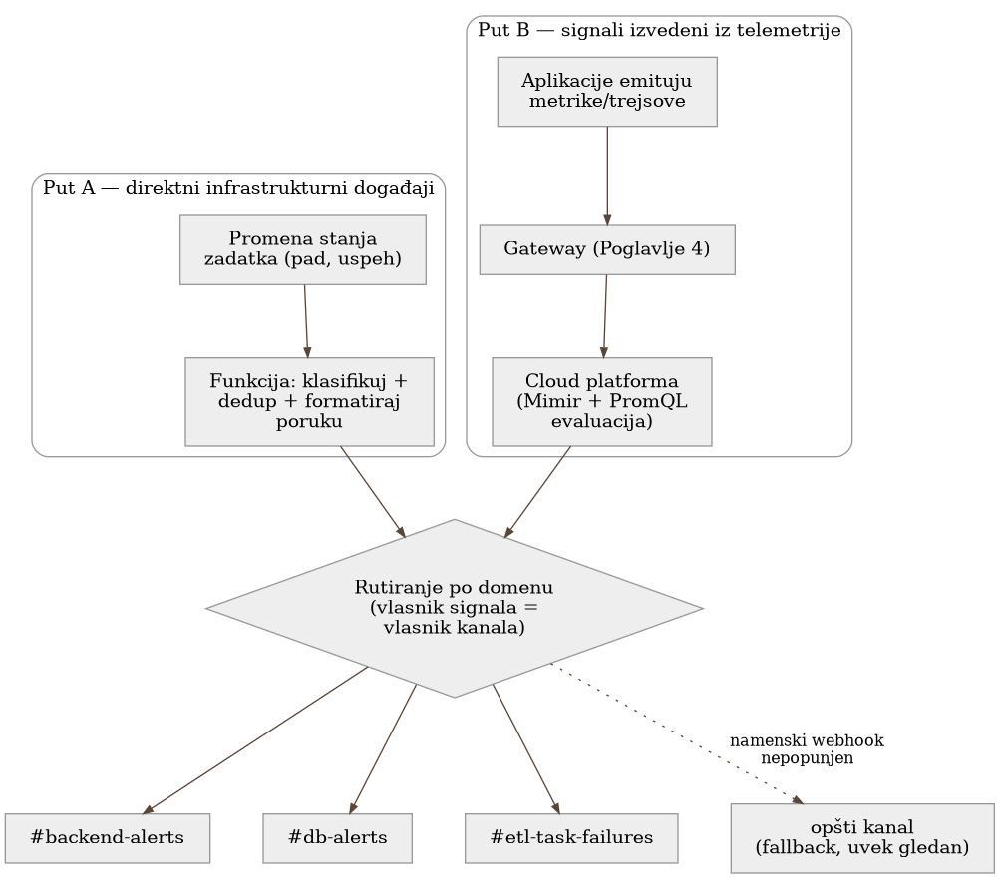

# Poglavlje 13 — Arhitektura alarmiranja: dva puta, jedan odredišni kanal

Dispečerski centar hitne službe prima poziv na dva potpuno različita načina.
Građanin diže telefon i bira broj — ljudski glas, opisuje šta vidi, često
nesiguran u detalje. U isto vreme, senzor dima u zgradi na drugom kraju grada
sam, automatski, šalje signal čim registruje čađ iznad praga — bez ijedne
reči, bez čoveka koji bira broj. Ova dva signala ne dele ništa u tehničkom
smislu — jedan je ljudski govor preko telefonske mreže, drugi je mašinski
signal preko posvećene linije — a ipak oba završavaju na istom pultu, kod
istog dispečera, jer dispečeru u tom trenutku nije bitno **kako** je signal
stigao, nego **da je** stigao. Da je neko pokušao da natera senzor dima da
"zove telefonom" radi doslednosti, samo bi dodao kašnjenje i tačku otkaza
tamo gde nije trebalo da postoji.

## 13.1 Pitanje na koje ovo poglavlje odgovara

Sistem koji knjiga prati ima alarme koji stižu iz dva suštinski različita
izvora — direktni događaji infrastrukture (da li je kontejnerski zadatak
umro) i signali izvedeni iz telemetrije (PromQL upit nad metrikama koje
gateway iz Poglavlja 4 prikuplja) — a oba na kraju stižu u iste Slack kanale.
Ovo poglavlje odgovara na pitanje zašto se ta dva puta namerno **ne** stapaju
u jedan zajednički mehanizam, i kako se, unutar tog dvostrukog puta, alarmi
dalje raspoređuju po timovima koji ih treba da vide.

## 13.2 Kako je to urađeno — praktičan pregled

**Put A — direktni infrastrukturni događaji.** Kada kontejnerski zadatak u
flotu za obradu podataka promeni stanje (zaustavi se, padne, ne uspe da se
pokrene), cloud platforma emituje događaj u realnom vremenu — nema
posrednika, nema metrike koja se prvo mora izračunati. Taj događaj direktno
pokreće funkciju koja klasifikuje ozbiljnost, proverava da li je isti obrazac
već nedavno prijavljen (da ne bi doslovno isti pad izazvao deset poruka), i
šalje formatiranu poruku sa direktnim linkovima ka relevantnim dashboard-ima.

**Put B — signali izvedeni iz telemetrije.** Aplikacije šalju svoje metrike i
trejsove kroz gateway iz Poglavlja 4, koji ih prosleđuje do cloud
observability platforme. Tamo, PromQL upit periodično proverava da li neki
uslov važi (na primer, da li je stopa grešaka prešla prag), i ako važi,
platforma sama šalje alarm ka istom odredištu.

Oba puta na kraju stižu u iste Slack kanale — ali **ne kroz isti mehanizam**.
Ovo je namerna arhitekturna odluka, ne istorijski nusprodukt: signal iz Puta
A prirodno živi u infrastrukturnim događajima (nema smisla prvo pretvarati
događaj u metriku samo da bi prošao kroz isti cevovod kao Put B), a signal iz
Puta B prirodno živi u telemetriji (nema smisla izvlačiti ga iz platforme
nazad u infrastrukturni sloj). Svaki put prati signal odakle prirodno živi,
bez nepotrebnog cross-cloud skoka.

### Raspodela po domenu — "vlasnik signala = vlasnik kanala"

Alarmi se dalje dele po domenu na koji se odnose, ne po tome kojim putem su
stigli. Backend servis ima svoj kanal, baza podataka svoj, auth sloj
(Keycloak-tipa identity provider) svoj, batch/ETL flota svoj, mrežni sloj
svoj, serverska flota svoj. Princip je jednostavan: tim koji poseduje
konkretan segment sistema treba da vidi baš njegove alarme, ne da ih
pretražuje unutar zajedničkog, preplavljenog kanala. Signal sa Puta A
(infrastrukturni pad zadatka) i signal sa Puta B (telemetrijski izveden
alarm) za **isti** domen završavaju u **istom** namenskom kanalu — razlika u
putu je nevidljiva timu koji čita alarm, i tako treba da bude.

### Fallback lanac — alarm se nikad ne gubi

Svaki namenski kanal je zapravo posebna Slack integracija (webhook), i
mehanizam koji bira koju integraciju koristiti radi po principu **unazad
odstupanje**: prvo pokušaj namenski webhook za taj domen; ako nije podešen
(prazna vrednost), padni nazad na sledeći širi kanal; ako ni taj nije
podešen, padni na opšti, uvek-postojeći kanal. Ovo znači da uvođenje novog
domena (novog namenskog kanala) nikad ne rizikuje da alarm potpuno nestane
ako neko zaboravi da popuni konfiguraciju za taj kanal na vreme — alarm samo
sleže jedan nivo šire, nikad se ne gubi u tišini. Ova odluka je posebno
vredna zato što je suprotstavljena intuitivnom refleksu "podrazumevana ruta
je mesto gde idu alarmi koje ne želimo da vidimo" — ovde je podrazumevana
ruta stvaran, gledan kanal, ne kanta za otpatke.

{: width="95%" }

### Kako se sami alarmi i dashboard-i drže pod kontrolom verzija

Mehanizam rutiranja opisan gore — pravila, kontakt tačke (Grafana-ov naziv
za odredište jednog obaveštenja: webhook, email, itd.), fallback lanac —
nije nešto što neko ručno održava kroz web interfejs observability
platforme. Pravila za Put B (PromQL uslov, prag, kontakt tačka kojoj
pravilo šalje obaveštenje) definisana su kao infrastrukturni kod, istim
alatom (Terraform) i u istom stilu repozitorijuma kojim je definisana i
sama infrastruktura koja tu telemetriju proizvodi. Svaka grupa pravila i
svaka kontakt tačka je resurs u kodu; promena ide kroz isti `plan`/`apply`
ciklus kao i svaka druga infrastrukturna promena, sa stanjem čuvanim u
istom udaljenom skladištu.

Dashboard-i idu drugačijim putem — namerno žive odvojeno od infrastrukturnog
koda, u sopstvenom repozitorijumu, i objavljuju se isključivo kroz namenski
skript, nikad ručnim pozivom API-ja. Razlog razdvajanja nije istorijski
nego namerni: definicija alarma je infrastrukturna odluka (prag, uslov, kome
ide) koja prirodno prati istu disciplinu pregleda promena kao mreža ili baza
podataka; sadržaj dashboard-a je češće uređivački posao — raspored panela,
koji upit ide na koji grafikon — kojim se bavi širi krug ljudi, uključujući
i one koji ne pišu infrastrukturni kod. Nametanje istog alata i istog toka
odobravanja na oba bi ili usporilo iteraciju na dashboard-ima ili oslabilo
disciplinu oko alarma.

Ova disciplina otkriva zamku koja se ne vidi dok se u nju ne udari: izmena
postojeće grupe pravila resetuje stanje **svakog** pravila u toj grupi, ne
samo onog koje se menja. Ako je bilo koje pravilo u grupi trenutno aktivno
(alarmira), primena promene odmah šalje lažno "razrešeno" obaveštenje,
spušta pravilo na neutralno stanje, i onda ga ponovo vodi kroz isti prelaz
nazad ka alarmiranju — par poruka koji u Slack-u izgleda identično kao da je
alarm zatreperio, a nije. Zabeležen slučaj: promena samo jednog sporednog
parametra (koliko često se obaveštenje ponavlja) na pravilu koje je već
šest sati mirno alarmiralo na istoj, nepromenjenoj vrednosti izazvala je
tačno taj par poruka — "razrešeno" u trenutku primene, pa "ponovo aktivno"
tačno onoliko kasnije koliko iznosi prozor potvrde tog pravila (u zabeleženom
slučaju, pola sata). Uslov se u međuvremenu nije nijednom promenio.

Ovo nije kvar konfiguracije nego neizbežna posledica arhitekture — stanje
pravila živi po grupi, ne po pojedinačnom pravilu — i vredi je unapred
očekivati, ne tražiti joj uzrok posle svake primene: jedan par
"razrešeno pa ponovo aktivno" po svakom trenutno-aktivnom pravilu u grupi,
za svaku primenu koja tu grupu dotiče. Praktična posledica: primenjivati
promene kad ništa u toj grupi ne alarmira ako postoji izbor, i unapred
najaviti timu da će par poruka doći ako se primenjuje dok nešto već
alarmira.

## 13.3 Analitički deo — zašto se ne stapaju u jedan mehanizam

### Zvanična preporuka: rutiranje po vlasništvu, ne po tehnologiji

Nezavisan pregled prakse rutiranja alarma dosledno preporučuje dvoslojni
pristup: grubo rutiranje na nivou alatke za alarmiranje (koja platforma,
koji tim), i fino rutiranje unutar toga (ozbiljnost, konkretna eskalacija).
Redosled pravila treba da ide od najspecifičnijeg ka najopštijem, sa
podrazumevanom rutom koja **nikad** ne sme biti tretirana kao "mesto gde
idu alarmi koje ignorišemo" — tačno princip primenjen u fallback lancu
opisanom iznad. Isti materijal preporučuje redovno merenje kolika
procentualno alarma zaista pogađa namensku rutu naspram podrazumevane —
cilj od 95%+ pokrivenosti namenskim rutama otkriva rupe u konfiguraciji pre
nego što ih neko otkrije uživo, u trenutku incidenta.

### Zašto ne postoji jedan univerzalan cevovod

Uobičajen nagon je forsirati sve kroz jednu platformu radi doslednosti —
"sve treba da ide kroz observability platformu, zbog jednog mesta istine".
Implementacija koju knjiga prati je eksplicitno odbacila taj nagon iz tri
razloga: prvo, stanje infrastrukturnog zadatka prirodno živi u
infrastrukturnim događajima, ne u metrici — forsiranje bi značilo ili
objavljivanje tih događaja kao log linija ili sintetizovanje metrike samo da
bi prošla kroz isti cevovod, dodatni skok bez koristi. Drugo, webhook URL-ovi
bi morali ili biti konfigurisani na oba mesta (dupliranje, dva mesta koja
mogu da se raziđu) ili bi jedno moralo da poziva drugo cross-cloud
(dodatna operativna složenost i dodatna tačka otkaza). Treće, format poruke
sa Puta A (bogat, sa specifičnom logikom po tipu zadatka i direktnim
linkovima) je teško izraziti kroz šablone za alarmiranje observability
platforme, koji su projektovani za drugu vrstu poruke.

### Cena da je postojao samo jedan put: kontrafaktički scenario

Vredi konkretno odigrati alternativu u kojoj bi infrastrukturni događaji bili
prisiljeni kroz observability platformu radi "jednog mesta istine". Svaki
pad zadatka bi prvo morao biti pretvoren u log liniju ili sintetičku
metriku, zatim čekati sledeći ciklus evaluacije PromQL upita (kašnjenje koje
direktan događaj nikad ne bi imao), a sam webhook bi morao biti konfigurisan
na strani cloud platforme umesto u infrastrukturnom nalogu — što znači da bi
kvar cloud platforme (tačno onaj scenario koji Poglavlje 4 već pominje kao
razlog za nezavisnost) mogao da obori **oba** puta odjednom, umesto da Put A
ostane nezavisan i nastavi da radi dok se Put B oporavlja. Doslednost
transportnog mehanizma bi bila kupljena po ceni upravo one nezavisnosti koja
čini sistem otporan.

Vratimo se na dispečerski centar s početka poglavlja. Dispečer ne insistira
da senzor dima "zove telefonom" da bi oba poziva izgledala isto na papiru —
insistira samo da oba, ma kojim putem stigla, završe na istom pultu, kod
prave jedinice, i da nijedan poziv ne nestane u tišini ako je linija za
određenu jedinicu zauzeta. **Dosledan izgled odredišta ne zahteva dosledan
put do njega — zahteva samo da nijedan put ne otkaže na način koji povlači
drugi sa sobom.**

## 13.4 Skupljena pravila iz ovog poglavlja

- Ne forsiraj signal kroz tuđi transportni mehanizam radi doslednosti —
  neka svaki signal ide putem gde prirodno živi (infrastrukturni događaj kroz
  infrastrukturni put, telemetrijski signal kroz telemetrijski put).
- Rutiraj alarme po vlasništvu nad domenom (ko poseduje taj deo sistema), ne
  po tome kojim tehničkim putem su stigli — vlasnik signala treba da bude
  vlasnik kanala.
- Nikad ne tretiraj podrazumevanu/opštu rutu kao mesto za alarme koje
  ignorišeš — ona mora biti stvaran, gledan kanal, jer je to mesto gde
  sleže sve što još nema namensku rutu.
- Ugradi eksplicitan fallback lanac (namenski → širi → opšti kanal) tako da
  nepopunjena konfiguracija za novi domen preusmeri alarm umesto da ga
  izgubi.
- Meri redovno koliki procenat alarma zaista pogađa namensku rutu — pad tog
  procenta je rani signal da je neki domen prerastao svoju trenutnu
  konfiguraciju.
- Drži definicije alarma (pragovi, kontakt tačke) kao infrastrukturni kod uz
  ostatak sistema i primenjuj ih istim `plan`/`apply` ciklusom — ali očekuj
  da izmena grupe pravila pošalje lažan par "razrešeno pa ponovo aktivno"
  za svako trenutno aktivno pravilo u toj grupi, ne samo za pravilo koje se
  zapravo menja.

## 13.5 Vežba za čitaoca

Pronađi u svom sistemu bar dva alarma koja stižu potpuno različitim
tehničkim putevima (jedan direktan događaj, jedan izveden iz upita nad
metrikama). Da li oba završavaju u istom, ili bar predvidljivo povezanim
odredištima? Ako namenska konfiguracija za jedan od njih nedostaje, gde
tačno taj alarm završava — u nekom stvarno gledanom kanalu, ili tiho nigde?

---

### Izvori korišćeni u analitičkom delu

- [Best practices for alert routing — Grafana Cloud documentation](https://grafana.com/docs/grafana-cloud/alerting-and-irm/irm/guides/best-practices/routing/)
- [Alerting best practices — Grafana documentation](https://grafana.com/docs/grafana/latest/alerting/guides/best-practices/)
- [Mastering incident routing: a critical component in incident management — incident.io](https://incident.io/blog/mastering-incident-routing-a-critical-component-in-incident-management)
- [How to Implement Alert Routing — OneUptime](https://oneuptime.com/blog/post/2026-01-30-alert-routing/view)
