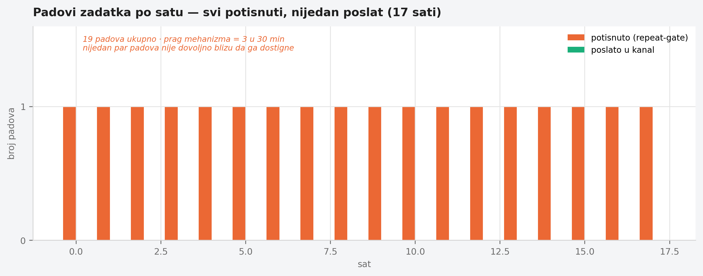

# Poglavlje 14 — Kad alarm ćuti: gating, dedup i "tihi gap"

Detektor dima u kuhinji je podešen da prepozna jednu vrstu opasnosti dobro:
naglu, gustu koncentraciju dima — nešto gori brzo, senzor to vidi za
sekunde. Taj isti detektor je, po svojoj prirodi, gotovo slep za sasvim
drugu vrstu opasnosti: polako curenje ugljen-monoksida koje raste iz sata u
sat, nikad ne pređe prag koji bi okinuo naglu reakciju, a ipak, posle
dovoljno vremena, jednako opasno. Detektor nije pokvaren — radi tačno kako
je projektovan. Problem je što je projektovan za jedan **oblik** opasnosti,
a opasnost koja ga je zaista pogodila imala je sasvim drugi oblik.

## 14.1 Pitanje na koje ovo poglavlje odgovara

Alarm koji je ispravno definisan, ispravno primenjen, i tehnički radi tačno
onako kako je specificiran — može, u praksi, da nikad ne stigne do čoveka.
Ovo poglavlje odgovara na pitanje kako se to dešava, i kroz dve stvarne
studije slučaja pokazuje da je ovo možda i najvažnija, a najređe pisana tema
u observability-ju: **ne kvar alarma, nego njegova tiha, ispravna neaktivnost
baš onda kad je najpotrebniji.**

## 14.2 Kako je to urađeno — praktičan pregled

### Prva studija slučaja: mehanizam projektovan za naleta, primenjen na curenje

Flota zakazanih batch zadataka ima mehanizam protiv spam-a — ako isti
zadatak počne da pada uzastopno, alarm se ne šalje na svaki pojedinačan pad,
nego tek kad broj padova pređe prag unutar kratkog vremenskog prozora
(tri pada u trideset minuta). Ideja iza ovoga je zdrava: nagli talas
grešaka (na primer, deset padova za minut zbog jednog lošeg deploy-a) ne
treba da preplavi kanal sa deset identičnih poruka.

Problem se pojavio kod zadatka koji je padao **jednom po pokretanju**, na
zakazanom rasporedu, otprilike jednom na sat. Taj obrazac nikad ne
zadovoljava prag "tri u trideset minuta" — ne zato što je greška retka, nego
zato što je **raspoređena**. Rezultat: mehanizam projektovan da spreči
preplavljivanje kanala je, primenjen na ovaj obrazac, postao trajno,
strukturno tih. Ne kašnjenje u alarmiranju — potpuno odsustvo alarmiranja,
zauvek, bez obzira koliko dana zaredom zadatak nastavio da pada.

Otkriveno je slučajno: neko je primetio da dashboard pokazuje neuspele
pokrete zadatka koji nikad nisu stigli kao poruka u kanalu. Istraga je
pokazala da je mehanizam za sprečavanje spam-a radio tačno kako je
specificiran — beležio je svaki pad, ispravno brojao, i ispravno odlučivao
da prag nije dostignut. Alarm je **postojao**, bio je **ispravno definisan**,
i **ipak** nikad nije stigao do čoveka.

Dublja lekcija iz istrage: pretpostavka "ako ne znamo kategoriju zadatka,
podrazumevano ga tretiraj kao da treba alarm" je bila dokumentovana kao
sigurnosna mreža — "nepoznato → podrazumevano šumno, ne tiho" (namerno
zapisano kao princip). Ali ta pretpostavka je pisana **pre** nego što je
mehanizam za sprečavanje spam-a uveden, i niko je nije ponovo pročitao posle
te promene. Posle uvođenja praga, "podrazumevano šumno" je prestalo da znači
"dobijamo obaveštenje" i počelo da znači "dobijamo obaveštenje samo ako
padne tri puta u trideset minuta" — potpuno drugo obećanje, pod istim
imenom.

### Druga studija slučaja: dva upozorenja koja se ne zbrajaju u grešku

Isti tip zadatka je, u odvojenom incidentu, bio prisilno gašen zbog
nedostatka memorije **devetnaest puta za sedamnaest sati** — otprilike
jednom na sat, opet raspoređeno, opet ispod praga mehanizma za sprečavanje
spam-a. Jedina poruka koja je stigla do kanala u tom periodu bila je
upozorenje o **potrošnji memorije** (ne o padu) — "60% zauzeća, pa 75%, pa
90%" — nivo ozbiljnosti **warning**, ne **error**.

Istraga je otkrila nešto suptilnije od proste tišine: **dva odvojena
upozorenja** su radila, oba ispravno, oba istovremeno — jedno je pratilo
zauzeće memorije i ispravno signaliziralo "opasno visoko"; drugo je pratilo
učestalost padova i ispravno signaliziralo "ovaj zadatak pada čudno često".
Nijedno pojedinačno nije bilo pogrešno. Ali nijedno od njih, niti oba
zajedno, nisu se **zbrojila** u jasnu poruku "ovaj zadatak se gasi zbog
nedostatka memorije, devetnaest puta, upravo sada" — poruku koja bi po svom
sadržaju jasno zaslužila nivo **error**, ne dva paralelna **warning**-a.
Čovek koji je čitao kanal je video dva upozorenja i pročitao ih kao "nešto
niskog prioriteta se dešava" — tačno pogrešan zaključak za ono što se zaista
dešavalo.

Dodatno je otkriveno da je nivo ozbiljnosti samog upozorenja o memoriji
zavisio od **slučajnosti trenutka merenja** — sistem uzima uzorak zauzeća na
svakih dvadesetak sekundi, a da li će taj uzorak pasti iznad ili ispod
kritičnog praga zavisi od toga gde tačno u vremenu uzorkovanje padne u
odnosu na trenutak prisilnog gašenja. Isti tip pada je, u zavisnosti od
trenutka uzorkovanja, mogao da proizvede ili "upozorenje" ili "kritično" —
ozbiljnost poruke je bila **kockanje na tajming uzorkovanja**, ne svojstvo
onoga što se zaista dogodilo.

### Šta je popravljeno

Popravka nije bila "spusti prag mehanizma za sprečavanje spam-a" — to bi
lečilo simptom (premalo poruka) bez lečenja uzroka (mehanizam ne razlikuje
oblik greške). Umesto toga, uveden je eksplicitan spisak **razloga pada**
koji **zaobilaze** mehanizam za sprečavanje spam-a u potpunosti — pad zbog
nedostatka memorije je jedan takav razlog, jer je determinističan i po
prirodi sklon ponavljanju, za razliku od, recimo, prolaznog mrežnog
zastoja, koji namerno **ostaje** pod mehanizmom, jer tu je privremena
tišina zaista ispravan odgovor. Neuspeh se i dalje **beleži** bez izuzetka
(brojač prozora ostaje tačan), samo se odluka o **slanju** menja za tu
kategoriju razloga.

Ovako izgleda prva studija slučaja izmerena — devetnaest padova raspoređenih
kroz sedamnaest sati, svaki sam za sebe ispod praga mehanizma za
sprečavanje spam-a, nijedan ikad poslat:

{: width="95%" }

## 14.3 Analitički deo — zašto ovo retko piše iko drugi

### Mehanizam za sprečavanje spam-a kodira pretpostavku o obliku greške

Vredi imenovati ono što obe studije slučaja zapravo pokazuju: svaki
mehanizam koji potiskuje ponovljene alarme implicitno pretpostavlja **kako**
greške dolaze — u naletima, retko, izolovano, ili raspoređeno. "Tri u
trideset minuta" je razuman prag za nalet grešaka od lošeg deploy-a. Isti
prag je, primenjen na posao koji radi jednom na sat i povremeno padne,
matematički nemoguć da ikad zadovolji — ne zato što je slabo podešen, nego
zato što meri pogrešnu osobinu za taj obrazac otkaza. Pre uvođenja bilo kog
mehanizma za potiskivanje ponavljanja, vredi eksplicitno pobrojati koji
postojeći signali **nikad** ne mogu zadovoljiti novi prag, ma koliko dugo
otkaz trajao — to je provera koja se ovde preskočila i koja bi obe studije
slučaja unapred otkrila.

### "Dva upozorenja" problem nije o pragovima — o agregaciji značenja

Druga studija slučaja pokazuje nešto što literatura o alarmiranju retko
imenuje direktno: sistem može imati **potpunu pokrivenost** (svaki relevantan
signal postoji i ispravno se okida) i **i dalje ne preneti tačnu sliku**
čoveku koji čita rezultat, jer nijedan pojedinačan signal ne nosi kontekst
koji bi objasnio da su druga dva signala **isti događaj**, gledan iz dva
ugla. Pokrivenost nije isto što i obaveštenost. Kad dva nezavisna, ispravna
upozorenja opisuju istu stvarnu situaciju, njihov zbir za čitaoca ne postaje
automatski "ozbiljnije" — ostaje "dva niskoprioritetna signala", osim ako
neko eksplicitno projektuje vezu između njih.

### Cena da se ništa od ovoga nije primetilo: kontrafaktički scenario

Vredi odigrati šta bi se dogodilo da mehanizam za sprečavanje spam-a nikad
nije preispitan. Zadatak koji pada jednom na sat bi nastavio da pada,
zauvek, bez ijedne poruke u kanalu — ne zato što niko ne bi mario, nego zato
što niko ne bi **znao**. Razlika između "tiho jer je sve u redu" i "tiho jer
mehanizam ne ume da vidi ovaj obrazac" je nevidljiva sa spoljašnje strane —
oba izgledaju identično: prazan kanal. Upravo je to razlog zašto je ovaj
gap pronađen slučajno, posmatranjem dashboard-a, ne alarmom koji bi
sam sebe prijavio.

Vratimo se na detektor dima s početka poglavlja. On nije neispravan — radi
tačno kako je kalibrisan. Problem nastaje kad neko pretpostavi da je jedna
kalibracija dovoljna za svaku vrstu opasnosti koju treba da uhvati. **Alarm
koji ćuti zato što mehanizam ispravno radi po pogrešnoj pretpostavci je
opasniji od alarma koji je jednostavno pokvaren — jer pokvaren alarm bar
izgleda sumnjivo, dok ispravan-ali-pogrešno-kalibrisan izgleda kao mir.**

## 14.4 Skupljena pravila iz ovog poglavlja

- Pre uvođenja bilo kog mehanizma za potiskivanje ponovljenih alarma,
  eksplicitno proveri koji postojeći, legitiman obrazac otkaza **nikad** ne
  može zadovoljiti novi prag, ma koliko dugo trajao.
- Razlikuj razloge otkaza po prirodi (determinističan i sklon ponavljanju
  naspram prolazan i samoizlečiv) i dozvoli prvoj kategoriji da zaobiđe
  mehanizam za potiskivanje ponavljanja u potpunosti.
- Nikad ne menjaj **da li se beleži** neuspeh da bi promenio **da li se
  šalje** poruka o njemu — brojač mora ostati tačan nezavisno od odluke o
  obaveštavanju, inače se sledeći neuspeh pogrešno protumači kao izolovan.
- Postavi pitanje da li dva ili više odvojenih, ispravnih upozorenja mogu
  opisivati **isti** stvaran događaj — ako mogu, dodaj eksplicitnu vezu koja
  to čitaocu kaže, umesto da se osloniš da će sam sabrati.
- Kad god uvedeš mehanizam koji nešto potiskuje, izmeri njegov efekat odmah
  posle uvođenja (koliko poruka je nestalo, i za koje porodice) — ne
  pretpostavljaj da je pad broja poruka isto što i "sistem je postao
  zdraviji".

## 14.5 Vežba za čitaoca

Pronađi u svom sistemu bilo koji mehanizam koji potiskuje ponovljene
alarme (dedup, rate-limit, prag broja ponavljanja). Zamisli grešku koja se
dešava tačno jednom po svakom zakazanom pokretanju, zauvek — da li bi taj
mehanizam ikad pustio poruku kroz sebe? Ako ne bi, to je tvoj kandidat za
"tihi gap" koji čeka da ga neko slučajno primeti na dashboard-u, umesto da
ga sistem sam prijavi.

---

### Izvori korišćeni u analitičkom delu

- [How to Implement Alert Routing — OneUptime](https://oneuptime.com/blog/post/2026-01-30-alert-routing/view)
- [Alerting best practices — Grafana documentation](https://grafana.com/docs/grafana/latest/alerting/guides/best-practices/)
- [Stop drowning in alerts: DevOps alert management strategies — Hyperping](https://hyperping.com/blog/devops-alert-management)
- [Mastering incident routing — incident.io](https://incident.io/blog/mastering-incident-routing-a-critical-component-in-incident-management)
