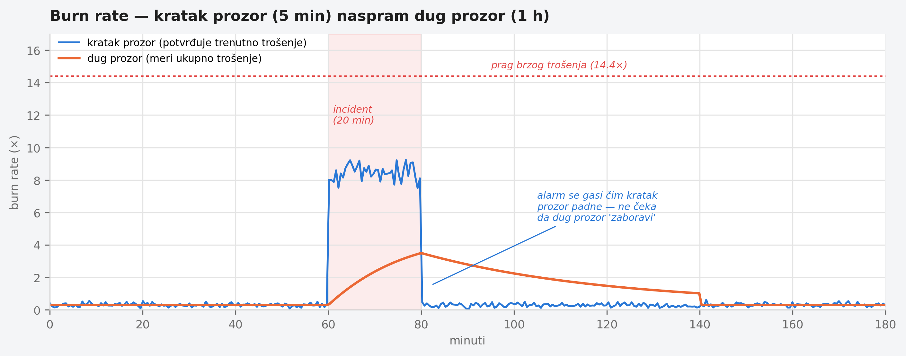
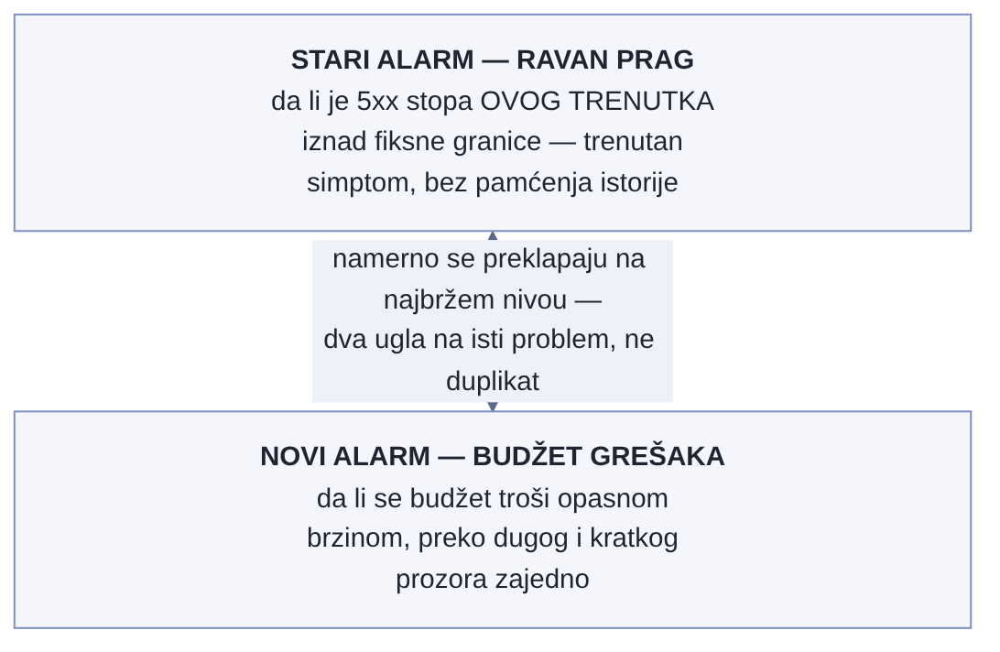

# Poglavlje 15 — SLO i alarmi zasnovani na budžetu grešaka

Merač goriva u automobilu ne razlikuje dva potpuno različita scenarija koji
oba izgledaju isto na tabli: gorivo koje curi kroz veliku rupu u rezervoaru i
prazni ceo tank za sat vremena, i gorivo koje se troši normalnom, sporom
brzinom i potraje nedelju dana. Oba scenarija u nekom trenutku pale isto
"malo goriva" svetlo. Ali hitnost reakcije je potpuno različita — jedno je
razlog da se odmah stane pored puta, drugo je razlog da se sutra svrati do
pumpe. Merač koji samo gleda **trenutni nivo** ne može tu razliku da vidi;
razliku vidi samo onaj ko posmatra **brzinu** kojom nivo pada.

## 15.1 Pitanje na koje ovo poglavlje odgovara

Prag zasnovan na trenutnoj vrednosti ("stopa grešaka je iznad 1%") ne
razlikuje naglo, ozbiljno pogoršanje od blagog, hroničnog curenja koje bi
za mesec dana potrošilo isti budžet grešaka. Ovo poglavlje odgovara na
pitanje kako se gradi alarm koji **razlikuje** ta dva scenarija — i, kroz
stvarnu studiju slučaja, pokazuje šta se dešava kad ulazni signal za taj
alarm sam po sebi nije ono što tvrdi da jeste.

## 15.2 Kako je to urađeno — praktičan pregled

### Multi-window burn-rate alarmi — osnovna mehanika

SLO (service-level objective) definiše koliki procenat zahteva sme da
"promaši" u definisanom periodu, a da usluga i dalje broji kao "dovoljno
dobra" — recimo, 99.9% dostupnosti mesečno znači budžet od 0.1% neuspešnih
zahteva. **Burn rate** je brzina kojom se taj budžet troši u odnosu na
normalnu, održivu brzinu: burn rate 1× znači "trošimo budžet tačno onom
brzinom koja bi ga potrošila do kraja perioda, ni brže ni sporije"; burn
rate 10× znači "trošimo ga deset puta brže — na ovoj brzini, budžet bi
nestao za desetinu perioda".

Implementacija koju knjiga prati koristi **tri nivoa** burn-rate alarma,
svaki sa **dva vremenska prozora** istovremeno — dug prozor koji meri da li
je budžet zaista značajno potrošen, i kratak prozor koji potvrđuje da se
trošenje **trenutno** dešava, ne da se dogodilo pa prestalo:

- **Brzo trošenje** (page, hitno): dug prozor 1 sat, kratak prozor 5 minuta,
  burn rate 14.4× — ozbiljan, tekući problem koji zaslužuje trenutnu pažnju.
- **Srednje trošenje** (page): dug prozor 6 sati, kratak prozor 30 minuta,
  burn rate 6×.
- **Sporo trošenje** (tiket, ne hitno): dug prozor 3 dana, kratak prozor 6
  sati, burn rate 1× — hronično curenje koje zaslužuje pažnju, ali ne budi
  nikoga usred noći.

Dva prozora rade zajedno namerno: sam dugi prozor bi, kad se problem reši,
nastavio da pokazuje povišen burn rate satima posle stvarnog oporavka (jer
prozor od 6 sati "pamti" grešku iz prethodnog sata), izazivajući alarm koji
kasni u gašenju baš koliko i u paljenju. Kratak prozor rešava to — alarm se
gasi čim kratak prozor pokaže da trošenje budžeta više nije aktivno, čak i
dok dugi prozor još uvek "pamti" ranije trošenje.

### Studija slučaja: kad SLI sam po sebi laže

Ovi alarmi su, u implementaciji koju knjiga prati, počeli da se okidaju
ponavljano — srednji i spor nivo, više puta u toku dana. Prva pretpostavka
bi bila da servis zaista degradira. **Servis je bio potpuno zdrav.**
Autoritativan signal (broj stvarnih neuspešnih odgovora izmeren na nivou
load balancer-a, van same aplikacije) pokazivao je svega **sedam** neuspešnih
zahteva za dvadeset četiri sata — praktično 100% dostupnost. Sam SLI (signal
na kome je alarm zasnovan), izveden iz histograma unutar aplikacije, tvrdio
je nešto sasvim drugo: preko milion "neuspešnih" zahteva na jednom endpoint-u,
i preko šesnaest miliona ukupnih zahteva na taj isti endpoint u istom
periodu — brzina saobraćaja koja je fizički nemoguća za taj broj instanci.

**Uzrok:** servis se horizontalno auto-skalira, dodaje i uklanja instance
tokom dana zbog rasporeda saobraćaja. Svaka instanca nosi sopstveni
identifikator u svojoj seriji histograma. Upit koji sabira "porast" preko
vremenskog prozora, primenjen preko **svih** serija odjednom, ekstrapolira
svaku pojedinačnu seriju do ivica prozora — a kad desetine kratkotrajnih
instanci nastaju i nestaju tokom dana, taj zbir ekstrapolacija **masivno
precenjuje** stvaran broj. Potpis greške je bio nedvosmislen u samim
podacima: broj grešaka po intervalu od pola sata je bio identičan, do
poslednje cifre, **dvanaest uzastopnih intervala zaredom** — stvaran
saobraćaj nikad ne proizvodi identičan broj dvanaest puta zaredom; to je
artefakt ekstrapolacije, ne merenje.

### Kako je reagovano — disciplina, ne refleks

Prva reakcija **nije** bila spustiti prag alarma da prestane da se oglašava
— to bi sakrilo simptom bez razumevanja uzroka i ostavilo pokvaren signal da
dalje živi neotkriven. Umesto toga: pravilo je **pauzirano** eksplicitno
(ostaje vidljivo u konfiguraciji kao pauzirano, ne obrisano, i ne
neprimećeno tiho), stvaran broj grešaka je potvrđen protiv nezavisnog,
autoritativnog izvora (load balancer, ne sopstveni histogram aplikacije), i
tek onda je odlučeno kako dalje: SLI treba **ponovo izgraditi** na signalu
koji je otporan na promenljivost broja instanci — bilo korišćenjem istog
autoritativnog spoljašnjeg brojača kao izvora, bilo agregiranjem histograma
po stabilnoj labeli pre računanja umesto po nestabilnom identifikatoru
instance.

Ovako izgleda mehanika dva prozora zajedno tokom kratkotrajnog incidenta —
kratak prozor skače odmah i pada odmah, dug prozor raste sporije i polako
se "vraća", što je razlog zašto se alarm gasi brzo posle stvarnog oporavka
umesto da satima kasni:

{: width="95%" }

### Zašto latencija namerno nije deo ovog SLI-ja

Vredi imenovati odluku koja se lako previdi jer je odsutna, ne prisutna:
SLO opisan iznad meri samo dostupnost (odnos uspešnih naspram svih zahteva),
namerno **ne** i latenciju, iako bi latencija na prvi pogled delovala kao
jednako prirodan kandidat za "da li je usluga dovoljno dobra". Razlog je
oblik saobraćaja same aplikacije: nekoliko njenih endpoint-a rade teške
izveštaje i izvoze podataka, čije p95 vreme odziva je **strukturno** visoko
— ne zato što je nešto pokvareno, nego zato što taj posao suštinski traje.
Da je latencija uključena u isti SLO uz dostupnost, budžet bi se trošio
svakog dana samo od normalnog, očekivanog rada tih endpoint-a, i alarm
zasnovan na budžetu bi neprestano javljao lažnu hitnost za ponašanje koje
nikad nije bilo namera da se popravi.

Ovo je ista vrsta odluke kao razdvajanje pragova za istu metriku viđeno u
Poglavlju 9 (sintetička proba naspram RUM-a) — samo primenjena jedan korak
ranije: tamo se ista metrika merila na dva mesta sa dva praga, ovde se jedna
dimenzija (latencija) **potpuno isključuje** iz merenja umesto da joj se
traži poseban prag. Kad neki deo sistema ima strukturno drugačiji profil od
ostatka (teški izveštaj naspram lakog API poziva), pitanje nije samo "kako
kalibrisati prag za ovo" nego, pre toga, "da li ova dimenzija uopšte pripada
ovom istom budžetu". Latencija tih endpoint-a i dalje ima sopstveno mesto za
posmatranje — samo ne u budžetu koji deli sudbinu sa dostupnošću cele
aplikacije.

### Dva alarma, namerno preklapajuća zona

Stariji, jednostavan alarm — ravan prag na trenutnoj stopi grešaka, bez
pamćenja budžeta niti drugog prozora — nastavlja da postoji uz novi,
budžetom-svesni alarm opisan u ovom poglavlju, iako se njihove zone
alarmiranja **preklapaju** na najbržem nivou hitnosti. Prvi nagon bi bio da
je preklapanje rasipanje — dva alarma za, izgleda, istu stvar. Implementacija
koju knjiga prati je zadržala oba namerno, jer odgovaraju na različita
pitanja: stari pita "da li je stopa grešaka OVOG TRENUTKA iznad granice
koju nikad ne treba preći", trenutan simptom bez ikakvog konteksta o budžetu;
novi pita "da li se budžet troši brzinom koja bi ga, da potraje, ozbiljno
iscrpela pre kraja perioda", pitanje koje zahteva istoriju, ne samo trenutak.

Preklapanje na najbržem nivou nije duplikat nego dve nezavisne implementacije
koje gledaju istu vrstu ozbiljnog otkaza iz dva ugla — ista logika koja u
Poglavlju 13 opravdava zašto se dva strukturno različita puta za alarme ne
stapaju u jedan mehanizam, samo primenjena unutar **jednog** domena umesto
između dva. Da je stari alarm ugašen čim je novi uveden, radi urednosti,
sistem bi izgubio jednostavnost i nezavisnost prvog signala — onog koji ne
zavisi od ispravnosti budžetske matematike da bi javio da nešto gori upravo
sad.

{: width="80%" }

## 15.3 Analitički deo — zašto multi-window nije proizvoljna komplikacija

### Zvanična preporuka: zašto jedan prag nikad nije dovoljan

Zvanična SRE praksa eksplicitno objašnjava zašto jednostavan prag na jednom
prozoru ne može istovremeno postići dobru preciznost, dobar recall, brzo
otkrivanje **i** brzo gašenje alarma. Prozor od jednog sata otkriva ozbiljan
ispad brzo, ali nastavlja da se oglašava sat vremena posle stvarnog
oporavka — što zbunjuje i troši poverenje u alarm. Rešenje nije jedan
"pravi" prozor, nego **par** prozora po nivou hitnosti, sa kratkim prozorom
čija je preporučena dužina otprilike jedna dvanaestina dugog — dovoljno kratak
da potvrdi da je trošenje budžeta **trenutno** aktivno, dovoljno dugačak da
ne reaguje na šum od par sekundi.

### Implementacija prati recept, sa jednim specifičnim dodatkom

Tri nivoa (brzo/srednje/sporo) i njihovi pragovi prate zvaničan obrazac
gotovo bukvalno — ovo je, slično Poglavlju 10, slučaj gde nema potrebe za
izmišljenom pričom o odstupanju. Ono što recept retko eksplicitno pokriva je
**pitanje pouzdanosti samog SLI-ja** — recept pretpostavlja da je brojanje
uspeh/neuspeh signala pouzdano, i fokusira se na to kako reagovati na
promenu tog broja. Implementacija koju knjiga prati je, kroz sopstveno
iskustvo, dodala korak koji recept ne razrađuje: **pre nego što se veruje
ijednom pragu, proveri da li apsolutne brojke iza odnosa uopšte imaju
smisla** — šesnaest miliona zahteva na jedan endpoint za dan je brojka koju
bi bilo ko sa poznavanjem kapaciteta sistema prepoznao kao nemoguću, da je
neko pogledao pre nego što je poverovao izvedenom procentu.

### Cena da je prva reakcija bila spuštanje praga: kontrafaktički scenario

Vredi konkretno odigrati alternativu. Da je tim, umesto pauziranja pravila i
istrage uzroka, jednostavno podigao prag da alarm prestane da se oglašava
(recimo, udvostručio granicu burn rate-a), rezultat bi izgledao kao rešen
problem — kanal bi utihnuo. Ali stvaran, pokvaren SLI bi ostao netaknut, i
sistem bi izgubio sposobnost da otkrije **pravu** degradaciju istog
servisa, jer bi prag sada bio podešen da toleriše lažni šum umesto da meri
stvarno stanje. Ovo je isti obrazac viđen već u Poglavlju 11 kod redukcije
kardinalnosti primenjene na pogrešno mesto: mera koja izgleda kao rešenje,
a zapravo uklanja sposobnost da se problem uopšte primeti kad se sledeći put
zaista dogodi.

Vratimo se na merač goriva s početka poglavlja. Svetlo "malo goriva" samo po
sebi ne govori ništa o hitnosti — potrebno je znati **brzinu** pada da bi se
znalo da li stati odmah ili sutra svratiti do pumpe. Ali čak i najbolji
merač brzine pada je beskoristan ako je sam senzor nivoa goriva neispravan i
javlja nemoguće brojke. **Burn-rate alarm rešava pitanje hitnosti — ali
rešava ga tek pošto je neko proverio da signal koji se meri zaista meri ono
što tvrdi da meri.**

## 15.4 Skupljena pravila iz ovog poglavlja

- Koristi multi-window burn-rate alarme umesto jednog praga na jednom
  prozoru — par dugog i kratkog prozora rešava i brzo otkrivanje i brzo
  gašenje, što nijedan pojedinačan prozor ne može sam.
- Postavi kratak prozor na otprilike jednu dvanaestinu dugog — dovoljno
  kratak da potvrdi trenutno trošenje budžeta, dovoljno dugačak da ne
  reaguje na šum.
- Pre nego što poveruješ izvedenom procentu ili odnosu, proveri apsolutne
  brojke iza njega protiv nezavisnog, autoritativnog izvora — odnos može
  izgledati verovatno dok su oba njegova člana besmislena.
- Kad alarm počne da se oglašava neočekivano često, prva reakcija nije
  spuštanje osetljivosti — prva reakcija je provera da li signal na kome je
  alarm zasnovan zaista meri ono što tvrdi da meri.
- Izbegavaj rate/increase upite preko labela sa visokim obrtom (identifikator
  instance koja se stalno menja) u SLI-ju — agregiraj ih na stabilnu labelu
  pre računanja ili koristi recording rule otporan na taj obrt.
- Pre dodavanja dimenzije (latencija, propusnost) u postojeći SLO, proveri
  da li ta dimenzija ima strukturno drugačiji profil od ostatka sistema —
  ako da, možda joj mesto uopšte nije u istom budžetu, ne samo u drugom
  pragu.
- Ne gasi jednostavan, stariji alarm samo zato što novi, sofisticiraniji
  pokriva istu zonu — preklapanje na najkritičnijem nivou je nezavisnost,
  ne rasipanje, sve dok svaki alarm odgovara na drugo pitanje.

## 15.5 Vežba za čitaoca

Pronađi SLO alarm u svom sistemu i proveri: da li ima samo jedan prozor, ili
par (dug + kratak)? Zatim uzmi apsolutne brojke iza njegovog trenutnog
odnosa (brojilac i imenilac, ne sam procenat) i uporedi ih sa nezavisnim
izvorom ako postoji. Da li se slažu? Ako nemaš nezavisan izvor za poređenje
— to je praznina koju ovo poglavlje traži da primetiš pre nego što ti
alarm jednog dana kaže nešto što nije istina.

---

### Izvori korišćeni u analitičkom delu

- [Alerting on SLOs — Google SRE Workbook](https://sre.google/workbook/alerting-on-slos/)
- [How to Build Burn Rate Alerts — OneUptime](https://oneuptime.com/blog/post/2026-01-30-sre-burn-rate-alerts/view)
- [How to implement multi-window, multi-burn-rate alerts with Grafana Cloud — Grafana Labs](https://grafana.com/blog/how-to-implement-multi-window-multi-burn-rate-alerts-with-grafana-cloud/)
- [The Multi-Window Multi-Burn-Rate Alert — Nova AI Ops Blog](https://novaaiops.com/blog/the-multi-window-multi-burn-rate-alert)
