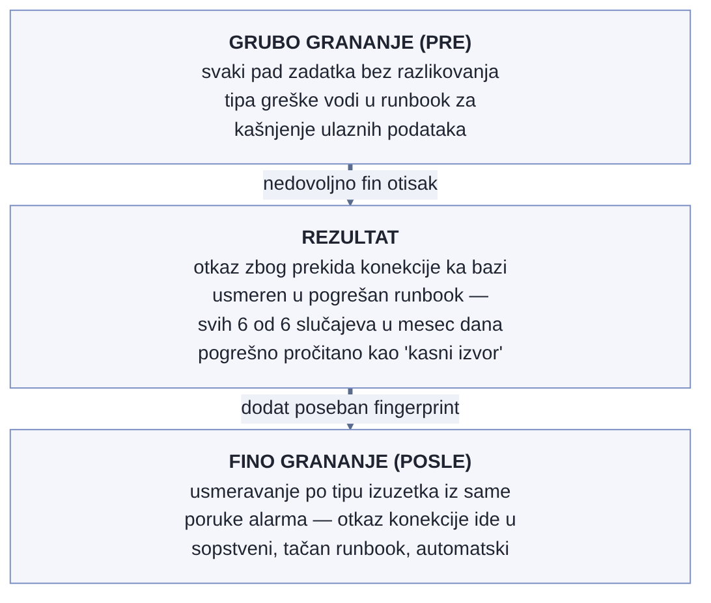

# Chapter 16 — Runbooks: from alert to resolution

A firefighter who arrives at the scene of a fire doesn't open a manual and
read from page one. On the helmet or in the truck they carry a laminated
card, divided by fire type — a grease fire in a kitchen is put out
differently from a fire in an electrical installation, and that difference
has to be recognized **within seconds**, not after minutes of reading. The
card doesn't explain why water must never touch an oil fire — that's learned
in training, in advance. The card exists to confirm, fast, that the
firefighter is in the right place, with the right plan, before they even
pick up the hose.

## 16.1 The question this chapter answers

An alert that arrives at three in the morning carries severity and basic
context, but it rarely carries the whole path to a resolution. This chapter
answers the question of what a document looks like that **shortens** the
path from "the alert has arrived" to "the problem is resolved, or at least
contained" — and, just as importantly, how such a document differs from the
two other types of documentation it's easily confused with.

## 16.2 How it's done — a practical overview

### The anatomy of a good runbook

A runbook, in the implementation this book follows, always opens with two
elements, in exactly this order:

- **A "when you land here" signature** — a precise description of the
  symptom or alert that brought the reader to this page, so that the first
  sentence confirms or denies that the reader is in the right place, before
  they read anything further.
- **An "at a glance" box** — a summary that lets the on-call engineer
  confirm orientation within ten seconds: which signal this is, which
  domain it affects, how severe it is, and what the first action is.

Only after that comes **branching by symptom "fingerprint"** — a concrete
decision tree that distinguishes between causes that look similar but are
fundamentally different, behind the same alert. The same alert ("job
failed") can have entirely different runbooks depending on whether the
cause is out-of-memory, a network problem at startup, or an error in the
application itself — the branching exists precisely so the on-call
engineer can quickly recognize **which** of those runbooks they're reading,
not so they read through all of them in order.

Runbooks are organized by system domain — databases, the network layer, the
server fleet, the auth layer, the batch/ETL fleet — each with its own
index. The file naming convention itself carries information (domain, then
symptom), so it's possible to find the right document even before opening
it, from the title alone in the index.

### Three different documents, three different directions in time

It's worth explicitly separating three types of document that easily look
alike, but do entirely different jobs:

- **A runbook is forward-facing.** "When X trips again, do Y." It's written
  **before** the next incident happens, for whoever will read it under
  pressure, for the first time, at the moment it occurs.
- **A postmortem is backward-facing.** "What broke once, why, and what we
  changed so it doesn't happen again." It's written **after** an incident,
  and its focus is understanding and a systemic fix, not putting out the
  fire in the moment.
- **A handoff is a one-time handover.** A specific bug or finding that the
  team that investigated it cannot resolve on its own, addressed to exactly
  one owner, with a clear request and evidence. It isn't a reusable
  procedure like a runbook, nor a retrospective like a postmortem — it's an
  **ask** directed at someone else.

This three-way split isn't an administrative technicality — each of the
three documents answers a different question ("what do I do now" versus
"why did that happen" versus "who needs to fix this"), and mixing the
content of one into another undermines the very speed a runbook primarily
exists to enable. A good runbook often **arises from** a postmortem — an
incident reveals a failure pattern worth having a prepared procedure for in
advance, and that procedure becomes a runbook — but the runbook itself
afterward stands independently, with no need for the reader to first read
the postmortem that inspired it.

{: width="90%" }

### When the fingerprint isn't fine enough, the error doesn't go undetected — it goes to the wrong runbook

It's worth naming the risk that "branching by symptom fingerprint" carries
when the fingerprint is defined too coarsely: misrouting doesn't look like
an absence of help, it looks like **wrong, but convincing** help. The
scheduled-job fleet had, for a long time, only one entry runbook for every
crash caused by a code exception, which branched at the level of "is input
data missing" — fine enough for most cases, but not for a crash caused by a
database connection drop. Such a crash, lacking its own fingerprint,
consistently ended up in the runbook for delayed input data, where the
on-call engineer read it as "the source is late" — a wrong diagnosis that
**sounded** plausible, because the runbook for that was well-written and
convincing, just for the wrong cause. Measurement showed the scale: all
**six out of six** such crashes in the previous thirty days had been
routed into that wrong runbook.

The fix wasn't expanding the existing runbook with another branch inside
itself — it was adding a **new, narrow fingerprint** that recognizes
exactly the exception type characteristic of a connection drop (already
distinguishable from the missing-data exception in the alert message
itself) and automatically routes to its own, dedicated runbook. This is a
distinction worth naming: branching by symptom fingerprint doesn't just
protect against "text too long for the reader to have to filter through"
(the reason named earlier in the chapter) — it also protects against an
on-call engineer confidently carrying out the wrong procedure, believing
they're in the right place because nothing told them otherwise. A runbook
that doesn't exist is harmless — the reader knows there's no help. A
runbook that **exists, but for the wrong cause**, is more dangerous,
because it actively steers attention away from the real problem.

{: width="85%" }

### A runbook that deliberately doesn't offer the fastest shortcut

The runbook for recovering from a pile of same-kind failures (when one
critical alert reports that further failures of the same error class are
quietly being folded into it, instead of each sending its own message)
contains something unusual for a document whose goal is speed: the
**explicit absence** of an action for bulk-restarting all affected jobs at
once, even though such an action would obviously be the fastest shortcut
to recovering the whole group. The reason is a concrete, measured
incident: one such bulk operation, in practice, once injected fifty-six
failed runs into a single fifteen-minute window — the very tool meant for
fast recovery had itself become the source of the burst it was supposed to
prevent.

The runbook, after that, explicitly walks through restarting group members
**one at a time**, slower but safe, instead of offering the more
convenient option that looks appealing exactly at the moment of pressure
when the on-call engineer most wants to fix everything in one move. This
is worth naming as a principle for writing runbooks in general: a runbook
doesn't have to offer every technically possible shortcut — if a shortcut
has already been proven dangerous once, deliberately leaving it out is
information just as valuable as a step that **is** included, and it's
worth writing down along with the reason, not just silently omitted.

## 16.3 Analytical section — why runbook structure isn't a stylistic choice

### The received wisdom: orientation before instruction

Independent surveys of runbook-writing practice consistently state that a
good runbook opens with a clear description of the symptom and the
conditions that trigger it, before moving on to concrete steps — the same
two-part structure (signature + at-a-glance) applied here. The same
material explicitly separates the runbook from the **playbook** (a playbook
is more strategic, describing a broader approach; a runbook is tactical,
step by step) and from the postmortem (which is retrospective, not an
in-the-moment action during an incident) — confirming that separation by
direction in time, applied here through three distinct document types, is
not an arbitrary organizational decision but a recognized pattern.

### Where the implementation adds something specific: an explicit third type

Most external material distinguishes only two types of document (runbook
versus postmortem). The implementation this book follows added a third,
explicitly named type — handoff — because in practice it noticed a category
of work that belongs to neither of the other two: a finding that has been
investigated, but whose resolution requires ownership (code, access, a
decision) that the investigating team doesn't have. Stuffing such a finding
into a postmortem would turn it into a retrospective of something that
hasn't happened yet; stuffing it into a runbook would presuppose a
repeatable procedure exists, when in fact there's one specific,
unrepeated bug waiting for a single owner. Naming the third type let each
document stay focused on the job it was built for.

### The cost of mixing types: a counterfactual scenario

It's worth imagining what would happen if all three types were merged into
a single document per domain — "everything about the database in one
place." An on-call engineer at three in the morning, with an alert demanding
a fast decision, would have to scroll through historical context from past
incidents and open requests to other teams just to reach the steps they need
**right now**. A runbook exists precisely to remove that kind of burden from
the moment of pressure — the "at a glance" box and branching by symptom
fingerprint are pointless if the reader first has to find them inside a
document trying to be history and instructions and a ticket all at once.

Let's go back to the firefighter from the start of this chapter. The
laminated card on the helmet doesn't contain a report on the last fire, nor
a list of equipment to order from a supplier — it contains exactly what
needs to be decided in the first ten seconds. The report on the last fire
and the equipment order are equally important documents, but they live
**somewhere else**, available when their time comes, not at the moment the
hose needs to be picked up. **A runbook isn't the place for everything known
about a domain — it's the place for what needs to be known in the first ten
seconds, and nothing more.**

## 16.4 Rules collected from this chapter

- Open every runbook with a "when you land here" signature and an "at a
  glance" box — the on-call engineer must be able to confirm orientation
  within ten seconds.
- Branch by symptom fingerprint, not by the order in which things were
  written — the same alert with different causes deserves different
  branches, not one long linear text the reader has to filter themselves.
- Keep the three document types strictly separated by direction in time:
  runbook forward-facing, postmortem backward-facing, handoff as a one-time
  request directed at a single owner.
- Let a runbook arise from a postmortem, but have it stand independently
  afterward — a reader under pressure must not have to read the history
  first to reach the steps they need.
- Organize runbooks by domain with a naming convention that carries
  information on its own (domain + symptom), so the right document can be
  found from the index, before it's even opened.
- When you notice a symptom fingerprint is too coarse to cover several
  fundamentally different causes, don't add another branch inside the same
  runbook — add a new, narrow fingerprint and its own runbook; misdirected
  confidence is more dangerous than an open admission that no runbook
  exists.
- If a shortcut in a runbook has already been proven, once, to cause more
  harm than good, write down its deliberate omission and the reason —
  don't rely on a reader under pressure avoiding it on their own.

## 16.5 Exercise for the reader

Take any document in your system that you call a "runbook" and check the
first ten lines: do they confirm, within ten seconds of reading, that the
reader is in the right place and what to do first? If the first ten lines
instead contain historical context, an explanation of the architecture, or
an open request to another team — that isn't a runbook, it's something else
called a runbook, and it's worth splitting it apart before someone tries to
use it at three in the morning.

---

### Sources used in the analytical section

- [Runbook Example: A Best Practices Guide — Nobl9](https://www.nobl9.com/it-incident-management/runbook-example)
- [On-Call Runbook Best Practices (With Examples) — Incident Copilot](https://incop.ai/blog/on-call-runbook-best-practices)
- [How to create an incident response playbook — Atlassian](https://www.atlassian.com/incident-management/incident-response/how-to-create-an-incident-response-playbook)
- [On-Call Runbook Template: A Framework That Works at 3AM — OpenObserve](https://openobserve.ai/blog/on-call-runbook-template-sre/)
