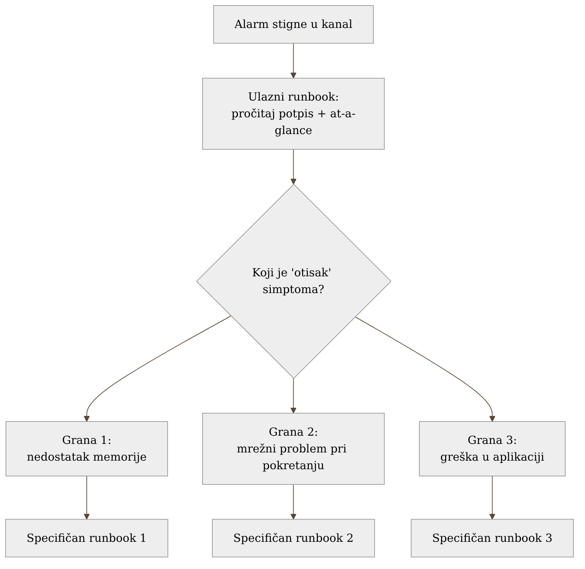

# Poglavlje 16 — Runbook-ovi: od alarma do rešenja

Vatrogasac koji stigne na mesto požara ne otvara priručnik i čita od prve
stranice. Na kacigi ili u vozilu drži laminiranu karticu, podeljenu po tipu
požara — masna vatra u kuhinji se gasi drugačije od požara na električnoj
instalaciji, a ta razlika mora biti prepoznata **za par sekundi**, ne posle
minuta čitanja. Kartica ne objašnjava zašto voda ne sme na uljani požar —
to se uči na obuci, unapred. Kartica postoji da potvrdi, brzo, da je
vatrogasac na pravom mestu, sa pravim planom, pre nego što uopšte podigne
crevo.

## 16.1 Pitanje na koje ovo poglavlje odgovara

Alarm koji stigne u tri ujutru nosi ozbiljnost i osnovni kontekst, ali retko
nosi ceo put do rešenja. Ovo poglavlje odgovara na pitanje kako izgleda
dokument koji **skraćuje** put od "alarm je stigao" do "problem je rešen ili
bar suzbijen" — i, podjednako važno, kako se takav dokument razlikuje od
druga dva tipa dokumentacije sa kojima se lako pobrka.

## 16.2 Kako je to urađeno — praktičan pregled

### Anatomija dobrog runbook-a

Runbook u implementaciji koju knjiga prati uvek počinje sa dva elementa, u
tačno tom redosledu:

- **Potpis "kada stigneš ovde"** — precizan opis simptoma ili alarma koji
  čitaoca dovodi na ovu stranicu, tako da prva rečenica potvrdi ili ospori
  da je čitalac na pravom mestu, pre nego što pročita bilo šta dalje.
- **"At a glance" okvir** — sažetak koji dežurnom inženjeru omogućava da za
  desetak sekundi potvrdi orijentaciju: koji signal je ovo, koji domen
  pogađa, koliko je ozbiljno, i koja je prva radnja.

Tek posle toga sledi **grananje po "otisku" simptoma** — konkretno drvo
odluka koje razlikuje slične, ali suštinski različite uzroke istog alarma.
Isti alarm ("zadatak nije uspeo") može imati sasvim različite runbook-e u
zavisnosti od toga da li je uzrok nedostatak memorije, mrežni problem pri
pokretanju, ili greška u samoj aplikaciji — grananje postoji upravo da bi
dežurni inženjer brzo prepoznao **koji** od tih runbook-a čita, ne da čita
sve redom.

Runbook-ovi su organizovani po domenu sistema — baze podataka, mrežni sloj,
serverska flota, auth sloj, batch/ETL flota — svaki sa svojim indeksom.
Konvencija imenovanja datoteke sama nosi informaciju (domen, zatim simptom),
tako da je moguće naći pravi dokument i pre nego što se otvori, samo iz
naslova u indeksu.

### Tri različita dokumenta, tri različita smera vremena

Vredi eksplicitno razdvojiti tri tipa dokumenta koji lako izgledaju slično,
a rade sasvim različit posao:

- **Runbook je unapred usmeren.** "Kad X sledeći put zaokine, uradi Y."
  Piše se **pre** nego što se sledeći incident dogodi, za onoga ko će ga
  tek pročitati u trenutku pritiska.
- **Postmortem je unazad usmeren.** "Šta se jednom pokvarilo, zašto, i šta
  smo promenili da se ne ponovi." Piše se **posle** incidenta, i njegov
  fokus je razumevanje i sistemska popravka, ne trenutno gašenje požara.
- **Handoff je jednokratna primopredaja.** Konkretan bag ili nalaz koji
  tim koji ga je istražio ne može sam da reši, upućen tačno jednom
  vlasniku, sa jasnim zahtevom i dokazima. Nije reusable procedura kao
  runbook, niti retrospektiva kao postmortem — to je **ask** upućen
  nekome drugom.

Ova trostruka podela nije administrativna sitnica — svaki od tri dokumenta
odgovara na drugo pitanje ("šta da radim sada" naspram "zašto se to
dogodilo" naspram "ko treba ovo da reši"), i mešanje sadržaja jednog u drugi
otežava upravo onu brzinu koju runbook prvenstveno postoji da omogući. Dobar
runbook često **nastaje iz** postmortema — incident otkrije obrazac otkaza
koji vredi imati unapred pripremljenu proceduru za, i ta procedura postaje
runbook — ali sam runbook posle toga stoji nezavisno, bez potrebe da čitalac
prvo pročita postmortem koji ga je inspirisao.

{: width="90%" }

## 16.3 Analitički deo — zašto struktura runbook-a nije stilski izbor

### Zvanična preporuka: orijentacija pre instrukcije

Nezavisan pregled prakse pisanja runbook-a dosledno navodi da dobar runbook
otvara jasnim opisom simptoma i uslova koji ga aktiviraju, pre nego što
pređe na konkretne korake — ista dvodelna struktura (potpis + at-a-glance)
primenjena ovde. Isti materijal eksplicitno razdvaja runbook od **playbook-a**
(playbook je stratešiji, opisuje širi pristup; runbook je taktički, korak po
korak) i od postmortema (koji je retrospektivan, ne akcion u trenutku
incidenta) — potvrđujući da razdvajanje po smeru vremena, primenjeno ovde
kroz tri odvojena tipa dokumenta, nije proizvoljna organizaciona odluka nego
prepoznat obrazac.

### Gde implementacija dodaje nešto specifično: eksplicitan treći tip

Većina spoljašnjeg materijala razlikuje samo dva tipa dokumenta (runbook
naspram postmortem). Implementacija koju knjiga prati je dodala treći,
eksplicitno imenovan tip — handoff — jer je u praksi primetila da postoji
kategorija rada koja ne pripada ni jednom od druga dva: nalaz koji je
istražen, ali čije rešenje zahteva vlasništvo (kod, pristup, odluku) koje
istraživački tim nema. Trpanje takvog nalaza u postmortem bi ga učinilo
retrospektivom nečega što se još nije desilo; trpanje u runbook bi
pretpostavilo da postoji ponovljiva procedura, dok zapravo postoji jedan
konkretan, neponovljen bag koji čeka jednog vlasnika. Imenovanje trećeg tipa
je omogućilo da svaki dokument ostane fokusiran na posao za koji je
napravljen.

### Cena mešanja tipova: kontrafaktički scenario

Vredi zamisliti šta bi se dogodilo da su sva tri tipa spojena u jedan
dokument po domenu — "sve o bazi podataka na jednom mestu". Dežurni
inženjer u tri ujutru, sa alarmom koji zahteva brzu odluku, morao bi da
skroluje kroz istorijski kontekst prošlih incidenata i otvorene zahteve ka
drugim timovima da bi stigao do koraka koji mu trebaju **sada**. Runbook
postoji upravo da tu vrstu tereta ukloni sa trenutka pritiska — "at a
glance" okvir i grananje po otisku simptoma su besmisleni ako ih čitalac
prvo mora da pronađe unutar dokumenta koji pokušava da bude i istorija i
uputstvo i tiket odjednom.

Vratimo se na vatrogasca s početka poglavlja. Laminirana kartica na kacigi
ne sadrži izveštaj o prošlom požaru niti listu opreme koju treba naručiti od
dobavljača — sadrži tačno ono što treba da se odluči u prvih deset sekundi.
Izveštaj o prošlom požaru i porudžbina opreme su podjednako važni dokumenti,
ali žive **negde drugde**, dostupni kad za njih dođe vreme, ne u trenutku
kad crevo treba da bude podignuto. **Runbook nije mesto za sve što se zna o
jednom domenu — to je mesto za ono što treba da se zna u prvih deset
sekundi, i ništa više.**

## 16.4 Skupljena pravila iz ovog poglavlja

- Otvori svaki runbook potpisom "kada stigneš ovde" i "at a glance" okvirom
  — dežurni inženjer mora moći da potvrdi orijentaciju za desetak sekundi.
- Granaj po otisku simptoma, ne po redosledu pisanja — isti alarm sa
  različitim uzrocima zaslužuje različite grane, ne jedan dugačak linearan
  tekst koji čitalac mora sam da filtrira.
- Drži tri tipa dokumenta strogo odvojena po smeru vremena: runbook unapred,
  postmortem unazad, handoff kao jednokratan zahtev upućen jednom vlasniku.
- Dozvoli runbook-u da nastane iz postmortema, ali neka posle toga stoji
  nezavisno — čitalac u trenutku pritiska ne sme morati prvo da pročita
  istoriju da bi stigao do koraka koji su mu potrebni.
- Organizuj runbook-ove po domenu sa konvencijom imenovanja koja nosi
  informaciju samu po sebi (domen + simptom), tako da se pravi dokument
  nađe iz indeksa, pre nego što se uopšte otvori.

## 16.5 Vežba za čitaoca

Uzmi bilo koji dokument u svom sistemu koji zoveš "runbook" i proveri prvih
deset redova: da li potvrđuju, za deset sekundi čitanja, da je čitalac na
pravom mestu i šta treba da uradi prvo? Ako prvih deset redova umesto toga
sadrže istorijski kontekst, objašnjenje arhitekture ili otvoren zahtev ka
drugom timu — to nije runbook, to je nešto drugo nazvano runbook-om, i vredi
ga razdvojiti pre nego što neko pokuša da ga koristi u tri ujutru.

---

### Izvori korišćeni u analitičkom delu

- [Runbook Example: A Best Practices Guide — Nobl9](https://www.nobl9.com/it-incident-management/runbook-example)
- [On-Call Runbook Best Practices (With Examples) — Incident Copilot](https://incop.ai/blog/on-call-runbook-best-practices)
- [How to create an incident response playbook — Atlassian](https://www.atlassian.com/incident-management/incident-response/how-to-create-an-incident-response-playbook)
- [On-Call Runbook Template: A Framework That Works at 3AM — OpenObserve](https://openobserve.ai/blog/on-call-runbook-template-sre/)
