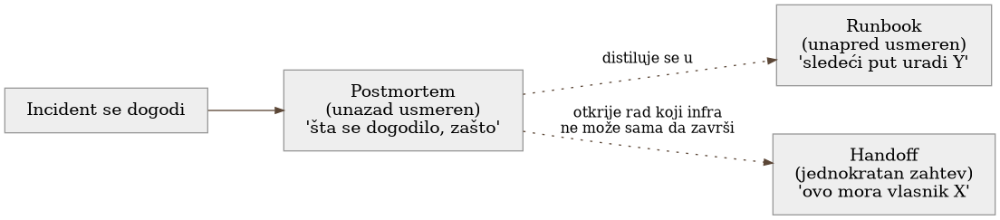

# Poglavlje 17 — Postmortem kultura

Komisija koja istražuje pomorsku nesreću ne piše izveštaj da bi utvrdila
čija je krivica. Piše ga da bi utvrdila **zašto** je sistem — brod, posada,
procedure, oprema — dozvolio da se nesreća dogodi, i šta tačno treba
promeniti da sledeći brod, sledeća posada, u sličnoj situaciji, ne završe
isto. Kapetan koji je te noći bio na komandnom mostu se imenuje u izveštaju
— ali imenuje se kao učesnik u lancu odluka, ne kao meta. Izveštaj koji bi
umesto toga tražio krivca bi naučio posadu jednu jedinu stvar: sledeći put,
ne prijavljuj grešku dok još ima vremena da se ispravi. Upravo to bi izveštaj
koji komisija piše trebalo da spreči.

## 17.1 Pitanje na koje ovo poglavlje odgovara

Nešto je isporučeno i onda se pokvarilo na način koji je nekoga koštao
vremena ili poverenja. Ko piše šta o tome, zašto, i kome je taj dokument
zapravo namenjen? Ovo poglavlje odgovara na to pitanje kroz konvenciju
korišćenu u implementaciji koju knjiga prati — i kroz obrazac koji se, kad
se pogleda ceo indeks napisanih postmortema, ponavlja iznenađujuće često:
**alarm koji nedostaje je češći uzrok bola nego pad sistema.**

## 17.2 Kako je to urađeno — praktičan pregled

### Bez-krivična konvencija

Postmortem u implementaciji koju knjiga prati počinje od jedne
pretpostavke, eksplicitno zapisane kao pravilo: svako uključeno u incident
je imao dobre namere i radio je najbolje što je mogao sa informacijom koju
je imao u tom trenutku. Cilj dokumenta je sistem i proces, ne osoba. Ova
pretpostavka nije kozmetička ljubaznost — ona je funkcionalni preduslov: tim
koji zna da će greška biti tražena i imenovana **sakriva** probleme umesto
da ih prijavljuje, a sakriven problem se ne rešava, samo čeka sledeći put
kad će koštati više.

### Kada se postmortem piše

Ne piše se za svaku grešku. Piše se kada je nešto **isporučeno** i onda se
pokvarilo na način koji je nekoga koštao vremena ili poverenja — korisnički
vidljiv zastoj, gubitak podataka, intervencija dežurnog van uobičajenog
toka (rollback, ručno preusmeravanje saobraćaja), ili period gde je
monitoring propustio nešto što je čovek morao ručno da otkrije. Greška
uhvaćena u code review-u ili lokalnom testu ne treba postmortem — ona nikad
nije stigla do stvarnog troška. Bilo koji učesnik sistema može zatražiti da
se postmortem napiše za bilo koji događaj, nezavisno od formalnih kriterijuma
— kriterijumi postoje da spreče "da li ovo zaslužuje dokument" debatu, ne da
ograniče ko sme da traži.

### Skimabilan rezime i indeksiranje

Svaki postmortem otvara okvirom koji se čita za deset sekundi: ozbiljnost,
šta je tačno pokvareno, domet uticaja, trenutni status. Detalji — vremenska
linija, uzrok, istraga, popravke, naučene lekcije — slede ispod, ali okvir
na vrhu sam po sebi mora biti dovoljan da neko ko samo skenira indeks zna da
li treba da otvori ceo dokument. Svaki postmortem se dodaje u centralni
indeks, sa datumom, kratkim opisom i statusom — ne zato što će ga neko čitati
odmah, nego zato što će ga neko **tražiti** meseci kasnije, kad se pojavi
sličan obrazac i neko posumnja "da li smo ovo već jednom videli".

### Obrazac koji indeks otkriva

Kad se pogleda ceo indeks napisanih postmortema u implementaciji koju
knjiga prati, ponavlja se jedan obrazac iznenađujuće često: incidenti gde
**ništa nije palo**, gde nije bilo prekida usluge niti gubitka podataka, a
ipak je postmortem opravdano napisan — jer je alarm koji je trebalo da
postoji, tiho, ispravno po sopstvenoj logici, nikad ne stigao do čoveka.
Jedan takav slučaj: istraga jednog propuštenog alarma je otkrila da je
mehanizam za praćenje pokrivenosti alarma bio ručno održavana lista koja se
nikad automatski nije poredila sa stvarnim stanjem flote — što je,
posmatrano unazad, otvorilo šest odvojenih, nezavisnih rupa u pokrivenosti
tokom sedam nedelja, nijedna primećena dok neko slučajno nije uočio
neslaganje na dashboard-u. Drugi, srodan slučaj, dogodio se dan kasnije, na
istom tipu zadatka, ali sasvim drugim mehanizmom: dva odvojena, ispravna
upozorenja niskog nivoa ozbiljnosti, koja se nikad nisu zbrojila u jasnu
sliku da se nešto ozbiljno ponavlja iznova. Nijedan od ova dva incidenta nije
srušio nijedan servis. Oba su bila, po sopstvenom priznanju napisanog
postmortema, ozbiljnija za poverenje u sistem nego neki pravi, kratkotrajni
ispad.

{: width="90%" }

### Krajnji slučaj obrasca: četiristo šezdeset devet dana tišine

Vredi imenovati jedan konkretan zapis iz indeksa kao krajnju tačku obrasca
opisanog iznad — ne zato što je tipičan, nego zato što pokazuje koliko
daleko "alarm koji nedostaje" može da ode pre nego što ga neko primeti.
Zakazan zadatak je otkazivao **svaki put kad je pokrenut, bez izuzetka, četiri
stotine šezdeset devet dana zaredom**. Alarm koji je trebalo da javi taj
otkaz nije nedostajao — bio je prisutan, uključen, i ispravno povezan.
Problem je bio u prirodi samog mehanizma obaveštavanja: sistem šalje poruku
na **promenu** stanja, ne dok stanje traje. Alarm je jednom, na sam dan kad
je otkazivanje počelo, prešao iz "u redu" u "alarmira" i tom prilikom poslao
tačno jedno obaveštenje. Pošto se stanje posle toga nikad nije vratilo u
"u redu" (zadatak nikad nije uspeo), nije bilo nove promene stanja koja bi
pokrenula drugu poruku — nijednu, sve to vreme.

Otkriveno je potpuno slučajno, ne pretragom niti dashboard-om: neko je
proveravao da li se stara verzija jednog alata bezbedno može ukloniti kao
"verovatno mrtav kod", i primetio da broj poziva tog zadatka uopšte nije
nula, iako bi trebalo da bude, prema pretpostavci da niko taj kod više ne
koristi. Postmortem napisan o ovom nalazu nije stao na "popravimo ovaj
jedan alarm" — pokrenuo je širi zamah: provera cele flote sličnih zadataka
otkrila je još pet koji otkazuju bez ijednog alarma uopšte, i da većina
zadataka u toj kategoriji nema nijedan mehanizam obaveštavanja koji bi
preživeo baš ovaj obrazac (traje-ali-se-ne-menja). Postmortem koji otkrije
jedan slučaj i pita "gde se još ovo krije" vredi mnogo više od onog koji
zatvori samo taj jedan, imenovan slučaj.

### Isti alarm, tri nepovezana uzroka — opasnost prvog objašnjenja koje se uklapa

Jedna porodica zadataka je za mesec dana pokrenula alarm **sedamdeset puta**,
svaki put istog oblika, svaki put na najvišem nivou ozbiljnosti, bez ijednog
mehanizma za spajanje ponovljenih poruka — sedamdeset zasebnih poziva u
kanal. Prva, sasvim razumna pretpostavka bila je da je reč o jednom uzroku
koji se ponavlja. Istraga koja bi stala na prvo objašnjenje koje se uklopi
u nekoliko primera bi lako promašila: kad je postmortem sistematski razložio
svih sedamdeset poziva umesto da uzorkuje par njih, pokazalo se da iza
identičnog oblika alarma stoje **tri** potpuno nepovezana uzroka — jedna
greška u obradi podataka koja pogađa oko devet od deset slučajeva, sasvim
druga, ređa klasa otkaza na nivou mrežne konekcije ka bazi, i jedan poziv
koji uopšte nije pripadao ovoj porodici zadataka nego susednoj, sa spoljne
platforme koja povlači stare zadatke iz pogona — slučajno poklapanje u
vremenu koje je gotovo navelo istragu na pogrešan trag.

Da je istraga stala posle prva dva ili tri pregledana slučaja, verovatno bi
zaključila da postoji jedan dominantan uzrok i predložila jednu popravku —
tehnički tačnu za većinu slučajeva, ali slepu za preostalu desetinu i za
potpuno pogrešno pripisan poziv koji nije ni pripadao ovoj porodici. Pouka
nije specifična za ovu porodicu zadataka: kad isti oblik alarma dolazi
dovoljno često da bude ozbiljan trošak, vredi razložiti **celu** populaciju
poziva, ne samo dovoljno njih da se prvo uverljivo objašnjenje potvrdi —
identičan spoljašnji oblik alarma ne garantuje ni jedan zajednički uzrok
iza njega, ni potpunu srodnost svih pojava.

{: width="85%" }

## 17.3 Analitički deo — zašto je "niko nije kriv" teže nego što zvuči

### Zvanična preporuka: blameless kao funkcionalni zahtev, ne ljubaznost

Zvanična SRE praksa formuliše ovo direktno: ne možeš "popraviti" ljude, ali
možeš popraviti sisteme i procese. Pristup je pozajmljen iz zdravstva i
avijacije, dve industrije gde je posledica skrivanja greške mnogo veća od
posledice priznavanja — i u obe, kultura koja traži krivca dosledno
proizvodi manje prijavljivanja, ne manje grešaka. Ista praksa navodi
konkretne okidače za pisanje postmortema (zastoj vidljiv korisnicima,
gubitak podataka, ručna intervencija dežurnog, vreme rešavanja iznad
definisane granice, kvar monitoringa koji je zahtevao ručno otkriće) —
gotovo identičan spisak korišćen ovde.

### Održavanje kulture je teže od pisanja jednog dobrog dokumenta

Materijal o održavanju prakse postmortema ističe da je najveći rizik
postepeno urušavanje discipline, ne pojedinačan loš postmortem — vidljivost
i priznanje od strane liderstva, centralizovan indeks koji omogućava
pretragu obrazaca kroz vreme, i redovna povratna informacija da li proces
opterećuje ili pomaže timu, sve su navedeni kao neophodni da praksa preživi
posle prvog entuzijazma. Ovo je razlog zašto indeksiranje ovde nije
sporedna administrativna sitnica — indeks je ono što omogućava da se
obrazac poput "alarm koji nedostaje" uopšte primeti kao **obrazac**, a ne
kao niz nepovezanih slučajeva.

### Cena kulture koja traži krivca: kontrafaktički scenario

Vredi konkretno odigrati alternativu. Da su oba incidenta o propuštenim
alarmima rezultirala pitanjem "ko je zaboravio da doda taj zadatak na
listu" umesto "zašto je lista uopšte ručno održavana", ishod bi verovatno
bio identičan popravljanju jedne konkretne rupe — ali sistemski mehanizam
(nedostatak automatske provere protiv stvarnog stanja flote) bi ostao
netaknut, čekajući sledeću ručnu grešku istog tipa. Gore od toga: sledeći
inženjer koji primeti sličnu rupu bi imao razlog da je tiho popravi sam,
bez prijave, da izbegne da bude sledeći imenovan — čime bi upravo obrazac
koji je ovaj postmortem otkrio (rupe koje se gomilaju nezapaženo) postao
**verovatniji**, ne manje verovatan.

Vratimo se na komisiju za pomorske nesreće s početka poglavlja. Njen
izveštaj imenuje kapetana, ali ga imenuje kao učesnika u lancu odluka koji
je doveo do nesreće — ne kao krivca čije je uklanjanje samo po sebi
rešenje. Sledeći brod ne postaje bezbedniji zato što je jedan kapetan
kažnjen; postaje bezbedniji zato što su procedure, oprema ili obuka
promenjeni na osnovu onoga što je izveštaj otkrio. **Postmortem koji traži
krivca rešava jedan incident. Postmortem koji traži sistem sprečava
sledeći.**

## 17.4 Skupljena pravila iz ovog poglavlja

- Piši postmortem kad je nešto isporučeno pa se pokvarilo na način koji je
  nekoga koštao vremena ili poverenja — ne za svaku grešku, ali za svaku
  koja je stigla do stvarnog troška.
- Drži rezime na vrhu skimabilnim za deset sekundi — ozbiljnost, šta je
  pokvareno, domet, status — jer većina čitalaca indeksa nikad neće otvoriti
  ceo dokument.
- Indeksiraj svaki postmortem centralno, sa pretraživim opisom — vrednost
  indeksa nije u trenutku pisanja, nego meseci kasnije, kad neko treba da
  proveri da li je sličan obrazac već viđen.
- Piši postmortem i za incidente gde ništa nije palo, ako je alarm koji je
  trebalo da postoji ostao tih — odsustvo signala je podjednako vredna tema
  koliko i pad sistema, često vrednija.
- Neguj bez-krivičnu kulturu aktivno, ne kao jednokratnu izjavu principa —
  vidljivost od strane liderstva, redovna provera da li proces opterećuje
  tim, i indeks koji stvarno neko koristi, sve su neophodni da praksa
  preživi posle prvog entuzijazma.
- Kad postmortem otkrije jedan slučaj propuštenog alarma, proširi istragu
  na celu srodnu flotu pre nego što proglasiš problem zatvorenim — jedan
  nalaz retko je jedina instanca.
- Kad isti oblik alarma dolazi dovoljno često da postane ozbiljan trošak,
  razloži celu populaciju poziva pre nego što prihvatiš prvo uverljivo
  objašnjenje — identičan oblik ne garantuje jedan zajednički uzrok.

## 17.5 Vežba za čitaoca

Pronađi poslednji incident u svom timu gde je nešto propušteno — ne pao
sistem, nego propušten signal, propušten alarm, propuštena provera. Da li
postoji pisani zapis o tome, pretraživ, sa jasnim opisom šta je sistemski
promenjeno da se to ne ponovi? Ako ne postoji, to je praznina koju ovo
poglavlje traži da zatvoriš — ne zato što je taj konkretan propust bio
poguban, nego zato što je sledeći put kad se ponovi mnogo skuplji ako niko
ne zna da se već jednom dogodio.

---

### Izvori korišćeni u analitičkom delu

- [Postmortem Culture: Learning from Failure — Google SRE Book](https://sre.google/sre-book/postmortem-culture/)
- [Postmortem Practices for Incident Management — Google SRE Workbook](https://sre.google/workbook/postmortem-culture/)
- [How to run a blameless postmortem — Atlassian](https://www.atlassian.com/incident-management/postmortem/blameless)
- [How to Run Effective Blameless Postmortems — Rootly](https://rootly.com/incident-postmortems/blameless)
