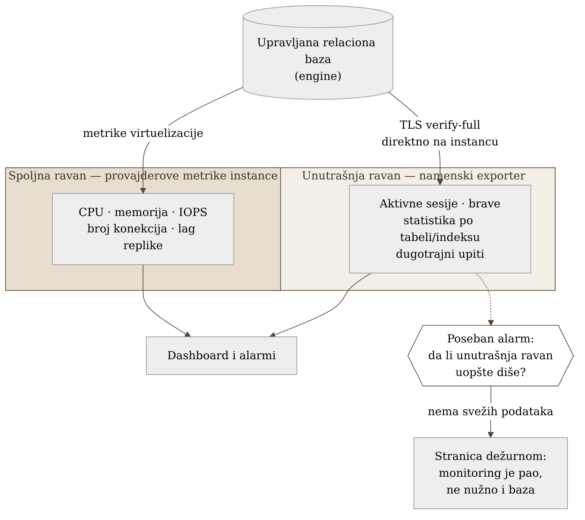
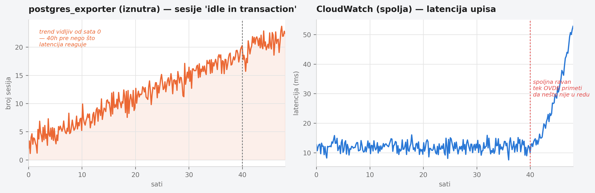

# Poglavlje 18 — Baze podataka (upravljane, tipa RDS/Aurora)

Kontrolna tabla u automobilu i dijagnostički port kod mehaničara pokazuju
dva različita automobila, iako gledaju u isti motor. Tabla ispred vozača
kaže brzinu, obrtaje, temperaturu rashladne tečnosti, nivo goriva — sve što
je potrebno da se vozi bezbedno, izmereno spolja, sa senzora koje je
proizvođač smatrao dovoljnim za vozača. Mehaničar koji prikopča
dijagnostički čitač vidi nešto sasvim drugo: kodove grešaka po pojedinačnom
cilindru, istoriju očitavanja senzora kiseonika, koliko puta se menjač
prebacio u zaštitni režim prošlog meseca. Ni jedan pogled ne laže. Ali
vozač koji gleda samo tablu nikad neće saznati da jedan cilindar
propaljuje neredovno već dve nedelje — jer ta informacija jednostavno nije
dizajnirana da stigne do table. A mehaničar koji gleda samo dijagnostiku
nikad neće znati da li se automobil u tom trenutku uopšte kreće. Upravljana
baza podataka se posmatra na potpuno isti način: spolja, kroz tablu koju
pruža provajder, i iznutra, kroz dijagnostiku koju pruža sam motor baze.

## 18.1 Pitanje na koje ovo poglavlje odgovara

Baza podataka je upravljana od strane provajdera — instanca se ne može
ulogovati SSH-om, disk se ne vidi direktno, proces se ne može profilisati
alatom sa hosta. Šta se onda uopšte može posmatrati, sa koliko poverenja, i
zašto jedan jedini pogled — bilo spoljni, bilo unutrašnji — sistematski
propušta polovinu problema koji se stvarno dešavaju?

## 18.2 Kako je to urađeno — praktičan pregled

### Dve ravni, nijedna nije podskup druge

Implementacija koju knjiga prati posmatra upravljanu relacionu bazu kroz
dve nezavisne ravni prikupljanja, namerno bez pokušaja da se jedna svede na
drugu:

- **Spoljna ravan** — metrike koje provajder izlaže na nivou instance i
  virtuelizacije: CPU, memorija, IOPS, latencija čitanja/pisanja, broj
  konekcija, slobodan prostor na disku, lag replike. Ovo je pogled "koliko
  je mašina zauzeta" — dovoljan da se primeti da nešto nije u redu, nikad
  dovoljan da se kaže **šta**.
- **Unutrašnja ravan** — exporter koji se konektuje direktno na sam
  bazu-motor i čita njegove interne sistemske tabele: aktivne sesije,
  brave, statistiku po tabeli i indeksu, replikacione slotove, dugotrajne
  upite. Ovo je pogled "šta baza zapravo radi" — vidi stvari koje spoljna
  ravan strukturno ne može da vidi, jer nikad ne postoje van samog
  procesa baze.

Ključna odluka, izneta eksplicitno u dokumentaciji implementacije: **nijedna
ravan nije nadskup druge.** Curenje konekcija se vidi u internoj ravni
(broj otvorenih sesija po korisniku, po stanju) mnogo pre nego što spoljna
ravan uopšte primeti porast latencije. Nasuprot tome, potpuni gubitak
mrežne dostupnosti do same instance vidi se **samo** spolja — jer u tom
trenutku exporter iznutra ne može ni da se konektuje da bi bilo šta
prijavio.

### Poseban i lako zaboravljen alarm: monitoring sam pao, ne baza

Implementacija eksplicitno razdvaja dve različite tvrdnje koje se lako
pomešaju: "baza ne radi" i "exporter koji prati bazu ne radi." Ako proces
koji skreje unutrašnju ravan padne, prestane, ili izgubi kredencijal — svi
dashboardi zasnovani na unutrašnjoj ravni odjednom postaju prazni. Bez
posebnog alarma, taj prazan dashboard izgleda identično kao "sve je
mirno" — što je opasnije od bilo koje stvarne alarme, jer se niko ne javlja
dok neko slučajno ne primeti da grafik nedelju dana nije pomerio ni jednu
tačku. Implementacija drži poseban, nezavisan alarm koji prati samo da li
unutrašnja ravan uopšte isporučuje sveže podatke, potpuno odvojen od bilo
kog praga zasnovanog na sadržaju tih podataka.

### TLS samo na instancu, nikad kroz posrednika

Konekcija koju unutrašnji exporter koristi za čitanje sistemskih tabela
ide isključivo na **endpoint pojedinačne instance**, sa punom TLS
verifikacijom sertifikata i imena hosta — nikad na klasterski/reader
endpoint za balansiranje opterećenja, i nikad kroz posrednika za pooling
konekcija. Razlog je strukturan, ne stvar ukusa: balansirajući endpoint
može u svakom trenutku preusmeriti konekciju na drugu fizičku instancu, a
posrednik za pooling po definiciji deli jednu pozadinsku konekciju između
više klijenata naizmenično. U oba slučaja, mapiranje "ova sesija u internoj
tabeli pripada ovoj konkretnoj instanci/klijentu" prestaje da važi — a to
mapiranje je tačno ono što unutrašnja ravan prikupljanja postoji da
obezbedi. Prikupljanje mora ići direktno na instancu da bi zadržalo smisao.

### Poluga na nivou baze, ne infrastrukture

Kada unutrašnja ravan otkrije sesije koje ostaju otvorene u stanju
"neaktivna u transakciji" duže od razumnog vremena — najčešći uzrok
polaganog curenja konekcija — postoji poluga koja ne zahteva promenu koda
aplikacije: vremensko ograničenje na nivou same baze koje prisilno prekida
takvu sesiju posle definisanog perioda mirovanja. Ovo je namerno
konfigurisano kao poslednja linija odbrane, ne kao prva — prva linija je i
dalje ispravljanje aplikacije koja ostavlja transakcije otvorene — ali
poluga postoji upravo zato što aplikacijski kod ne ispravlja uvek sve
pozivaoce na vreme.

{: width="90%" }

{: width="95%" }

## 18.3 Analitički deo — dve ravni kao poznat, ali retko imenovan obrazac

### Zvanična preporuka se slaže sa podelom, ali je ne imenuje eksplicitno

Provajderova sopstvena dokumentacija zaista razlikuje tri sloja: metrike na
nivou virtuelizacije (dostupne odmah, besplatne), agent na nivou
operativnog sistema instance (dublji uvid u procese, sa kašnjenjem
uzorkovanja), i sloj koji uzorkuje aktivno opterećenje baze i pripisuje ga
konkretnim upitima. Sva tri sloja i dalje posmatraju bazu **spolja** — ni
jedan ne čita direktno interne sistemske tabele samog baza-motora onako
kako to radi namenski exporter. Podela koju implementacija koristi —
"spolja" naspram "iznutra" — najbliže odgovara starijoj, opštijoj podeli iz
literature o pouzdanosti sistema: **crna kutija** (posmatranje ponašanja
spolja, bez pristupa unutrašnjem stanju) naspram **bela kutija**
(instrumentacija koja čita interno stanje sistema direktno). Provajderov
sloj koji uzorkuje opterećenje je bliži beloj kutiji od običnih metrika
instance, ali i dalje ne zamenjuje direktan uvid u sistemske tabele — brave,
bloat po indeksu, tačan tekst dugotrajnog upita u realnom vremenu ostaju
vidljivi samo namenskom exporteru.

### Gde standard menja zaključak: posrednik za pooling i mapiranje sesija

Zvanična dokumentacija posrednika za pooling konekcija potvrđuje tačno ono
što je implementacija pretpostavila bez čitanja te dokumentacije: pod
normalnim režimom rada, posrednik **pozajmljuje** pozadinsku konekciju po
transakciji i vraća je u zajednički bazen odmah posle — što znači da se
identifikator sesije u internim sistemskim tabelama deli i ponovo koristi
između mnogo različitih klijenata tokom vremena. Postoji i ugrađeni
bezbednosni ventil: kada se dogodi promena stanja sesije koja se ne može
bezbedno deliti (npr. privremene tabele, pripremljeni iskazi), posrednik se
**prikva** na fiksnu 1:1 konekciju za ostatak te sesije — vraćajući
mogućnost praćenja za tu jednu konekciju, ali po ceni gubitka efikasnosti
poolinga. Zvanično upozorenje je eksplicitno: široko rasprostranjeno
prikivanje "smanjuje efikasnost ponovne upotrebe konekcija" i preporučuje
se izbegavanje njegovih okidača u aplikativnom kodu, ne oslanjanje na
prikivanje kao normalno stanje. Praktična posledica, potvrđena i
implementacijom i zvaničnom dokumentacijom: praćenje na nivou sesije kroz
interne sistemske tabele je pouzdano samo za konekcije koje idu direktno na
instancu — tačno razlog zašto je odluka o zaobilaženju posrednika i
balansirajućeg endpointa strukturna nužnost, ne preterana opreznost.

### Alarm "monitoring je pao" kao poznat, ali ne i AWS-nativan obrazac

Alarm koji proverava da li interna ravan uopšte isporučuje sveže podatke,
nezavisno od sadržaja tih podataka, odgovara dobro poznatom obrascu u
svetu Prometheus/SRE alarmiranja — često nazvanom "mrtvačev prekidač": alarm
koji, za razliku od svih ostalih, okida tačno onda kada **prestane** da
prima otkucaje, hvatajući tihi pad same monitoring cevi (pad exportera,
gubitak scrape mete) koji bi inače ostao neprimećen kao lažna tišina.
Vredno je primetiti da ovaj obrazac nije nativno ugrađen u provajderovu
platformu za metrike instance — on je specifičan za Prometheus-stil
prikupljanja, gde je odsustvo podataka razlikovano od podatka "nula". To
znači da implementacija ovaj alarm mora sama izgraditi, van onoga što
provajder nudi po difoltu — što i jeste tačno ono što je urađeno.

### TLS verify-full kao zvanično preporučena, ne proizvoljna postavka

Zvanična preporuka za produkcione radne opterećenja koja rukuju osetljivim
podacima rangira nivoe verifikacije TLS konekcije eksplicitno: najniži
nivoi ne pružaju stvarnu zaštitu, srednji nivo proverava lanac sertifikata
ali ne i ime hosta, a najviši nivo — koji proverava i potpis sertifikata i
da se ime hosta poklapa sa serverom na koji se stvarno konektuje — opisan
je kao preporučen za svako produkciono opterećenje koje rukuje osetljivim
podacima. Implementacija koristi tačno taj najviši nivo, i to isključivo
protiv endpointa pojedinačne instance — dvostruko usklađeno sa preporukom,
jednom kroz nivo verifikacije, jednom kroz izbor endpointa.

### Kontrafaktički scenario: šta bi standardni pristup propustio

Zamislimo tim koji je pratio samo provajderove standardne metrike instance,
bez posebnog exportera i bez posebnog alarma za njegovu dostupnost —
udžbenički, "dovoljno dobro" pristup. Curenje konekcija bi se prvo
primetilo tek kada broj konekcija priđe granici i latencija počne
primetno da raste — što znači da bi se problem otkrio u trenutku kada je
već blizu ozbiljnog ispada, umesto sati ili dana ranije, dok je još bio
samo trend u broju "neaktivnih u transakciji" sesija. A da je exporter u
takvom postavljanju uopšte i postojao, ali bez posebnog alarma za njegovu
dostupnost, njegov pad bi izgledao potpuno identično kao "sve je u redu" —
dashboard prazan, bez ijedne alarme, dok bi neko ručno primetio da grafik
danima nije pomeren tek kada ga zatreba za dijagnozu potpuno drugog
problema.

Vratimo se na kontrolnu tablu i dijagnostički port s početka poglavlja.
Vozač koji vozi gledajući samo tablu ne vozi neoprezno — vozi sa tačno
onoliko informacije koliko mu je tabla dizajnirana da pruži, ni manje ni
više. Problem nastaje samo kad se zaboravi da tabla **nije** kompletna
slika motora, i kad se dijagnostički port priključi tek posle kvara, umesto
redovno, kao drugi, jednako legitiman izvor istine.

## 18.4 Skupljena pravila iz ovog poglavlja

- Prati upravljanu bazu kroz dve nezavisne ravni — spoljnu (provajderove
  metrike instance) i unutrašnju (exporter direktno na engine) — i ne
  pokušavaj da jednu svedeš na drugu; svaka vidi stvari koje druga
  strukturno ne može.
- Drži poseban, nezavisan alarm koji proverava samo da li unutrašnja ravan
  uopšte isporučuje sveže podatke — prazan dashboard bez ijedne alarme je
  opasniji od dashboarda punog alarmi, jer izgleda identično kao "sve je
  mirno."
- Konektuj unutrašnji exporter isključivo na endpoint pojedinačne instance,
  sa punom TLS verifikacijom imena hosta — nikad kroz balansirajući
  endpoint ili posrednik za pooling, jer oba brišu mapiranje sesije na
  instancu koje unutrašnja ravan postoji da obezbedi.
- Kad otkriješ sesije zaglavljene "neaktivne u transakciji," koristi
  vremensko ograničenje na nivou same baze kao poslednju liniju odbrane —
  ne kao zamenu za popravku aplikativnog koda koji ih ostavlja otvorene.
- Ne meri uspeh monitoringa time da li dashboard izgleda mirno — meri ga
  time da li znaš, sa sigurnošću, da li je taj mir stvaran ili je samo
  odsustvo podataka.

## 18.5 Vežba za čitaoca

Proveri da li tvoj tim ima poseban alarm koji prati isključivo dostupnost
samog mehanizma za prikupljanje metrika baze — nezavisno od bilo kog praga
zasnovanog na sadržaju tih metrika. Ako takav alarm ne postoji, zamisli
scenario u kom taj mehanizam prestane da radi u petak uveče: koliko dugo bi
prošlo pre nego što bi neko primetio da dashboard koji gledaju već danima
ne pokazuje ništa novo?

---

### Izvori korišćeni u analitičkom delu

- [Monitoring tools for Amazon Aurora — AWS Aurora User Guide](https://docs.aws.amazon.com/AmazonRDS/latest/AuroraUserGuide/MonitoringOverview.html)
- [Monitoring OS metrics with Enhanced Monitoring — AWS Aurora User Guide](https://docs.aws.amazon.com/AmazonRDS/latest/AuroraUserGuide/USER_Monitoring.OS.html)
- [Chapter 6: Monitoring Distributed Systems — Google SRE Book](https://sre.google/sre-book/monitoring-distributed-systems/)
- [Avoiding pinning an RDS Proxy — AWS RDS User Guide](https://docs.aws.amazon.com/AmazonRDS/latest/UserGuide/rds-proxy-pinning.html)
- [RDS Proxy concepts and terminology — AWS RDS User Guide](https://docs.aws.amazon.com/AmazonRDS/latest/UserGuide/rds-proxy.howitworks.html)
- [Securing Your Monitoring Stack with a Dead Man's Switch](https://seifrajhi.github.io/blog/securing-monitoring-stack-dead-man-switch/)
- [Enforcing TLS and managing certificate rotation for RDS and Aurora PostgreSQL — AWS Database Blog](https://aws.amazon.com/blogs/database/enforcing-tls-and-managing-certificate-rotation-for-rds-and-amazon-aurora-postgresql/)
