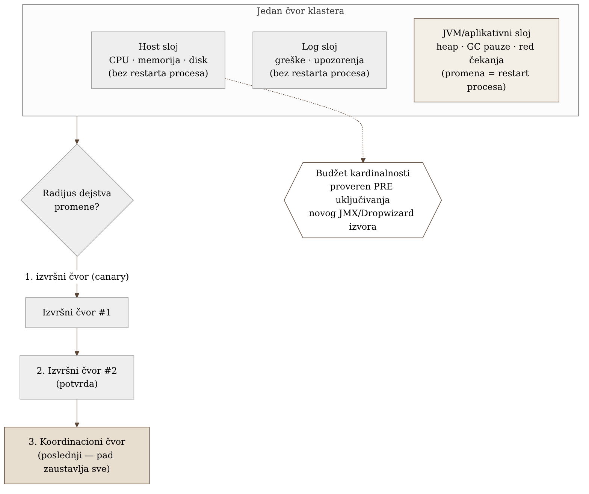
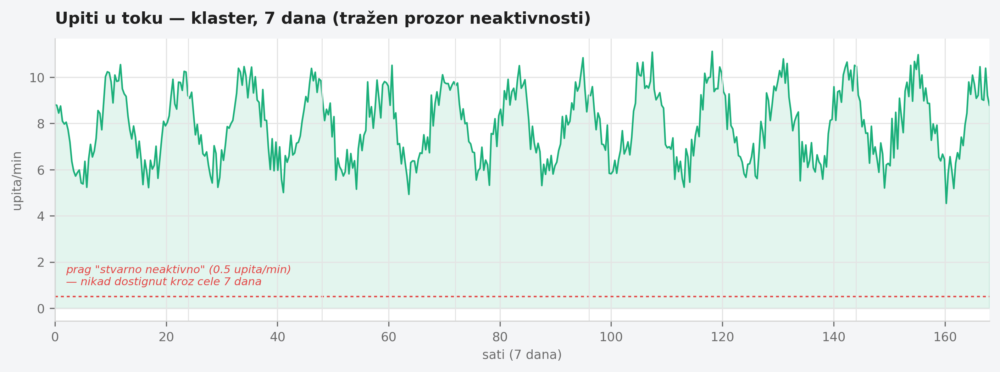

# Poglavlje 19 — Samostalno upravljani distribuirani sistemi (klaster tipa Dremio)

Orkestar ne zvuči dobro zato što svaki muzičar pojedinačno svira glasno.
Zvuči dobro zato što tri odvojene stvari rade zajedno: svaki instrument
mora biti naštiman i u ispravnom stanju (violina koja je raštimovana kvari
utisak bez obzira koliko dobro ostatak orkestra svira), notni zapis mora
biti tačno ono što se svira u tom trenutku (dirigent koji vodi po pogrešnoj
partituri neće to primetiti dok se muzika ne raspadne), i, na kraju,
publika mora stvarno čuti ono što je odsvirano — akustika sale, mikrofoni,
pojačala su treći, potpuno odvojen sloj koji može pokvariti savršen
nastup i pre nego što stigne do ušiju. Dirigent koji upravlja samo jednom
od te tri stvari upravlja pogrešnom trećinom orkestra. I kad menadžment
sale predloži da se orkestar raspusti u dane kad nema koncerta da bi se
uštedelo na platama — dirigent zna nešto što menadžment ne zna: orkestar
koji se svaki put iznova sastavlja nikad neće zvučati kao orkestar koji
svira zajedno već godinama. Ponekad je jeftinije držati ga sastavljenim,
manjim, nego rasformirati pa ponovo okupljati.

## 19.1 Pitanje na koje ovo poglavlje odgovara

Klaster koji tim sam instalira, konfiguriše i drži živim — bez provajdera
koji upravlja njime — traži nadzor na tri nivoa istovremeno, od kojih
svaki ima drugačiju cenu pada i drugačiju cenu restarta. Kako se ta tri
nivoa drže odvojenim a ipak čitaju zajedno, i zašto najočiglednija poluga
za uštedu — ugasi kad se ne koristi — ovde jednostavno ne radi?

## 19.2 Kako je to urađeno — praktičan pregled

### Trostruki signal po čvoru

Svaki čvor u klasteru koji implementacija prati nosi tri nezavisna sloja
posmatranja, sa različitom cenom ponovnog pokretanja ako signal iz tog
sloja pokaže problem:

- **Host sloj** — CPU, memorija, disk, mreža same mašine na kojoj čvor
  radi. Problem ovde (disk pun, memorija na ivici) ne zahteva restart
  procesa da bi se prijavio — vidljiv je spolja, nezavisno od toga da li
  je aplikacija uopšte živa.
- **Log sloj** — tekstualni izlaz iz procesa: greške, upozorenja, tragovi
  izuzetaka. Kao i host sloj, log se piše bez obzira na to da li je
  aplikacija u tom trenutku zdrava — proces koji se gasi zbog greške i
  dalje stigne da zapiše zašto, u poslednjoj sekundi života.
- **JVM i aplikativne metrike** — hip memorija, pauze za sakupljanje
  smeća, broj aktivnih upita, red čekanja. Ovaj sloj zahteva da agent za
  prikupljanje bude ugrađen u sam proces ili da proces eksportuje metrike
  aktivno — što znači da **promena** ovog sloja gotovo uvek zahteva
  restart procesa da bi se primenila, za razliku od prva dva sloja koja se
  mogu menjati bez dodirivanja aplikacije.

Ova razlika u ceni promene — dva sloja se mogu podesiti bez restarta,
treći gotovo nikad — direktno diktira redosled uvođenja bilo koje nove
provere ili praga: prvo host i log, tek onda, pažljivije, JVM/aplikativni
sloj.

### Redosled uvođenja promena po radijusu dejstva

Kada implementacija uvodi bilo koju promenu na klasteru — novu verziju,
novi prag alarma, novu konfiguraciju — redosled kojim se promena širi kroz
čvorove je namerno poređan po tome koliko štete pravi ako nešto pođe
naopako:

1. Jedan izvršni čvor, najmanjeg uticaja — ako nešto pukne, klaster
   nastavlja da radi sa preostalim kapacitetom.
2. Drugi izvršni čvor, potvrda da prvi rezultat nije bio slučajnost.
3. Koordinacioni čvor, poslednji — jer njegov pad utiče na ceo klaster
   odjednom, ne na jedan deo kapaciteta.

Ovaj redosled nije proizvoljan izbor — direktno odražava topologiju:
izvršni čvorovi su zamenjivi i njihov pojedinačni gubitak je apsorbovan,
koordinacioni čvor nije, i njegov gubitak zaustavlja sve.

### Merenje pre pretpostavke: da li automatsko gašenje uopšte radi ovde

Standardna poluga za uštedu troška na uvek-uključenim klasterima je
automatsko gašenje tokom perioda niske aktivnosti. Implementacija je ovo
**izmerila**, ne pretpostavila — i otkrila da klaster koji prati gotovo
nikad nema stvaran prozor neaktivnosti dovoljno dugačak da opravda
gašenje: čak i u satima najniže aktivnosti, dolazi dovoljno upita da bi
gašenje značilo ili odbijanje tih upita ili kašnjenje merano minutima dok
se klaster ponovo diže. Umesto gašenja, prava poluga koja se pokazala
delotvornom bila je **veličina** — smanjivanje broja i tipa čvorova na
osnovu izmerene stvarne potrošnje, ne na osnovu pretpostavljenog vršnog
opterećenja. Ovo je bitna razlika: posmatranje nije samo promenilo
dashboard, promenilo je **odluku** — sa "kada gasimo" na "koliko nam
stvarno treba upaljeno."

### Budžet kardinalnosti pre uključivanja novog izvora metrika

Pre nego što se bilo koji novi eksporter na nivou čvora ili JVM-a uključi,
implementacija prvo procenjuje koliko novih vremenskih serija taj izvor
donosi — jer pojedini standardni formati metrika (posebno oni izvedeni iz
JMX stabla atributa) mogu generisati porodice metrika sa histogramskim
kantama po niti, po konekciji, ili po upitu, koje bez pažnje eksplodiraju u
broju serija mnogo brže nego što izgleda iz same konfiguracije. Jedan
konkretan slučaj u implementaciji: uključivanje jednog naizgled bezazlenog
izvora metrika je za sebe udvostručilo ukupan broj aktivnih serija u
klasteru pre nego što je iko stigao da ga ograniči — otkriveno tek kad je
mesečni račun za metrike skočio, ne pre.

{: width="90%" }

{: width="95%" }

## 19.3 Analitički deo — zašto standardna poluga ovde ne radi

### FinOps standard poređa poluge, ali i sam upozorava na granice

Zvanična FinOps preporuka za kontrolu troška računarskih resursa poređa
standardne poluge u uobičajenom redosledu primene: prvo prilagođavanje
veličine na osnovu izmerene potrošnje (jer ne zahteva arhitekturnu
promenu), zatim automatsko skaliranje za opterećenja koja su stvarno
promenljiva i prate potražnju, tek onda vremenski zakazano gašenje — i to
eksplicitno opisano kao poluga za **razvojna i test okruženja van radnog
vremena**, ne za produkcione sisteme sa stalnim opterećenjem. Ovo se
tačno poklapa sa nalazom implementacije: gašenje kao standardna preporuka
i dalje postoji, ali je po sopstvenoj definiciji ograničeno na okruženja
koja nemaju obavezu da rade neprekidno — što ovaj klaster, po izmerenom
obrascu saobraćaja, jednostavno nije.

### Sam proizvođač potvrđuje: gašenje je za povremeno, ne za stalno opterećenje

Zvanična dokumentacija upravljane verzije istog sistema tretira automatsko
zaustavljanje kao prvoklasnu funkciju — ali **samo** za elastične resurse
konfigurisane sa minimalno nula stalno aktivnih instanci, i eksplicitno
preporučuje suprotno (najmanje jedna instanca uvek aktivna) da bi se
"garantovala niska latencija izvršavanja upita." Ovo je direktna, zvanična
potvrda da automatsko gašenje nije univerzalno dobra praksa — ono je izbor
koji zavisi od oblika opterećenja, i sam proizvođač sistema to kaže. Za
sistem samostalno upravljan, bez elastičnog sloja koji bi automatski
apsorbovao ponovno pokretanje, dokumentacija ide dalje: pokretanje i
gašenje čvorova je opisano kao strog, ručni, poređan postupak — bez
ugrađenog mehanizma za očuvanje stanja ili automatsko preraspoređivanje.
Samo postojanje tako strogog, ručnog redosleda je posredna, ali jasna
potvrda da je gašenje ovde tretirano kao operativno rizično, ne kao
rutinska ušteda.

### Standardni troslojni obrazac postoji, ali pod drugim imenom

Ne postoji jedan kanonski, imenovan "troslojni" standard u literaturi o
observability-ju — ali sam obrazac (host metrike → JVM/runtime metrike →
log/aplikativni signal, kao tri odvojene kategorije) redovno se pojavljuje
u vodičima za nadzor tačno ove klase sistema: distribuirani, JVM-zasnovani
klasteri sa koordinacionim i izvršnim ulogama. Ovo je uža i tačnija
paralela implementaciji nego opštija podela na "metrike, logove i
tragove" koja se često navodi kao standard observability-ja — ta podela je
zasnovana na **tipu podataka**, ne na **sloju sistema koji se posmatra**, i
ne mapira se direktno na razliku host/JVM/log koju implementacija koristi.

### Cardinality budžetiranje kao dokumentovan, konkretan rizik

Zvanična preporuka pre uvođenja novog eksportera je da se prvo stekne uvid
u postojeće serije i identifikuju "visoko-kardinalne, niskovredne" metrike
pre dodavanja novih izvora — sa konkretnim brojevima koji pokazuju da čak i
uobičajeni eksporteri po difoltu nose stotine do hiljadu serija, od kojih
nisu sve vredne cene. Ovo direktno potvrđuje nalaz implementacije: JMX/
Dropwizard stabla atributa mogu izložiti atribute po niti, po konekciji, ili
po identifikatoru upita, koji se pretvaraju u neograničenu kardinalnost
tačno onda kada se skrejpuju bez eksplicitne liste dozvoljenih metrika.

### Kontrafaktički scenario: šta bi udžbenički pristup uradio

Zamislimo tim koji je, bez merenja, primenio "standardnu" preporuku:
automatsko gašenje van radnog vremena, po analogiji sa razvojnim
okruženjima. Prvih nekoliko noći bi verovatno prošlo bez primetnog
problema — dovoljno tiho da se odluka proglasi uspešnom. Ali čim bi se
pojavio, makar i redak, upit u tom "mirnom" prozoru, korisnik bi čekao
minutima dok se klaster ponovo digne — a bez merenja koje je implementacija
stvarno sprovela, niko ne bi znao da li je takvih upita bilo dovoljno da
gašenje uopšte bude isplativo, ili je samo premestilo trošak sa računa za
infrastrukturu na trošak strpljenja korisnika koji čeka.

Vratimo se orkestru s početka poglavlja. Menadžment sale koji predlaže
raspuštanje orkestra između koncerata gleda samo na jednu liniju budžeta —
platu za dane bez nastupa. Dirigent koji odbija tu ideju ne brani
udobnost muzičara; brani nešto teže vidljivo na tabeli: orkestar koji se
svaki put iznova sastavlja gubi uigranost, i ta izgubljena uigranost ima
cenu koja se ne vidi dok se ne pojavi loš nastup. Prava ušteda nije bila u
raspuštanju — bila je u tome da orkestar bude tačno onoliko veliki koliko
mu stvarno treba, ni manje ni više, i da ostane sastavljen.

## 19.4 Skupljena pravila iz ovog poglavlja

- Prati samostalno upravljan klaster kroz tri nezavisna sloja — host, log,
  JVM/aplikativne metrike — i imaj na umu da promena trećeg sloja gotovo
  uvek zahteva restart procesa, dok prva dva ne.
- Uvodi promene po radijusu dejstva: zamenjivi izvršni čvorovi prvi,
  koordinacioni čvor poslednji — jer njegov pad zaustavlja ceo klaster,
  dok pad jednog izvršnog čvora apsorbuje preostali kapacitet.
- Ne pretpostavljaj da automatsko gašenje tokom neaktivnosti radi — izmeri
  da li stvaran prozor neaktivnosti uopšte postoji pre nego što uvedeš tu
  polugu, jer opterećenje bez pravih praznina čini gašenje skupljim od
  toga da ostane upaljeno.
- Kad prava neaktivnost ne postoji, poluga za trošak je veličina, ne
  raspored rada — smanji kapacitet na osnovu izmerene potrošnje umesto da
  ga uključuješ i isključuješ.
- Proceni koliko novih vremenskih serija donosi svaki novi izvor metrika
  pre nego što ga uključiš, posebno za JMX/Dropwizard porodice — one mogu
  udvostručiti ukupnu kardinalnost pre nego što iko stigne da to primeti.

## 19.5 Vežba za čitaoca

Pronađi jedan sistem u svom okruženju koji trenutno ima automatsko gašenje
ili skaliranje na nulu tokom perioda "niske aktivnosti," a čija je ta
odluka doneta bez stvarnog merenja prozora neaktivnosti. Izvuci sedmodnevni
grafik njegove aktivnosti i proveri: da li prozor neaktivnosti stvarno
postoji, dovoljno dugačak da opravda gašenje — ili je pretpostavka o
"mirnom periodu" samo pretpostavka?

---

### Izvori korišćeni u analitičkom delu

- [How to Optimize Cloud Usage — FinOps Foundation](https://www.finops.org/wg/how-to-optimize-cloud-usage/)
- [Manage Engines — Dremio Cloud Documentation](https://docs.dremio.com/dremio-cloud/admin/engines/)
- [Start, Stop, and Status — Dremio Software Documentation](https://docs.dremio.com/software/advanced-administration/start-stop/)
- [How to Manage High-Cardinality Metrics in Prometheus and Kubernetes — Grafana Labs](https://grafana.com/blog/how-to-manage-high-cardinality-metrics-in-prometheus-and-kubernetes/)
- [Monitoring Kafka with Datadog (host/JVM/application metric layering)](https://www.datadoghq.com/blog/monitor-kafka-with-datadog/)
