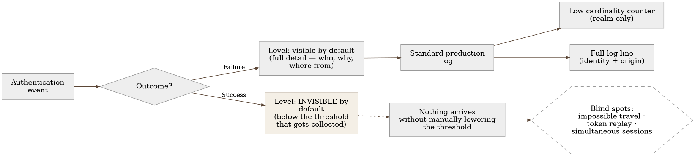
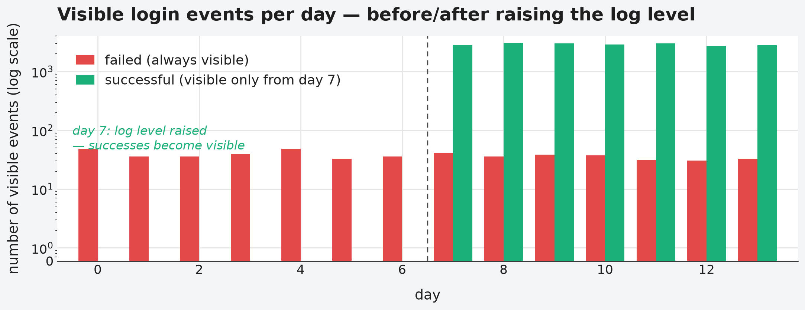

# Chapter 20 — Authentication and IAM (a Keycloak-type system)

Building security keeps a meticulous record of every failed attempt to get
in — a card that doesn't work, a wrong code at the door, a mistyped PIN, all
of it logged, with the time, the location, the name of the card that tried.
That record is thorough, searchable, and every failure is noticed
immediately. But that same front desk usually keeps a much thinner record of
**successful** entries — "card X passed through at 08:14" and nothing more,
no note of where that card had been earlier that day, whether the same card
had also "passed through" a different door ten minutes before, whether that
card had ever entered at this time of day before. If someone steals the card
and walks in with it normally, the guard will never notice it in the
record — not because the record is bad, but because it was designed to catch
**failure**, not to tell "success that looks normal" apart from "success
that looks suspicious." Half the security questions the front desk ought to
be able to answer — is this person really who they claim to be — can't be
answered until that exact asymmetry is fixed.

## 20.1 The question this chapter answers

An authentication and identity management system generates telemetry almost
exclusively about what didn't succeed. What happens when the questions a
team actually needs to answer are about successful logins — which of them
are suspicious, which arrive from impossible routes, which repeat too many
times at once — and the signal for that simply doesn't exist by default?

## 20.2 How it was done — a practical walkthrough

### An infrastructure constraint that has to be resolved before any signal

Before any telemetry can be collected at all, the system has to be running
in an optimized, production mode — and that mode carries a constraint the
implementation discovered through an actual failed rollout, not by reading
the documentation in advance: a certain class of configuration options has
to be fixed **at container image build time**, not later, through an
environment variable at startup. Trying to set such an option as an
environment variable at runtime doesn't produce a warning — it crashes the
container on start. The practical consequence: any option that affects
which events the system is even capable of emitting has to be baked into
the image ahead of time, which turns every change to the logging pattern
into a new build and redeploy, not a quick configuration change.

### Three signals directly, one through a sidecar

The authentication system itself is able to push three of the four
signals directly to the observability collector — traces and logs
through built-in, native telemetry-push support, with no agent and no
sidecar. Metrics are the exception: the system doesn't push them, it only
exposes them locally on its own port, in a format meant for pulling, not
pushing. Since the observability platform accepts only push, an
intermediary is needed — a dedicated sidecar within the same
infrastructure unit that periodically pulls that local source (every
thirty-ish seconds, infrequent enough for a long-lived service) and
pushes the result onward. This sidecar isn't a new pattern — it reuses
the same sidecar that already collects the infrastructure unit's own
metrics (CPU, memory, network) for the rest of the fleet, just with an
added module that knows how to pull from the local source.

The reuse wasn't without its trap: both replicas of the authentication
system expose metrics on an *identical* local address — without
additional intervention, the collector would derive an identical source
identity for both replicas, and their metrics would merge into a single
time series, hiding the difference between the two separate instances.
The fix was to explicitly override that derived identity with a value
that's actually unique per unit (the infrastructure unit's own
identifier), instead of relying on what the collector derives on its own
from the address it scanned — a small difference in how the data gets
merged (override instead of only adding if missing) that, without care,
silently erases half the data.

Traces have their own trap, related to cost, not correctness: the
default trace sampling rate is 100% — every request generates a trace.
For an authentication system, which is by nature a hot path with a high
request volume, this would generate a trace volume out of proportion to
its actual diagnostic value. The rate was dropped to just a few percent
from the very start, with a deliberate plan to raise it later if traces
turn out to be too sparse too often to be useful — the reverse order from
raising detail only once it's needed, because the default rate would
have been too expensive to ever ship to production.

{: width="90%" }

### An asymmetry discovered by reading the default logging levels

The implementation uncovered this chapter's central finding not through an
incident, but through a systematic review of the default logging levels
for every type of authentication event: **a failed login attempt is logged
by default at a level visible in the standard production log, with full
detail (user, failure reason, origin). A successful login is logged by
default at a level invisible under the standard configuration** — below
the threshold that normally gets collected. The consequence is direct: any
security question that requires comparing successful logins against one
another — "did this user just log in from two geographically distant
locations minutes apart," "is the same token arriving from two different
clients at the same time" — simply has no input data until this default
level is explicitly raised.

### Two different signal shapes for two different kinds of questions

The fix wasn't "raise everything to the highest level of detail" — that
would have produced a needless cardinality explosion, since most security
questions are aggregate, not individual. The implementation kept two
parallel signal shapes, each aimed at a different kind of question:

- **Deliberately low cardinality in metrics** — counters for successful
  and failed logins labeled only by realm (the logical grouping of
  users), with no individual user identity as a label. This answers
  questions like "did the rate of failed logins just spike" — aggregate,
  cheap, with no risk of cardinality growing with every new user.
- **Full detail in the log line** — every event, now including
  successful logins at the raised level, carries the user's identity,
  origin, and timestamp in the log text itself, searchable afterward.
  This answers questions like "what exactly were the last login attempts
  for this specific user" — forensic, on demand, not aggregate.

This split — a counter for "is something changing," a log line for "what
exactly happened to this specific identity" — is a deliberate
architectural decision, not a compromise: it solves two different
questions with two different data shapes, instead of forcing one shape to
answer both.

### Concrete security signals built on top of the raised level

Only once successful logins became visible in the standard log stream
could the implementation build concrete queries for account-takeover
patterns: counting how many distinct IP addresses a single user uses for
successful logins within a short time window (a cheap substitute signal
for impossible travel — more on why it's a substitute, not the full
technique, in the next section), detecting the same token used from two
different clients or IP addresses in an overlapping time period (a
possible replay), and detecting an unusually large number of
simultaneously active sessions for a single identity. None of these three
queries was possible before the asymmetry was fixed — not because the
query logic was complicated, but because the input data simply didn't
exist.

{: width="90%" }

{: width="95%" }

### Two different attacks look like the same symptom until split by username

There's another distinction worth naming within the same signal catalog:
the raw count of failed logins by itself doesn't distinguish between two
different attacks that call for different responses. **Password
brute-forcing** is many attempts against **one** username from one IP
address — Keycloak's own temporary account-lockout mechanism already
catches and stops this on its own, with no need for an extra alert.
**Credential stuffing** is the opposite pattern: one IP address trying
many **different** usernames, each with just a couple of attempts — few
enough per account that no individual lockout ever fires, while the
aggregate pattern at the IP-address level stays clearly visible. The
per-account mechanism is structurally blind to this second form: it
counts attempts per user, not per source, so an attack spread across a
thousand accounts looks like a thousand perfectly normal, isolated typos.

Telling the two apart requires a query that groups by IP address and
counts **distinct** usernames within the window, not just the total
number of failures — the signal described earlier in this chapter as
"brute-forcing or something more subtle" now has a concrete test that
tells the two apart. A baseline worth recording: the normal failed-login
rate in this system is 2-5%; anything above 15-20% deserves
investigation, regardless of which of the two patterns it points to.

The last signal in the same catalog looks after a successful breach, not
before it: administrative and audit events — a password change, a role
grant, regenerating a client secret — are what an attacker does **after**
already taking over an account, not an attempt to get in. An alert on an
unusual spike in these events catches the **consequence** of a successful
takeover, not the attempt itself, and it's valuable as a last line of
defense precisely because it doesn't depend on any earlier signal having
noticed anything suspicious at all.

### Raising the level is actually two independent switches, not one

The asymmetry fix described above sounds like one change — "raise the
visibility level of successful logins." In the implementation it's
actually **two independent switches**, and both have to be set correctly
for a successful login to reach the observability platform at all. The
first is the level the authentication-events module itself uses when it
records a successful login — lower by default than the level that gets
forwarded at all. The second, completely separate switch is the
threshold on the output path that decides which level of record the
system forwards to the observability collector at all. Raising only one
of the two doesn't produce an error, doesn't produce a warning — it
produces silence that looks identical to the fix never having been
attempted at all. Only once both switches are aligned does a successful
login become visible with the full detail described earlier in the
chapter.

This is worth naming as a distinct pattern, not just an implementation
detail: "raise the logging level" sounds like a single action with a
single place it's carried out, but a system that separates **what the
module decides to record** from **what actually gets shipped out of
what's recorded** hides a second switch that no one assumes exists until
the first time they have to check why the expected records still aren't
arriving.

An explicit cost comes with the same fix, and it's worth naming: the
moment a successful login becomes visible with full detail, that detail
by definition carries the user's identity and the request's origin —
personal data the system hadn't stored in this form up to that point. The
decision to fix the asymmetry has to come with a deliberate check of what
this introduces into data retention, not just a check of whether the
change is technically visible on a dashboard.

### Zero hits isn't the same as "no failed logins"

When the counter for successful and failed logins was first wired up to
an alert and a dashboard, both were built on the assumption that a
failure carries its own, separate event type in the counter. That
assumption was wrong: the system doesn't record a failure as a distinct
type — it records it as the **same** event type as a success,
distinguished only by the presence of an error-reason field. A selector
written against the original, incorrect assumption didn't return an
error — it returned zero time series, quietly, and that alert and that
dashboard sat "healthy" because they never had anything to report.

The mistake was discovered only when someone deliberately triggered a
real failed login in a test environment to check that the alert actually
worked — the dashboard that should have shown a spike showed nothing. Had
the test environment, at that moment, not had a single real failed
login, there would have been no way to tell "the selector is wrong" apart
from "there are currently no failed logins" — both look identical as
zero. This is the same "known data gap that looks like a known-good
state" pattern seen earlier in the book in other contexts, now at the
very heart of a chapter that's specifically about the difference between
success and failure: even an alert designed to catch exactly that
difference can quietly miss both sides at once.

### Two environments that don't behave the same, even though both carry the same system name

The test and production environments of this system were, during the
period observability was being introduced, running two different major
versions — production on a version whose official support had ended,
test on the current one. The difference wasn't cosmetic: only the newer
version can natively push traces and structured logs; the older version
simply doesn't have this, no matter how well it's configured. Any
assumption that something verified on the test environment behaves
identically in production was, during that period, wrong by definition
of the version, not by a configuration mistake.

There was also an additional trap that nearly produced a wrong
conclusion: both environments write their startup report into the
**same**, shared infrastructure log space, distinguished only by an
environment field inside the record itself, not by a separate space. The
first attempt to confirm which version production was actually running
on, by reading that space without careful filtering, nearly attributed
test environment's startup report to production — corrected only by
checking the configuration actually applied on the image itself, not by
reading the shared log report. The lesson isn't new, but it's concrete
here: shared infrastructure between environments carries a risk of
misattributing a record's identity, even when an environment field exists
specifically to prevent that confusion.

## 20.3 Analytical section — a known class of gap, rarely named formally

### Official logging guidance calls for both outcomes equally

Official security guidance on logging explicitly states that
"authentication successes and failures" must always be logged equally,
citing failed attempts as an early indicator of credential-based
attacks — but calling just as insistently for successful events as part
of the minimum schema (when, where, who, what, and **outcome with
reason**). Interestingly, broader security guidance on logging failures
explicitly names the opposite asymmetry as a known anti-pattern — "only
successful logins are logged, not failed ones" — which means the
direction of this particular asymmetry (failure visible, success
invisible) is less common in the formal literature, but just as harmful
when it happens, because the standard guidance calls for symmetry, not
any particular direction of asymmetry.

### Impossible travel as a well-documented technique — and the cheaper substitute that was actually implemented

Identity system vendors document impossible-travel detection as a
standard technique: comparing the geographic location of the current
login attempt against the time and location of the previous one,
checking whether physical travel between those two locations is even
possible in that time gap. The minimal input data this full technique
requires — a geographic location derived from the IP address, a
timestamp, a persistently stored record of the previous successful
session's location — was exactly what the asymmetry in this
implementation had previously blocked.

It's worth being precise about what actually happened once the asymmetry
was fixed: the implementation didn't immediately build the full
geolocation technique, but a cheaper substitute that uses the same
newly-available data in a simpler way — counting how many distinct IP
addresses a single user uses for successful logins within a short time
window, with no geolocation step at all. A handful of distinct IP
addresses within ten minutes is already a rare enough pattern to justify
an alert, even without knowing whether those addresses are geographically
close or on opposite sides of the world — the cost of an error (a false
positive for a user legitimately switching networks) is low compared to
the cost of missing an actual account takeover. This is a live,
production alert, not a prototype — but it's worth calling it by its
correct name: a cheap substitute signal for impossible travel, not the
technique itself. True geolocation stays explicitly recorded as a
remaining backlog item, not something already implemented.

### Detecting token reuse is more weakly standardized

Unlike impossible travel, detecting token reuse and concurrent sessions
is more weakly covered by formal standards. One broader security
guideline on session management even takes a stance opposite to
intuition — it explicitly states that automatically blocking concurrent
sessions is no longer recommended, since in practice "the last one to
log in wins," and that's often precisely the attacker, and instead of
blocking recommends that the user be able to see and terminate their own
active sessions. There's no formal requirement that explicitly mandates
**logging** concurrent sessions or repeated tokens as telemetry — this
is a real, documented gap in the standards themselves, not just in the
implementation, which means the implementation's decision to build these
queries on its own goes beyond what the standard even asks for.

### The system's own default behavior confirms the finding

The official documentation of the identity management system the
implementation uses confirms this directly: the user event log is by
default neither stored nor displayed, and of the event types that do get
logged to the standard log at all, only **errors** are logged at a level
visible by default — a successful event is logged at a level that
requires explicitly lowering the threshold to become visible. This isn't
a byproduct of the implementation — it's the default behavior of the
system itself, which every team using it has to recognize and correct on
their own, because the system won't do it for them.

### Counterfactual scenario: what stays blind without the fix

Imagine the implementation had stopped at "failed logins are tracked,
alerts work" and never opened the question of successful events. An
attacker who obtains valid credentials — not by guessing, but by
theft — would never produce a single failed attempt: every one of their
logins would be, technically, successful. A system that tracks only
failures would see such an attack as identical to a completely
legitimate user doing their job — right up until the damage becomes
visible some other, far more expensive way. The class of attack that
depends most heavily on compromised, not incorrect, credentials would
remain entirely invisible precisely because the asymmetry was left
unfixed.

Let's return to the front desk from the start of the chapter. The record
of failed attempts was perfect from day one — every bad PIN, every bad
card was logged. But the guard who actually catches a stolen card isn't
looking at the list of failures — they're looking at whether the same
card showed up at two doors two minutes apart, or whether a card that
usually enters in the morning suddenly enters at midnight. To even be
able to see that, the record of successful entries has to be just as
detailed as the record of failures — not because success is suspicious,
but because hidden inside the pile of successes is the one that isn't.

## 20.4 Rules collected from this chapter

- Check the default logging levels for successful and failed
  authentication events separately — don't assume symmetry; many systems
  by default log only failure at a visible level.
- Keep two parallel signal shapes for security telemetry: low-cardinality
  counters for aggregate questions ("is the rate rising") and full log
  lines with identity for forensic questions ("what exactly happened to
  this user") — one shape can't efficiently answer both kinds of
  questions.
- Know that a class of options affecting what the system is even capable
  of emitting can be fixed at image build time, not at startup — check
  this before you plan a quick change through an environment variable.
- Don't rely solely on formal security standards to tell you what to
  log — detecting token reuse and concurrent sessions is weakly covered
  by the standards, which means the absence of a formal requirement
  doesn't mean the absence of a real need.
- Ask yourself, for every class of attack that depends on compromised
  (not incorrect) credentials: would that class of attack ever produce a
  single failed attempt — if not, your system that tracks only failures
  is completely blind to that class of attack.
- When a metrics-pulling sidecar is reused across multiple identical
  replicas, explicitly override the source identity with a value unique
  per replica — don't rely on what the collector derives on its own from
  the address it scanned, because identical addresses across all replicas
  silently merge them all into one series.

- When "raise the logging level" means aligning the module that decides
  what gets recorded WITH the threshold that decides what actually gets
  shipped from what's recorded, treat them as two independent switches —
  raising only one produces silence that looks identical to nothing
  having been done at all.
- Never trust an alert or dashboard that "healthy, zero hits" means "no
  problem" until you've tested it at least once with a deliberate, real
  failure — a selector targeting the wrong data shape and a system that
  currently has nothing to report look identical, both as zero.
- Don't assume test and production environments behave the same just
  because they share the system's name — check the actual version of
  each separately, and never attribute a startup report to an
  environment based on a shared log space without explicitly filtering
  by the environment field.
- Password brute-forcing (one account, many attempts) and credential
  stuffing (one IP address, many accounts, a couple of attempts each)
  call for different queries — the per-account lockout mechanism is
  structurally blind to the second pattern, since it counts per user, not
  per source.
- Don't rely only on signals that precede a successful breach — an alert
  on an unusual spike in sensitive administrative events (a password
  change, a role grant) catches the consequence of an account takeover
  independently of whether any earlier signal noticed anything.

## 20.5 Exercise for the reader

Check the default logging level for a successful login in the
authentication system your team uses — not the failed one, the
successful one. Is that level visible in the standard production log,
with enough detail (identity, origin, time) that two successful events
could be compared against each other? If it isn't, write down one
concrete security question your team currently can't answer because of
it.

---

### Sources used in the analytical section

- [OWASP Logging Cheat Sheet](https://cheatsheetseries.owasp.org/cheatsheets/Logging_Cheat_Sheet.html)
- [OWASP Top 10:2025 — A09 Security Logging and Alerting Failures](https://owasp.org/Top10/2025/A09_2025-Security_Logging_and_Alerting_Failures/)
- [OWASP ASVS 4.0 — V3 Session Management](https://github.com/OWASP/ASVS/blob/master/4.0/en/0x12-V3-Session-management.md)
- [Microsoft Entra ID Protection — Risk Detections (impossible travel)](https://learn.microsoft.com/en-us/entra/id-protection/concept-identity-protection-risks)
- [Okta — Add a Velocity Behavior Detection](https://help.okta.com/en-us/content/topics/security/behavior-detection/velocity-behavior-detection.htm)
- [Red Hat build of Keycloak — Configuring Auditing to Track Events](https://docs.redhat.com/en/documentation/red_hat_build_of_keycloak/24.0/html/server_administration_guide/configuring_auditing_to_track_events)
