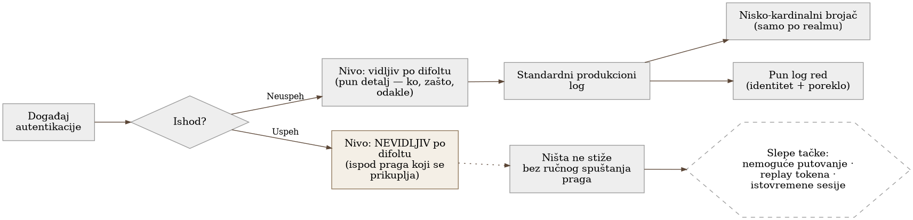
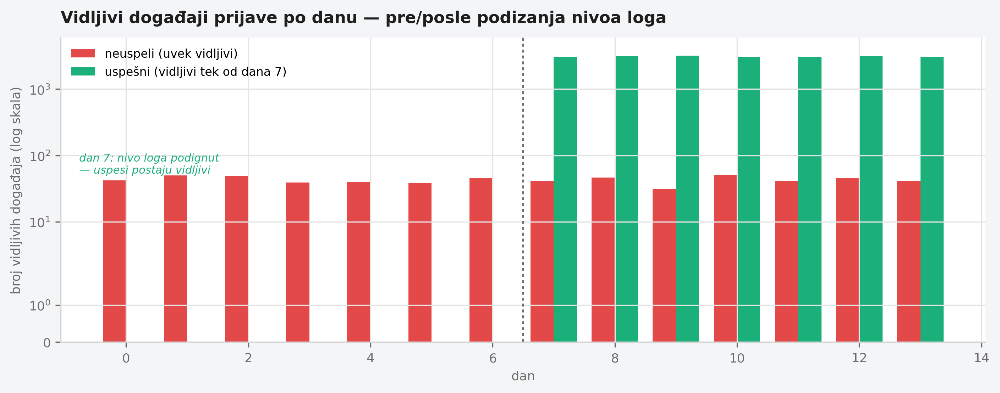

# Chapter 20 — Authentication and IAM (a Keycloak-type system)

Building security keeps a meticulous record of every failed attempt to get
in — a card that doesn't work, a wrong code at the door, a mistyped PIN, all
of it logged, with the time, the location, the name of the card that tried.
That record is thorough, searchable, and every failure is noticed
immediately. But that same front desk usually keeps a much thinner record of
**successful** entries — "card X passed through at 08:14" and nothing more,
no note of where that card had been earlier that day, whether the same card
had also "passed through" a different door ten minutes before, whether that
card had ever entered at this time of day before. If someone steals the card
and walks in with it normally, the guard will never notice it in the
record — not because the record is bad, but because it was designed to catch
**failure**, not to tell "success that looks normal" apart from "success
that looks suspicious." Half the security questions the front desk ought to
be able to answer — is this person really who they claim to be — can't be
answered until that exact asymmetry is fixed.

## 20.1 The question this chapter answers

An authentication and identity management system generates telemetry almost
exclusively about what didn't succeed. What happens when the questions a
team actually needs to answer are about successful logins — which of them
are suspicious, which arrive from impossible routes, which repeat too many
times at once — and the signal for that simply doesn't exist by default?

## 20.2 How it was done — a practical walkthrough

### An infrastructure constraint that has to be resolved before any signal

Before any telemetry can be collected at all, the system has to be running
in an optimized, production mode — and that mode carries a constraint the
implementation discovered through an actual failed rollout, not by reading
the documentation in advance: a certain class of configuration options has
to be fixed **at container image build time**, not later, through an
environment variable at startup. Trying to set such an option as an
environment variable at runtime doesn't produce a warning — it crashes the
container on start. The practical consequence: any option that affects
which events the system is even capable of emitting has to be baked into
the image ahead of time, which turns every change to the logging pattern
into a new build and redeploy, not a quick configuration change.

### An asymmetry discovered by reading the default logging levels

The implementation uncovered this chapter's central finding not through an
incident, but through a systematic review of the default logging levels
for every type of authentication event: **a failed login attempt is logged
by default at a level visible in the standard production log, with full
detail (user, failure reason, origin). A successful login is logged by
default at a level invisible under the standard configuration** — below
the threshold that normally gets collected. The consequence is direct: any
security question that requires comparing successful logins against one
another — "did this user just log in from two geographically distant
locations minutes apart," "is the same token arriving from two different
clients at the same time" — simply has no input data until this default
level is explicitly raised.

### Two different signal shapes for two different kinds of questions

The fix wasn't "raise everything to the highest level of detail" — that
would have produced a needless cardinality explosion, since most security
questions are aggregate, not individual. The implementation kept two
parallel signal shapes, each aimed at a different kind of question:

- **Deliberately low cardinality in metrics** — counters for successful
  and failed logins labeled only by realm (the logical grouping of
  users), with no individual user identity as a label. This answers
  questions like "did the rate of failed logins just spike" — aggregate,
  cheap, with no risk of cardinality growing with every new user.
- **Full detail in the log line** — every event, now including
  successful logins at the raised level, carries the user's identity,
  origin, and timestamp in the log text itself, searchable afterward.
  This answers questions like "what exactly were the last login attempts
  for this specific user" — forensic, on demand, not aggregate.

This split — a counter for "is something changing," a log line for "what
exactly happened to this specific identity" — is a deliberate
architectural decision, not a compromise: it solves two different
questions with two different data shapes, instead of forcing one shape to
answer both.

### Concrete security signals built on top of the raised level

Only once successful logins became visible in the standard log stream
could the implementation build concrete queries for account-takeover
patterns: comparing the geographic location of the current successful
login against the last known location of the same user within a short
time window (impossible travel), detecting the same token used from two
different clients or IP addresses in an overlapping time period (a
possible replay), and detecting an unusually large number of
simultaneously active sessions for a single identity. None of these three
queries was possible before the asymmetry was fixed — not because the
query logic was complicated, but because the input data simply didn't
exist.

{: width="90%" }

{: width="95%" }

## 20.3 Analytical section — a known class of gap, rarely named formally

### Official logging guidance calls for both outcomes equally

Official security guidance on logging explicitly states that
"authentication successes and failures" must always be logged equally,
citing failed attempts as an early indicator of credential-based
attacks — but calling just as insistently for successful events as part
of the minimum schema (when, where, who, what, and **outcome with
reason**). Interestingly, broader security guidance on logging failures
explicitly names the opposite asymmetry as a known anti-pattern — "only
successful logins are logged, not failed ones" — which means the
direction of this particular asymmetry (failure visible, success
invisible) is less common in the formal literature, but just as harmful
when it happens, because the standard guidance calls for symmetry, not
any particular direction of asymmetry.

### Impossible travel as a well-documented but rarely implemented technique

Identity system vendors document impossible-travel detection as a
standard technique: comparing the geographic location of the current
login attempt against the time and location of the previous one,
checking whether physical travel between those two locations is even
possible in that time gap. The minimal input data this technique
requires is exactly what the asymmetry in this implementation blocked: a
geographic location derived from the IP address, a timestamp, and a
persistently stored record of the previous successful session's
location. Without a reliable, persistent record of successful logins,
this technique is impossible no matter how sophisticated the comparison
logic is.

### Detecting token reuse is more weakly standardized

Unlike impossible travel, detecting token reuse and concurrent sessions
is more weakly covered by formal standards. One broader security
guideline on session management even takes a stance opposite to
intuition — it explicitly states that automatically blocking concurrent
sessions is no longer recommended, since in practice "the last one to
log in wins," and that's often precisely the attacker, and instead of
blocking recommends that the user be able to see and terminate their own
active sessions. There's no formal requirement that explicitly mandates
**logging** concurrent sessions or repeated tokens as telemetry — this
is a real, documented gap in the standards themselves, not just in the
implementation, which means the implementation's decision to build these
queries on its own goes beyond what the standard even asks for.

### The system's own default behavior confirms the finding

The official documentation of the identity management system the
implementation uses confirms this directly: the user event log is by
default neither stored nor displayed, and of the event types that do get
logged to the standard log at all, only **errors** are logged at a level
visible by default — a successful event is logged at a level that
requires explicitly lowering the threshold to become visible. This isn't
a byproduct of the implementation — it's the default behavior of the
system itself, which every team using it has to recognize and correct on
their own, because the system won't do it for them.

### Counterfactual scenario: what stays blind without the fix

Imagine the implementation had stopped at "failed logins are tracked,
alerts work" and never opened the question of successful events. An
attacker who obtains valid credentials — not by guessing, but by
theft — would never produce a single failed attempt: every one of their
logins would be, technically, successful. A system that tracks only
failures would see such an attack as identical to a completely
legitimate user doing their job — right up until the damage becomes
visible some other, far more expensive way. The class of attack that
depends most heavily on compromised, not incorrect, credentials would
remain entirely invisible precisely because the asymmetry was left
unfixed.

Let's return to the front desk from the start of the chapter. The record
of failed attempts was perfect from day one — every bad PIN, every bad
card was logged. But the guard who actually catches a stolen card isn't
looking at the list of failures — they're looking at whether the same
card showed up at two doors two minutes apart, or whether a card that
usually enters in the morning suddenly enters at midnight. To even be
able to see that, the record of successful entries has to be just as
detailed as the record of failures — not because success is suspicious,
but because hidden inside the pile of successes is the one that isn't.

## 20.4 Rules collected from this chapter

- Check the default logging levels for successful and failed
  authentication events separately — don't assume symmetry; many systems
  by default log only failure at a visible level.
- Keep two parallel signal shapes for security telemetry: low-cardinality
  counters for aggregate questions ("is the rate rising") and full log
  lines with identity for forensic questions ("what exactly happened to
  this user") — one shape can't efficiently answer both kinds of
  questions.
- Know that a class of options affecting what the system is even capable
  of emitting can be fixed at image build time, not at startup — check
  this before you plan a quick change through an environment variable.
- Don't rely solely on formal security standards to tell you what to
  log — detecting token reuse and concurrent sessions is weakly covered
  by the standards, which means the absence of a formal requirement
  doesn't mean the absence of a real need.
- Ask yourself, for every class of attack that depends on compromised
  (not incorrect) credentials: would that class of attack ever produce a
  single failed attempt — if not, your system that tracks only failures
  is completely blind to that class of attack.

## 20.5 Exercise for the reader

Check the default logging level for a successful login in the
authentication system your team uses — not the failed one, the
successful one. Is that level visible in the standard production log,
with enough detail (identity, origin, time) that two successful events
could be compared against each other? If it isn't, write down one
concrete security question your team currently can't answer because of
it.

---

### Sources used in the analytical section

- [OWASP Logging Cheat Sheet](https://cheatsheetseries.owasp.org/cheatsheets/Logging_Cheat_Sheet.html)
- [OWASP Top 10:2025 — A09 Security Logging and Alerting Failures](https://owasp.org/Top10/2025/A09_2025-Security_Logging_and_Alerting_Failures/)
- [OWASP ASVS 4.0 — V3 Session Management](https://github.com/OWASP/ASVS/blob/master/4.0/en/0x12-V3-Session-management.md)
- [Microsoft Entra ID Protection — Risk Detections (impossible travel)](https://learn.microsoft.com/en-us/entra/id-protection/concept-identity-protection-risks)
- [Okta — Add a Velocity Behavior Detection](https://help.okta.com/en-us/content/topics/security/behavior-detection/velocity-behavior-detection.htm)
- [Red Hat build of Keycloak — Configuring Auditing to Track Events](https://docs.redhat.com/en/documentation/red_hat_build_of_keycloak/24.0/html/server_administration_guide/configuring_auditing_to_track_events)
