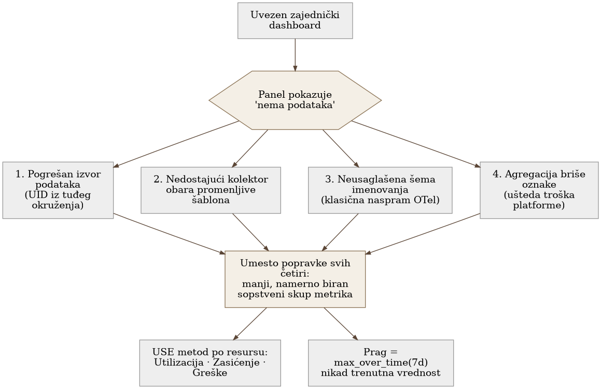

# Chapter 21 — Hosts and servers as machines

A borrowed map of a city rarely matches the streets you actually drive.
Someone drew that map for their own city, their own intersections, their
own one-way rules — and when you carry it into a different city, part of
it overlaps closely enough to fool you, and part of it is simply wrong: a
street the map marks as passable is closed, an intersection the map
expects in one place has shifted two blocks over. A driver who blindly
follows such a map doesn't turn the wrong way because they don't know how
to drive — they turn the wrong way because the map claims something that
is no longer true for this particular city. The fix isn't to throw away
every map and drive from memory — the fix is to draw your own small,
accurate map for the streets you actually use, even if it's far more
modest than the borrowed one.

## 21.1 The question this chapter answers

Free, ready-made dashboards for monitoring servers exist — they're
downloaded in a few clicks and promise instant insight. Why do they so
often stop working the moment they're actually imported, and what does it
mean to build your own, minimal set of metrics instead of borrowing
someone else's?

## 21.2 How it was done — a practical walkthrough

### Four concrete reasons why a borrowed dashboard doesn't work

From real-world experience importing several popular shared dashboards,
the implementation documented four separate, structural reasons why those
dashboards simply stop working — not because of a configuration mistake,
but because of a mismatch that exists even when everything is "correctly"
installed:

- **The wrong data source is baked into the dashboard itself.** The
  exported dashboard JSON carries the data source identifier from the
  environment of the person who originally built it. Imported into a
  different environment, that identifier simply doesn't exist — every
  panel silently falls back to "no data," with no error explaining why.
- **A single missing collector breaks every template variable.** The
  dashboard assumes all the standard collection modules are enabled. If
  even one is disabled or named differently, the query that populates the
  server/instance dropdown returns an empty result — which drags the
  **entire** dashboard down into "no data," even though all the other
  data in the background exists and is correct.
- **The metric naming schema doesn't match.** A dashboard written for one
  metric-naming convention (the classic prefixed format) finds nothing
  when the actual metrics were collected under a different, newer
  convention (OpenTelemetry-style naming) — different names for exactly
  the same physical quantities.
- **Aggregation on the platform side silently strips the labels the
  dashboard expects.** The mechanism a metrics platform uses to reduce
  cost — aggregating less-frequently-used series — can remove precisely
  the label combination an old template variable or query expects,
  leaving a panel empty with no error message at all.

The common thread across all four: none of these four reasons is "user
error" in the classic sense. Each is a structural mismatch between the
dashboard's assumptions and the actual environment it was imported into.

### A minimal, deliberately chosen set of metrics instead of someone else's bundle

Rather than trying to fix each of the four reasons for every imported
dashboard, the implementation went the opposite way: it defined its own
small set of metrics and alerts, chosen deliberately by which specific
question each metric answers, not by whether it's "standard" or comes
bundled. The result is a smaller but fully understood set — every panel
on the dashboard has a known reason for existing, and no one on the team
has to guess whether "no data" on a panel is real news or an artifact of
one of the four mismatches described above.

### Calibrating a threshold: the seven-day maximum, not the instantaneous value

Along the way, the implementation corrected a methodological mistake
uncovered during the analysis itself: an alert threshold is never set
based on a value measured at a single point in time — it's always set
based on the maximum observed over a longer window, seven days, say. The
concrete case that revealed this: a threshold set from the current,
"typical" value was off by an order of magnitude relative to a real,
legitimate peak that occurs regularly — just not at the exact moment
someone happened to be looking at the screen. This mistake was caught and
fixed in the middle of the analysis itself, not after an incident caused
by a false alert.

### Utilization versus saturation as two separate classes of alert

The implementation separated two questions that are easily conflated
when alerting only on percentage resource occupancy: how **busy** a
resource is (utilization), and how much work is **waiting** on that
resource without getting served in time (saturation). One decision had
originally been "don't alert on this, it'll be noisy" — but a comparison
against a known reference alert set showed that this decision had
confused the two concepts: a metric that measures saturation (queue
length, for instance) is a far more reliable early signal of a problem
than a metric that measures only utilization, and is rarely as noisy as
the original assumption claimed.

### "Rejected with a reason" as a permanently different category from "not done yet"

The implementation maintains an explicit distinction between two kinds of
coverage gaps: things that **haven't been done because they haven't come
up yet**, and things that were **deliberately rejected, with a recorded
reason** — for example, a metric that would be expensive in terms of
cardinality and answers a question that has never actually been asked so
far. This distinction prevents anyone later, looking only at a list of
"missing" items, from assuming every gap is an oversight — some are
deliberate, considered decisions, with a recorded reason for whoever
revisits them later.

{: width="90%" }

## 21.3 Analytical section — a known method, a documented cause of failure

### The USE method as a formal framework for what the implementation does intuitively

A formal method for diagnosing system resource performance known as USE
(Utilization, Saturation, Errors) defines exactly three axes to check for
every resource — how busy it is, how much work is waiting, and how many
errors occur. This method explicitly emphasizes that saturation is often
an earlier and more reliable signal of impending trouble than utilization
itself — which is exactly the correction the implementation discovered
on its own, independently, by comparing against a reference alert set.

### An official reference alert set confirms the implementation's choice

The official, community-maintained alert set for the standard host
metrics collection system doesn't focus primarily on plain CPU or memory
percentage thresholds — instead it emphasizes predictive signals (disk
fill rate before the disk actually fills up, inode exhaustion, network
interface errors, degraded RAID, a failed system service, system clock
drift). The author of that set himself describes it as a "work in
progress" and a template for further adaptation — an acknowledgment that
even the official, reference set isn't a finished or universally correct
product, which directly supports the implementation's decision to build
its own smaller but fully understood set, rather than adopt someone
else's as-is.

### The naming schema mismatch is a documented, growing problem

The difference in metric names between the classic convention and the
OpenTelemetry-style convention is a confirmed, documented problem within
the very community that maintains the standard metrics collectors — there
is an open discussion in the project that develops the OpenTelemetry
collector about precisely this mismatch, where the classic set has
considerably more individual metrics than the newer, more compact OTel
set, under entirely different names and sometimes at a different
granularity. This isn't a hypothetical risk the implementation invented —
it's an actively acknowledged gap in the tooling ecosystem itself.

### Aggregation that strips labels is a documented platform feature, not a bug

The official documentation for the platform mechanism that aggregates
less-frequently-used series to save cost explicitly lists the scenarios
in which an existing dashboard stops working after that aggregation is
turned on: a query that asks for an aggregation type that isn't
configured returns an empty result, a query that asks for a label value
that aggregation removed returns an empty result, and a query that spans
both the period before and the period after the switch to aggregation
deliberately returns a completely empty answer — by design, to avoid
silently returning a wrong number instead of nothing. This confirms that
one of the four reasons the implementation identified is in fact an
officially documented, expected consequence of turning on this cost
saving — not a byproduct of poor configuration.

### A counterfactual scenario: what would have happened had the dashboard been imported without checking

Imagine a team that simply imported a popular shared dashboard, saw that
a few panels showed data, and declared the task done — without
systematically checking why the remaining panels showed "no data." The
first real crisis would reveal that half the dashboard they thought they
had never actually worked — not because an alert failed to arrive, but
because the panel that was supposed to show a warning trend never
displayed any data at all, and no one noticed until it was too late to
help.

Return to the borrowed map from the start of the chapter. The map isn't
useless — it was just drawn for a different city. A driver who
understands that difference doesn't throw the map away; they use it as a
starting point, check every intersection they actually use, and end up
with their own smaller but fully accurate map. A dashboard built
deliberately, panel by panel, instead of imported whole, does the same
thing — it's smaller than what could have been taken off the shelf, but
every part of it has been checked and is accurate for the city you
actually drive in.

## 21.4 Rules collected from this chapter

- When importing someone else's dashboard, check all four structural
  reasons a panel can show "no data" — the wrong data source, a missing
  collector that breaks template variables, a mismatched naming schema,
  and aggregation that strips labels — before assuming the dashboard is
  simply "ready to use."
- Calibrate every alert threshold from the maximum over a longer time
  window, never from a value measured at a single point in time — an
  order-of-magnitude mistake is easy to make if the threshold is set from
  a "typical" value.
- Separate utilization from saturation as two distinct classes of alert —
  saturation is often a more reliable, earlier signal of an impending
  problem, and is rarely as noisy as assumed without checking.
- Record deliberately rejected metrics with a reason, separately from
  things that simply haven't been done yet — both are coverage gaps, but
  only one is an oversight that needs fixing.
- Consider building a smaller, deliberately chosen set of metrics instead
  of importing someone else's bundle — one panel that exists because it
  answers a known question is worth more than ten panels that exist
  because they came in the package.

## 21.5 Exercise for the reader

Open one imported, shared dashboard your team uses for monitoring
servers. For every panel that currently shows "no data" or an empty
graph, determine the exact cause — is the data source wrong, is a
collector missing, do the metric names not match, or did aggregation
strip a label the panel is asking for. Write down the cause next to each
empty panel before deciding whether to fix it or remove it.

---

### Sources used in the analytical section

- [USE Method: Linux Performance Checklist — Brendan Gregg](https://www.brendangregg.com/USEmethod/use-linux.html)
- [node_exporter mixin — README i alerts.libsonnet](https://github.com/prometheus/node_exporter/blob/master/docs/node-mixin/README.md)
- [Comparing node_exporter and OpenTelemetry Collector host metrics receiver](https://luppeng.wordpress.com/2025/07/26/comparing-the-key-hardware-and-os-metris-exposed-by-prometheus-node-exporter-and-opentelemetry-collectors-host-metrics-receiver/)
- [opentelemetry-collector-contrib issue #22067 — naming differences node_exporter vs OTel](https://github.com/open-telemetry/opentelemetry-collector-contrib/issues/22067)
- [Grafana Cloud — Troubleshoot your aggregated metrics query (Adaptive Metrics)](https://grafana.com/docs/grafana-cloud/adaptive-telemetry/adaptive-metrics/troubleshoot-your-aggregated-metrics-query/)
- [Google SRE Workbook — Alerting on SLOs](https://sre.google/workbook/alerting-on-slos/)
