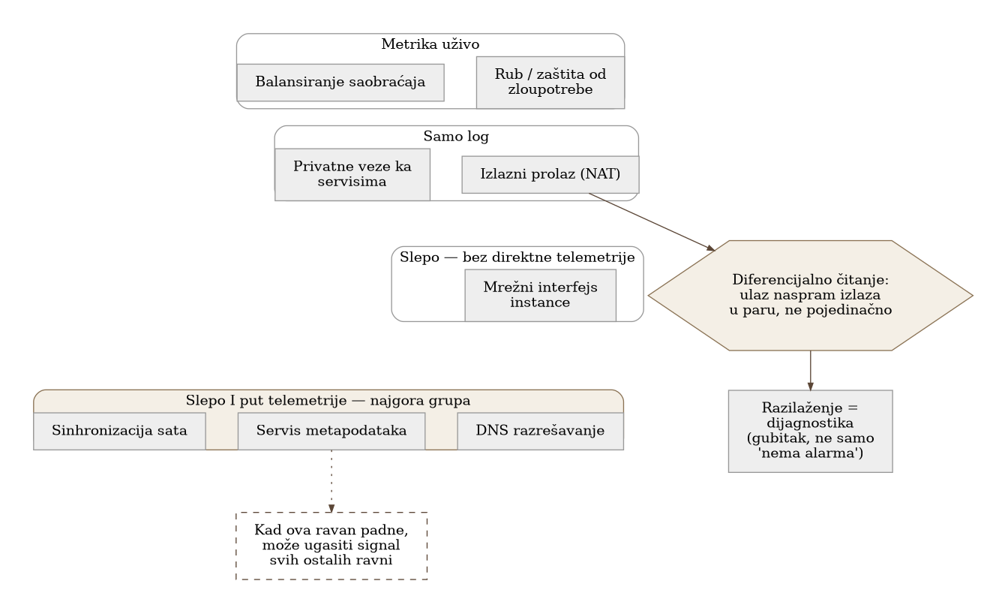
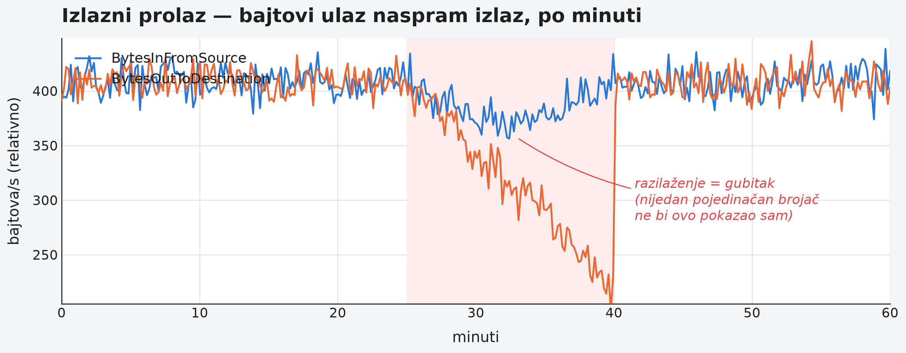

# Chapter 22 — The network as its own observation plane

Beneath every city run several entirely separate networks that no resident
ever sees while they're working — water, electricity, gas, telephone lines,
each with its own pipes or cables, its own points of failure, its own crew
that maintains it. When the power goes out, that doesn't mean the water has
stopped too — but it can mean that the pumps pushing water uphill stall, and
a power failure turns into a water failure, even though the pipe itself is
untouched. And the most dangerous moment is the one where the telephone
lines, which are supposed to carry the call "we've had no power for an
hour," run through the very same distribution cabinet that just burned
out — so at the exact moment the call for help is most needed, the phone is
silent for the same reason the power went out. A city that understands
these five networks as five separate systems knows something essential:
when one of them goes down, the first thing to check isn't "are the others
working," but "can any of the others even report that something isn't
working."

## 22.1 The question this chapter answers

The network is not a single system that either works or doesn't — it's a
set of independent layers, each with its own points of failure and its own
telemetry. How are these layers kept separate in observation, and what does
it mean when the network itself — the path telemetry travels along —
becomes the part of the system that's broken?

## 22.2 How this was done — a practical overview

### Nine independent planes

The implementation divides network infrastructure into nine independent
observation planes, each with its own source of metrics and its own risk of
going down without affecting the other eight: the system edge and abuse
protection, load-balancing devices, the outbound gateway to the internet,
private connections to external services within the same cloud, the
network interface of each individual instance, and — separately, and often
forgotten — three more: name resolution, the instance metadata service, and
clock synchronization. Each of these planes has its own telemetry, its own
alert threshold, and — most importantly — its own failure path, completely
independent of the other eight.

### Grouping by how much each plane "sees" when something goes wrong

The implementation further groups these nine planes by how well each plane
reports its own failure: some planes have live metrics that immediately
show a problem, some have only a log that has to be searched after the
fact, some are completely blind — with no direct telemetry, visible only
indirectly through symptoms on other planes — and one group is especially
dangerous: planes that are both blind **and** form part of the path other
telemetry travels along. The implementation explicitly marks this last
group as the worst category — because a failure on that plane not only
stays unseen in itself, but can also extinguish visibility into everything
passing through it.

### Differential reading: two independent paths to the same failure

The central discipline of the implementation is reading connected signals
**as a pair**, not individually. A concrete example: the outbound gateway
to the internet has two related, but independently generated metrics — how
many bytes/packets enter the gateway on one side, and how many leave on the
other. In normal operation these two values track each other. When they
diverge — input rises, output doesn't — that divergence is itself
diagnostic: it shows that traffic is being taken or lost somewhere in
between, even without a single explicit alert for "loss." The
implementation further distinguishes two different forms of silence such a
metric pair can show: a plane that **genuinely emits zeros** (active, but
with no traffic) versus a plane that **emits nothing at all** (completely
silent, perhaps because the collection mechanism itself has gone down) — a
distinction that looks trivial on paper but completely changes the
diagnosis: the first means "there's no traffic," the second means "we
don't know whether there's traffic."

### Why the network has to be read as a pair, not as a single signal

The reason for this discipline is structural: a broken network is
precisely the part of the system that carries both its own telemetry and
the telemetry of every other component that communicates with the outside
world through it. When it goes down, it isn't only user traffic that goes
down — the signal that's supposed to report that user traffic went down
can go down with it. That's why one lone alert that has stopped arriving
doesn't necessarily mean "everything is fine" — it can mean "the path that
alert was supposed to travel is precisely what just broke." Reading two
independent paths to the same failure domain together — one still
reporting, the other silent — is the only way to tell "there really is no
problem" apart from "the problem exists, but its messenger is mute."

### Applying the principle to the alert itself: a route that survives its own collector going down

The implementation applied the same differential-reading principle to the
delivery of the alert itself, not just to measurement. Most network alert
rules evaluate over the same shared collector and the same pipeline that
carries the rest of the fleet's telemetry — which means that if that
exact pipeline goes down, the rule doesn't report an error, it simply
**stops evaluating** and goes quiet. A rule's silence is, from the
outside, indistinguishable from "everything is fine" — exactly the
problem this chapter already described for ordinary metrics, now applied
to the very mechanism that's supposed to warn about a failure. The fix
was to deliberately split a small number of the most critical rules into
a separate group that reads directly from an independent data source,
bypassing the shared collector — so that when the collector or its
pipeline goes down, that other group of rules keeps evaluating, and can
still report. Both groups send to the same notification channel, so the
difference exists only in the path to that point, not in where it
ultimately shows up.

{: width="85%" }

### Two kinds of check for two kinds of bugs

Before the newly built dashboard was put into use, the implementation
replayed every query on every panel live, compared it against expected
values, and looked for empty or failed results — a check that caught
several real bugs in the queries themselves. But that same check
**passed** two separate, real bugs that had nothing wrong with the
query — the panel was returning correct data, it was just
**displaying** it wrong: a title truncated because there wasn't enough
space for the text, and one panel that, because of combining an
aggregation with a default zero-value in the wrong place, displayed two
values side by side where there should have been only one. A query-based
check can't see either of these two bugs, because both return valid,
non-empty data — the bug exists only in how the result is displayed, not
in the result itself. These two layers of checking catch strictly
different classes of bugs, and neither replaces the other: **a query
check proves a panel isn't dead, not that it's correct** — for the
latter you need to look at the rendered panel itself, not just the data
that feeds it.

It's worth noting a subtler trap within the query check itself: one panel
had data at build time, and was empty barely forty minutes later — not
because of a bug, but because the real measured value hit zero and the
source stopped emitting it at all. The lesson isn't "remember which
metrics are known to disappear" — that's a moving target, exactly which
metrics are empty at a given moment depends only on what's currently
measuring zero. The lesson is that every error or rejection counter has
to be treated as capable of disappearing, and given an explicit
zero-default proactively, instead of adding that protection only after
something specific has actually disappeared.

{: width="90%" }

{: width="95%" }

## 22.3 Analytical section — a principle known in two separate official forms

### The official documentation already uses the differential pattern, explicitly

The provider's official documentation for outbound gateway metrics already
recommends reading inbound and outbound byte/packet flow as a pair, and
explicitly states that a discrepancy between them indicates possible data
loss or blocked traffic — this is a direct, official confirmation of the
implementation's differential discipline, not an assumption the
implementation invented on its own. The same pattern exists at the
load-balancing layer too: the official documentation distinguishes errors
generated by the load balancer itself from errors generated by the
backend service, as two separate counters for exactly the same reason —
the same point of failure observed from two independent positions, where
the divergence between them localizes the cause.

### "Planes" exist as a formal concept, but not under this name, for this combination

The official documentation on fault isolation boundaries formalizes the
split between the control plane (APIs, orchestration) and the data plane
(actual traffic transport) as a deliberate architectural decision — a
failure on the control plane must not bring down traffic already in flight
on the data plane. This confirms the general principle that a network is
deliberately divided into independent layers for resilience, but the
specific combination of nine planes the implementation uses — edge, load
balancing, outbound gateway, private connections, per-instance network
interface, plus DNS/metadata/clock — isn't formulated as a ready-made,
named list in any single official document; it's the implementation's own
synthesis, built on a more general principle, applied to its own
architecture.

### DNS, instance metadata, and the clock as documented, neglected telemetry

All three less obvious layers have documented confirmation that they're
easily neglected: the official documentation for name resolution within a
private network explicitly states that detailed per-query data is an
optional, paid feature, while basic health status is free but coarsely
sampled — meaning granular DNS visibility requires a deliberate,
additional step. The instance metadata service has no first-class
built-in availability or latency metric in the standard metrics
platform — the absence is itself a documented finding, not an assumption.
And system clock accuracy requires a custom script and a custom metric
before it becomes visible at all — there's no default alert for clock
drift, despite the fact that clock drift directly breaks certificate
validation, log correlation, and the accuracy of distributed tracing.

### Counterfactual scenario: an alert that's silent at exactly the wrong moment

Imagine a team that watches the outbound gateway through a single
counter — say, only inbound traffic — without pairing it against outbound.
The moment the gateway starts losing part of its traffic, that single
counter still shows "traffic is arriving," because it measures only the
input, not the difference. The alert that should catch the loss would
never fire — not because the threshold was set wrong, but because the
metric being watched structurally cannot see the difference between
"everything is passing through" and "half of it is being lost." Only once
users started complaining about slowness would someone manually discover
that the loss had existed for hours, invisible to the one counter anybody
was watching.

Let's return to the city and its five networks from the start of the
chapter. A city that understands water, electricity, gas, and telephone as
separate systems doesn't panic at every failure — it knows exactly which
crew to call, and knows to check whether a call for help can even get
through the network that might be the very one that's broken. The network
layer of infrastructure, observed through nine independent planes instead
of as one vague "network problem," gives that same insight: you know not
only what's broken, but also whether the messenger that's supposed to
report it can even speak.

## 22.4 Rules collected from this chapter

- Observe the network as a set of independent planes, not as a single
  system — each plane has its own failure path, and one plane's failure
  means neither the failure nor the health of the others.
- Identify which planes are both blind (with no direct telemetry) and, at
  the same time, part of the path other planes' telemetry travels along —
  that combination is the most dangerous, because their failure can
  extinguish visibility into everything else.
- Read connected network signals as a pair, not individually — the
  divergence between two independent paths to the same failure domain is
  itself diagnostic, even without an explicit alert for exactly that
  scenario.
- Distinguish "a plane that emits zeros" from "a plane that emits
  nothing" — the first means "there's no traffic," the second means "we
  don't know," and conflating the two diagnoses leads to the wrong
  conclusion.
- Don't forget DNS, the instance metadata service, and clock
  synchronization — all three are documented as neglected, with no
  default detailed telemetry, despite their direct impact on TLS, logs,
  and tracing.
- Split a handful of the most critical network alerts into a separate
  group that reads directly from a source independent of the shared
  collector — if every rule evaluates over the same pipeline that
  carries it, that pipeline going down silences exactly the rules that
  should be reporting it, and that silence looks identical to health.
- Don't trust a panel just because its query passed a live check — a
  query check proves a panel isn't dead, not that it's displayed
  correctly; for rendering bugs (truncated text, a duplicated value
  where there should be one) you need to look at the rendered panel
  itself.

## 22.5 Exercise for the reader

List the network layers a typical request in your system passes through,
from the user to the database and back. For each layer, ask the question:
does this layer have its own, independent telemetry, or is its health only
inferred indirectly, through symptoms on other layers? Find at least one
layer that is currently completely blind.

---

### Sources used in the analytical section

- [Create CloudWatch alarms to monitor a NAT gateway — AWS VPC User Guide](https://docs.aws.amazon.com/vpc/latest/userguide/creating-alarms-nat-gateway.html)
- [NAT gateway metrics and dimensions — AWS VPC User Guide](https://docs.aws.amazon.com/vpc/latest/userguide/metrics-dimensions-nat-gateway.html)
- [CloudWatch metrics for your Application Load Balancer — AWS ELB User Guide](https://docs.aws.amazon.com/elasticloadbalancing/latest/application/load-balancer-cloudwatch-metrics.html)
- [AWS Fault Isolation Boundaries whitepaper — Control planes and data planes](https://docs.aws.amazon.com/whitepapers/latest/aws-fault-isolation-boundaries/control-planes-and-data-planes.html)
- [Monitoring Route 53 Resolver endpoints with CloudWatch](https://docs.aws.amazon.com/Route53/latest/DeveloperGuide/monitoring-resolver-with-cloudwatch.html)
- [Manage Amazon EC2 instance clock accuracy using Amazon Time Sync Service and CloudWatch — AWS Cloud Operations Blog](https://aws.amazon.com/blogs/mt/manage-amazon-ec2-instance-clock-accuracy-using-amazon-time-sync-service-and-amazon-cloudwatch-part-2/)
- [Synthetic Monitoring vs Real User Monitoring — Kentik](https://www.kentik.com/kentipedia/synthetic-monitoring-vs-real-user-monitoring/)
