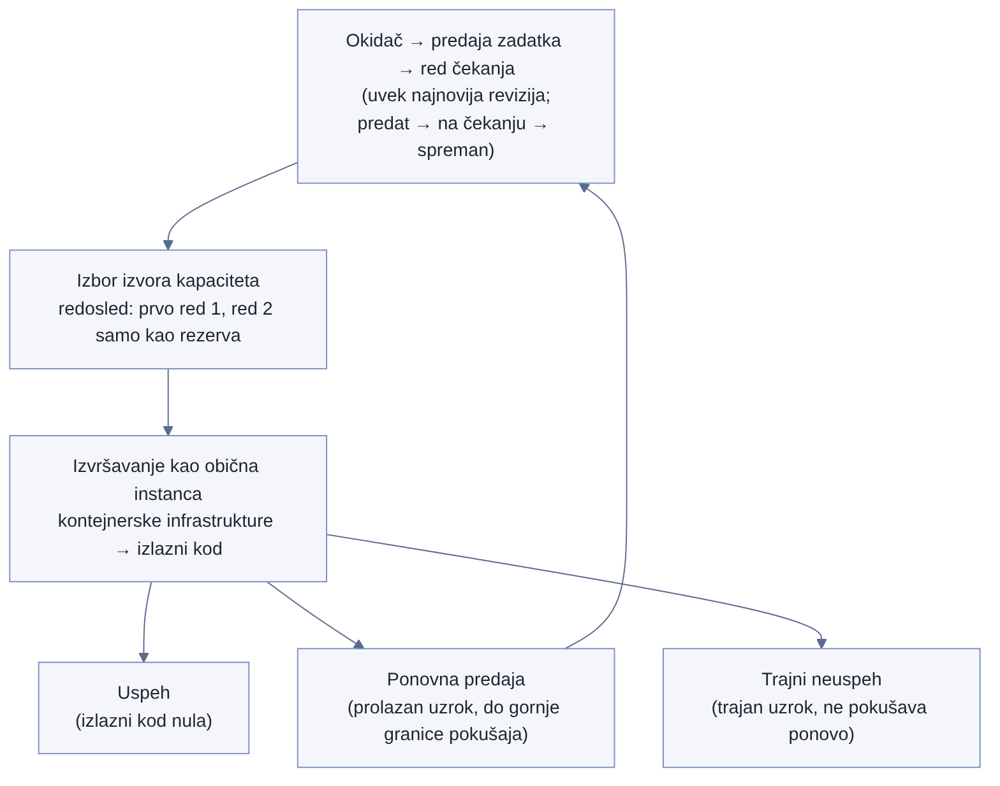

# Chapter 23 — The batch/ETL job fleet

A night baker doesn't measure success by whether the oven was on. An oven
that ran for three hours is only a fact about power consumption — it says
nothing about whether the dough was ever kneaded, whether it was left to
rise long enough, and, in the end, whether any bread came out of that oven
fit to sell in the morning. A baker who kept a log reading only "oven ran
from midnight to three" would miss the night the dough was forgotten on
the counter, never put in at all — the oven would still have been on,
still burning power, and by that one record alone would look like a
perfectly successful shift. A real baker checks three separate things:
whether the process ever started, whether anything actually came out at
the end, and, if not, why. An oven that runs without producing bread isn't
a successful night — it's just expensive.

## 23.1 The question this chapter answers

A fleet of jobs that run on a schedule or on demand — not services that
continuously receive traffic, but jobs that appear, do their work, and
disappear — doesn't answer the same questions as a service listening on a
network port. What does it mean for a batch job to be "healthy," and why
isn't a green exit code by itself sufficient proof that the work got
done?

## 23.2 How it was done — a practical walkthrough

### A completeness model instead of the usual service pattern

Instead of the standard pattern for monitoring services — request rate,
errors, duration — the implementation for the batch job fleet uses a
different framework, suited to the nature of the work: whether a job even
**started**, whether it **produced** anything, and, if it failed,
**why**. This completeness model deliberately makes no attempt to force a
batch job into a mold built for services that continuously receive
traffic — because a single scheduled job has no meaningful "request
rate," and its duration, without confirmation that it actually produced
something, says nothing useful on its own.

### How a job actually flows through the system, step by step

The completeness model from the previous section isn't an arbitrary
choice — it directly tracks the concrete steps every job actually passes
through:

1. **Trigger.** A scheduled rule or a call from another job initiates
   submission.
2. **Submission.** Called with the queue name and the job definition
   name — with no pinned definition revision, so it always uses the
   latest version available at the moment of submission.
3. **Queue.** The job passes through a series of states — submitted,
   pending, ready to run.
4. **Capacity source selection.** The system walks the list of possible
   capacity sources in exactly the order they're listed for that queue,
   and places the job on the first source that has enough resources to
   accept it. This is the exact mechanism behind the ordering lesson in
   the next section — "changing the order" literally means swapping the
   positions of two sources on this list, nothing more.
5. **Execution.** The job runs as an ordinary instance of the container
   infrastructure, sharing everything that infrastructure already
   offers.
6. **Exit.** The exit code determines whether the job succeeded or not.
   If a retry is configured, the system resubmits the job on its own
   with an incremented attempt count, until the give-up rule says
   "enough" or the upper attempt limit is reached.

These six steps are the same for every job in the fleet, regardless of
what the job actually does — which is exactly why the completeness model
could be a single, general pattern instead of per-job custom logic.

{: width="90%" }

### A specific and deliberately different pattern: completed successfully, but empty

The most important failure mode the implementation explicitly covers —
and the easiest one to miss — is a job that finishes with a clean,
successful exit code, but that produced not a single row of data. The
alert for this case is deliberately written as two separate conditions
joined together: the step actually ran **AND** the number of rows
produced is zero — not merely the bare condition "row count is zero." The
difference matters: the bare condition would fire falsely in a perfectly
normal situation where the step simply wasn't supposed to run that day at
all. The joined condition fires only when the process actually attempted
the work, and actually produced nothing — exactly the scenario a green
exit code, by itself, conceals.

### Changes in order on the job execution infrastructure

The system the implementation uses to run batch jobs runs on the same
underlying infrastructure as the services that continuously receive
traffic — which meant, somewhat surprisingly, that a good portion of the
existing alerting infrastructure (the mechanism that listens for state
changes in execution) could be reused without writing anything entirely
new. On top of that, the implementation tightened its retry rules:
instead of every failure automatically retrying, the rules were defined
to distinguish a **transient** cause of failure (a temporary
infrastructure problem, resource availability) from a **permanent** one
(a bug in the job's own logic, bad input data) — because retrying a
permanent failure only burns through the retry budget with no chance
whatsoever that another attempt will succeed.

### Eliminating one class of interruption by changing order, not by adding resilience

One specific source of instability — interruption of the cheaper, but
less reliable, type of compute capacity — was resolved by changing the
**order** in which the system chooses where to draw capacity from,
instead of adding extra recovery logic for interruptions. This is a
valuable lesson in its own right: not every reliability problem is solved
by adding fault tolerance — sometimes it's cheaper and more reliable to
simply change the order of selection so that the less reliable option
gets used less often in the first place.

### Why this fleet didn't need a separate failure alert

Jobs in this fleet, when they run, run as ordinary instances of the same
container infrastructure that carries the rest of the system — there's
no separate, dedicated infrastructure just for batch work. The practical
consequence: the general, per-family, aggregated alert on a non-zero
exit code, described in Chapter 30, automatically covers this fleet too,
without a single line of code written specifically for it. This was
confirmed live on the very same day the capacity source order was
changed — a real, interrupted job on the older, less reliable source was
caught and reported by that same general mechanism within minutes, with
no special preparation ahead of time.

This wasn't always the only path for a failure alert. Until recently, a
second, purpose-built mechanism existed in parallel just for this
fleet: a dedicated function that counted failures and published them as
a separate metric, feeding three named alerts. It was decommissioned in
the same cleanup as a related case elsewhere in the system — same
pattern, different fleet — for two reasons: its execution environment
had been obsolete for years, and an audit found that all three alerts
had sat silently in the exact same, unchanged state for over three
years. No one had noticed, because the newer, general mechanism had
quietly been doing the real work the whole time. Only the scheduled rule
that used to trigger that old mechanism was deliberately kept —
redirected to just archive the records for cheap after-the-fact
forensics, with nothing left that would send an alert from it.

### Current state: outside the main telemetry pipeline

The implementation records what hasn't been done yet, not just what has:
the batch job fleet currently sends its logs through an older, direct
path to the logging platform, outside the main OpenTelemetry pipeline
that covers the rest of the system. This is recorded as a known gap in
coverage, not as a hidden oversight — a clearly named boundary of what
has been done relative to the rest of the architecture.

{: width="90%" }

{: width="95%" }

### A reorder fix with no guardian

The reordering fix described in the previous section — which gives
capacity source priority — solved a real problem once, but that same
change exists nowhere in infrastructure code today. The queue and
capacity sources for this fleet still change only by direct command or
through the console, outside the system that manages the rest of the
infrastructure as code. The practical consequence: anyone with console
access can, deliberately or by accident, put a cheaper, less reliable
source back in first place — and nothing in the system will notice it as
a deviation, because there is no recorded, desired state to compare the
current state against.

It's worth setting this next to a similar pattern earlier in the book
(task definition revision drift) — but with one important difference
that makes this gap more dangerous, not less: there, at least something
was recorded (the revision) whose identity could be checked and
compared. Here there isn't even that — the capacity source order itself
doesn't exist recorded anywhere outside the current, live state of the
job execution service itself. A regression would first be noticed only
indirectly, through the general failure alert described earlier in this
chapter — and that alert catches the **consequence** (a job failed on an
unreliable source), not the **cause** (someone changed the order). The
time between those two things can be days, long enough for someone to
forget they ever touched the order at all by the time the first failure
report finally arrives.

The fix isn't complicated in principle — bring these resources into the
same infrastructure-as-code system that already manages the rest of the
fleet, so the desired state becomes something that can be read and
compared, not just something that currently exists in the head of
whoever last touched the console. It's also worth recording why this
hasn't been done yet: the execution resources for this fleet were never
brought into that system, not even before this fix — which means this
isn't a regression of something that used to be protected, but a gap
that existed from the start and that a real incident merely made
visible.

### Cutting CPU and cutting memory aren't the same savings, and the ceiling predicts failure

A systematic pass through reservations across the whole fleet —
comparing actual peak memory and CPU footprint against what's actually
reserved — turned up two things that are easy to lose sight of when
optimization is viewed only through "how much did we over-reserve."

The first is that cutting CPU and cutting memory aren't interchangeable
savings. For a job family whose work is memory-heavy but CPU-bound
(using almost all its allocated CPU for the whole run), cutting the CPU
reservation saves almost nothing — the job just takes longer on fewer
cores, ending up with roughly the same number of vCPU-hours, while
cutting memory, where a real surplus exists, saves linearly. For another
family, the opposite: memory was right at the edge, while CPU had a
surplus, so it was CPU cutting that delivered almost all the savings
there. The rule that follows from this isn't "cut both resources
equally" but "measure which resource is actually the bottleneck for this
specific job, before deciding where to cut" — the same recipe applied to
the wrong resource doesn't hurt, it just does nothing.

The second, more serious thing: when all roughly fifty families in the
fleet are grouped by memory utilization and compared against the failure
count over the last thirty days, the difference between groups isn't
small. Families at 90% utilization or higher fail on average **thirty
times more often** than families in the 40-70% range — and those rare,
near-ceiling families account for nearly half of all failures across the
entire fleet. (The group below 40% has its own, larger failure count —
but that's a separate cause, bugs in the application itself that memory
wouldn't explain, not the same pattern in reverse.) This changes the
priority order: a family close to its own memory ceiling deserves a fix
before any cheaper, safer saving elsewhere in the fleet — expanded
further in Chapter 27.

Measuring this carries its own traps, each of which returned a
plausible but wrong answer, not an error: a query shaped for services
returns nothing for standalone, scheduled jobs with no ECS service
behind them (a different attribute carries the identity), a metric that
records the failure *event* (not a state) returns zero series if queried
with the instantaneous value instead of a sum over time, and a
metrics-listing tool silently returns only the first page of results if
it isn't parsed with pagination support — all three look like "no data
for this family," not like a bug in the query.

### The alert that "needed to be built" already exists — paused, not absent

When this same analysis was proposed as a recommendation: add a
fleet-wide alert that tracks the ratio of used to reserved memory per
job. Checking before building showed that such an alert **already
existed** — live, managed as code, with exactly the expression asked
for, two thresholds (warning and critical), and rich links to the
dashboard and the log in the notification. The difference between "no
alert exists" and "an alert exists, but is paused at the request of the
team that receives it, because it was flooding the shared notification
channel" looks the same from outside — in both cases the alert is silent
— but these are two completely different problems, and only the second
one is real. Had the alert been built again, the result would have been
a duplicate expression double-notifying the exact channel that had asked
for less noise.

Two measurements worth recording before deciding what to do next with
the paused alert. First: the utilization signal and the actual
out-of-memory kill event **don't agree in either direction** — one
family had ten kills and not a single utilization warning, another had
nine warnings and not a single kill. Utilization and memory saturation
measure different things, as an earlier chapter already distinguishes
for hosts — here it's the same principle, just at the level of an
individual job. Second, sharper: the utilization number itself is, in at
least one confirmed case, provably a **lower bound**, not the actual
value — a job was reading well below its own ceiling at the very moment
it was actively being killed for lack of memory, because the utilization
signal and the kill signal sample on different rhythms. An alert reading
green doesn't mean the job wasn't, at that very moment, on the edge of
being killed.

One last thing makes re-arming the paused alert subtler than it looks:
the rightsizing program that is itself part of this analysis
**mechanically raises that same ratio** on unchanged real load — when
memory is cut to save cost, the same absolute consumption now occupies a
larger percentage of a smaller reservation. For families hit by an
earlier round of savings, the utilization ratio in some cases has nearly
doubled, even though the real load hasn't changed at all. None of them
yet crosses the warning threshold — but every subsequent round of
savings moves them closer to that line, and a noise estimate made before
the cut no longer holds after it. The rule that follows isn't "don't
alert on utilization" but "never reuse a noise estimate measured before
a reservation change — measure it again, afterward."

## 23.3 Analytical section — a familiar contrast with the standard method for services

### The RED method is meant for a different shape of load

The standard method for instrumenting services — request rate, errors,
duration, described in Chapter 5 as a byproduct of auto-instrumentation —
was formulated in 2015 specifically for microservices with a continuous
stream of requests: APIs, gateways, anywhere "rate" and "latency
distribution" are meaningful concepts because there's a steady flow of
requests through which those concepts can be measured. No source reviewed
claims explicitly that this method "doesn't work" for batch jobs — but
every secondary source describing it scopes its domain to synchronous,
request/response traffic. A single scheduled run of a batch job has no
meaningful "rate," and its duration, without a completeness signal, says
nothing about whether the work actually got done — exactly the gap the
implementation's completeness model fills.

### "Green exit code hides an empty result" is a recognized, named pattern

This exact scenario — a process that finishes cleanly but delivers an
incomplete or incorrect result — is explicitly named in the data quality
literature as a distinct and particularly costly failure mode, precisely
because it goes unnoticed until someone else, downstream, later notices
that expected data is missing. The standard recommendation from that same
literature is identical to the implementation's decision: pair a signal
about **process completion** with an independent signal about result
**volume/freshness**, because completion alone carries no guarantee about
content.

### Official documentation confirms the principle of distinguishing transient from permanent causes

The official documentation for the batch job retry mechanism explicitly
recommends ending retry rules with a catch-all rule that does **not**
retry unmatched or permanent failure causes — direct confirmation that
deliberately limiting retries to transient causes is an officially
recommended practice, not an unsupported, conservative choice by the
implementation.

### Capacity selection order as documented, recommended strategy

The official recommendation for using cheaper, interruptible capacity
explicitly recommends a selection strategy that weighs both price and
interruption probability together, rather than a strategy that optimizes
for price alone — confirming that changing the order of capacity
selection, as the implementation did, is exactly the kind of solution the
official documentation recommends as a first step, before more elaborate
resilience mechanisms.

### Counterfactual scenario: what a green status hides

Picture a team tracking a batch job fleet solely through whether each job
finished with a successful exit code — with no check on output volume at
all. A job that depends on an external data source could, because of a
silent change on that source's end, receive an empty response, process it
cleanly (processing zero rows is itself, technically, a successful
operation), and finish with a green status. The dashboard would look
flawless — everything green, no failures. The real damage — a gap in the
downstream data — would stay invisible until someone else, much later,
discovers it by hand, wondering why a report depending on that data looks
wrong.

Back to the baker from the start of this chapter. An oven running for
three hours isn't news — the news is whether bread came out of it. A
baker who checks all three things — was the dough kneaded, was it put in,
did bread come out — isn't wasting time on a redundant check; they're
wasting less time than the baker who finds out only in the morning, from
customers, that the shelves are empty.

## 23.4 Rules collected from this chapter

- Track batch/ETL jobs through a completeness model — whether it started,
  whether it produced output, why not if it didn't — instead of forcing
  metrics meant for services with continuous traffic onto work that has
  no meaningful "request rate."
- Write the "completed successfully, but empty" alert as a joined
  condition — step ran AND zero rows — never as the bare condition "zero
  rows," which would fire falsely on days when the job legitimately
  wasn't supposed to run.
- Separate transient from permanent causes of failure in your retry
  rules — retrying a permanent cause only burns through the retry budget
  with no chance of success.
- Consider whether a reliability problem can be solved by changing the
  order of resource selection instead of adding more elaborate recovery
  logic — sometimes the simpler solution is also the cheaper one.
- Record known gaps in coverage explicitly — for example, which part of
  the fleet still isn't onboarded onto the main telemetry pipeline —
  instead of leaving the gap hidden until someone stumbles onto it by
  chance.
- When you carry out a fix by changing order or configuration directly
  on a live resource, and that resource isn't under an
  infrastructure-as-code system, that fix has no guardian — anyone with
  console access can quietly revert it, and the regression will first be
  noticed only indirectly, through the consequence, not through the
  cause itself.
- Don't cut CPU and memory equally out of habit — measure which resource
  is actually the bottleneck for that specific job (a CPU-bound job
  saves almost nothing from cutting memory and vice versa), and treat a
  family close to its own memory ceiling as a reliability priority, not
  just a savings candidate.
- Before building an alert that "obviously doesn't exist yet," check
  whether it already exists, somewhere paused or redirected — the
  absence of a signal and an existing, silenced signal look identical
  from outside, but they have different fixes.
- Never reuse one alert's noise estimate measured before a resource
  reservation change — every round of reservation cuts mechanically
  shifts that estimate on unchanged real load.
- Check whether the jobs in your fleet share execution infrastructure
  with the rest of the system — if they do, a general alert on exit code
  already covers the fleet for free, and a separate, purpose-built
  mechanism for the same thing is an unnecessary risk of silently going
  stale. Periodically audit existing alerts to confirm none of them has
  sat in the exact same, unchanged state for years without anyone
  noticing.

## 23.5 Exercise for the reader

Find one scheduled job in your system that is currently tracked only
through a successful/failed exit code. Ask the question: could that job
"succeed" without actually producing the expected output — and if so, is
there currently a single alert that would catch that situation?

---

### Sources used in the analytical section

- [The RED Method: How to Instrument Your Services — Grafana Labs](https://grafana.com/blog/the-red-method-how-to-instrument-your-services/)
- [Automated job retries — AWS Batch User Guide](https://docs.aws.amazon.com/batch/latest/userguide/job_retries.html)
- [EvaluateOnExit — AWS Batch API Reference](https://docs.aws.amazon.com/batch/latest/APIReference/API_EvaluateOnExit.html)
- [Use Amazon EC2 Spot best practices for AWS Batch](https://docs.aws.amazon.com/batch/latest/userguide/bestpractice6.html)
- [Data quality and Airflow — Astronomer Documentation](https://www.astronomer.io/docs/learn/data-quality)
- [Data Pipeline Observability: What It Is and Why It Matters — Airbyte](https://airbyte.com/data-engineering-resources/data-pipeline-observability)
