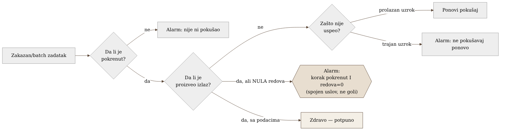
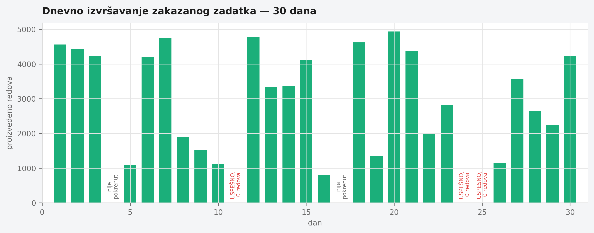

# Poglavlje 23 — Batch/ETL flota zadataka

Noćni pekar ne meri uspeh po tome da li je rerna bila upaljena. Rerna
upaljena tri sata je samo činjenica o potrošnji struje — ne govori ništa o
tome da li je testo uopšte umešeno, da li je ostavljeno da naraste
dovoljno dugo, i, na kraju, da li je iz rerne izašao hleb koji se može
prodati ujutru. Pekar koji bi vodio evidenciju samo "rerna je radila od
ponoći do tri" bi propustio noć u kojoj je testo zaboravljeno na pultu,
nikad stavljeno unutra — rerna bi i dalje bila upaljena, trošila struju,
i po toj jedinoj evidenciji izgledala bi kao savršeno uspešna smena. Pravi
pekar proverava tri odvojene stvari: da li je proces uopšte krenuo, da li
je nešto na kraju stvarno izašlo, i, ako nije, zašto. Rerna koja radi bez
hleba na kraju nije uspešna noć — samo je skupa.

## 23.1 Pitanje na koje ovo poglavlje odgovara

Flota zadataka koji se pokreću po rasporedu ili na zahtev — ne servisi koji
stalno primaju saobraćaj, nego zadaci koji se pojave, urade posao, i
nestanu — ne odgovara na ista pitanja kao servis koji sluša mrežni port.
Šta znači "zdrav" batch zadatak, i zašto zeleni izlazni kod sam po sebi
nije dovoljan dokaz da je posao obavljen?

## 23.2 Kako je to urađeno — praktičan pregled

### Model potpunosti umesto uobičajenog obrasca za servise

Umesto standardnog obrasca praćenja servisa — stopa zahteva, greške,
trajanje — implementacija flote batch zadataka koristi drugačiji okvir,
prilagođen prirodi posla: da li je zadatak uopšte **pokrenut**, da li je
**proizveo** bilo šta, i, ako nije uspeo, **zašto**. Ovaj model potpunosti
namerno ne pokušava da forsira batch zadatak u kalup napravljen za
servise koji stalno primaju saobraćaj — jer pojedinačan zakazan zadatak
nema smislenu "stopu zahteva," a njegovo trajanje bez potvrde da je
zaista nešto proizveo ne govori ništa korisno samo po sebi.

### Poseban i namerno drugačiji obrazac: uspešno završeno, ali prazno

Najvažniji, i najlakše propušten oblik kvara koji je implementacija
eksplicitno pokrila jeste zadatak koji se završi sa urednim, uspešnim
izlaznim kodom — ali koji nije proizveo nijedan red podataka. Alarm za ovaj
slučaj je namerno napisan kao dva odvojena uslova spojena zajedno: korak
je stvarno pokrenut **I** broj proizvedenih redova je nula — ne samo goli
uslov "broj redova je nula." Razlika je bitna: goli uslov bi lažno
alarmirao i u potpuno normalnoj situaciji kada korak uopšte nije trebalo
da se izvrši tog dana. Spojen uslov alarmira samo kada je proces stvarno
pokušao, i stvarno nije proizveo ništa — tačno onaj scenario koji zeleni
izlazni kod sam po sebi sakriva.

### Redosled promena na infrastrukturi izvršavanja zadataka

Sistem za izvršavanje batch zadataka koji implementacija koristi radi na
istoj osnovnoj infrastrukturi kao i servisi koji stalno primaju saobraćaj
— što znači da se, iznenađujuće, dobar deo postojeće infrastrukture za
alarme (mehanizam koji sluša promene stanja izvršavanja) mogao ponovo
iskoristiti bez pisanja nečeg potpuno novog. Uz to, implementacija je
zategla pravila ponovnog pokušavanja: umesto da svaki neuspeh automatski
pokuša ponovo, pravila su definisana da razlikuju **prolazan** uzrok
neuspeha (privremen problem infrastrukture, dostupnost resursa) od
**trajnog** uzroka (greška u samoj logici zadatka, loš ulazni podatak) —
jer ponovno pokušavanje trajne greške samo troši budžet pokušaja bez
ikakve šanse da drugi pokušaj uspe.

### Eliminacija jedne klase prekida promenom redosleda, ne dodavanjem otpornosti

Jedan konkretan izvor nestabilnosti — prekid jeftinijeg, ali manje
pouzdanog tipa računarskog kapaciteta — rešen je promenom **redosleda**
kojim sistem bira odakle da uzme kapacitet, umesto dodavanjem dodatne
logike za oporavak od prekida. Ovo je vredna lekcija sama po sebi: nije
svaki problem sa pouzdanošću rešen dodavanjem otpornosti na kvar — nekad
je jeftinije i pouzdanije jednostavno promeniti redosled izbora tako da se
manje pouzdana opcija ređe uopšte i koristi.

### Trenutno stanje: van glavnog cevovoda za telemetriju

Implementacija beleži i ono što još nije urađeno, ne samo ono što jeste:
flota batch zadataka trenutno šalje svoje logove kroz stariji, direktan
put ka platformi za logove, van glavnog OpenTelemetry cevovoda koji
pokriva ostatak sistema. Ovo je zabeleženo kao poznata razlika u
pokrivenosti, ne kao skriven propust — jasno imenovana granica onoga što
je urađeno u odnosu na ostatak arhitekture.

{: width="90%" }

{: width="95%" }

## 23.3 Analitički deo — poznat kontrast sa standardnim metodom za servise

### RED metod je namenjen drugačijem obliku opterećenja

Standardni metod za instrumentaciju servisa — stopa zahteva, greške,
trajanje — je 2015. godine formulisan namenski za mikroservise sa
kontinualnim tokom zahteva: API-je, gateway-e, sve gde su "stopa" i
"raspodela latencije" smisleni pojmovi jer postoji stalan protok
zahteva kroz koji se ti pojmovi mogu meriti. Nijedan pregledan izvor ne
tvrdi eksplicitno da ovaj metod "ne radi" za batch zadatke — ali svaki
sekundarni izvor koji ga opisuje ograničava njegov domen na sinhroni,
zahtev/odgovor saobraćaj. Pojedinačno zakazano izvršavanje batch zadatka
nema smislenu "stopu," i njegovo trajanje bez signala o potpunosti ne
govori ništa o tome da li je posao stvarno obavljen — tačno jaz koji
model potpunosti implementacije popunjava.

### "Zeleni izlazni kod sakriva prazan rezultat" je priznat, imenovan obrazac

Ovaj tačan scenario — proces koji se uredno završi, ali isporuči
nepotpun ili netačan rezultat — je eksplicitno imenovan u literaturi o
kvalitetu podataka kao poseban i posebno skup oblik kvara, upravo zato što
prolazi neopaženo do trenutka kad neko drugi, nizvodno, primeti da
nedostaje očekivan podatak. Standardna preporuka iz te iste literature je
identična odluci implementacije: upariti signal o **završetku procesa** sa
nezavisnim signalom o **zapremini/svežini** rezultata, jer sam završetak
procesa ne nosi garanciju o sadržaju.

### Zvanična dokumentacija potvrđuje princip razlikovanja prolaznog od trajnog uzroka

Zvanična dokumentacija mehanizma za ponovno pokušavanje batch zadataka
eksplicitno preporučuje da se pravila ponovnog pokušaja završe
sveobuhvatnim pravilom koje **ne** pokušava ponovo neuparene ili trajne
uzroke neuspeha — direktna potvrda da je namerno ograničavanje ponovnih
pokušaja na prolazne uzroke zvanično preporučena praksa, ne konzervativan
izbor implementacije bez podrške.

### Redosled izbora kapaciteta kao dokumentovana, preporučena strategija

Zvanična preporuka za korišćenje jeftinijeg, prekidivog kapaciteta
eksplicitno preporučuje strategiju izbora koja uzima u obzir i cenu i
verovatnoću prekida zajedno, umesto strategije koja optimizuje samo cenu —
potvrđujući da je promena redosleda izbora kapaciteta, koju je
implementacija primenila, upravo ona vrsta rešenja koju zvanična
dokumentacija preporučuje kao prvi korak, pre složenijih mehanizama
otpornosti.

### Kontrafaktički scenario: šta zeleni status krije

Zamislimo tim koji prati flotu batch zadataka isključivo kroz to da li se
svaki zadatak završio sa uspešnim izlaznim kodom — bez ijedne provere
zapremine izlaza. Neki zadatak koji zavisi od spoljnog izvora podataka bi
mogao, zbog tihe promene na strani tog izvora, primiti prazan odgovor,
uredno ga obraditi (obrada nule redova je i sama, tehnički, uspešna
operacija), i završiti se sa zelenim statusom. Dashboard bi izgledao
besprekorno — sve zeleno, nijedan neuspeh. Prava šteta — praznina u
podacima nizvodno — bi ostala nevidljiva sve dok je neko drugi, mnogo
kasnije, ne otkrije ručno, pitajući se zašto izveštaj koji zavisi od tih
podataka izgleda pogrešno.

Vratimo se pekaru s početka poglavlja. Rerna koja radi tri sata nije
vest — vest je da li je iz nje izašao hleb. Pekar koji proverava sve tri
stvari — da li je testo umešeno, da li je stavljeno unutra, da li je
izašao hleb — ne gubi vreme na suvišnu proveru; gubi manje vremena nego
pekar koji sazna tek ujutru, od mušterija, da police stoje prazne.

## 23.4 Skupljena pravila iz ovog poglavlja

- Prati batch/ETL zadatke kroz model potpunosti — da li je pokrenut, da li
  je proizveo izlaz, zašto nije ako nije — umesto da forsiraš metrike
  namenjene servisima sa stalnim saobraćajem na posao koji nema smislenu
  "stopu zahteva."
- Piši alarm za "uspešno završeno, ali prazno" kao spojen uslov — korak
  pokrenut I nula redova — nikad kao goli uslov "nula redova," koji bi
  lažno alarmirao u danima kad zadatak legitimno nije trebalo da se
  izvrši.
- Razdvoj prolazne od trajnih uzroka neuspeha u pravilima ponovnog
  pokušavanja — ponovno pokušavanje trajnog uzroka samo troši budžet
  pokušaja bez ikakve šanse za uspeh.
- Razmisli da li se problem sa pouzdanošću rešava promenom redosleda
  izbora resursa umesto dodavanjem složenije logike za oporavak — nekad je
  jeftinije rešenje jednostavnije.
- Beleži poznate praznine u pokrivenosti eksplicitno — na primer, koji deo
  flote još nije uključen u glavni cevovod za telemetriju — umesto da
  praznina ostane skrivena dok je neko slučajno ne otkrije.

## 23.5 Vežba za čitaoca

Pronađi jedan zakazan zadatak u tvom sistemu koji se trenutno prati samo
kroz uspešan/neuspešan izlazni kod. Postavi pitanje: da li bi taj zadatak
mogao da se "uspešno" završi bez da je stvarno proizveo očekivan izlaz —
i ako da, postoji li trenutno ijedan alarm koji bi tu situaciju uhvatio?

---

### Izvori korišćeni u analitičkom delu

- [The RED Method: How to Instrument Your Services — Grafana Labs](https://grafana.com/blog/the-red-method-how-to-instrument-your-services/)
- [Automated job retries — AWS Batch User Guide](https://docs.aws.amazon.com/batch/latest/userguide/job_retries.html)
- [EvaluateOnExit — AWS Batch API Reference](https://docs.aws.amazon.com/batch/latest/APIReference/API_EvaluateOnExit.html)
- [Use Amazon EC2 Spot best practices for AWS Batch](https://docs.aws.amazon.com/batch/latest/userguide/bestpractice6.html)
- [Data quality and Airflow — Astronomer Documentation](https://www.astronomer.io/docs/learn/data-quality)
- [Data Pipeline Observability: What It Is and Why It Matters — Airbyte](https://airbyte.com/data-engineering-resources/data-pipeline-observability)
