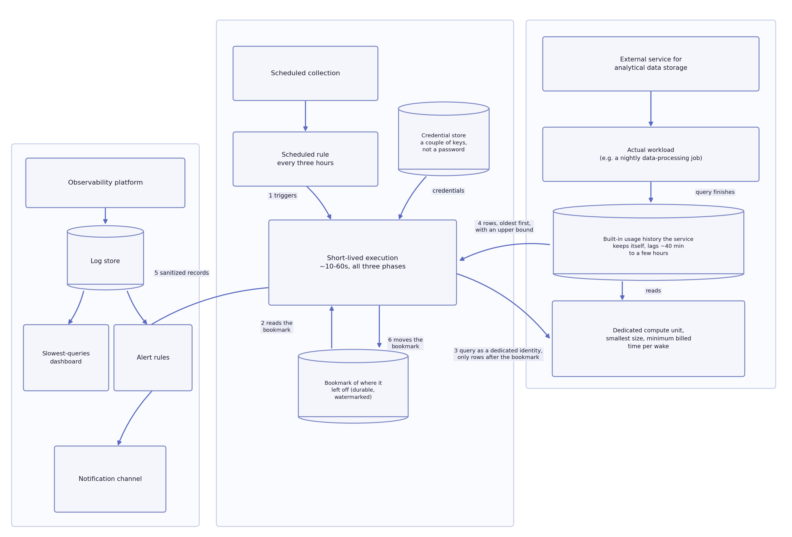
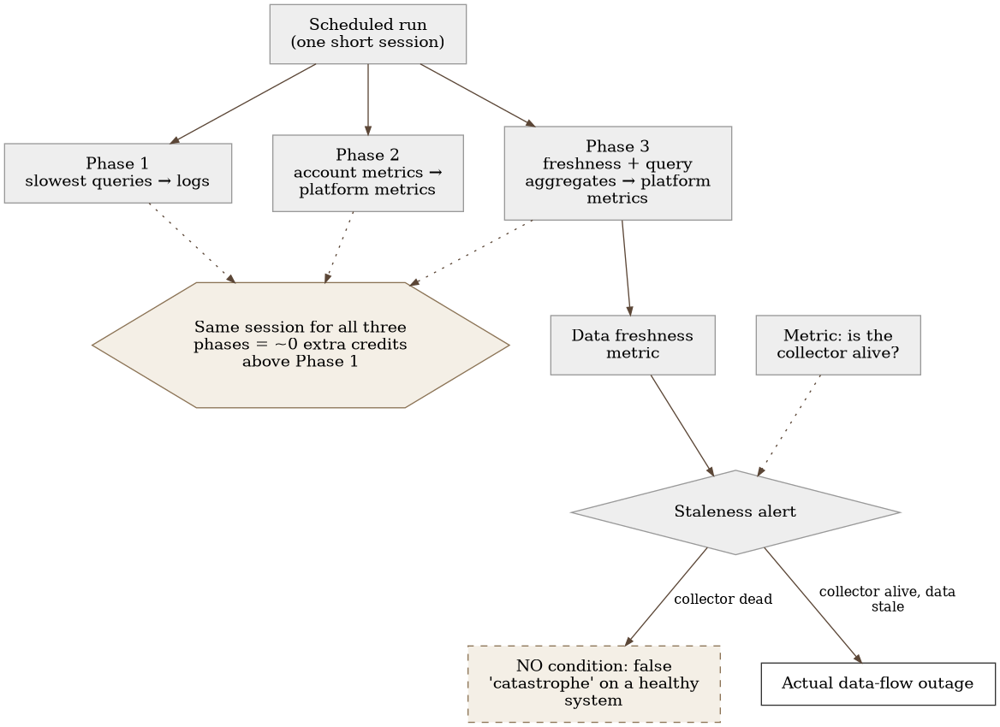
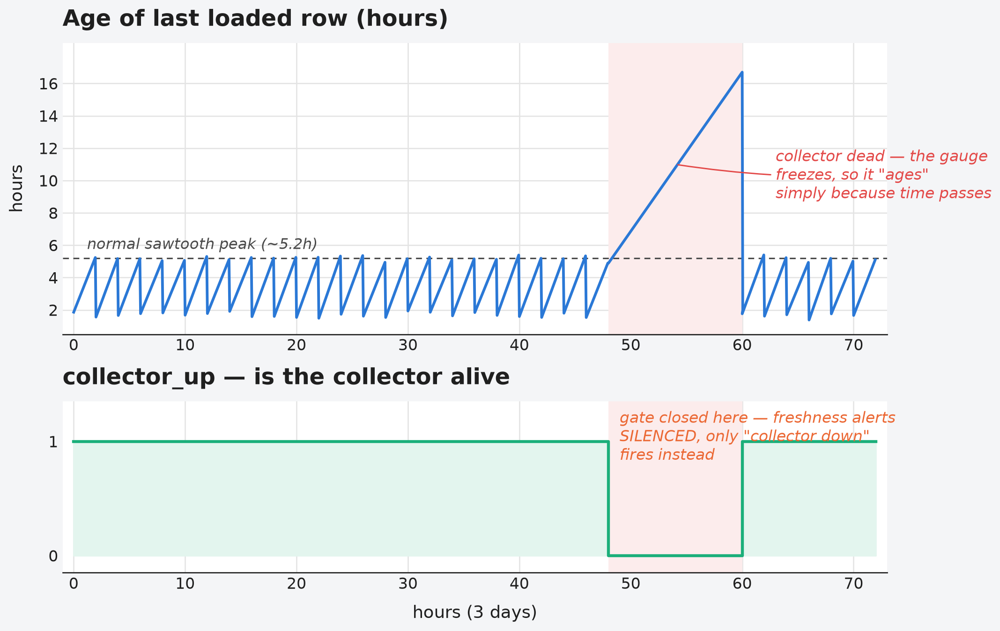

# Chapter 24 — Observing a service that isn't ours (the Snowflake kind)

When a restaurant hires an outside caterer for a big event, that restaurant's
head chef cannot walk into the caterer's kitchen, cannot check the
temperature of their oven, cannot stand next to their cook and watch a dish
being prepared. All the head chef has is whatever the caterer decides to
show them: the bill at the end, the quantity delivered, and, if the caterer
is diligent, a report of what was sent and when. None of it is live — the
bill arrives the next day, the report lags an hour or two. And if the
caterer stops sending reports, that doesn't necessarily mean the food has
stopped arriving — maybe the administrative person who writes the reports
just went on vacation. A head chef who fails to tell the two apart might
conclude the whole event fell through, when in fact the food arrived
perfectly on time — only the report about it didn't.

## 24.1 The question this chapter answers

The last domain case study in this part of the book differs from all the
previous ones in one fundamental way: there is no host to install an agent
on, no process to attach to, no network to observe from inside our own
infrastructure. The service is entirely someone else's — living in the
vendor's cloud, managed exclusively by that vendor. What does it even mean
to "observe" something when we don't have a single one of the usual tools
for doing it?

## 24.2 How it was done — a practical overview

### Zero observability as the starting point

Before this work began, the external data-warehousing service the
implementation uses had absolutely no observability of any kind — not one
metric, not one log, not one alert. All that existed was the monthly bill
and, occasionally, a user's subjective impression that some queries were
"slow." This is a valuable starting point for the chapter — it sets it apart
from every previous case study, where some form of observability already
existed and was being improved.

### Why scheduled collection, not a direct connection

Before any of what's described above was built, three different paths to
the same goal were considered — a dashboard in the observability
platform showing what's happening inside the external service.

The first idea was to install a ready-made connector on the
observability platform for a direct, interactive connection to the
external service, signed and loaded outside the official catalog. This
turned out to be technically infeasible on the platform variant in use
(managed, in the cloud, not self-hosted): the managed variant installs
only connectors from the official catalog, and the mechanism for
privately signing and loading your own connector exists only for the
self-hosted variant of the platform. A dead end, discovered only after
it was attempted.

The second idea was to pay for the official, vendor-provided connector
for a direct connection — technically it would have worked on the
managed platform variant without any obstacles. It was rejected because
it represents a recurring, ongoing cost item, not a one-time build
cost — the budget for it didn't exist.

The third path — the one chosen and built — doesn't use any direct
connector at all: instead of interactive access where someone could
write an arbitrary query and get an answer immediately, a scheduled,
short-lived run periodically pulls the slowest queries from the
service's own, built-in usage history that it already keeps, and pushes
them as sanitized records directly into the observability platform. A
dashboard over those records replaces interactive browsing. The accepted
trade-off is explicit: there's no free, arbitrary querying that a real
connector would give you — what you get is a periodically refreshed
table of the worst queries, not an exploration tool.

### Three phases, one shared session

The solution was built in three separate phases, each covering a different
goal, but all three **share the same session** against the external
service — each phase runs inside the same scheduled, short-lived
invocation, rather than each one opening its own, fresh session:

- **Phase one** — a view of the slowest queries, delivered as searchable log
  entries, with a link back to the service's own diagnostic tool for each
  query.
- **Phase two** — account-level metrics: credits consumed, load per logical
  compute unit, storage footprint, login success rate.
- **Phase three** — data freshness (how old the last loaded row is in each
  key table) and aggregated query-performance figures per compute unit.

Sharing one session across all three phases isn't just a technical
convenience — it was a direct cost decision: because the external service
bills by the minimum activation time of a compute unit, every additional,
separate session would mean paying that minimum charge again. By merging
all three phases into one invocation, the second and third phases cost
practically **zero additional credits** above what the first phase would
have cost on its own.

### How the mechanism actually works, step by step

All three phases from the previous section are executed by the same
mechanism, and that mechanism is worth describing at the "how" level,
not just the "what":

- **Trigger.** A scheduled rule kicks off a short-lived run every three
  hours. A trap worth knowing: an "every N hours" schedule like this is,
  in practice, computed from the moment *the rule itself was created*,
  not from clock midnight — if the rule is ever recreated (not just
  edited), the exact trigger time shifts. Whoever first sets up a
  schedule like this expecting it to land on round hours will be
  surprised.
- **The bookmark of where it left off.** Before each query against the
  external service, the mechanism reads a durably stored bookmark — the
  last row it successfully reached. The query asks only for rows newer
  than that bookmark, with an upper bound on the number of rows per run,
  always oldest first. The bookmark only advances once the rows have
  been successfully delivered to the observability platform — not
  before — so a failed run neither loses rows nor duplicates them.
- **A minimally privileged identity.** The query doesn't run under the
  same identity real applications use, but under a purpose-built,
  read-only identity, limited to only the required view of usage
  history. Authentication goes through a key pair, not a password — a
  leaked credential here opens nothing beyond this narrow view. The
  query itself runs on the smallest possible unit of compute the service
  offers, for the same reason mentioned earlier: minimum billed time per
  wake-up.
- **Sanitization before the data leaves the service.** The text of every
  query is scrubbed of actual values before being sent (concrete
  literals are replaced with a placeholder character), collapsed to a
  single line, and truncated to a reasonable length — what arrives at
  the observability platform is the shape of the query, not the data the
  query ran over.
- **Delivery.** The sanitized rows are sent as logs, through the same
  general protocol this implementation uses everywhere to send logs,
  directly into the observability platform — no intermediary server, no
  temporary file.

The entire run, all three phases together, takes on the order of ten
seconds to a minute — short enough that the code package doesn't even
need to be packaged as a container image. A run that finds no new rows
is entirely routine and quietly finishes with nothing to send — for most
of the day, an earlier run the same day has already picked up everything
that happened that day.

{: width="90%" }

### Structural lag, not a design flaw

The implementation explicitly documents that nothing in this system is, or
was ever meant to be, real-time. The data the external service exposes
about its own usage lags anywhere from forty-odd minutes to several hours,
depending on which kind of data is being observed — this lag is a published
property of the service itself, not a consequence of anything in the
implementation. The practical consequence: the threshold for "data didn't
arrive on time" has to be set with a deliberate margin above this published
lag, because a threshold set too close to the actual lag would constantly
false-alert on a perfectly healthy system.

### An alert that depends on the health of its own collector

The most important lesson from this implementation, uncovered and fixed
only after the initial rollout: an alert that tracks data freshness must be
explicitly conditioned on the collection mechanism itself being alive, not
just on whether the observed value has gone stale. The original version of
this alert watched only the age of the freshness metric itself — and once
the collection mechanism stopped running (with no error anywhere in the
call itself, it just quietly never finished), the freshness metric froze at
its last value while time kept passing, which inevitably crossed the
staleness threshold and fired a false, critical alert about a supposed
**complete halt in the data flow** — on a system that was, in reality,
completely healthy. The fix was to make the data-freshness alert explicitly
conditional on a separate "is the collector even alive" metric: without
that condition, a dead collector looks identical to a catastrophic outage
of the data flow from the external service — two entirely different
problems, the same false picture.

### Discovered only after someone finally looked

The mere act of introducing observability uncovered problems that had
existed for months, completely invisible because no one had ever had a
reason to go looking for them: a handful of temporary, "transitional"
tables — leftovers from routine monthly and annual data refreshes — had
never been dropped after the job they were built for finished, amounting
to several terabytes of dead space still being billed every month.
Separately, it turned out that three different environments — development,
test, and production — shared the **same** identity and the same
credential for accessing the external service, stored directly as a plain,
unencrypted environment variable. The practical consequence of this second
finding is serious: a credential leak from the least sensitive, nearly
inactive development environment would, at that point, have been
indistinguishable from a leak of the production credential — because,
technically, they were the same one. Both findings were reported to the
data owners for further decision; observability only made them visible, it
didn't fix them.

{: width="90%" }

{: width="95%" }

### Fixing attribution isn't fixing identity — and that was a deliberate choice

The finding about shared identity from the previous section opens an
obvious question: why wasn't it fixed right away? The answer is that the
real fix — splitting one shared account into a separate identity for
each environment — isn't something that can be changed from this side,
outside the owner of that account, and isn't something done overnight.
While that fix waits, an unanswered question remains: how to distinguish
one environment's traffic from another's in the meantime at all, when
all three write identical queries under the same username?

The answer that was applied doesn't touch identity at all. The
connection string the application uses to connect to the external
service carries parameters the service itself doesn't recognize — and it
turned out that the driver silently turns such an unrecognized parameter
into a session parameter, instead of rejecting the connection. That
means it's enough to add one such parameter with a value that identifies
the environment ("this is test," "this is production") for every query
that session executes from then on to carry that tag in the service's
usage history — without a single line of code, without a new release,
just an environment variable change and a restart.

The same driver property that made this safe to try has a flip side, and
both matter equally:

- **Safe:** a wrong parameter name can't bring down the connection at
  startup — trying it carries no risk of stopping the application.
- **Dangerous:** a wrong parameter name **silently does nothing at
  all**. The connection succeeds, the application keeps running,
  everything looks completely normal — and not a single query carries
  the new tag, and nothing at that moment reports it.

The consequence is a discipline that runs through this book in
different forms: that a connection succeeded, or that an environment
reported healthy again after a restart, proves nothing about whether the
change actually worked. The only reliable proof is looking at the
**effect** — in this case, a query straight against the service's usage
history that counts how many queries actually carry each environment's
tag over the last few hours. Rolling out this parameter really was done
gradually, environment by environment, and right at one of the
intermediate steps a useful near-incident happened: that environment
reported seriously degraded health for a few minutes during the change
itself. It turned out the cause wasn't the service parameter at all but
a perfectly ordinary, expected artifact of the platform the application
runs on — old instances being retired during a routine restart
rotation, while the remaining ones kept serving traffic cleanly without
a single error. Had the check stopped at the status color, instead of
looking at actual traffic, the near-incident could easily have been
misread as a harmless parameter change having broken something.

Production was deliberately left untouched by this quick, manual change
entirely — the tag was put into production only through the regular code
delivery path, with the system owner's approval. The reason isn't
caution for caution's sake: a more complete replacement of the same
mechanism — a tag per individual request, not just per environment — was
already in progress through that same delivery path, and a manual change
to production would be work the next regular release would immediately
overwrite. A quick manual fix makes sense where nothing better is
already on the way; when something better is already coming through the
same channel, the manual shortcut becomes work someone else will erase.

### When a threshold was tuned for someone else's job, your own traffic becomes invisible

Per-environment tagging solves the question of "whose query is this." It
doesn't solve a different, separate question: whether that query even
shows up on the slowest-queries dashboard from earlier in this chapter.
Here a finding turned up that deserves its own paragraph, because it
looks like a broken tag while actually being something else entirely.

The slowest-queries dashboard selects queries that run at least sixty
seconds — a threshold that made sense for a job that periodically loads
large volumes of data, and that regularly crosses that threshold. The
main application, which uses this same external service for an entirely
different purpose — quickly serving individual user requests — executes
tens of thousands of queries a day against that same service, and **not
a single one** of them crosses that sixty-second threshold. The
consequence: every row that dashboard has ever shown comes from the
data-loading job, never from the main application — a dashboard that's
supposed to cover the whole service is, in practice, a dashboard for
only one of its consumers.

When the per-environment tag was rolled out, it was naturally expected
that a new column on that same dashboard would immediately show the main
application's traffic by environment. That column stayed empty — and
this is the moment where the difference between two explanations matters
most. An empty column *looks* like proof the tag isn't working, the same
failure described in the previous section. It isn't: the tag works
correctly and is written onto every query; the queries it's written onto
simply never cross the threshold that would bring them onto this
particular dashboard. This is a variant of the same pattern seen earlier
in the book (Chapter 20, logins counted as zero not because there are
none, but because the selector looks at the wrong event type) — a
measurement that looks like "nothing is happening" while the real cause
lies in where the boundary is drawn, not in whether anything is actually
happening. The only way to tell these two explanations apart is to check
directly against the usage history, bypassing the dashboard and the
threshold, whether the tag really is present on the main application's
queries — and it is. The right fix isn't "check whether the tag is
broken," but a separate, lower threshold for this particular service
consumer — an acknowledged, not-yet-implemented item on the improvement
list, not something any change to the tag itself could fix.

## 24.3 Analytical section — observability without infrastructure access as a distinct problem

### The service itself distinguishes between two different forms of its own observability

The external service's official documentation draws a clear line between
two entirely separate problems: instrumenting **code that runs inside** the
service (stored procedures, user-defined functions) versus observing **how
the service as a whole is used** (consumption, queries, load, logins). The
service solves the first problem with its own tracing and event mechanism,
built into the platform. The second problem — the one this chapter deals
with — the service solves only through its own queryable views into usage
history. The implementation correctly recognized that its case is
exclusively this second one: the service is used as a data store, not as a
platform on which its own code runs, so the first mechanism simply has
nothing to observe in this case.

### The published lag is officially documented, per view, not assumed

The official documentation for every individual queryable view the
implementation uses states an explicit, numeric value for the expected
lag — from forty-odd minutes to several hours, depending on the specific
view — with a note that these values are "approximate" and that the actual
lag can sometimes be shorter. This directly confirms that the
implementation did not arbitrarily guess at the lag, but pulled it from the
service's own published specification — a principle that should be applied
to every external service whose internal state is observed only through
its own exposed API, not through direct access.

### The "a dead collector looks like a catastrophe" pattern is a known, named problem in black-box monitoring

The broader literature on observing systems without direct host access —
through periodic polling of someone else's exposed API, a common pattern
for any external, managed service — treats the ambiguity of "no new data"
as a well-known, recurring problem: such an alert, by definition, looks
identical whether the upstream service has genuinely gone silent or the
collection mechanism itself has stopped running. The standard, recommended
fix is exactly the one the implementation applied only after its first
false alert — make the staleness alert conditional on the independently
verified health of the collector itself, rather than treating "stale
metric" and "silent upstream service" as the same signal.

### Tuning the minimum activation time has no universally correct value

Both the external service's official documentation and independent
commentary on cloud cost control reject the idea of one universally
"correct" value for a compute unit's minimum activation time — instead,
both sources treat it as a trade-off specific to the workload, between
shutdown speed (less credit wasted while the unit sits idle) and preserved
cache warmth (faster next execution if the unit stays active a little
longer). The official recommendation goes further and explicitly warns
against a mismatched value — keeping a rarely used unit active for too long
burns credits with zero benefit from the cache. This confirms that the
implementation's choice to keep an aggressively short activation time for a
scheduled, periodic job — where there's no benefit from a warm cache
between runs hours apart — isn't arbitrary, but aligned with the workload's
own logic.

### Same change, two warehouses, opposite sign — measurement decides, not a rule

A concrete measurement on two different Snowflake warehouses in the same
system goes a step beyond the general principle above: it shows that an
identical change — a shortened minimum activation time — isn't just a
question of "how short," but a question with an **opposite** sign
depending on the warehouse.

On the warehouse dedicated to the periodic, scheduled job, shortening
the minimum activation time was the single best cost fix in the entire
system — measurement showed that most of the gaps between queries are
longer than the existing minimum, so a shorter minimum translates
directly into savings with no lost benefit from cache warmth (which
doesn't exist there anyway). On the other, neighboring warehouse that
serves interactive, frequent traffic, the exact same change would make
the cost **worse**, not better — measurement showed the opposite
distribution: most of the gaps between queries are shorter than the
existing minimum, so shortening it would just multiply the number of
times the warehouse restarts and pays its own per-startup billing
minimum, instead of simply waiting out that gap.

The decisive data point isn't the type of workload, nor an intuition
about "this warehouse looks busier" — the decisive factor is the actual
distribution of gap lengths between queries, per warehouse, invisible
without cost attribution down to the level of an individual query. The
rule that follows: a change to the minimum activation time is never
copied from one warehouse to another as "best practice" — every
warehouse carries its own distribution of gaps, and that distribution,
measured, is the answer.

### Counterfactual scenario: what would have stayed invisible without this work

Imagine the decision had been "we don't have infrastructure access, so
there's nothing to observe" — a valid-sounding but wrong conclusion.
Several terabytes of unused, forgotten tables would have kept being billed
indefinitely, because no one would have had a reason to look for them
without a systematic review of usage per table. A shared, unencrypted
credential across three environments would have stayed undiscovered until,
in the worst case, a leak from the least-guarded environment turned into an
actual security incident in production. Both findings existed before this
work, entirely invisible — observability didn't create them, it just made
it possible, for the first time, for them to be seen.

Let's return to the restaurant and its outside caterer from the start of
this chapter. The head chef will never be able to walk into someone else's
kitchen — but they can demand a better report, compare it week over week,
and notice when something in that report doesn't add up, even through that
usual, accepted one-day lag. Observing a service that isn't ours will never
be the same as observing our own infrastructure — but not having access to
the host is not the same as not having the ability to find anything out. We
come back to a question posed much earlier in this book: what does it even
mean to "observe" something — and the answer, confirmed here on the hardest
possible example, stays the same. Observability was never about direct
access. It was always about asking the right question and finding **any**
reliable path to the answer, even when that path runs through someone
else's delayed report.

## 24.4 Rules collected from this chapter

- When a service has no host or process you can reach, look for its own
  queryable views into usage history that the service exposes itself —
  that's the only source of truth available, and nearly every serious
  external service has one in some form.
- Pull the published lag directly from the service's official
  specification, for each individual data source — don't assume a single
  lag value applies to the whole service at once.
- Condition every data-staleness alert on an independent check that the
  collection mechanism itself is alive — without that condition, a dead
  collector and an actual outage in the flow look identical, and will
  falsely trigger the most serious alarm possible.
- When billing depends on a minimum activation time, merge all collection
  phases into one shared session instead of letting each one open its
  own — the cost difference can be enormous for a job that would otherwise
  never even notice it's sharing infrastructure.
- Expect that the mere act of introducing observability will surface
  problems that have nothing to do with observability itself — forgotten
  resources, shared credentials — because no one before had a reason, or a
  tool, to go looking for them.
- When identity can't be fixed right away, look for a lighter, reverse
  fix for attribution instead — but check whether the mechanism that
  makes that possible (e.g., an unrecognized connection parameter the
  driver silently accepts) has a flip side too: the same property that
  makes a trial safe makes a typo completely invisible. Always verify
  the effect, never just that the connection or the environment stayed
  healthy.
- An empty column or a zero value after a rollout isn't automatically
  proof the change doesn't work — check whether a threshold or filter
  structurally excludes exactly that traffic before concluding the
  change itself is broken.
- Don't copy a minimum activation time setting from one warehouse to
  another as "best practice" — the same change can save on one and cost
  more on another, depending on the distribution of gaps between queries
  specific to that warehouse. Measure per warehouse, never generalize
  from a single case.
- When a direct, interactive connection to an external service isn't
  available for free (and the paid variant isn't in the budget), check
  whether the external service already keeps its own usage history that
  you can periodically pull and push as logs — a periodically refreshed
  table of the worst cases is often a good enough substitute for free-form
  querying.

## 24.5 Exercise for the reader

List the external, managed services your system uses that you have no host
or process access to whatsoever — a payment service, an email-sending
service, an external data-storage layer, anything living in someone else's
cloud. For one of them, find out whether that service exposes its own view
into usage history that could be polled regularly. If it exists, and no one
is currently using it — that's the gap this chapter is asking you to close.

---

### Sources used in the analytical section

- [Account Usage — Snowflake Documentation](https://docs.snowflake.com/en/sql-reference/account-usage)
- [QUERY_HISTORY view — Snowflake Documentation](https://docs.snowflake.com/en/sql-reference/account-usage/query_history)
- [WAREHOUSE_METERING_HISTORY view — Snowflake Documentation](https://docs.snowflake.com/en/sql-reference/account-usage/warehouse_metering_history)
- [Optimizing the warehouse cache — Snowflake Documentation](https://docs.snowflake.com/en/user-guide/performance-query-warehouse-cache)
- [Observability in Snowflake: A New Era with Snowflake Trail — Snowflake Blog](https://www.snowflake.com/en/blog/observability-new-era-with-snowflake-trail/)
- [How to setup a Prometheus dead man's switch](https://jakubstransky.com/2019/01/26/who-monitors-prometheus/)
