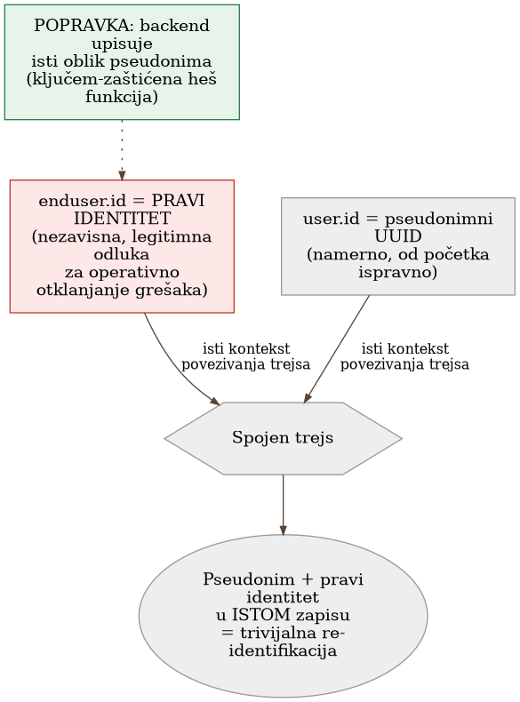
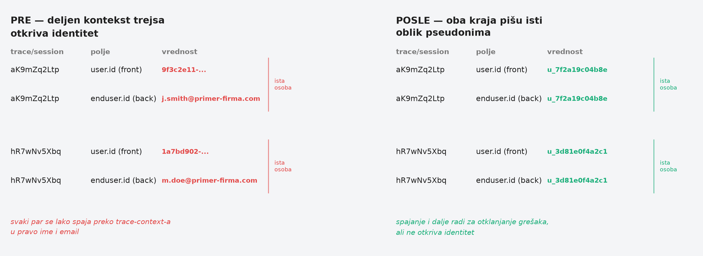

# Chapter 25 — Privacy in telemetry

The witness protection program exists for exactly one assumption: that no
one can connect the new name to the old life. A witness is given a new
identity, a new address, a new biography — all carefully separated from the
previous file, which stays locked at a single agency, under strictly
limited access. Protection doesn't fail because the new name was poorly
designed. It fails the moment two different institutions — say, a hospital
and a bank — happen to start using the same internal case number for the
same person, neither one knowing that number exists anywhere else. Someone
with access to only one of those two institutions still sees nothing. But
someone who links the two records through the shared number suddenly has
the old name, the new address, and everything protection was meant to keep
apart — and neither institution individually did anything wrong. What went
wrong was the system that never noticed the same number ran through both.

## 25.1 The question this chapter answers

Telemetry collects everything anyone instruments, often more than anyone
planned for — user identity, IP addresses, parameters from the URL. Why
isn't "strip it in the browser" enough when the same data travels by
another path that filter never touches, and what does it actually mean to
close that gap — not at one point, but across the whole chain?

## 25.2 How this was done — a practical overview

### The discovery: pseudonymous on one side, fully exposed on the other

The frontend application of the implementation this book follows was
deliberately designed to send only a pseudonymous user identifier — a
random UUID from the authentication system, never a name or email. That
was the right, deliberate decision from day one. The problem was
discovered only when someone checked what happens **after** that first
step: the browser forwards the standard trace-linking context (the same
mechanism that ties one user request to the corresponding processing on
the server) to the backend service — and that backend service, completely
independently and for a wholly different, legitimate reason (operational
debugging), writes the user's **real email** onto its own part of the same
trace. When the two halves of the same trace are pulled up together, two
pseudonymous signals turn into one fully identified record — not because
either side individually made a mistake, but because the shared linking
context joins together what was supposed to stay apart.

### Verification against real data, not an assumption

This wasn't a theoretical exercise — the implementation checked against a
real, live session: the pseudonymous identifier on the browser side was
tracked across dozens of linked requests to the backend, and in the large
majority of them the backend half of the same trace carried the user's
real identity. In other words, the "pseudonymous session" was
**trivially** resolvable down to a specific person's name directly from
the trace-browsing tool, without a single additional lookup step in any
user database.

### Why the fix has to go to the source, not to a filter

The first instinctive reaction — add a filter that strips identifying data
from the URL and query parameters on the browser side — had already been
implemented, and it was correct **for signals that never touch the
backend**. But that filter, however thorough, can do nothing about what
gets written onto the server-side half of the same trace — because that
write happens entirely separately, in another system, after the moment the
browser has already sent its own half. The fix has to go to the source of
the problem: the backend itself needs to stop writing the real identity,
and instead write the **same** form of pseudonym the frontend already
uses.

### A derived pseudonym, not a bare hash

The solution the implementation designed doesn't use a plain hash of the
email address — because the space of possible email addresses is small
and predictable enough that a bare hash would be trivially broken with a
precomputed table. Instead, the pseudonym is derived through a keyed hash
function: the same email address always produces the same pseudonym
(which preserves the ability to track the same user over time, useful for
dashboards), but no one without the secret key can work backward from the
pseudonym to the real identity. On top of that, the implementation keeps
one, strictly controlled way to resolve backward — an administrative
endpoint that, only for an authorized role and with full audit logging of
who resolved whom and when, returns the real identity behind the
pseudonym for the rare cases where that's genuinely operationally
necessary.

### What the fix doesn't solve — and why that's fine

The implementation is explicitly aware of the limits of its own fix:
historical telemetry, already recorded before the change, stays in raw
form — pseudonymization isn't retroactive, and the old records simply age
out through the normal retention policy. This isn't an oversight but a
sober judgment call: retroactively rewriting data already recorded would
be disproportionately expensive relative to the benefit, given that the
retention period will delete those records soon enough anyway. The
implementation also draws a clear, documented distinction between
identifiers of a **person** (which are never recorded in the new fields)
and identifiers of the **asset/resource the query was run against** (which
are deliberately still recorded, because they identify what was queried,
not who queried it) — a distinction that keeps pseudonymization from being
over-applied where it's neither needed nor useful.

{: width="90%" }

{: width="95%" }

## 25.3 Analytical section — a known leakage pattern, with a precise name

### Pseudonymization remains personal data — and that changes the obligation

The official guidance on pseudonymization is unambiguous: pseudonymized
data **remains** personal data in the full legal sense, because
re-identification is still possible in principle — the distinction from
fully anonymized data (which drops out of the obligation entirely) is
sharp and deliberate. This means the implementation's pseudonymization
didn't "solve" the legal obligation — it reduced risk and tightened
minimization, but the data still demands the same care as any other
personal data, just with lower risk to the individual if a leak occurs.

### What happened has a precise name in the literature: a linkage attack

The scenario the implementation uncovered — two seemingly harmless,
pseudonymous data sets that together reveal identity the moment they're
joined through a shared key — is formally described in the privacy
engineering literature as a **linkage attack**: assembling an identifying
record by combining a targeted data set with an auxiliary or external
source. The official pseudonymization guidance goes a step further and
names exactly this mechanism as the reason it recommends **transactional**
pseudonyms (different for every interaction) over **personal** pseudonyms
(stable, reused everywhere) — because it's precisely a stable, shared
identifier that makes linkage easy. The implementation deliberately kept a
stable pseudonym (for the sake of longitudinal per-user analysis) with
full awareness of this trade-off — a reasonable decision, but one that has
to stay visible, not assumed.

### A keyed hash function is the officially recommended choice, not an arbitrary one

Both the official pseudonymization guidance and the broader technical
literature explicitly warn against a bare, unkeyed hash of low-entropy
identifiers like email addresses — precisely because of the risk from
precomputed tables. The recommended direction is a keyed one-way function,
with sufficient entropy in the key itself. A further, subtler point from
the same literature, directly relevant here: using the **same** key
across two different systems reintroduces the possibility of linkage — if
two services hash the same email address with the same key, their outputs
match and can be joined, defeating the purpose of isolation. The
implementation addresses this by keeping the key singular and internal,
stored separately from any external system.

### The right to erasure collides with the architecture of telemetry systems

Broader analysis shows that the right to erasure of personal data is a
genuine, unresolved friction point for most metrics and logging systems —
many are architected as append-only, precisely for reliability and audit
integrity, without any built-in capability to delete by individual
subject. This means the runbook for on-request deletion — which the
implementation has only planned, not yet built — is a substantively
important step, not an administrative footnote: without it, the deletion
obligation is either ignored or handled with a blunt instrument (deleting
an entire period of data instead of just one person's).

### Counterfactual scenario: what a browser-side filter wouldn't have caught

Imagine a team that stopped at "the browser sends only a pseudonym, done"
— and never checked what happens to that same trace past the system's
first boundary. Every dashboard and every trace-search tool would still
look correct: pseudonym visible, name nowhere directly in the UI. But
anyone with access to the trace-viewing tool could, in a few clicks,
follow a single trace from pseudonym to real name — it would only surface
the moment someone actually checked, or worse, when someone abused exactly
that capability. The impression of privacy would exist; actual privacy
would not.

Let's return to the witness protection program from the start of the
chapter. A new identity on its own isn't enough — protection holds only if
**every** institution that touches that identity knows not to share the
same internal number with any other. Pseudonymization in telemetry runs
on the same rule: it isn't enough for one layer of the system to be
careful. The whole chain has to be careful, from the first signal to the
last place where two signals can meet.

## 25.4 Rules collected from this chapter

- Don't trust that pseudonymization at one point in the system is enough —
  check whether the same identity, in any other form, gets written
  somewhere downstream where two signals can be linked through shared
  context.
- Use a keyed hash function for pseudonyms, never a bare hash of a
  low-entropy identifier like an email address — and keep the key
  singular, internal, never shared between systems that are otherwise
  meant to stay unlinked.
- Remember that pseudonymized data remains personal data in the full legal
  sense — it reduces risk, it doesn't remove the obligation.
- Separate identifiers of a person (never recorded in new fields) from
  identifiers of the resource something was done to (legitimately
  recorded, because they identify what was queried, not who queried it) —
  don't apply pseudonymization where it isn't even needed.
- Plan the on-request deletion runbook in advance, knowing that most
  metrics and logging systems aren't architected for deletion by
  individual subject — waiting until a request actually arrives is too
  late to be designing the solution for the first time.

## 25.5 Exercise for the reader

Find one identifier in your system that's pseudonymized at a single point
(frontend, one service, one log). Trace that identifier downstream —
through every service that touches the same request or the same session —
and check whether any of them writes the real identity somewhere else in
the same context. If the answer is yes, you've just found the same kind
of leak as in this chapter.

---

### Sources used in the analytical section

- [EDPB Guidelines 01/2025 on Pseudonymisation](https://www.edpb.europa.eu/system/files/2025-01/edpb_guidelines_202501_pseudonymisation_en.pdf)
- [ICO — Pseudonymisation guidance](https://ico.org.uk/for-organisations/uk-gdpr-guidance-and-resources/data-sharing/anonymisation/pseudonymisation/)
- [SoK: Managing risks of linkage attacks on data privacy — PETS 2023](https://petsymposium.org/popets/2023/popets-2023-0043.pdf)
- [ENISA — Pseudonymisation techniques and best practices](https://www.enisa.europa.eu/publications/pseudonymisation-techniques-and-best-practices)
- [NIST SP 800-224 (draft) — HMAC specification](https://csrc.nist.gov/pubs/sp/800/224/ipd)
- [Axiom — The Right to Be Forgotten vs. Audit Trail Mandates](https://axiom.co/blog/the-right-to-be-forgotten-vs-audit-trail-mandates)
