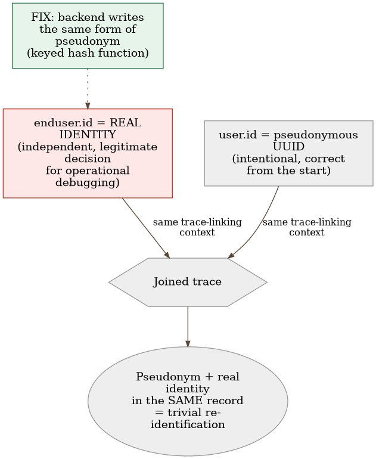
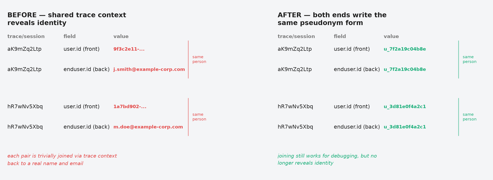
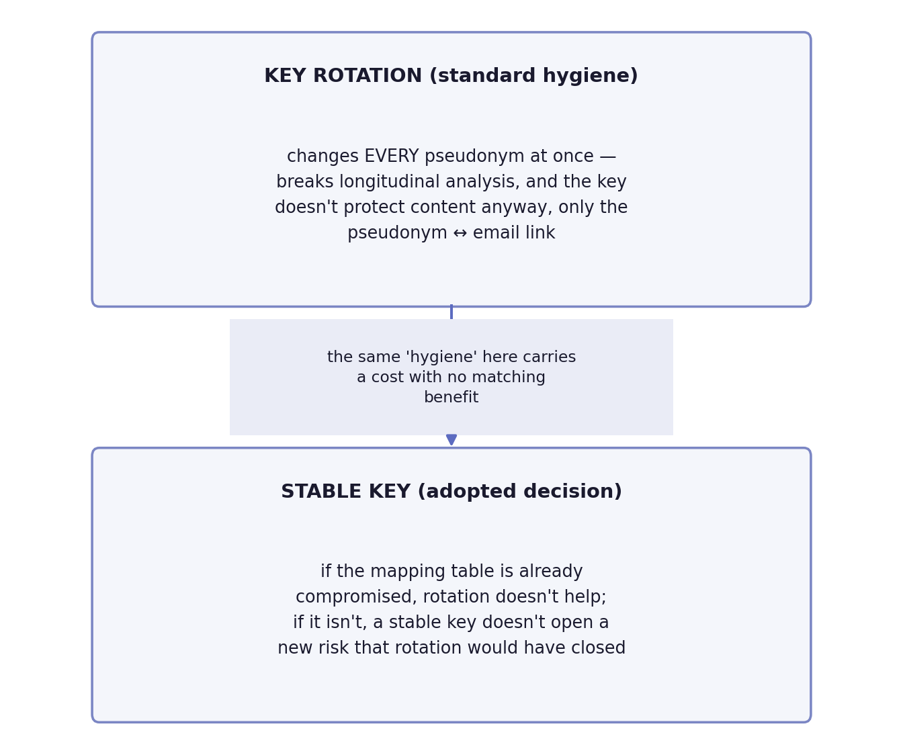

# Chapter 25 — Privacy in telemetry

The witness protection program exists for exactly one assumption: that no
one can connect the new name to the old life. A witness is given a new
identity, a new address, a new biography — all carefully separated from the
previous file, which stays locked at a single agency, under strictly
limited access. Protection doesn't fail because the new name was poorly
designed. It fails the moment two different institutions — say, a hospital
and a bank — happen to start using the same internal case number for the
same person, neither one knowing that number exists anywhere else. Someone
with access to only one of those two institutions still sees nothing. But
someone who links the two records through the shared number suddenly has
the old name, the new address, and everything protection was meant to keep
apart — and neither institution individually did anything wrong. What went
wrong was the system that never noticed the same number ran through both.

## 25.1 The question this chapter answers

Telemetry collects everything anyone instruments, often more than anyone
planned for — user identity, IP addresses, parameters from the URL. Why
isn't "strip it in the browser" enough when the same data travels by
another path that filter never touches, and what does it actually mean to
close that gap — not at one point, but across the whole chain?

## 25.2 How this was done — a practical overview

### The discovery: pseudonymous on one side, fully exposed on the other

The frontend application of the implementation this book follows was
deliberately designed to send only a pseudonymous user identifier — a
random UUID from the authentication system, never a name or email. That
was the right, deliberate decision from day one. The problem was
discovered only when someone checked what happens **after** that first
step: the browser forwards the standard trace-linking context (the same
mechanism that ties one user request to the corresponding processing on
the server) to the backend service — and that backend service, completely
independently and for a wholly different, legitimate reason (operational
debugging), writes the user's **real email** onto its own part of the same
trace. When the two halves of the same trace are pulled up together, two
pseudonymous signals turn into one fully identified record — not because
either side individually made a mistake, but because the shared linking
context joins together what was supposed to stay apart.

### Verification against real data, not an assumption

This wasn't a theoretical exercise — the implementation checked against a
real, live session: the pseudonymous identifier on the browser side was
tracked across dozens of linked requests to the backend, and in the large
majority of them the backend half of the same trace carried the user's
real identity. In other words, the "pseudonymous session" was
**trivially** resolvable down to a specific person's name directly from
the trace-browsing tool, without a single additional lookup step in any
user database.

### Why the fix has to go to the source, not to a filter

The first instinctive reaction — add a filter that strips identifying data
from the URL and query parameters on the browser side — had already been
implemented, and it was correct **for signals that never touch the
backend**. But that filter, however thorough, can do nothing about what
gets written onto the server-side half of the same trace — because that
write happens entirely separately, in another system, after the moment the
browser has already sent its own half. The fix has to go to the source of
the problem: the backend itself needs to stop writing the real identity,
and instead write the **same** form of pseudonym the frontend already
uses.

### A derived pseudonym, not a bare hash

The proposal the team put together deliberately doesn't use a plain hash
of the email address — because the space of possible email addresses is
small and predictable enough that a bare hash would be trivially broken
with a precomputed table. Instead, the proposal derives the pseudonym
through a keyed hash function: the same email address would always
produce the same pseudonym (which would preserve the ability to track
the same user over time, useful for dashboards), and no one without the
secret key would be able to work backward from the pseudonym to the real
identity. The proposal also includes one, strictly controlled way to
resolve backward — an administrative endpoint that would, only for an
authorized role and with full audit logging of who resolved whom and
when, return the real identity behind the pseudonym for the rare cases
where that's genuinely operationally necessary.

It's worth saying this explicitly, not just assuming it: at the time of
writing this is a design on paper, not a shipped change. The proposal
carries a "not started" status, with several decisions still waiting for
someone with authority to make before any of this lands in code —
including the exact key-rotation question from the next section. The
discovery from a moment ago (71 of 98 linked spans) is real and
confirmed; the fix described here is a proposal for how to close that
discovery, not a description of something that has already happened.

### What the fix doesn't solve — and why that's fine

The proposal explicitly acknowledges the limits of its own scope, up
front: historical telemetry, already recorded before any change, would
stay in raw form — pseudonymization would not be retroactive, and old
records would simply expire through the normal retention policy. This
isn't an oversight but a sober judgment call made in advance:
retroactively rewriting data already recorded would be disproportionately
expensive relative to the benefit, given that the retention period will
delete those records soon enough anyway. The proposal also draws a clear
distinction between identifiers of a **person** (which would not be
recorded in the new fields) and identifiers of the **asset/resource the
query was run against** (which would deliberately still be recorded,
because they identify what was queried, not who queried it) — a
distinction that would keep pseudonymization from being over-applied
where it's neither needed nor useful.

{: width="90%" }

{: width="95%" }

### Parameter type as proof, not just a naming rule

The distinction between "person identifiers" (never logged) and "resource
identifiers" (legitimately logged) from the previous section sounds like a
rule someone has to remember and disciplinedly apply to every new field.
The implementation went a step further: instead of relying purely on
naming discipline, it checked whether the parameter's **typing** itself
structurally prevents the leak. Parameters that identify a resource (an
asset identifier, a location identifier) are declared in the backend
controller as strictly typed values (UUID, a decimal number) — meaning the
request-handling framework **rejects** any call where someone tries to put
free text, an email, or a token into that field. The rule "this field is
safe to log" isn't just an agreement living in the team's heads here — it's
**structurally impossible to violate otherwise**, because a malformed
value never gets past request validation.

This check also revealed the boundary of its own rule: two neighboring
parameters in the same query set are plain text fields, not typed values,
and their content is entirely in the hands of whoever sends the request —
there's no type guarantee they won't contain something sensitive. The
implementation **still** logs them (they haven't been declared person
identifiers), but with an extra measure typed parameters don't need:
encoding special characters before writing to the log, so free-text
content can't inject a separator or newline and corrupt the structure of
the log record itself. Two different guarantees for two different
categories of parameters — one structural (type), one operational
(encoding) — applied exactly where each makes sense.

### Why the proposal recommends the pseudonymization key never rotate

Standard security hygiene calls for periodic rotation of secret keys — a
rule that holds for passwords, API tokens, encryption keys. For the key
that would drive the hash function behind pseudonyms, the proposal
deliberately goes **against** the usual rule: it recommends that the key
stay stable, with no planned rotation. But this is exactly the place to
be precise about what has been decided versus what is only proposed —
this is a recommendation that, at the time of writing, still awaits
official confirmation from someone with authority, not an already-adopted
rule. The reasoning behind the recommendation itself isn't negligence but
an explicit trade-off analysis made in advance. Rotating the key would
change **every** pseudonym at once — every user would get a new
pseudonym at the same instant, which would break longitudinal analysis (a
dashboard tracking the same user over time would suddenly see a "new"
user) and would require reconciling the internal mapping table that ties
pseudonyms to emails. By contrast, the benefit of rotation here would be
unusually small: the key wouldn't protect the content itself (the email
would stay readable in the mapping table regardless of the key) — it
would only protect the **link** between the pseudonym and the email for
anyone who sees the pseudonym without access to that table. If the
mapping table were already compromised, rotating the key would fix
nothing; if it weren't, a stable key wouldn't open a new risk that
rotation would close. Security hygiene that makes sense for a password
would here only introduce operational damage with no corresponding
security benefit — which is an argument FOR the recommendation, not proof
that the question is closed. Until someone with authority officially
confirms it, key rotation remains an open item on the list of decisions
the proposal is waiting on, not a finished story.

{: width="80%" }

### A second question about the same data: not who can see it, but where it physically sits

Everything described so far in this chapter — trace linking,
pseudonymization, the keyed hash function — answers the question "who
can link this data to a specific person." A separate check, done after
that one, opened up an entirely different question about the same data,
one the first check doesn't even touch: which country that data is
physically processed in, regardless of who can see it.

The implementation's telemetry, including data relating to users from
the European Union, is processed exclusively in the observability
provider's region located in the United States — one region for all
traffic, regardless of where the user actually comes from. This fact
itself — which country a user is from — didn't exist as a recorded fact
anywhere in the system at all; finding out which users are actually from
the EU at all required manually going through a sample of real
production access logs and checking which organizations the domains of
logged-in users belong to. The result of that check: at least two users
are confirmed with certainty as organizations headquartered in the EU,
while for several other domains residency stayed unknown even after
checking — the very act of determining "who is from the EU" turned out
to be surprisingly non-trivial when the system doesn't record that fact
anywhere as a first-class one.

This opens a legal question entirely separate from everything earlier in
the chapter. Transferring personal data to a country the European Union
hasn't declared an adequate destination requires a formal safeguard — in
this case, standard contractual clauses inside a signed data processing
agreement with the provider, a transfer impact assessment documenting
the actual risk, and a clear notice in the privacy policy that data
linked to users is processed in that country. At the time of this check,
none of those three items could be confirmed as already in place — not
because someone consciously decided to skip them, but because no one had
even asked the question until that point. A cleaner solution, identified
but not yet implemented, is simple in principle: route all traffic
attributable to an EU user to the provider's region located inside the
EU, instead of the single US region that receives everything today.

The valuable lesson here isn't technical but structural: "privacy" in
telemetry isn't one problem with one solution. Identity leakage through
trace linking and cross-border data transfer are two entirely different
obligations within the same regulation, with two entirely different
remedies — one is solved by pseudonymization at the source, the other
solely by choosing **where** the infrastructure physically runs. Fixing
one doesn't move the needle on the other by a millimeter, and a team
that stopped after the first fix, convinced that "privacy is handled,"
would still leave the second one entirely untouched.

## 25.3 Analytical section — a known leakage pattern, with a precise name

### Pseudonymization remains personal data — and that changes the obligation

The official guidance on pseudonymization is unambiguous: pseudonymized
data **remains** personal data in the full legal sense, because
re-identification is still possible in principle — the distinction from
fully anonymized data (which drops out of the obligation entirely) is
sharp and deliberate. This means that the proposed pseudonymization, even once
implemented, won't fully "solve" the legal obligation — it will reduce
risk and tighten minimization, but the data will still demand the same
care as any other personal data, just with lower risk to the individual
if a leak occurs.

### What happened has a precise name in the literature: a linkage attack

The scenario the implementation uncovered — two seemingly harmless,
pseudonymous data sets that together reveal identity the moment they're
joined through a shared key — is formally described in the privacy
engineering literature as a **linkage attack**: assembling an identifying
record by combining a targeted data set with an auxiliary or external
source. The official pseudonymization guidance goes a step further and
names exactly this mechanism as the reason it recommends **transactional**
pseudonyms (different for every interaction) over **personal** pseudonyms
(stable, reused everywhere) — because it's precisely a stable, shared
identifier that makes linkage easy. The proposal deliberately chooses to keep a
stable pseudonym (for the sake of longitudinal per-user analysis) with
full awareness of this trade-off — a reasonable choice, but one that has
to stay visible, not assumed, and one that, as the previous section
showed, is still only a recommendation awaiting confirmation, not a
decision already made.

### A keyed hash function is the officially recommended choice, not an arbitrary one

Both the official pseudonymization guidance and the broader technical
literature explicitly warn against a bare, unkeyed hash of low-entropy
identifiers like email addresses — precisely because of the risk from
precomputed tables. The recommended direction is a keyed one-way function,
with sufficient entropy in the key itself. A further, subtler point from
the same literature, directly relevant here: using the **same** key
across two different systems reintroduces the possibility of linkage — if
two services hash the same email address with the same key, their outputs
match and can be joined, defeating the purpose of isolation. The
proposal addresses this by having the key remain singular and
internal, stored separately from any external system.

### The right to erasure collides with the architecture of telemetry systems

Broader analysis shows that the right to erasure of personal data is a
genuine, unresolved friction point for most metrics and logging systems —
many are architected as append-only, precisely for reliability and audit
integrity, without any built-in capability to delete by individual
subject. This means the runbook for on-request deletion — which the
implementation has only planned, not yet built — is a substantively
important step, not an administrative footnote: without it, the deletion
obligation is either ignored or handled with a blunt instrument (deleting
an entire period of data instead of just one person's).

### Counterfactual scenario: what a browser-side filter wouldn't have caught

Imagine a team that stopped at "the browser sends only a pseudonym, done"
— and never checked what happens to that same trace past the system's
first boundary. Every dashboard and every trace-search tool would still
look correct: pseudonym visible, name nowhere directly in the UI. But
anyone with access to the trace-viewing tool could, in a few clicks,
follow a single trace from pseudonym to real name — it would only surface
the moment someone actually checked, or worse, when someone abused exactly
that capability. The impression of privacy would exist; actual privacy
would not.

Let's return to the witness protection program from the start of the
chapter. A new identity on its own isn't enough — protection holds only if
**every** institution that touches that identity knows not to share the
same internal number with any other. Pseudonymization in telemetry runs
on the same rule: it isn't enough for one layer of the system to be
careful. The whole chain has to be careful, from the first signal to the
last place where two signals can meet.

## 25.4 Rules collected from this chapter

- Don't trust that pseudonymization at one point in the system is enough —
  check whether the same identity, in any other form, gets written
  somewhere downstream where two signals can be linked through shared
  context.
- Use a keyed hash function for pseudonyms, never a bare hash of a
  low-entropy identifier like an email address — and keep the key
  singular, internal, never shared between systems that are otherwise
  meant to stay unlinked.
- Remember that pseudonymized data remains personal data in the full legal
  sense — it reduces risk, it doesn't remove the obligation.
- Separate identifiers of a person (never recorded in new fields) from
  identifiers of the resource something was done to (legitimately
  recorded, because they identify what was queried, not who queried it) —
  don't apply pseudonymization where it isn't even needed.
- Plan the on-request deletion runbook in advance, knowing that most
  metrics and logging systems aren't architected for deletion by
  individual subject — waiting until a request actually arrives is too
  late to be designing the solution for the first time.
- Whenever possible, rely on a parameter's type to structurally prevent a
  leak, not just on a naming convention — and for fields that must stay
  free text, add an operational measure (encoding) that typed fields
  don't need.
- Before applying a general security rule (like periodic key rotation) to
  a new situation, check whether that rule's benefit actually applies
  here — rotation that breaks longitudinal analysis with no corresponding
  security gain is damage dressed up as hygiene.
- Don't equate "I solved who can link this data to a person" with "I
  solved privacy" — check separately where that data is physically
  processed too, because cross-border transfer of personal data carries
  its own, entirely independent obligation that no anti-linkage measure
  touches.

## 25.5 Exercise for the reader

Find one identifier in your system that's pseudonymized at a single point
(frontend, one service, one log). Trace that identifier downstream —
through every service that touches the same request or the same session —
and check whether any of them writes the real identity somewhere else in
the same context. If the answer is yes, you've just found the same kind
of leak as in this chapter.

---

### Sources used in the analytical section

- [EDPB Guidelines 01/2025 on Pseudonymisation](https://www.edpb.europa.eu/system/files/2025-01/edpb_guidelines_202501_pseudonymisation_en.pdf)
- [ICO — Pseudonymisation guidance](https://ico.org.uk/for-organisations/uk-gdpr-guidance-and-resources/data-sharing/anonymisation/pseudonymisation/)
- [SoK: Managing risks of linkage attacks on data privacy — PETS 2023](https://petsymposium.org/popets/2023/popets-2023-0043.pdf)
- [ENISA — Pseudonymisation techniques and best practices](https://www.enisa.europa.eu/publications/pseudonymisation-techniques-and-best-practices)
- [NIST SP 800-224 (draft) — HMAC specification](https://csrc.nist.gov/pubs/sp/800/224/ipd)
- [Axiom — The Right to Be Forgotten vs. Audit Trail Mandates](https://axiom.co/blog/the-right-to-be-forgotten-vs-audit-trail-mandates)
