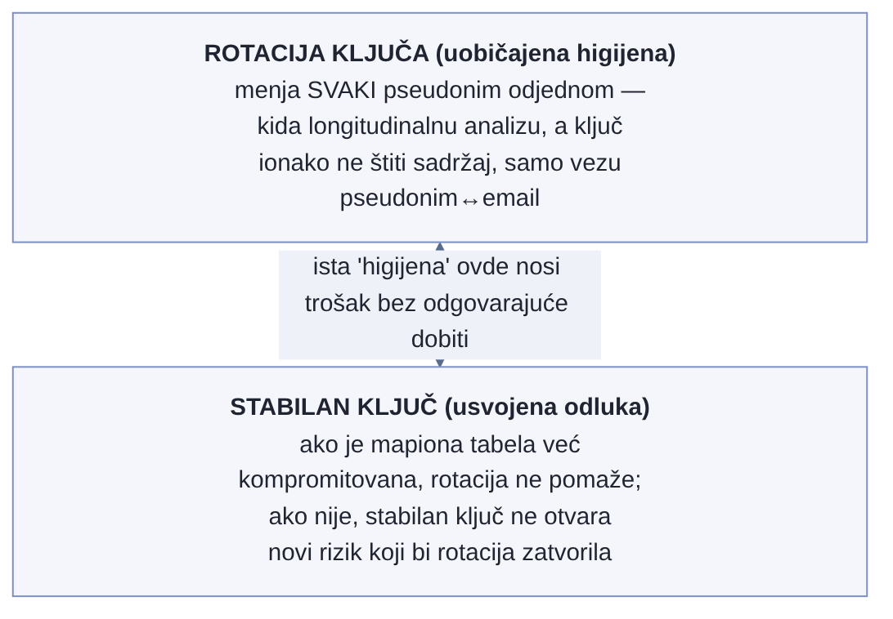

# Poglavlje 25 — Privatnost u telemetriji

Program zaštite svedoka postoji tačno zbog jedne pretpostavke: da niko ne
može da poveže novo ime sa starim životom. Svedoku se dodeli novi
identitet, nova adresa, nova biografija — sve pažljivo odvojeno od
prethodnog dosijea, koji ostaje zaključan kod jedne jedine agencije, sa
striktno ograničenim pristupom. Zaštita ne puca zato što je novo ime
loše osmišljeno. Puca onog trenutka kad dve različite institucije —
recimo, bolnica i banka — slučajno počnu da koriste isti interni broj
dosijea za istu osobu, ni ne znajući da taj broj postoji i na drugom
mestu. Neko ko ima pristup samo jednoj od te dve institucije i dalje ne
vidi ništa. Ali neko ko poveže ta dva zapisa preko zajedničkog broja
odjednom ima staro ime, novu adresu, i sve što je zaštita trebalo da
razdvoji — a nijedna od te dve institucije pojedinačno nije pogrešila.
Pogrešio je sistem koji nije primetio da isti broj prolazi kroz oba.

## 25.1 Pitanje na koje ovo poglavlje odgovara

Telemetrija prikuplja sve što neko instrumentira, često i više od onoga
što je iko planirao — identitet korisnika, IP adrese, parametri iz URL-a.
Zašto "obriši to u pregledaču" nije dovoljno kad isti podatak putuje
drugim putem koji taj filter ne dodiruje, i šta znači zapravo zatvoriti tu
rupu, ne samo na jednoj tački nego kroz ceo lanac?

## 25.2 Kako je to urađeno — praktičan pregled

### Otkriće: pseudonimno na jednoj strani, potpuno otkriveno na drugoj

Ovaj isti obrazac — pseudonimni identitet na jednoj strani sistema, potpuno
otkriven na drugoj — Poglavlje 5 je već pomenulo, u kontekstu
instrumentacije, kao ilustraciju šta se dešava kad dva nezavisna mehanizma
za pseudonimizaciju ne "znaju" jedno za drugo. Ovde se isti nalaz posmatra
iz šire perspektive privatnosti: ne samo da li se identitet slučajno
otkriva, nego i kako se ta rupa zatvara na izvoru, kroz koji oblik
pseudonima, i koje se drugo, potpuno odvojeno pitanje o istoj telemetriji
krije ispod površine.

Frontend aplikacija implementacije koju knjiga prati je namerno projektovana
da šalje samo pseudonimni identifikator korisnika — nasumični UUID iz
autentikacionog sistema, nikad ime ili email. To je bila ispravna, promišljena
odluka od prvog dana. Problem je otkriven tek kad je neko proverio šta se
dešava **posle** tog prvog koraka: pregledač prosleđuje standardni
kontekst za povezivanje trejsova (isti mehanizam koji spaja jedan zahtev
korisnika sa odgovarajućom obradom na serveru) ka backend servisu — a taj
backend servis, potpuno nezavisno i sa sasvim drugim, legitimnim razlogom
(operativno otklanjanje grešaka), upisuje **pravi email korisnika** na
svoj deo istog trejsa. Kad se povuku dva dela istog trejsa zajedno, dva
pseudonimna signala se pretvaraju u jedan potpuno identifikovan zapis —
ne zato što je bilo koja strana pojedinačno pogrešila, nego zato što
zajednički kontekst povezivanja spaja ono što je trebalo da ostane
razdvojeno.

### Verifikacija na stvarnim podacima, ne pretpostavka

Ovo nije bilo teoretsko razmatranje — implementacija je proverila na
stvarnoj, živoj sesiji: pseudonimni identifikator na strani pregledača je
praćen kroz desetine povezanih zahteva ka backend-u, i u velikoj većini
njih je backend deo istog trejsa nosio pravi identitet korisnika. Drugim
rečima, "pseudonimna sesija" je bila **trivijalno** rešiva do imena
konkretne osobe direktno iz alata za pregled trejsova, bez ijednog
dodatnog koraka pretrage u bilo kojoj bazi korisnika.

### Zašto popravka mora ići na izvor, ne na filter

Prva instinktivna reakcija — dodati filter koji briše identifikujuće
podatke iz URL-a i upita na strani pregledača — je već bila sprovedena, i
bila je ispravna **za signale koji nikad ne dodiruju backend**. Ali taj
filter, ma koliko temeljit, ne može ništa da uradi po pitanju onoga što se
upisuje na server-side deo istog trejsa — jer taj upis se dešava potpuno
odvojeno, u drugom sistemu, posle trenutka kad je pregledač već poslao
svoj deo. Popravka mora ići na izvor problema: sam backend treba da
prestane da upisuje pravi identitet, i da umesto toga upisuje **isti**
oblik pseudonima koji frontend već koristi.

### Izvedeni pseudonim, ne goli heš

Predlog koji je tim sastavio namerno ne koristi prost heš email
adrese — jer je prostor mogućih email adresa dovoljno mali i predvidljiv
da bi goli heš bio trivijalno razbijen unapred izračunatom tabelom.
Umesto toga, predlog izvodi pseudonim kroz ključem-zaštićenu heš funkciju:
ista email adresa bi uvek proizvela isti pseudonim (što bi sačuvalo
mogućnost praćenja istog korisnika kroz vreme, korisno za dashboard-e), a
niko bez tajnog ključa ne bi mogao da krene unazad od pseudonima ka pravom
identitetu. Predlog uključuje i jednu, strogo kontrolisanu mogućnost
razrešenja unazad — administrativni endpoint koji bi, samo za ovlašćenu
ulogu i uz potpuno audit-logovanje ko je koga razrešio i kada, vraćao pravi
identitet iza pseudonima za retke slučajeve kad je to stvarno operativno
potrebno.

Vredno je reći ovo eksplicitno, ne samo podrazumevati: u trenutku pisanja
ovo je dizajn na papiru, ne sprovedena promena. Predlog nosi status "nije
započeto", sa nekoliko odluka koje osoba sa ovlašćenjem tek treba da
donese pre nego što bilo šta od ovoga uđe u kod — uključujući i tačno
pitanje rotacije ključa iz sledećeg odeljka. Otkriće od malopre (71 od 98
povezanih raspona) jeste stvarno i potvrđeno; popravka opisana ovde je
predlog kako da se to otkriće zatvori, ne opis nečega što se već desilo.

### Šta popravka ne rešava — i zašto je to u redu

Predlog eksplicitno priznaje granice sopstvenog dometa, unapred: istorijska
telemetrija, već zapisana pre bilo kakve promene, ostala bi u sirovom obliku
— pseudonimizacija ne bi bila retroaktivna, a stari zapisi bi jednostavno
istekli kroz redovnu politiku čuvanja. Ovo nije previd nego trezvena
procena unapred: retroaktivno prepisivanje već zapisanih podataka bilo bi
nesrazmerno skupo u odnosu na korist, kad period čuvanja i onako uskoro
briše te zapise. Predlog takođe pravi jasnu razliku između identifikatora
**osobe** (koji se ne bi beležili u novim poljima) i identifikatora
**imovine/resursa nad kojim je upit izvršen** (koji bi se namerno i dalje
beležili, jer identifikuju šta je upitano, ne ko je upitao) — razlika koja
bi sprečila da se pseudonimizacija preterano primeni tamo gde nije ni
potrebna ni korisna.

{: width="90%" }

{: width="95%" }

### Tip parametra kao dokaz, ne samo pravilo po nazivu

Razlika između "identifikatora osobe" (nikad beleženih) i "identifikatora
resursa" (legitimno beleženih) iz prethodnog odeljka zvuči kao pravilo koje
neko mora da pamti i primenjuje disciplinovano na svako novo polje. Implementacija
je otišla korak dalje: umesto da se osloni samo na disciplinu imenovanja,
proverila je da li sama **tipizacija** parametra strukturno sprečava curenje.
Parametri koji identifikuju resurs (identifikator imovine, identifikator
lokacije) su u backend kontroleru deklarisani kao strogo tipizovani vrednosti
(UUID, decimalni broj) — što znači da okvir za obradu zahteva **odbija** svaki
poziv gde bi neko pokušao da u to polje ubaci slobodan tekst, email ili token.
Pravilo "ovo polje je bezbedno za beleženje" ovde nije samo dogovor u glavama
tima — ono je **strukturno neizvodljivo drugačije**, jer pogrešan oblik
vrednosti nikad ne stigne dalje od validacije zahteva.

Ova provera je otkrila i granicu sopstvenog pravila: dva susedna parametra u
istom skupu upita su obična tekstualna polja, ne tipizovane vrednosti, i
njihov sadržaj je potpuno u rukama onoga ko šalje zahtev — nema tipske
garancije da neće sadržati nešto osetljivo. Implementacija ih **i dalje**
beleži (nisu proglašeni identifikatorima osobe), ali sa dodatnom merom koju
tipizovani parametri ne trebaju: enkodiranje specijalnih karaktera pre upisa u
log, tako da sadržaj slobodnog teksta ne može da ubaci separator ili novi red
i naruši strukturu samog log zapisa. Dve različite garancije za dve različite
kategorije parametara — jedna strukturna (tip), jedna operativna (enkodiranje)
— primenjene tačno tamo gde svaka ima smisla.

### Zašto predlog preporučuje da se pseudonimizacioni ključ nikad ne rotira

Uobičajena bezbednosna higijena nalaže periodičnu rotaciju tajnih ključeva —
pravilo koje važi za lozinke, API tokene, enkripcione ključeve. Za ključ koji
bi pokretao heš funkciju za pseudonime, predlog ide svesno **suprotno**
uobičajenom pravilu: preporučuje da ključ ostane stabilan, bez planirane
rotacije. Ali ovo je tačno mesto gde treba biti precizan oko toga šta je
odlučeno, a šta samo predloženo — ovo je preporuka koja u trenutku pisanja
još čeka da je neko sa ovlašćenjem zvanično potvrdi, ne već doneto pravilo.
Razlog iza same preporuke nije nemar nego eksplicitna analiza kompromisa
unapred. Rotacija ključa bi promenila **svaki** pseudonim odjednom — svaki
korisnik bi dobio novi pseudonim istog trenutka, što bi kidalo longitudinalnu
analizu (dashboard koji prati istog korisnika kroz vreme odjednom bi video
"novog" korisnika) i zahtevalo usklađivanje interne mapione tabele koja
pseudonime vezuje za email. Nasuprot tome, dobit od rotacije bi ovde bila
neobično mala: ključ ne bi štitio sam sadržaj (email bi ostao čitljiv u
mapionoj tabeli bez obzira na ključ) — štitio bi samo **vezu** između
pseudonima i emaila za svakog ko vidi pseudonim bez pristupa toj tabeli. Ako
bi mapiona tabela već bila kompromitovana, rotacija ključa ništa ne bi
popravila; ako ne bi bila, stabilan ključ ne bi otvarao novi rizik koji bi
rotacija zatvorila. Bezbednosna higijena koja ima smisla za lozinku bi ovde
samo unela operativnu štetu bez odgovarajuće bezbednosne dobiti — što je
argument ZA preporuku, ne dokaz da je pitanje zatvoreno. Dok god je neko sa
ovlašćenjem zvanično ne potvrdi, rotacija ključa ostaje otvorena stavka na
spisku odluka koje predlog čeka, ne završena priča.

{: width="80%" }

### Drugo pitanje o istom podatku: ne ko ga vidi, nego gde fizički leži

Sve dosad opisano u ovom poglavlju — povezivanje trejsova, pseudonimizacija,
ključem-zaštićena heš funkcija — odgovara na pitanje "ko može da poveže ovaj
podatak sa konkretnom osobom". Odvojena provera, urađena posle te, otvorila
je sasvim drugo pitanje o istom podatku, koje prva provera ni ne dodiruje: u
kojoj se zemlji taj podatak fizički obrađuje, bez obzira na to ko ga vidi.

Telemetrija implementacije, uključujući i podatke koji se odnose na korisnike
iz Evropske unije, obrađuje se isključivo u regionu pružaoca usluge za
posmatranje smeštenom u Sjedinjenim Državama — jedan region za sav promet,
bez obzira odakle korisnik zapravo dolazi. Sam taj podatak — koji je korisnik
odakle — nije ni postojao kao evidentirana činjenica nigde u sistemu; da bi
se uopšte saznalo koji su korisnici stvarno iz EU, moralo se ručno proći kroz
uzorak stvarnog produkcionog pristupnog loga i proveriti kojim organizacijama
pripadaju domeni prijavljenih korisnika. Rezultat te provere: najmanje dva
korisnika su sa sigurnošću potvrđena kao organizacije sa sedištem u EU, dok
je za nekoliko drugih domena rezidentnost ostala nepoznata i posle provere —
sam čin utvrđivanja "ko je iz EU" pokazao se iznenađujuće netrivijalnim kad
sistem tu činjenicu nigde ne beleži kao prvorazrednu.

Ovo otvara pravno pitanje koje je potpuno odvojeno od svega ranije u
poglavlju. Prenos ličnih podataka u zemlju koju Evropska unija nije
proglasila adekvatnom destinacijom zahteva formalnu zaštitnu meru — u ovom
slučaju standardne ugovorne klauzule unutar potpisanog ugovora o obradi
podataka sa pružaocem usluge, procenu uticaja samog prenosa koja dokumentuje
stvaran rizik, i jasno obaveštenje u politici privatnosti da se podaci
povezani sa korisnicima obrađuju u toj zemlji. U trenutku ove provere, nijedna
od te tri stavke nije mogla da se potvrdi kao već sprovedena — ne zato što je
neko svesno odlučio da ih preskoči, nego zato što niko do tog trenutka nije
ni postavio pitanje. Čistije rešenje, identifikovano ali još nesprovedeno, je
jednostavno u principu: usmeriti sav promet koji se može pripisati korisniku
iz EU ka regionu pružaoca usluge koji se nalazi unutar EU, umesto ka
jedinstvenom regionu u SAD koji danas prima sve.

Vredna lekcija ovde nije tehnička nego strukturna: "privatnost" u telemetriji
nije jedan problem sa jednim rešenjem. Curenje identiteta kroz povezivanje
trejsova i prekogranični prenos podataka su dve potpuno različite obaveze
unutar iste regulative, sa dva potpuno različita leka — jedna se rešava
pseudonimizacijom na izvoru, druga isključivo izborom **gde** infrastruktura
fizički radi. Popraviti jednu ne pomera iglu na drugoj ni za milimetar, i tim
koji je stao posle prve popravke, uveren da je "privatnost sređena", bi i
dalje ostavio drugu, potpuno neotvorenu.

## 25.3 Analitički deo — poznat obrazac curenja, sa preciznim imenom

### Pseudonimizacija ostaje lični podatak — i to menja obavezu

Zvanična smernica o pseudonimizaciji je nedvosmislena: pseudonimizovan
podatak **ostaje** lični podatak u punom pravnom smislu, jer je
re-identifikacija i dalje moguća u principu — razlika prema potpuno
anonimizovanom podatku (koji izlazi iz obaveze u potpunosti) je oštra i
namerna. Ovo znači da predložena pseudonimizacija, čak i kad bude sprovedena, neće
"rešiti" pravnu obavezu u potpunosti — smanjiće rizik i pooštriti
minimizaciju, ali podatak će i dalje zahtevati istu pažnju kao svaki drugi
lični podatak, samo sa manjim rizikom po pojedinca ako dođe do curenja.

### Ono što se dogodilo ima precizno ime u literaturi: napad povezivanjem

Scenario koji je implementacija otkrila — dva naizgled bezopasna,
pseudonimna skupa podataka koji zajedno otkrivaju identitet čim se povežu
preko zajedničkog ključa — je formalno opisan u literaturi o inženjeringu
privatnosti kao **napad povezivanjem** (linkage attack): sastavljanje
identifikujućeg zapisa kombinovanjem ciljanog skupa podataka sa pomoćnim
ili spoljnim izvorom. Zvanična smernica o pseudonimizaciji ide korak dalje
i imenuje tačno ovaj mehanizam kao razlog zašto preporučuje **tranzakcione**
pseudonime (drugačiji po svakoj interakciji) umesto **ličnih** pseudonima
(stabilan, ponovo korišćen svuda) — jer je upravo stabilan, deljen
identifikator ono što povezivanje čini lakim. Predlog svesno bira da
zadrži stabilan pseudonim (radi longitudinalne analize po korisniku) uz
punu svest o ovom kompromisu — razuman izbor, ali izbor koji mora ostati
vidljiv, ne podrazumevan, i koji je, kao što je prethodni odeljak pokazao,
još uvek samo preporuka koja čeka potvrdu, ne doneta odluka.

### Ključem-zaštićena heš funkcija je zvanično preporučena, ne proizvoljna

I zvanična smernica o pseudonimizaciji i šira tehnička literatura
eksplicitno upozoravaju protiv golog, nezaštićenog heša niskoentropijskih
identifikatora poput email adresa — upravo zbog rizika unapred izračunatih
tabela. Preporučen pravac je ključem-zaštićena jednosmerna funkcija, sa
dovoljno entropije u samom ključu. Dodatna, suptilnija napomena iz iste
literature, direktno relevantna: **isti** ključ korišćen u dva različita
sistema ponovo uvodi mogućnost povezivanja — ako dva servisa heš-uju istu
email adresu istim ključem, njihovi izlazi se poklapaju i mogu se spojiti,
poništavajući svrhu izolacije. Predlog ovo rešava tako što bi ključ ostao jedan, unutrašnji, čuvan
odvojeno od bilo kog eksternog sistema.

### Pravo na brisanje sudara se sa arhitekturom sistema za telemetriju

Šira analiza pokazuje da je pravo na brisanje ličnih podataka iskren,
nerešen problem trenja za većinu sistema za metrike i logove — mnogi su
arhitektonski projektovani kao samo-za-dodavanje (append-only), upravo
radi pouzdanosti i integriteta revizije, bez ugrađene mogućnosti brisanja
po pojedinačnom subjektu. Ovo znači da je runbook za brisanje na zahtev
— koji implementacija tek planira, ne još ima gotov — suštinski važan
korak, ne administrativna sitnica: bez njega, obaveza brisanja se ili
ignoriše ili rešava grubim silom (brisanje celog perioda podataka umesto
samo jedne osobe).

### Kontrafaktički scenario: šta filter na pregledaču ne bi uhvatio

Zamislimo tim koji je stao na "pregledač šalje samo pseudonim, gotovo" —
i nikad nije proverio šta se dešava sa istim trejsom posle prve granice
sistema. Svaki dashboard i svaki alat za pretragu trejsova bi i dalje
izgledao ispravno: pseudonim vidljiv, ime nigde direktno u UI-ju. Ali bilo
ko sa pristupom alatu za pregled trejsova bi mogao, u nekoliko klikova,
da prati jedan trejs od pseudonima do stvarnog imena — otkriveno bi samo
u trenutku kad neko stvarno proveri, ili gore, kad neko zloupotrebi upravo
tu mogućnost. Utisak privatnosti bi postojao; stvarna privatnost ne bi.

Vratimo se programu zaštite svedoka s početka poglavlja. Novi identitet
sam po sebi nije dovoljan — zaštita drži samo ako **svaka** institucija
koja dodiruje taj identitet zna da ne sme deliti isti unutrašnji broj sa
bilo kojom drugom. Pseudonimizacija u telemetriji radi po istom pravilu:
nije dovoljno da jedan sloj sistema bude pažljiv. Mora biti pažljiv ceo
lanac, od prvog signala do poslednjeg mesta gde se dva signala mogu
sastati.

## 25.4 Skupljena pravila iz ovog poglavlja

- Ne veruj da je pseudonimizacija na jednoj tački sistema dovoljna — proveri
  da li se isti identitet, u bilo kom drugom obliku, upisuje negde nizvodno
  gde se dva signala mogu povezati preko zajedničkog konteksta.
- Koristi ključem-zaštićenu heš funkciju za pseudonime, nikad goli heš
  niskoentropijskog identifikatora poput email adrese — i drži ključ jedan,
  interni, nikad deljen između sistema koji bi inače trebalo da ostanu
  nepovezani.
- Zapamti da pseudonimizovan podatak ostaje lični podatak u punom pravnom
  smislu — smanjuje rizik, ne uklanja obavezu.
- Razdvoji identifikatore osobe (nikad beleženi u novim poljima) od
  identifikatora resursa nad kojim je nešto urađeno (legitimno beleženi,
  jer identifikuju šta je upitano, ne ko je upitao) — ne primenjuj
  pseudonimizaciju tamo gde nije ni potrebna.
- Planiraj runbook za brisanje na zahtev unapred, znajući da većina sistema
  za metrike i logove nije arhitektonski projektovana za brisanje po
  pojedinačnom subjektu — čekanje da zahtev stvarno stigne je prekasno da
  se prvi put smišlja rešenje.
- Kad god je moguće, oslanjaj se na tip parametra da strukturno sprečiš
  curenje, ne samo na dogovor o imenovanju — a za polja koja moraju ostati
  slobodan tekst, dodaj operativnu meru (enkodiranje) koju tipizovana polja
  ne trebaju.
- Pre nego što primeniš opšte bezbednosno pravilo (poput periodične rotacije
  ključa) na novu situaciju, proveri da li dobit tog pravila stvarno važi
  ovde — rotacija koja kida longitudinalnu analizu bez odgovarajuće
  bezbednosne dobiti je šteta obučena kao higijena.
- Ne izjednačavaj "rešio sam ko može da poveže podatak sa osobom" sa
  "rešio sam privatnost" — proveri odvojeno i gde se taj podatak fizički
  obrađuje, jer prekogranični prenos ličnih podataka nosi sopstvenu,
  potpuno nezavisnu obavezu koju nijedna mera protiv povezivanja ne dodiruje.

## 25.5 Vežba za čitaoca

Pronađi jedan identifikator u tvom sistemu koji je pseudonimizovan na
jednoj tački (frontend, jedan servis, jedan log). Prati taj identifikator
nizvodno — kroz svaki servis koji dodiruje isti zahtev ili istu sesiju —
i proveri da li ijedan od njih upisuje pravi identitet negde drugde u
istom kontekstu. Ako je odgovor da, upravo si pronašao istu vrstu curenja
kao u ovom poglavlju.

---

### Izvori korišćeni u analitičkom delu

- [EDPB Guidelines 01/2025 on Pseudonymisation](https://www.edpb.europa.eu/system/files/2025-01/edpb_guidelines_202501_pseudonymisation_en.pdf)
- [ICO — Pseudonymisation guidance](https://ico.org.uk/for-organisations/uk-gdpr-guidance-and-resources/data-sharing/anonymisation/pseudonymisation/)
- [SoK: Managing risks of linkage attacks on data privacy — PETS 2023](https://petsymposium.org/popets/2023/popets-2023-0043.pdf)
- [ENISA — Pseudonymisation techniques and best practices](https://www.enisa.europa.eu/publications/pseudonymisation-techniques-and-best-practices)
- [NIST SP 800-224 (draft) — HMAC specification](https://csrc.nist.gov/pubs/sp/800/224/ipd)
- [Axiom — The Right to Be Forgotten vs. Audit Trail Mandates](https://axiom.co/blog/the-right-to-be-forgotten-vs-audit-trail-mandates)
