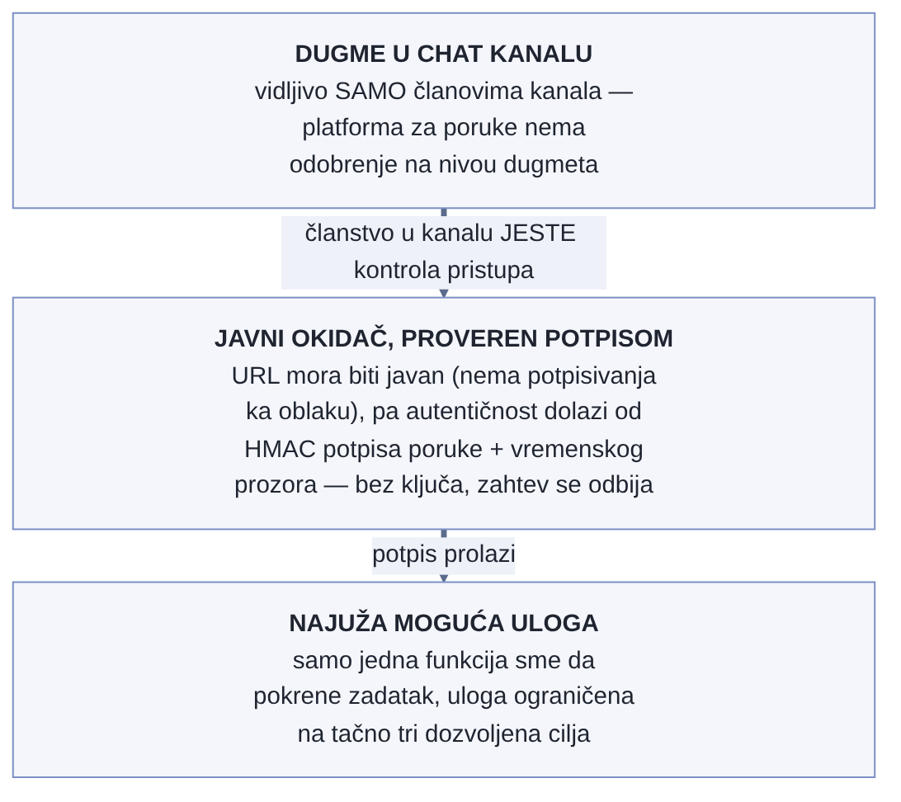

# Chapter 26 — Observability as a compliance control (a SOC 2 example)

A health inspector who walks into a restaurant doesn't carry a single
universal recipe for a safe kitchen, the same one for every restaurant in
town. Instead, a good inspection system requires that each restaurant write
its own food-safety plan in advance — at what temperature the chicken is
kept, who checks expiration dates, what happens when the refrigerator fails
— and then the inspector checks exactly one thing: whether the restaurant is
actually doing what that plan promised. A restaurant that wrote an ambitious
plan and doesn't follow it comes out worse than a restaurant that wrote a
more modest plan and follows it exactly. The point of the inspection isn't
"are you the best restaurant in town." The point is: is what you post on the
door true.

## 26.1 The question this chapter answers

How do monitoring and alerting even map onto the trust criteria that a
security standard like SOC 2 requires — and, more important than the mapping
itself, why isn't compliance about whether you satisfy some external catalog
of controls, but about whether you do what you claim to do?

## 26.2 How this was done — a practical overview

### Two directions of the relationship, not one

The implementation starts from a clearly formulated insight: observability
and compliance stand in a two-way relationship, not a one-way one.

- **Observability is evidence of control.** The alerting system itself —
  anomaly detection, escalation, response — is operational proof that the
  organization actually monitors its components and responds to incidents,
  exactly what the trust criteria require of system-monitoring controls.
- **Observability is simultaneously also a control obligation.** That same
  telemetry carries personal data (user identity on traces and logs,
  potentially de-anonymized browser sessions) — which means the telemetry
  itself becomes confidential information that needs protecting, not just a
  tool that protects something else.

### An honest status table, not a polished story for the auditor

The central artifact of the practical section is an internal working table
that maps each relevant control area onto three columns: the criterion the
area relates to, the **actual state** (marked honestly with IN PLACE,
PARTIAL for "partial or undocumented," GAP for "gap"), and the remaining
work needed to close the gap. This table is deliberately written for
internal reading, not for the auditor — the goal is that every claim the
organization later makes to the auditor has already been verified inside
this table, instead of the table being written to look good.

An example of the shape (illustrative, not an actual list from the
implementation): one control area might be fully in place (encryption in
transit via TLS), another partially documented (who exactly has access to
the telemetry platform's console, with which role, isn't formally
inventoried), and a third a complete gap (there's no runbook that would, on
request, delete someone's personal data from the trace and log systems). The
value of the table isn't that every mark reads IN PLACE — the value is that
every mark is accurate.

### The question that decides what even enters scope

The standard the implementation follows has one mandatory criteria category
(security) and several optional ones (availability, confidentiality,
processing integrity, privacy) that the organization chooses to include or
not. The implementation explicitly treats this decision as a strategic
question, not a formality: including an optional category the organization
doesn't actually satisfy doesn't go unnoticed — on the contrary, it expands
the audit's scope to that category, and every gap in it becomes a
**documented finding** instead of simply not being part of the story. The
implementation's conclusion: the first round of compliance targets only the
mandatory category (with room to add a narrower category that's easier to
satisfy), while the broader, more demanding category is deliberately
deferred until concrete fixes (like the pseudonymization from the previous
chapter) have actually settled in.

### The one thing the auditor actually tests

The implementation names the central check the auditor actually performs:
**consistency between what the organization publicly claims and what it
actually does.** The standard doesn't mandate that telemetry be
pseudonymized — but if any public document (a privacy policy, an answer to a
customer's security questionnaire) claims that personal data is minimized or
pseudonymized, while the actual telemetry still carries raw identity, that's
a discrepancy the auditor uncovers and records as an exception — regardless
of whether that area is even formally in the audit's scope.

{: width="85%" }

### An automated action from chat: the token permits, the channel restricts

One control in the table deserves special attention because it shows how
deep the analysis has to go once automation gains the ability to change
system state, not just observe it. An alert in the job-failure channel
carries a button that restarts a **production** job — a real write to
infrastructure, triggered directly from a chat message. The mechanism
reveals two separate layers of authorization, and the implementation
explicitly named both, instead of treating "the button works" as a
sufficient check.

The first layer is a technically unavoidable trade-off: the trigger is a
**public** URL with no request signing on the messaging platform's side,
because that platform has no mechanism to sign a request using the
standard cloud-access protocol. Instead, authenticity comes from the
messaging platform's **own** HMAC signature on every request, with a
window of a few minutes that prevents a captured message from being
replayed later — and the mechanism deliberately **rejects** the request if
the secret key for verifying the signature isn't configured, rather than
letting the request through unchecked. The second layer is subtler: the
messaging platform has no per-button approval mechanism — so **the
privacy of the channel itself** is the only real access control. Whoever
is a member of that channel can press the button; whoever isn't, doesn't
see it at all. The formal permission list in the identity-management
system is as narrow as possible (only one execution role is allowed to
trigger the job, restricted to exactly three roles allowed to assign it) —
but that list means nothing if channel membership isn't just as strictly
controlled and regularly reviewed.

This is exactly the kind of insight an honest internal table needs to
capture: the control "who can trigger a production action" here is
actually **not one** control but two — technical (signature, role,
permission scope) and organizational (who's a channel member) — and only
the first of the two is verifiable through code and infrastructure. The
second depends on discipline around chat-channel membership, which is
easier to forget to check regularly.

{: width="82%" }

### Least privilege for services isn't the same as least privilege for people

The same table shows a pattern that repeats across several rows: the
machine side of access is often strictly, verifiably constrained, while
the human side of the same system is completely undocumented. Access
tokens for services that send telemetry live in a secrets vault, granted
with the narrowest possible scope per purpose — this is a state that can
be verified by reading configuration, and the implementation openly
records it as **in place**. But exactly who has interactive access to the
telemetry platform's own console, and with which role, isn't formally
inventoried anywhere — this stays **partial**, not because access is
necessarily too broad but because nobody can prove the opposite without an
inventory.

The point the implementation names: "access control" as a single line item
on a control list is the wrong grain of measurement. It covers at least
two independent questions — are machines restricted to what they need,
and are people restricted to what they need — and an organization can
have a fully accurate answer to one question while having no answer at all
to the other. A table that records just one, combined score for "access"
would hide exactly that distinction; a table that separates the machine
row from the human row makes the gap visible instead of burying it behind
the part that's already in order.

## 26.3 Analytical section — compliance as self-consistency, not an external catalog

### The official criteria structure confirms the two-layer split

The official trust criteria structure defines one mandatory category (the
common criteria, organized into nine series) and four optional categories
chosen at the organization's discretion, only when they're actually relevant
to the services being provided. Specifically, the criteria within the series
covering system operations — monitoring components to detect anomalies,
evaluating whether an anomaly constitutes a security event, and responding
through a defined program — map directly onto what the implementation's
alerting and escalation system does every day. This confirms that the
implementation correctly recognized its own alerting system as **positive
evidence**, not just an operational tool.

### "Attestation, not certification" is an official, precisely formulated distinction

The official distinction, confirmed in the industry literature on the
standard itself, is that this isn't certification against an external,
universal passing threshold — it's an attestation: a licensed auditor tests
whether the controls, **as the organization itself documented them**, are
actually in place and, in the more demanding type of report, whether they
function consistently over time. There is no single correct answer to "is
the organization compliant" independent of what that organization itself
claimed it does — which is exactly the insight the implementation
formulates as "the one thing the auditor actually tests here."

### The decision on optional categories is a documented point of sensitivity

Industry guidance on choosing optional categories explicitly warns that
including a category the organization isn't actually ready to satisfy — a
typical example being the most demanding category, the one covering the
privacy of personal data, included without a real consent program and
data-subject rights — creates unnecessary exposure risk: because that
category is now in scope, the auditor tests it, and every gap becomes a
recorded exception instead of simply not being part of the story. This
confirms exactly the logic the implementation followed in deferring the
broader category.

### Retention and the right to deletion don't mean what's often assumed

The guiding principle from the same industry guidance is that the standard
doesn't prescribe a universal retention period, nor does it mandate
implementing a right to deletion modeled on other regulations — the
principle is that personal or confidential data be kept no longer than is
actually needed for its declared purpose, and that the auditor tests whether
the actual data-destruction practice matches the organization's **own**
declared policy, not some external calendar. This means the gap the
implementation records in its own table (the lack of formally documented
retention by signal type) isn't a violation of the standard directly — but
it becomes one the moment the organization publicly claims otherwise
anywhere.

### A counterfactual scenario: what a "polished story" would miss

Imagine a team that, instead of an honest internal table, wrote answers
directly for the auditor — choosing wording that sounds confident, without
first checking internally whether each claim is actually true. The first
real audit would uncover the gap between what was written and what's real,
at the worst possible moment — in front of the auditor, with reputational
and contractual consequences, instead of internally, where the gap can be
closed before anyone outside ever asks the question. An honest internal
table with PARTIAL and GAP marks isn't an admission of weakness to the
outside world — it's the reason the outside world never has to see a
surprise.

Let's return to the health inspector from the start of the chapter. A
restaurant that wrote a modest but completely accurate plan — "we keep the
chicken at this temperature, we check it every day at seven in the morning"
— and actually does it, passes inspection better than a restaurant that
wrote a more ambitious plan and only half-follows it. Compliance was never a
contest over who has the most impressive plan. It was, from the start, a
question of whether the plan and reality tell the same story.

## 26.4 Rules collected from this chapter

- Keep an internal, honest table of control status (IN PLACE / PARTIAL /
  GAP) before anything reaches the auditor — the goal is for every claim to
  already be verified internally, not for the table to look good.
- Treat your own alerting and escalation system as positive evidence for the
  system-monitoring criteria — document it explicitly as such, not just as
  an operational tool.
- Don't include an optional criteria category you don't actually satisfy —
  inclusion is what opens up the audit's scope, and every gap in that
  category becomes a recorded exception only once the category is in scope.
- Remember that the auditor tests consistency between public claims and
  actual practice, not compliance with a universal external catalog — every
  public claim about data minimization or protection has to be backed by
  actual state, not just intent.
- Align retention and deletion practice with what you actually **write**
  that you do, not with what you'd ideally want to do — a gap becomes a
  finding only when the claim and reality diverge.
- When chat-based automation is allowed to change production state, name
  both authorization layers separately — technical (signature, role,
  permission scope) and organizational (who's a member of the channel
  that sees the button) — because the first is verifiable through code,
  and the second depends on discipline that's easy to forget.
- Don't record "access control" as one combined line item — separate the
  machine side (tokens, permission scope) from the human side (who has
  interactive access, with which role) — an organization often has an
  accurate answer to one question while having none for the other, and a
  combined score hides that gap.

## 26.5 Exercise for the reader

Find one public claim your team or organization makes about how data is
protected, retained, or minimized — in a privacy policy, in an answer to a
customer questionnaire, or even in internal documentation that gets shared
externally. Check, honestly and concretely, whether the actual telemetry and
actual practice today really do what that claim says. If they don't, that's
a gap worth closing before someone else finds it.

---

### Sources used in the analytical section

- [2017 Trust Services Criteria with Revised Points of Focus — AICPA & CIMA](https://www.aicpa-cima.com/resources/download/2017-trust-services-criteria-with-revised-points-of-focus-2022)
- [SOC 2 CC7.2 — Monitoring of System Components for Anomalies](https://www.cyberday.ai/requirement/soc-2-cc7-2-monitoring-of-system-components-for-anomalies)
- [SOC 2 CC7.4 — Responding to Identified Security Incidents](https://www.cyberday.ai/requirement/soc-2-cc7-4-responding-to-identified-security-incidents)
- [Is SOC 2 a Certification or an Attestation? — Vanta](https://www.vanta.com/collection/soc-2/is-soc-2-a-certification-or-attestation)
- [SOC 2 Trust Services Categories: Do You Need Privacy or Just Confidentiality? — Sage Audits](https://sageaudits.com/blog/2026/05/01/soc-2-trust-services-categories-do-you-need-privacy-or-just-confidentiality/)
- [Data Retention Policy and SOC 2 — Linford & Co](https://linfordco.com/blog/data-retention-policy-soc-2/)
