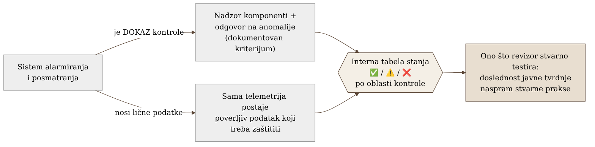

# Poglavlje 26 — Observability kao kontrola usklađenosti (SOC 2 primer)

Sanitarni inspektor koji dolazi u restoran ne nosi sa sobom jedan
univerzalni recept za bezbednu kuhinju, isti za svaki restoran u gradu.
Umesto toga, dobar sistem inspekcije traži da svaki restoran unapred
napiše **sopstveni** plan bezbednosti hrane — na kojoj temperaturi se čuva
piletina, ko proverava rok trajanja, šta se radi kad frižider otkaže — i
onda inspektor proverava tačno jedno: da li restoran stvarno radi ono što
je taj plan obećao. Restoran koji je napisao ambiciozan plan pa ga ne
prati dobija gore od restorana koji je napisao skromniji, ali potpuno
tačan plan. Poenta inspekcije nije "da li si najbolji restoran u gradu."
Poenta je: da li je ono što pišeš na vratima istina.

## 26.1 Pitanje na koje ovo poglavlje odgovara

Kako se monitoring i alarmiranje uopšte mapiraju na kriterijume poverenja
koje traži bezbednosni standard poput SOC 2 — i, važnije od same mape,
zašto usaglašenost nije o tome da li ispunjavaš spoljni katalog kontrola,
nego da li radiš ono što tvrdiš da radiš?

## 26.2 Kako je to urađeno — praktičan pregled

### Dva pravca odnosa, ne jedan

Implementacija polazi od jasno formulisanog uvida: observability i
usaglašenost stoje u dvosmernom odnosu, ne jednosmernom.

- **Observability je dokaz kontrole.** Sam sistem za alarmiranje —
  detekcija anomalija, eskalacija, odgovor — je operativni dokaz da
  organizacija zaista nadzire svoje komponente i reaguje na incidente,
  tačno ono što kriterijumi poverenja traže od kontrola nadzora sistema.
- **Observability je istovremeno i obaveza kontrole.** Ista ta telemetrija
  nosi lične podatke (identitet korisnika na trejsovima i logovima,
  potencijalno de-anonimizovane sesije iz pregledača) — što znači da sama
  telemetrija postaje poverljiva informacija koju treba štititi, ne samo
  alat kojim se nešto drugo štiti.

### Iskrena tabela stanja, ne uglačana priča za revizora

Centralni artefakt praktičnog dela je interna radna tabela koja mapira
svaku relevantnu oblast kontrole na tri kolone: kriterijum na koji se
oblast odnosi, **stvarno stanje** (obeleženo iskreno sa oznakom NA MESTU,
DELIMIČNO za "delimično ili nedokumentovano", PRAZNINA za "praznina"), i preostali rad
potreban da se praznina zatvori. Ova tabela je namerno pisana za interno
čitanje, ne za revizora — cilj je da svaka tvrdnja koju organizacija
kasnije izgovori revizoru bude već proverena unutar ove tabele, umesto da
se tabela piše da bi izgledala dobro.

Primer oblika (ilustrativan, ne stvaran spisak implementacije): jedna
oblast kontrole može biti potpuno na mestu (šifrovanje u tranzitu preko
TLS-a), druga delimično dokumentovana (ko tačno ima pristup konzoli
platforme za telemetriju, sa kojom ulogom, nije formalno popisano), a
treća potpuna praznina (ne postoji runbook koji bi, na zahtev, izbrisao
nečije lične podatke iz sistema za trejsove i logove). Vrednost tabele
nije u tome da svaka oznaka bude NA MESTU — vrednost je u tome da svaki znak bude tačan.

### Pitanje koje odlučuje šta uopšte ulazi u obim

Standard koji implementacija prati ima jednu obaveznu kategoriju
kriterijuma (bezbednost) i nekoliko opcionih (dostupnost, poverljivost,
integritet obrade, privatnost) koje organizacija bira da uključi ili ne.
Implementacija eksplicitno razmatra ovu odluku kao strateško pitanje, ne
kao formalnost: uključivanje opcione kategorije koju organizacija stvarno
ne ispunjava ne ostaje neprimećeno — naprotiv, proširuje obim revizije na
tu kategoriju, i svaka praznina u njoj postaje **dokumentovani nalaz**
umesto da jednostavno ne bude deo priče. Zaključak implementacije: prva
runda usaglašenosti cilja samo obaveznu kategoriju (uz mogućnost dodavanja
uže kategorije koja se lakše ispunjava), dok se šira, zahtevnija kategorija
svesno odlaže dok konkretne popravke (poput pseudonimizacije iz prethodnog
poglavlja) stvarno ne slegnu.

### Jedna stvar koju revizor zapravo testira

Implementacija imenuje centralnu proveru koju revizor stvarno sprovodi:
**doslednost između onoga što organizacija javno tvrdi i onoga što
stvarno radi.** Standard ne propisuje da telemetrija mora biti
pseudonimizovana — ali ako bilo koji javni dokument (politika privatnosti,
odgovor na bezbednosni upitnik klijenta) tvrdi da se lični podaci
minimizuju ili pseudonimizuju, a stvarna telemetrija i dalje nosi sirov
identitet, to je razlika koju revizor otkriva i beleži kao izuzetak — bez
obzira na to da li je ta oblast uopšte formalno u obimu revizije.

{: width="85%" }

## 26.3 Analitički deo — usaglašenost kao samo-doslednost, ne spoljni katalog

### Zvanična struktura kriterijuma potvrđuje dvoslojnu podelu

Zvanična struktura kriterijuma poverenja definiše jednu obaveznu kategoriju
(zajednički kriterijumi, organizovani u devet serija) i četiri opcione
kategorije birane po diskrecionom pravu organizacije, samo kada su stvarno
relevantne za usluge koje se pružaju. Konkretno, kriterijumi unutar serije
koja pokriva rad sistema — nadzor komponenti radi otkrivanja anomalija,
procena da li anomalija predstavlja bezbednosni događaj, i odgovor kroz
definisan program — direktno odgovaraju onome što sistem alarmiranja i
eskalacije implementacije radi svakog dana. Ovo potvrđuje da je
implementacija ispravno prepoznala sopstveni sistem alarmiranja kao
**pozitivan dokaz**, ne samo kao operativni alat.

### "Atestacija, ne sertifikacija" je zvanično, precizno formulisana razlika

Zvanična razlika, potvrđena u industrijskoj literaturi o samom standardu,
jeste da ovo nije sertifikacija sa spoljnim, univerzalnim pragom prolaska —
to je atestacija: licenciran revizor testira da li su kontrole, **onako
kako ih je organizacija sama dokumentovala**, stvarno na mestu i, u
zahtevnijem tipu izveštaja, da li dosledno funkcionišu kroz vreme. Ne
postoji jedan tačan odgovor na "da li je organizacija usaglašena" nezavisno
od toga šta je ta organizacija sama tvrdila da radi — što je tačno uvid
koji implementacija formuliše kao "jedina stvar koju revizor zapravo
testira ovde."

### Odluka o opcionim kategorijama je dokumentovano osetljiva tačka

Industrijska smernica o biranju opcionih kategorija eksplicitno upozorava
da uključivanje kategorije koju organizacija nije stvarno spremna da
ispuni — tipičan primer je najzahtevnija kategorija, ona koja pokriva
privatnost ličnih podataka, uključena bez realnog programa pristanka i
prava subjekta podataka — stvara nepotreban rizik izloženosti: pošto je ta
kategorija sada u obimu, revizor je testira, i svaka praznina postaje
zabeležen izuzetak umesto da jednostavno ne bude deo priče. Ovo potvrđuje
tačno logiku kojom se implementacija vodila pri odlaganju šire kategorije.

### Retencija i pravo na brisanje ne znače ono što se često pretpostavlja

Vodeći princip iz iste industrijske smernice jeste da standard ne propisuje
univerzalan rok čuvanja niti obaveznu implementaciju prava na brisanje po
uzoru na druge regulative — princip je da lični ili poverljivi podaci budu
čuvani ne duže nego što je stvarno potrebno za deklarisanu svrhu, i da
revizor testira da li stvarna praksa uništavanja podataka odgovara
**sopstvenoj** deklarisanoj politici organizacije, ne nekom spoljašnjem
kalendaru. Ovo znači da praznina koju implementacija beleži u sopstvenoj
tabeli (nedostatak formalno dokumentovane retencije po tipu signala) nije
propust prema standardu direktno — ali postaje propust onog trenutka kad
organizacija bilo gde javno tvrdi suprotno.

### Kontrafaktički scenario: šta bi "uglačana priča" propustila

Zamislimo tim koji je, umesto iskrene interne tabele, direktno pisao
odgovore za revizora — birajući formulacije koje zvuče sigurno, bez
prethodne interne provere da li je svaka tvrdnja stvarno tačna. Prva
prava revizija bi otkrila razliku između napisanog i stvarnog, u
najgorem mogućem trenutku — pred revizorom, sa reputacionim i ugovornim
posledicama, umesto interno, gde se praznina može zatvoriti pre nego što
iko spolja uopšte postavi pitanje. Iskrena interna tabela sa DELIMIČNO i PRAZNINA
oznakama nije priznanje slabosti prema spoljnom svetu — ona je razlog zašto
spoljni svet nikad ne mora da vidi iznenađenje.

Vratimo se sanitarnom inspektoru s početka poglavlja. Restoran koji je
napisao skroman, ali potpuno tačan plan — "čuvamo piletinu na ovoj
temperaturi, proveravamo je svaki dan u sedam ujutru" — i zaista to radi,
prolazi inspekciju bolje od restorana koji je napisao ambiciozniji plan pa
ga napola prati. Usaglašenost nikad nije bila takmičenje u tome ko ima
najimpresivniji plan. Bila je, od početka, pitanje da li plan i stvarnost
govore istu priču.

## 26.4 Skupljena pravila iz ovog poglavlja

- Vodi internu, iskrenu tabelu stanja kontrola (NA MESTU / DELIMIČNO / PRAZNINA) pre nego što bilo
  šta stigne do revizora — cilj je da svaka tvrdnja bude već proverena
  interno, ne da tabela izgleda dobro.
- Tretiraj sopstveni sistem alarmiranja i eskalacije kao pozitivan dokaz
  za kriterijume nadzora sistema — dokumentuj ga eksplicitno kao takav,
  ne samo kao operativni alat.
- Ne uključuj opcionu kategoriju kriterijuma koju stvarno ne ispunjavaš —
  uključivanje je ono što otvara obim revizije, i svaka praznina u toj
  kategoriji postaje zabeležen izuzetak tek kad je kategorija u obimu.
- Zapamti da revizor testira doslednost između javnih tvrdnji i stvarne
  prakse, ne ispunjenost univerzalnog spoljnog kataloga — svaka javna
  tvrdnja o minimizaciji ili zaštiti podataka mora biti podržana stvarnim
  stanjem, ne samo namerom.
- Uskladi retenciju i praksu brisanja sa onim što stvarno **pišeš** da
  radiš, ne sa onim što bi u idealnom svetu trebalo da radiš — praznina
  postaje nalaz samo kad tvrdnja i stvarnost krenu različitim putem.

## 26.5 Vežba za čitaoca

Pronađi jednu javnu tvrdnju tvog tima ili organizacije o tome kako se
podaci štite, čuvaju, ili minimizuju — u politici privatnosti, u
odgovoru na upitnik klijenta, ili čak u internoj dokumentaciji koja se
deli spolja. Proveri, iskreno i konkretno, da li stvarna telemetrija i
stvarna praksa danas zaista rade ono što ta tvrdnja kaže. Ako ne rade,
to je razlika koju vredi zatvoriti pre nego što je neko drugi otkrije.

---

### Izvori korišćeni u analitičkom delu

- [2017 Trust Services Criteria with Revised Points of Focus — AICPA & CIMA](https://www.aicpa-cima.com/resources/download/2017-trust-services-criteria-with-revised-points-of-focus-2022)
- [SOC 2 CC7.2 — Monitoring of System Components for Anomalies](https://www.cyberday.ai/requirement/soc-2-cc7-2-monitoring-of-system-components-for-anomalies)
- [SOC 2 CC7.4 — Responding to Identified Security Incidents](https://www.cyberday.ai/requirement/soc-2-cc7-4-responding-to-identified-security-incidents)
- [Is SOC 2 a Certification or an Attestation? — Vanta](https://www.vanta.com/collection/soc-2/is-soc-2-a-certification-or-attestation)
- [SOC 2 Trust Services Categories: Do You Need Privacy or Just Confidentiality? — Sage Audits](https://sageaudits.com/blog/2026/05/01/soc-2-trust-services-categories-do-you-need-privacy-or-just-confidentiality/)
- [Data Retention Policy and SOC 2 — Linford & Co](https://linfordco.com/blog/data-retention-policy-soc-2/)
