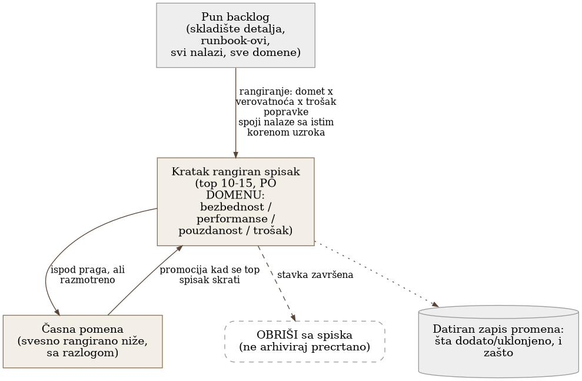
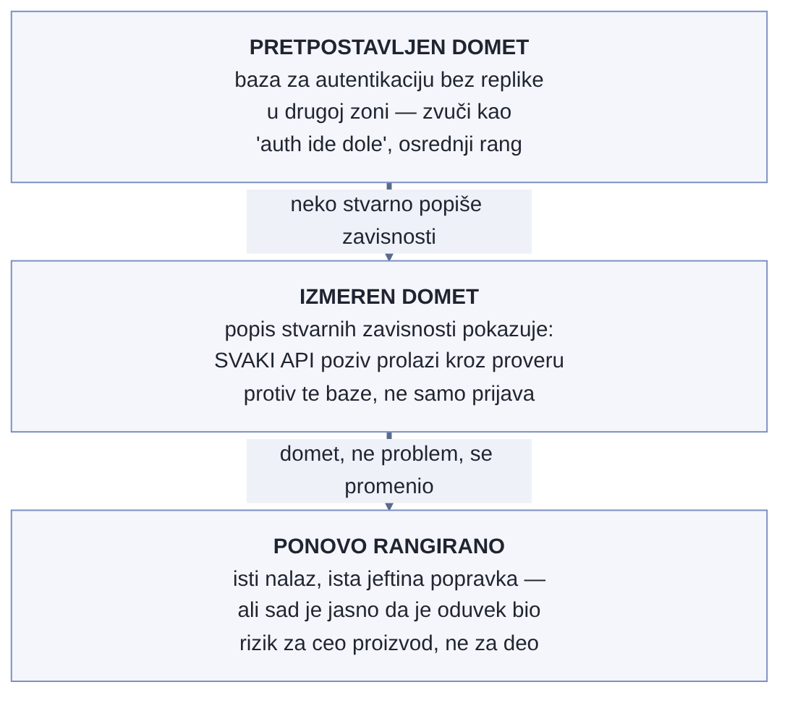

# Poglavlje 27 — Prioritizacija: cena, performanse, pouzdanost, bezbednost

Upravnik velikog imanja sa desetak zgrada ne vodi jednu beskonačnu listu
"sve što bi trebalo popraviti" — takva lista bi za godinu dana narasla na
stotine stavki i niko je više ne bi stvarno čitao. Umesto toga drži kratak,
stalno osvežavan spisak od desetak stvari koje se rade sledeće: krov koji
curi ozbiljno ako padne kiša ove nedelje ide iznad ograde koja je kriva već
tri godine i verovatno može čekati još jednu. Kad se krov popravi, briše se
sa liste — ne prebacuje se u "završeno" arhivu koju niko ne čita, prosto
nestaje, i sledeća stavka se penje na njegovo mesto. Neke stvari sa dna
originalne liste od stotinu stavki namerno ostaju tamo, sa zapisanim
razlogom: "ograda čeka jer trošak zamene premašuje vrednost te sekcije
placa." To nije isto što i "nismo stigli do toga." Upravnik koji meša ta
dva razloga na kraju gubi poverenje vlasnika — ili opravdava nešto što nije
trebalo, ili zaboravlja nešto što jeste trebalo.

## 27.1 Pitanje na koje ovo poglavlje odgovara

Observability program generiše više nalaza nego što bilo koji tim može
odjednom rešiti — bezbednosne rupe, skupe upite, krhke tačke pouzdanosti,
performanse koje bi mogle biti bolje. Kako izgleda živ dokument koji rangira
sledećih dvanaestak stvari po domenu, sa metodologijom koja razlikuje
"časnu pomenu" od stvarnog prioriteta, i zašto se observability program
nikad ne "završava" nego se njime upravlja kao bilo kojim drugim backlog-om?

## 27.2 Kako je to urađeno — praktičan pregled

### Odvojene liste po domenu, ista disciplina

Implementacija drži odvojen, kratak rangirani spisak za svaki od nekoliko
domena — bezbednost, performanse, pouzdanost, trošak — umesto jedne
zajedničke liste u koju bi se sve slivalo. Svaki spisak je namerno kratak
(desetak do petnaestak stavki), izvučen iz mnogo šireg, detaljnog backlog-a
gde žive puni opisi nalaza i runbook-ovi. Kratak spisak je **pogled za
odlučivanje** — šta raditi sledeće, sa jasnim razlogom zašto je baš to na
vrhu. Puni backlog je **skladište detalja** — gde neko ide kad treba tačan
korak-po-korak za konkretnu stavku.

### Rangiranje po tri ose, ne po jednom utisku

Redosled na svakom spisku nije subjektivan utisak "šta izgleda hitno."
Kombinuje tri nezavisne ose: koliki je domet štete ako se nalaz iskoristi
ili ispolji (blast radius), koliko je verovatno da će se to stvarno
dogoditi s obzirom na trenutne kontrole, i koliko brzo/jeftino se može
popraviti. Kad dva odvojena nalaza zapravo dele isti osnovni uzrok,
implementacija ih namerno spaja u jednu, više rangiranu kombinovanu stavku
— umesto da ih broji kao dva odvojena, niže rangirana problema. Ovo
sprečava situaciju gde bi rangiranje bilo lažno nisko samo zato što je
jedan uzrok slučajno proizveo više pojedinačnih simptoma.

### "Časna pomena" kao formalna, imenovana kategorija

Ispod praga koji ulazi u glavni rangirani spisak, implementacija drži
posebnu, imenovanu sekciju za stavke koje su stvarne, ali nisu dovoljno
visoko rangirane da uđu u top listu. Ova sekcija ima eksplicitnu svrhu:
kad se glavni spisak skrati (stavke se završe i izbrišu), sledeća stavka
za promociju dolazi odavde, umesto da se lista veštački puni niže
vrednim stavkama samo da bi imala deset redova. Razlikovanje "časna
pomena" (razmotreno, svesno rangirano niže) od "nikad ni pomenuto" je
samo po sebi informacija — govori timu da je nešto viđeno i procenjeno,
ne propušteno.

Konkretan primer kako ova kategorija izgleda u praksi, ne samo u teoriji:
kontinuirano profilisanje (CPU/memorija na nivou linije koda, ne samo na
nivou zahteva) je mogućnost koju observability platforma koju knjiga
prati već nudi — izvor podataka postoji, spreman za upotrebu — a ipak
nijedan servis nije instrumentisan da ga koristi. Ovo nije propust koji
niko nije primetio: formalni pregled programa ga je eksplicitno naveo kao
stavku sa statusom "praznina", ne kao nešto što se slučajno izgubilo iz
vida, i dodelio mu je mesto u drugom talasu prioriteta — posle stavki sa
većim dometom štete ili većom verovatnoćom, ne zato što profilisanje
nema vrednost. Preporučeni sledeći korak je već zapisan i čeka na
spisku: uključiti ga prvo na endpoint-ima koji već imaju definisan budžet
greške (Poglavlje 15), gde bi povezivanje trejsa sa profilom omogućilo da
se spor poziv, uhvaćen exemplar-om (Poglavlje 11), prati ne samo do
trejsa nego do tačne linije koda koja je potrošila vreme. Razlika između
ovog i "nikad ni pomenuto" je upravo ono što ova sekcija čuva: neko je
razmotrio, zapisao razlog, i ostavio jasan sledeći korak za dan kada se
stavka promoviše.

### Brisanje kao pravilo, ne kao izuzetak

Kada je stavka završena, ona se **briše** sa spiska — ne prebacuje u arhivu
"urađeno," ne ostavlja precrtana na dnu. Ovo je namerna disciplina: spisak
koji samo raste, čak i sa precrtanim stavkama, postepeno postaje nešto
što niko stvarno ne čita, jer je signal-šum odnos sve gori. Kratak,
aktivan spisak koji se stalno prazni i puni ostaje nešto što tim stvarno
konsultuje pre nego što odluči šta radi sledeće.

### Beleženje istorije odluka, ne samo trenutnog stanja

Svaki spisak nosi kratak, hronološki zapis promena na dnu — šta je
dodato, šta je uklonjeno, i **zašto**, sa datumom. Ovo nije administrativna
formalnost: kad neko meseci kasnije pita "zašto je ova stavka bila
prioritet a ona nije," odgovor postoji, umesto da se rekonstruiše iz
sećanja. Zapis promena takođe hvata slučajeve kad je jedna stavka
otkrivena kao **posledica** rada na potpuno drugoj — signal da domeni
nisu stvarno izolovani, samo su tako predstavljeni radi jasnoće.

{: width="88%" }

### Domet štete se meri, ne pretpostavlja

Prva od tri ose rangiranja — domet štete — zvuči kao nešto što se procenjuje
na oko, iz naziva problema. Implementacija je na jednom konkretnom nalazu
pokazala zašto to nije dovoljno. Baza za autentikaciju je bila u jednoj
dostupnoj zoni, bez replike u drugoj — na prvi pogled uzak nalaz, "autentikacija
može da otkaže." Rangiran kao osrednji ozbiljnost, jer "auth SPOF" zvuči kao
nešto što pogađa prijavljivanje, ne ceo proizvod.

Kad je neko stvarno napravio mapu koji API pozivi zavise od autentikacije —
ne pretpostavku nego stvaran popis rutā i njihovih zavisnosti — pokazalo se
da doslovno **svaki** API poziv prolazi kroz proveru protiv te baze, ne samo
prijavljivanje. Domet štete se time promenio iz "auth ide dole" u "ceo
proizvod ide dole," a popravka — dodavanje replike u drugoj zoni — je ostala
ista, jeftina promena od nekoliko desetina dolara mesečno. Rangiranje se
promenilo ne zato što je problem postao veći, nego zato što je tek merenje
otkrilo koliko je oduvek bio veliki. Implementacija je ovo eksplicitno
zapisala uz nalaz: procenjeni domet je bio pogrešan sve dok ga niko nije
stvarno izmerio, i ta razlika je jeftina lekcija samo zato što je otkrivena
pre incidenta, ne tokom njega.

{: width="82%" }

### Obrisano tek kad merenje to potvrdi, ne kad kod uđe u granu

Pravilo "briši stavku kad je završena" iz prethodnog odeljka zvuči
jednostavno, ali implementacija je na jednom nalazu pokazala gde je stvarna
granica "završeno." Performansni nalaz je opisivao da backend servis, na
**svaki** zahtev sa osnovnom autentikacijom, iznova upituje servis za
autentikaciju bez ikakvog keširanja — dodajući merljivo kašnjenje svakom
takvom pozivu i opterećujući bazu koja stoji iza njega, istu onu iz
prethodnog primera. Popravka je predložena, kod je napisan, pregledan, i
**spojen** u razvojnu granu.

Stavka je ostala na spisku. Ne zato što niko nije stigao da je obriše, nego
zato što spojen kod u razvojnoj grani nije isto što i kod koji radi u
produkciji — put od razvojne grane do produkcije prolazi kroz dodatne korake
objavljivanja, i dok taj put nije pređen, teret na servisu za autentikaciju u
produkciji ostaje nepromenjen. Svaka stavka na spisku nosi sopstveni **signal
verifikacije** — konkretnu metriku koja dokazuje da je popravka stvarno
promenila stanje sistema, ne samo da je kod stigao do glavne grane. Za ovaj
nalaz, signal je bio pad stope poziva ka servisu za autentikaciju na delić
prethodne vrednosti, izmeren posle objavljivanja u produkciju — tek tada je
stavka stvarno obrisana sa spiska. Razlika između "kod je spojen" i "signal
je izmeren" je razlika između dva različita, lako pobrkana značenja reči
"završeno" — i implementacija namerno bira strože od ta dva kao uslov za
brisanje.

## 27.3 Analitički deo — poznat obrazac iz upravljanja rizikom, primenjen dosledno

### Kombinacija dometa i verovatnoće je standardna, imenovana metodologija

Dominantan obrazac u literaturi o proceni rizika — bezbednosnoj i
projektnoj podjednako — kombinuje **domet štete** i **verovatnoću** u
jedan sastavljen rezultat, ponekad sa trećom osom troška popravke
dodatom naknadno radi prioritizacije. Poznata bezbednosna metodologija
ovo formalizuje eksplicitno: rizik kao proizvod verovatnoće i uticaja, sa
napomenom da najozbiljniji rizici treba da se popravljaju prvi, ali i da
trošak popravke mora biti odmeren prema gubitku — neki rizik je
"opravdano prihvatiti" ako je trošak popravke nesrazmeran. Ovo potvrđuje
da treća osa (brzina/cena popravke) koju implementacija koristi nije
odstupanje od standarda — standard je već predviđa.

### "Prihvaćen rizik" je formalna kategorija u dva nezavisna standarda

Oba glavna okvira za upravljanje rizikom koje sam istražio tretiraju
**prihvatanje** kao jedan od malog broja formalnih, imenovanih ishoda —
ne kao odsustvo odluke. Jedan okvir eksplicitno zahteva da prihvatanje
bude "namerna i informisana odluka," jasno razdvojena od pasivnog
zanemarivanja. Drugi ide dalje: zahteva da vlasnik rizika formalno odobri
preostali, prihvaćen rizik, i da registar rizika beleži opis, rezultat,
izabrani tretman i status — čineći "formalno prihvaćeno" merljivo
drugačijim, proverljivim stanjem u odnosu na "još nerešeno." Ovo potvrđuje
tačno razliku koju implementacija pravi između "časne pomene" i prostog
izostanka sa liste.

### Deduplikacija pre rangiranja je standardna praksa upravljanja ranjivostima

Šira praksa upravljanja bezbednosnim nalazima tretira spajanje nalaza sa
istim korenom uzroka kao obavezan korak **pre** rangiranja, ne posle —
sa eksplicitnim obrazloženjem da rangiranje pre spajanja znači rangiranje
istog problema više puta, što poništava svrhu rangiranja. Napredniji
pristup u istoj literaturi ide dalje od pukog spajanja: umesto praćenja
mnogo površinskih nalaza, kolabira ih u jednu, više rangiranu stavku
vezanu za zajednički koren (ranjiva biblioteka, pogrešno podešena osnovna
slika) — jer popravka korena rešava sve zavisne nalaze odjednom. Ovo je
tačan obrazac koji implementacija primenjuje kad spaja nalaze koji dele
uzrok.

### Dvoslojna dokumentacija ima formalno ime u praksi upravljanja projektima

Standardna praksa upravljanja projektnim rizikom pravi eksplicitnu
razliku između **registra rizika** (centralni zapis svih rizika, pun
detalj — uzrok, verovatnoća, uticaj, plan odgovora, vlasnik, status — za
operativnu upotrebu radnog tima) i **izveštaja o riziku** (izvlači
ključne informacije iz registra u kraću, kurirsku formu za zainteresovane
strane, bez punog detalja). Nijedan ne zamenjuje drugi — registar je
izvor istine, izveštaj je alat za odlučivanje izveden iz njega. Ovo je
formalno ime za tačnu podelu koju implementacija koristi između kratkog
rangiranog spiska i punog backlog-a.

### Kontrafaktički scenario: šta bi jedna, nerazdvojena lista propustila

Zamislimo tim koji vodi jednu jedinu, veliku listu svih nalaza iz svih
domena, bez razdvajanja na kratak spisak za odlučivanje i pun backlog za
detalje, i bez formalne "časna pomena" kategorije. Lista bi rasla dok ne
postane stotine redova — u tom trenutku, niko je više stvarno ne čita pre
nego što odluči šta raditi sledeće; odluke počinju da se donose po
utisku ili po tome ko je poslednji glasno pomenuo neki nalaz na sastanku,
ne po dosledno primenjenoj metodologiji. Deduplicirani, dosledno rangirani
nalazi bi se pomešali sa nededuplikovanim šumom, i tim bi rangirao isti
osnovni problem nekoliko puta, u nekoliko različitih obličja, bez ikad
primetivši da je to isti problem.

Vratimo se upravniku imanja s početka poglavlja. Njegova kratka lista od
desetak stavki ne znači da imanje ima samo deset problema — znači da je
neko odlučio, sa jasnom metodologijom, šta od stotinu mogućih stavki
zaslužuje pažnju ove nedelje, i zašto. Observability program, posmatran
kao rizikom-upravljan backlog umesto kao jednokratan projekat, radi po
istom pravilu: nikad se ne završava, jer imanje nikad ne prestaje da
zahteva održavanje — ali disciplina rangiranja i brisanja je ono što drži
listu korisnom umesto da postane još jedan dokument koji niko ne čita.

## 27.4 Skupljena pravila iz ovog poglavlja

- Drži kratak, aktivno održavan rangirani spisak odvojeno od punog
  backlog-a — kratak spisak je za odlučivanje šta raditi sledeće, pun
  backlog je skladište detalja i runbook-ova.
- Rangiraj po kombinaciji dometa štete, verovatnoće i troška popravke —
  ne po pojedinačnom utisku hitnosti, i spoji nalaze koji dele isti koren
  uzroka pre rangiranja, ne posle.
- Drži formalnu, imenovanu "časna pomena" kategoriju ispod praga glavnog
  spiska — razlikuj "razmotreno i svesno rangirano niže" od "nikad
  pomenuto", jer je ta razlika sama po sebi vredna informacija. Za svaku
  takvu stavku zapiši i konkretan sledeći korak, ne samo razlog odlaganja
  — dan kad se stavka promoviše, taj korak treba da već čeka spreman.
- Briši stavke sa spiska kad su stvarno završene, umesto da ih gomilaš u
  precrtanu arhivu — spisak koji samo raste postepeno prestaje da bude
  nešto što tim stvarno konsultuje.
- Vodi kratak, datiran zapis promena za svaki spisak — šta je dodato,
  šta uklonjeno, i zašto — da odgovor na "zašto je ovo bilo prioritet"
  postoji i meseci kasnije, umesto da se rekonstruiše iz sećanja.
- Izmeri domet štete umesto da ga pretpostaviš iz naziva nalaza — uzak,
  osrednje rangiran problem se ponekad pokaže kao nešto što pogađa ceo
  sistem tek kad neko stvarno popiše zavisnosti, ne pre toga.
- Definiši za svaku stavku na spisku konkretan signal verifikacije — metriku
  koja dokazuje da je popravka promenila stanje produkcije — i briši stavku
  tek kad je taj signal izmeren, ne kad je kod spojen u granu; "spojeno" i
  "objavljeno u produkciju" nisu isto "završeno."

## 27.5 Vežba za čitaoca

Pogledaj backlog nalaza tvog tima — bezbednosnih, performansnih, ili bilo
kog drugog tipa. Da li postoji kratak, rangiran spisak odvojen od punog
detalja, sa jasnom metodologijom ranga? Da li postoji formalna razlika
između "svesno odloženo, sa razlogom" i "još nismo stigli"? Ako ne
postoji nijedno od to dvoje, to je praznina koju ovo poglavlje traži da
zatvoriš — ne dodavanjem još jedne liste, nego disciplinom kojom se
postojeća lista održava.

---

### Izvori korišćeni u analitičkom delu

- [OWASP Risk Rating Methodology](https://owasp.org/www-community/OWASP_Risk_Rating_Methodology)
- [NIST — Risk Response (glossary term)](https://csrc.nist.gov/glossary/term/risk_response)
- [ISO/IEC 27005 — Risk Treatment Options](https://secureframe.com/blog/iso-27005)
- [Vulnerability Deduplication — Northstar.io](https://www.northstar.io/blog/vulnerability-deduplication/)
- [From Detection to Remediation: Root-Cause Remediation — Wiz](https://www.wiz.io/blog/from-detection-to-remediation-it-s-time-to-rethink-appsec-around-exploitability-a)
- [Risk Report vs. Risk Register — Project Management Academy](https://projectmanagementacademy.net/resources/blog/risk-report-vs-risk-register/)
