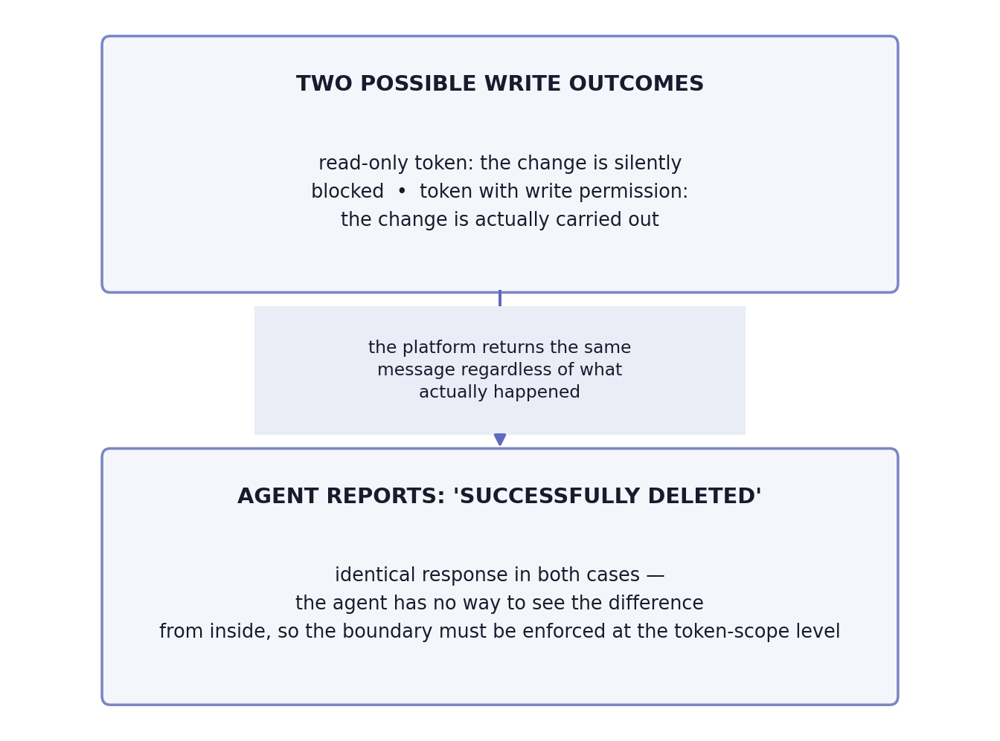

# Chapter 28 — AI-assisted observability: an agent that reads telemetry

The locum doctor covering a weekend shift for the regular family physician
is, often, an excellent doctor — perhaps even better educated, more
confident in general diagnostics, more current with the latest guidelines.
But he doesn't know that the patient in room three always has slightly
elevated blood pressure when nervous, something the regular doctor knows by
heart and doesn't take seriously. He doesn't know that another patient has a
rare allergy that isn't recorded in the system in the usual place, but in a
note someone added by hand long ago. The locum doctor does exactly what any
good doctor would do: tracks symptoms, orders standard tests, reaches a
conclusion that is, on paper, perfectly reasonable. The problem isn't his
knowledge of medicine. The problem is that a good diagnosis for **this**
patient, in **this** hospital, depends on a great deal that's never written
in any textbook — and is recorded, if it's recorded at all, in notes that
only the regular doctor reads.

## 28.1 The question this chapter answers

A tool that gives an AI agent access to metrics, logs, and traces promises
to speed up alert triage. Does that promise hold up against real, past
incidents — and, just as important, exactly where does such an agent
confidently get it wrong, and why is it harder for an agent than for a
human to notice when something is **missing** rather than reporting
something incorrectly?

## 28.2 How this was done — a practical walkthrough

### Method: replaying real incidents, not hypotheticals

Instead of taking the promise "an agent can triage alerts" on faith, the
implementation ran a check against four **real**, already-resolved
incidents from its own history — letting the agent independently walk the
same trail a human had walked, with the same tools for querying metrics,
logs, and traces, and comparing the agent's conclusion against the known,
already-confirmed answer. This is the "replay" method — because the answer
is known in advance, it's possible to measure precisely where the agent's
reasoning matches the human's, and where it diverges.

### First replay: a correct diagnosis through a chain of evidence

In the first incident (a service intermittently returned an error after
roughly five minutes of waiting), the agent independently assembled a chain
of evidence leading to the correct root cause: it recognized that the
latency value, repeating **exactly** at the same boundary, was not a
coincidence but the signature of a network device that terminates an idle
connection after a fixed time — distinct from the chaotic latency
distribution a crash of the application itself would produce. It then
correctly redirected attention from "where was the time spent" to "where
was the time **lost**" — discovering that the actual database query took
only a fraction of the total time, which ruled out the obvious but wrong
hypothesis ("a heavy query") and pointed instead to the service buffering
the entire response in memory before it began sending it, rather than
streaming it out incrementally. The agent systematically checked and
dismissed eight alternative infrastructure hypotheses, each with a single
query — exactly the work an agent is most useful for, because it's
mechanical and repetitive.

### Second replay: a differential that names the cause

In the second incident, the question that actually resolved the diagnosis
wasn't "what broke" but "is this happening in one environment or in both."
The agent correctly recognized that simultaneous degradation across two
independent environments pointed to a shared error in the code, not an
infrastructure problem specific to one environment — and, more
importantly, it managed to **rule out** the most obvious suspect (rising
database load) by comparing the incident window to the same time window on
previous days and discovering that this load level was entirely ordinary,
the third-largest of the week, while larger, more common spikes had never
caused errors. The correct answer required three separate comparisons —
across environments, across days, across subsystems — each cheap on its
own, but taken together tedious enough that the first human read of this
incident was wrong and had to be corrected the next day.

### Third replay: where a naive agent confidently gets it wrong

The third incident is the most valuable precisely because it shows the
boundary. The alert claimed that a third of requests were returning
errors — sounds like a serious outage, and that was in fact the original,
wrong conclusion even the human team reached, corrected only the next day.
An agent without additional context would have stopped at the same wrong
place: the orchestration platform reports an error percentage derived from
its own internal instance health check, not from the actual number of
errors at the system's edge. Only checking the **authoritative** counter —
actual errors at the load-balancing device — shows that the real error
rate was a thousand times lower than claimed, and that no real user
request ever saw an error. The real story was completely different: the
autoscaling policy was misconfigured for this type of workload, adding
instances slowly and shutting them down too early, in a loop that repeated
every hour without ever actually resolving the problem that triggered it.
Without additional context about **which** counter to trust, the agent
would have produced a confident, alert-ready, but wrong conclusion.

### Fourth replay: the class of absence

The fourth incident belongs to an entirely different class of failure —
nothing reported incorrectly; nothing reported **at all**. It was
discovered by accident, when a human noticed a discrepancy on a dashboard,
not through any alert. The investigation uncovered six separate lapses of
the same shape, introduced over the course of several weeks: links in
alerts pointing to a service that no longer exists under that name,
telemetry from one job family reporting under the name of an entirely
different family because of a copied setting, and jobs whose crashes had
been systematically suppressed for days. The implementation drew a
sobering conclusion about the division of labor: an agent is useful for
checking **observed** reality (whether telemetry actually exists where it
should, whether two sources agree) — but an automated, code-written check
of **declared** configuration remains necessary, because such a check
doesn't require access to the telemetry platform and can't be fooled by
the artifact of a narrow query time window. The agent doesn't replace that
check; it complements it.

### The context layer as a real asset

The common thread through all four replays: an agent with **generic**
observability knowledge gets this far, but at exactly the points where
specific insight into this particular system is needed — which counter is
authoritative, which metric lies by construction, which seemingly
innocuous query returns zero instead of an error when something is wrong —
generic knowledge stops being enough. The implementation therefore built a
small, carefully maintained document of system-specific pitfalls (a
"context layer"), loaded into the agent exactly at the moment it is about
to query the telemetry platform, not preloaded into every session in
advance. The decision to keep this document as something loaded on demand,
rather than a permanently present, enormous file weighing down every
unrelated session, proved essential to keeping the document useful instead
of forgotten.

{: width="92%" }

{: width="95%" }

### False success: when the agent says "done" and nothing happened

This case sits apart from the four replays above — it isn't a fifth
incident, but a deliberate test of a boundary. The implementation
uncovered a mechanism more dangerous than an agent that misdiagnoses — an
agent that **honestly** relays false information about its own action,
because it has no way of knowing better itself. The tool
that gives the agent access to the telemetry platform is deliberately
configured read-only, enforced through the access token's own permission
scope, not through a promise or an instruction in the prompt. When the
agent, in a test, tries to delete an alerting rule with that token, the
platform responds with a message saying the deletion **succeeded** — while
in reality nothing changed. The agent honestly relays that message
onward, because that's exactly what the tool returned to it.

The sobering consequence, which the implementation explicitly names: the
response "successfully deleted" looks **identical** regardless of whether
the action was actually carried out or silently blocked. The agent has no
way to internally distinguish the two outcomes — the difference exists
only at the level of whether the token actually had write permission,
information that's out of the agent's reach. This means the boundary "the
agent may propose, not execute" must not rest on an instruction to the
agent, nor on checking the agent's own report — it has to be enforced
**externally**, at the level of the access permission scope itself,
because that's the only place the difference between "blocked" and
"executed" exists at all. Trusting the agent's report of what it did is,
under this threat model, the wrong place to put trust.

{: width="80%" }

### The wrong store sounds like "no problem," not like an error

The implementation documented a distinct error class, different from "the
wrong counter in the same data store" from the third replay: here, the
**entire wrong store** is queried, because some events structurally don't
exist anywhere else. A concrete, measured example: an error reported by
the traffic load balancer at the system's edge **never** reaches the
backend service's own traces, because it happens at a layer the backend
never sees — a trace query returns empty, not because there's no error,
but because traces structurally cannot contain it. The same holds in the
opposite direction: certain kinds of application crashes are recorded only
in the infrastructure logging system, never in the centralized telemetry
platform. Querying the wrong store doesn't return an error — it returns a
convincing, empty zero, which reads as "no problem" exactly as
convincingly as a genuine finding of no problem would look.

The implementation adds a related, less obvious trap of the same origin: a
percentile computed over a small number of requests is a mathematical
artifact, not a measurement — a high percentile from only a handful of
requests a day doesn't mean "slow endpoint," it means the sample lacks the
statistical power for the percentile to say anything at all. The defense
against both traps is the same: before trusting an empty or extreme
result, check **which store could even contain** the requested event type
at all, and **how many requests** stand behind a derived statistic like a
percentile — both questions that generic observability knowledge doesn't
automatically raise, but the specific context layer about this system
should force.

### The new risk isn't access — it's who that access gets sent to

The tool that gives the agent access to the telemetry platform doesn't
open up any data access that doesn't already exist today: the same
queries, the same permissions, the same scope of visibility an engineer
running those queries by hand with administrator credentials would have.
The implementation explicitly separated this from the genuinely new risk,
and the distinction is worth drawing out: this implementation's
telemetry carries a real user identity (email on traces and logs), and
that data, once the agent queries the platform, now travels one step
further — to the language-model provider, as part of the context the
agent receives. That isn't a question of access (who's allowed to see
the data) but a question of **processing** (who the data physically gets
sent to) — exactly the same shape of question opened in this book's
privacy chapter earlier, just at a new, additional point in the chain.

The implementation considered four separate mechanisms to wall the agent
off from this specific identifier, in increasing order of complexity:

1. **Fully excluding one data source.** Simplest, but all-or-nothing —
   if personal data and everything else are mixed in the same log store,
   this means "no logs for the agent at all," not "logs without personal
   data."
2. **A tag filter at the access-policy level**, with the ability to
   exclude exactly the records that carry the identifier. Works for
   metrics and logs — but not for traces, because that access-policy
   mechanism simply doesn't cover that kind of data, and the very same
   identifier exists there too.
3. **Team-scoped access control**, inside the platform itself. Already
   mature for metrics and logs; still in early availability for traces —
   and, critically, there's no documented confirmation of whether that
   control even applies to the account the agent accesses through (as
   opposed to an individual person's account), which means none of this
   can be assumed and has to be explicitly tested before relying on it.
4. **An upper bound on the number of records returned per query.** This
   doesn't control access at all — it only limits how much data a single
   query can pull at once, useful as an additional measure, useless as a
   standalone safeguard.

None of these four mechanisms solves the problem at its root, and the
implementation openly admits this: the durable fix wasn't any combination
of these access controls, but a completely different move — the same
keyed pseudonymization described in the privacy chapter. A pseudonymized
identity that reaches the language-model provider is no longer personal
data in the same sense, and the question "who is it allowed to be sent
to" loses most of its weight. This is a concrete instance of that
chapter's general point: the real fix for an identity leak is rarely an
access control at the new point — it's often removing the identity
itself from the place the leak could ever start from.

### A ready-made instruction pack from the vendor, checked against your own, hard-won facts

Before building the custom, purpose-fit context layer described earlier
in this chapter, the implementation checked whether the same work already
existed ready-made — the telemetry platform's vendor publishes its own,
extensive pack of pre-built agent instructions, free and easy to install.
Instead of taking on faith that such a pack would make a custom context
layer redundant, the implementation checked it directly, against two of
its own hardest-won facts from earlier work on this platform. Neither of
the two was mentioned — the pack wouldn't have prevented a single one of
the implementation's own past mistakes.

Worse than mere non-overlap is one concrete item inside that pack that
describes the **wrong** access path to the platform for this exact
project — it documents only the self-hosted variant, never the managed
variant the implementation actually uses, and advises removing access as
soon as a read is confirmed to work, the opposite of the decision the
implementation deliberately made. The instruction pack wasn't neutrally
unhelpful here — it would have been actively wrong if followed without
checking.

The most sobering finding came from a single search: not one line in the
entire, extensive pack mentions the active-user billing mechanism —
exactly the mechanism that already cost this implementation an unplanned
expense once, quietly and unnoticed a month before it was caught. The
lesson the custom context layer exists to capture — which billing is
hidden, which metric lies, which access path is real and which is
stale — isn't generic platform knowledge that any external pack, however
extensive, can carry in advance. That knowledge is made only one way:
someone actually pays the price of a mistake once, and then writes it
down.

## 28.3 Analytical section — external confirmation, and one sobering limit

### The protocol for connecting agents to telemetry is new, but already standardized

An open protocol that standardizes how AI agents access external tools and
data exists for exactly this purpose — described by its own creator as a
universal connector that avoids the need for a bespoke integration per
tool. Every major telemetry platform vendor has since shipped its own
server for this protocol, with a consistently similar design choice:
read-only by default, with explicit flags required to allow writes.

### An official recommendation independently confirms the discipline of constraining queries

An independent source from the same industry formulates a philosophy that
almost word-for-word matches what the implementation does: an agent should
query the telemetry platform **the way an experienced engineer would** —
with surgical precision, testing concrete hypotheses, within strict
constraints, not "pouring" a huge volume of raw data into the agent's
context. The same source explicitly recommends a mandatory discovery step
before querying (which metrics even exist, with which labels) and a
cardinality check before running a query that could turn out to be too
expensive — mechanisms that prevent exactly the kind of mistake that would
otherwise go unnoticed until the bill, or the agent's context, overflows.

### A known, named pitfall: a query that succeeds, but lies

An independent risk analysis of this class of tool names exactly the
pitfall the implementation uncovered in the third replay: the failure
isn't a crash or an error message — it's a query that **succeeds** and
returns a plausible-looking but wrong answer, because a wrong term (a
wrong service name, a wrong counter) quietly entered somewhere earlier in
the reasoning chain. This confirms that the implementation's fourth replay
isn't an exception but a well-known, named failure pattern specific to
agents that carry out multiple reasoning steps in sequence.

### The context layer as the differentiating factor is independently confirmed outside this implementation

An independent analysis on the same topic formulates an almost identical
conclusion to the one the implementation reached through its own
experience: raw tool access — what the protocol standardizes — is
necessary, but not sufficient. Without organizational knowledge (who owns
which service, what the dependencies are, which metrics are known to be
misleading), an agent **guesses instead of knowing** — and the difference
between an agent that guesses and an agent that knows is, according to the
same analysis, the difference between a demonstration and a system that
can actually be used in production. This is independent confirmation that
the implementation's "context layer" isn't a byproduct of caution but an
identified, named, decisive ingredient.

### The context layer has a measurable limit: it can be found and still bypassed

The previous conclusion — that the context layer is a decisive
ingredient, not a byproduct of caution — gets tested by what happens once
that same layer is placed inside a tool where the agent can find it on
its own, instead of being fed it by hand. A condensed write-up of the
pitfalls document was published inside the telemetry platform's own
assistant, available to every user. The result, across three separate
attempts with increasingly explicit phrasing — first just a reference,
then a paragraph explicitly stating when the write-up applies, finally a
block with concrete examples of a wrong and a correct query — was
identical every time: the assistant would use the write-up's own
vocabulary in its answer, the interface would even confirm the write-up
had been found and read, and the query it actually ran stayed the same,
forbidden one. In one such case the agent called an "event"-type counter
"something like a monotonically increasing counter," ran a query built on
that assumption, got zero, and confidently reported that nothing had
happened in that period — while the write-up, literally found and cited
as a source, said the opposite.

Independently of this test, one control question outside everything the
write-up covers returned a convincing, neatly formatted application
latency report that was wrong by roughly a factor of a thousand — because
one latency metric was recorded in seconds and the agent read it as if it
were in milliseconds, and nothing in general observability knowledge
warned it of that possibility. Precisely because the question fell
outside the covered scope, this miss revealed a gap no earlier test
could — hence the implementation's conclusion that a control question
deliberately placed outside the covered scope is worth more than one more
successful test inside it.

The difference between these two outcomes and the context layer described
earlier isn't in the content but in where the rule lives. The context
layer the implementation builds gets loaded into the model as text, in
the same space where the model decides what to do — and such a rule, as
this test shows, can be found, cited as a source, and still not applied,
because nothing technically enforces it at the moment the query is
actually run. An independent project in the same space builds the same
guidance one level lower: the rule lives on the server that receives the
query, checks it before execution, and **rejects** one that violates the
boundary — instead of leaving the model, after reading the advice, still
free not to follow it. The context layer remains a valuable, cheap habit
that catches most cases and costs only the discipline of upkeep — but
where the cost of a single wrong query is high enough, this difference
stops being theoretical: advisory text is a ceiling on how good a soft
approach can get, not a substitute for enforcement the model cannot route
around.

### The recommendation that the agent remain advisory, not authorized to change state

Independent guidance on governing this class of tool in an operational
context recommends a clear separation of authority: an agent may gather
and connect evidence, but any change to system state (rolling back to a
previous version, changing capacity, modifying configuration) requires
explicit human approval. The reasoning given in the same source is direct:
production diagnostics doesn't have the same firm, verifiable signals
that, for instance, code generation has — which can be tested before being
applied — which makes autonomous action by an agent in this context
inherently riskier. The implementation has already enforced this
recommendation structurally: the agent proposes and explains, it does not
execute changes itself.

### Counterfactual scenario: what would have happened without the context layer

Imagine a team that gave an agent access to the telemetry platform without
spending a single minute documenting known pitfalls — trusting that raw
access to data was enough. The third replay shows exactly what would
happen: the agent would read an alert claiming a serious outage, confirm
it without checking against the authoritative source, and escalate a false
alarm with full confidence — because nothing in its generic knowledge of
observability would warn it that this particular counter, on this
particular platform, is known to be unreliable. The damage wouldn't be
that the agent did nothing — it would be that it did the wrong thing,
fast, and with a convincing explanation.

Let's return to the locum doctor from the start of this chapter. His
medical knowledge isn't the problem — the problem is the absence of the
note the regular doctor would recognize instinctively. The solution isn't
to dismiss the locum doctor, nor to trust him without verification — the
solution is to write those notes clearly, update them every time something
new is learned, and put them where the locum doctor will actually read
them before making a decision. An AI agent that reads telemetry works by
the same rule: useful exactly to the extent that the context layer around
it is current, honest, and available at the right moment.

## 28.4 Rules collected from this chapter

- Test an agent's triage promise against real, already-resolved incidents
  before taking it on faith — replaying with a known answer is a cheap,
  precise way to measure where the reasoning diverges.
- Build and actively maintain a small, purpose-loaded context layer with
  known pitfalls specific to your system — generic observability knowledge
  stops being accurate enough exactly where your system diverges from the
  textbook.
- Expect that the agent will sometimes return a successful, plausible, but
  wrong answer — this isn't a rare mistake but a named, well-known failure
  class specific to agents that reason across multiple steps.
- **Class of absence:** keep an automated, code-written check of declared
  configuration separate from the agent that checks observed reality — one
  doesn't replace the other; both are needed for the class of failures
  where something is missing rather than reporting incorrectly.
- Keep the agent advisory for changes to system state — let it propose and
  explain, not execute — until enough trust and verification has been
  built for autonomous action to be justified.
- **False success:** enforce the "read-only" boundary at the level of the
  access permission scope itself, not at the level of an instruction to
  the agent — a blocked write and a real write can look identical in the
  agent's report, so trust in that report is not where that boundary can
  rest.
- Before trusting an empty or extreme result, check whether the requested
  event type could even exist in the store that was queried, and how many
  requests stand behind a derived statistic like a percentile — both
  traps return a convincing but wrong zero instead of an error message.
- When an agent sends telemetry to the model, treat that as a processing
  question (who the data gets sent to), not an access question (who's
  allowed to see it) — access controls at various points help, but the
  durable fix for a personal identifier is removing the identity itself
  before it ever reaches the agent, not one more lock along the way.
- Don't trust a ready-made, externally published agent instruction pack
  until you've checked it against your own hard-won facts — a generic
  pack can be unhelpful at best, and actively wrong at worst, especially
  where it describes a stale or unused access path.
- Don't rely on an advisory context layer being found and cited as a
  source — the model can cite it and still act against it; where the
  cost of a wrong query is high, the rule should live on the side that
  receives the query and can reject it, not only on the side that
  suggests it.

## 28.5 Exercise for the reader

Take one genuinely resolved incident from your team's history, ideally one
where the first explanation was wrong and got corrected later. Imagine an
AI agent with only generic observability knowledge has to diagnose it from
scratch. At exactly which step would the agent likely stop at the same
wrong place your team stopped at the first time — and what should be
written down, in advance, to stop it there?

---

### Sources used in the analytical section

- [Model Context Protocol — Introduction](https://modelcontextprotocol.io/docs/2026-07-28/getting-started/intro.md)
- [How obs-mcp boosts AI-native OpenShift observability — Red Hat Developer](https://developers.redhat.com/articles/2026/07/16/how-obs-mcp-boosts-ai-native-openshift-observability)
- [AI SRE Hallucination Guardrails — Neubird](https://neubird.ai/blog/ai-sre-hallucination-guardrails/)
- [The Missing Context Layer: Why Tool Access Alone Won't Make AI Agents Useful in Engineering — SD Times](https://sdtimes.com/ai/the-missing-context-layer-why-tool-access-alone-wont-make-ai-agents-useful-in-engineering/)
- [AI SRE Agents for Incident Response: Where Should Teams Trust Them? — NHIMG](https://nhimg.org/community/agentic-ai-and-nhis/ai-sre-agents-for-incident-response-where-should-teams-trust-them/)
