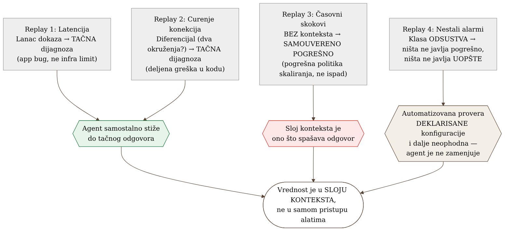

# Poglavlje 28 — AI-asistirana observability: agent koji čita telemetriju

Zamenski lekar koji pokriva vikend smenu za redovnog porodičnog doktora je,
često, odličan lekar — možda i bolje obrazovan, sigurnije u opštoj
dijagnostici, ažurniji sa najnovijim smernicama. Ali on ne zna da pacijent
iz sobe tri uvek ima blago povišen pritisak kad je nervozan, što redovni
doktor zna napamet i ne shvata ozbiljno. Ne zna da druga pacijentkinja ima
retku alergiju koja nije upisana u sistem na uobičajenom mestu, nego u
napomeni koju je neko davno dodao rukom. Zamenski lekar radi tačno ono što
bi svaki dobar lekar uradio: prati simptome, naručuje standardne analize,
donosi zaključak koji je, na papiru, savršeno razuman. Problem nije u
njegovom znanju medicine. Problem je što dobra dijagnoza za **ovog**
pacijenta, u **ovoj** bolnici, zavisi od mnogo toga što nikad nije upisano
u udžbenik — a stoji zapisano, ako uopšte stoji, u napomenama koje samo
redovni doktor čita.

## 28.1 Pitanje na koje ovo poglavlje odgovara

Alat koji AI agentu daje pristup metrikama, logovima i trejsovima obećava
da ubrza triažu alarma. Da li to obećanje drži na stvarnim, prošlim
incidentima — i, podjednako važno, gde tačno takav agent samouvereno
pogreši, i zašto je teže agentu nego čoveku da primeti kad nešto **nedostaje**
umesto da nešto javlja pogrešno?

## 28.2 Kako je to urađeno — praktičan pregled

### Metod: ponovno odigravanje stvarnih incidenata, ne hipoteza

Umesto da poveruje na reč obećanju "agent može da trijažira alarme,"
implementacija je sprovela proveru na četiri **stvarna**, već rešena
incidenta iz sopstvene istorije — puštajući agenta da nezavisno prođe
kroz iste tragove koje je čovek prošao, sa istim alatima za upit metrika,
logova i trejsova, i porediti agentov zaključak sa poznatim, već potvrđenim
odgovorom. Ovo je "replay" metod — jer je odgovor unapred poznat, moguće je
tačno izmeriti gde se agentovo rezonovanje poklapa sa ljudskim, a gde
skreće.

### Prvi replay: tačna dijagnoza kroz lanac dokaza

U prvom incidentu (servis je povremeno vraćao grešku posle otprilike pet
minuta čekanja), agent je samostalno sastavio lanac dokaza koji vodi ka
tačnom uzroku: prepoznao je da vremenska vrednost kašnjenja, ponovljena
**tačno** na istoj granici, nije slučajnost nego potpis mrežnog uređaja
koji prekida neaktivnu konekciju posle fiksnog vremena — različito od
haotične raspodele kašnjenja koju bi izazvao pad same aplikacije. Zatim je
ispravno preusmerio pažnju sa "gde je vreme potrošeno" na "gde je vreme
**izgubljeno**" — otkrivši da je stvarni upit prema bazi trajao svega
delić ukupnog vremena, što je isključilo očiglednu, ali pogrešnu hipotezu
("težak upit") i ukazalo na to da servis čuva ceo odgovor u memoriji pre
nego što počne da ga šalje, umesto da ga šalje postepeno. Agent je
sistematski proverio i odbacio osam alternativnih infrastrukturnih
hipoteza, svaku jednim jedinim upitom — tačno posao za koji je agent
najkorisniji, jer je mehanički i ponavljajući.

### Drugi replay: diferencijal koji imenuje uzrok

U drugom incidentu, ključno pitanje koje je razrešilo dijagnozu nije bilo
"šta je pokvareno" nego "da li se ovo dešava u jednom okruženju ili u
oba." Agent je ispravno prepoznao da istovremena degradacija u dva
nezavisna okruženja ukazuje na deljenu grešku u kodu, ne na infrastrukturni
problem specifičan za jedno okruženje — i, još važnije, uspeo je da
**isključi** najočigledniju sumnju (rastuće opterećenje baze podataka)
tako što je uporedio incidentni prozor sa istim vremenskim prozorom
tokom prethodnih dana i otkrio da je taj nivo opterećenja bio sasvim
uobičajen, treći po veličini u nedelji, a da veći, uobičajeniji skokovi
nikad nisu izazivali greške. Ispravan odgovor je zahtevao tri odvojene
komparacije — kroz okruženja, kroz dane, kroz podsisteme — svaka jeftina
pojedinačno, ali zajedno dovoljno mukotrpna da je prvo ljudsko čitanje
ovog incidenta bilo pogrešno i moralo je da se ispravi sledećeg dana.

### Treći replay: gde naivan agent samouvereno greši

Treći incident je najvredniji upravo zato što pokazuje granicu. Alarm je
tvrdio da trećina zahteva vraća grešku — zvuči kao ozbiljan ispad, i to je
bio prvobitni, pogrešan zaključak čak i ljudskog tima, ispravljen tek
sledećeg dana. Agent bez dodatnog konteksta bi stao na istom pogrešnom
mestu: platforma za orkestraciju izveštava procenat grešaka izveden iz
sopstvene interne provere zdravlja instance, ne iz stvarnog broja grešaka
na granici sistema. Tek provera **autoritativnog** brojača — stvarnih
grešaka na uređaju za balansiranje saobraćaja — pokazuje da je stvarna
stopa grešaka bila hiljadu puta manja od tvrđene, i da nijedan stvaran
zahtev korisnika nikad nije video grešku. Prava priča je bila potpuno
drugačija: politika automatskog skaliranja je bila pogrešno oblikovana za
ovaj tip opterećenja, dodajući instance sporo i gaseći ih prerano, u
petlji koja se ponavljala svakog sata bez ikad stvarno rešivši problem
koji ju je pokrenula. Bez dodatnog konteksta o **kojem** brojaču verovati,
agent bi proizveo samouveren, spreman-za-alarmiranje, ali pogrešan
zaključak.

### Četvrti replay: klasa odsustva

Četvrti incident pripada potpuno drugoj klasi kvara — ništa nije javilo
pogrešno; ništa nije javilo **uopšte**. Otkriven je slučajno, kad je čovek
primetio neslaganje na dashboard-u, ne kroz bilo koji alarm. Istraga je
otkrila šest odvojenih propusta istog oblika, uvedenih tokom nekoliko
nedelja: linkovi u alarmima koji vode na servis koji više ne postoji pod
tim imenom, telemetrija jedne porodice zadataka koja se, zbog kopiranog
podešavanja, prijavljuje pod imenom potpuno druge porodice, i zadaci čiji
su padovi bili sistematski potiskivani danima. Implementacija je izvukla
otrežnjujući zaključak o podeli rada: agent je koristan za proveru
**posmatrane** stvarnosti (da li telemetrija stvarno postoji tamo gde bi
trebalo, da li se dva izvora slažu) — ali automatizovana, kodom pisana
provera **deklarisane** konfiguracije ostaje neophodna, jer takva provera
ne zahteva pristup platformi za telemetriju i ne može biti zavarana
artefaktom uskog vremenskog prozora upita. Agent ne zamenjuje tu proveru;
dopunjuje je.

### Sloj konteksta kao stvarna imovina

Zajednička nit sva četiri replay-a: agent sa **generičkim** znanjem
observability-ja dolazi dovde, ali tačno na mestima gde je potreban
specifičan uvid u ovaj konkretan sistem — koji brojač je autoritativan,
koja metrika laže po konstrukciji, koji naizgled bezazlen upit vraća
nulu umesto greške kad nešto nije u redu — generičko znanje prestaje da
bude dovoljno. Implementacija je zato izgradila mali, pažljivo održavan
dokument specifičnih zamki ("sloj konteksta"), učitan agentu tačno u
trenutku kad se sprema da upita platformu za telemetriju, ne pri svakoj
sesiji unapred. Odluka da se ovaj dokument drži kao nešto što se učitava
po potrebi, a ne kao stalno prisutan, ogroman fajl koji opterećuje svaku
nevezanu sesiju, pokazala se ključnom za to da dokument ostane koristan
umesto zaboravljen.

{: width="92%" }

{: width="95%" }

## 28.3 Analitički deo — potvrda spolja, i jedna otrežnjujuća granica

### Protokol za povezivanje agenata na telemetriju je nov, ali već standardizovan

Otvoren protokol koji standardizuje kako AI agenti pristupaju spoljnim
alatima i podacima postoji tačno za ovu svrhu — opisan od strane samog
tvorca kao univerzalan konektor koji izbegava potrebu za posebnom
integracijom za svaki alat. Svaki veći dobavljač platforme za telemetriju
je od tada isporučio sopstveni server po ovom protokolu, sa dosledno
sličnim dizajnerskim izborom: podrazumevano samo-za-čitanje, sa eksplicitnim
zastavicama potrebnim da se dozvoli pisanje.

### Zvanična preporuka nezavisno potvrđuje disciplinu ograničavanja upita

Nezavisan izvor sa iste industrije formuliše filozofiju koja se gotovo
doslovno poklapa sa onim što implementacija radi: agent treba da upita
platformu za telemetriju **onako kako bi to radio iskusan inženjer** — sa
apsolutnom preciznošću, testirajući konkretne hipoteze, unutar strogih
ograničenja, ne "izlivajući" ogromnu količinu sirovih podataka u kontekst
agenta. Isti izvor eksplicitno preporučuje obavezan korak otkrivanja pre
upita (koje metrike uopšte postoje, sa kojim oznakama) i proveru
kardinalnosti pre izvršenja upita koji bi mogao biti preskup — mehanizmi
koji sprečavaju tačno onu vrstu greške koja bi inače prošla neopaženo dok
se račun ili kontekst agenta ne preplavi.

### Poznata, imenovana zamka: upit koji uspe, ali laže

Nezavisna analiza rizika ove klase alata imenuje tačno zamku koju je
implementacija otkrila u trećem replay-u: greška nije pad ili poruka o
grešci — to je upit koji **uspe** i vrati verodostojno izgledajući, ali
pogrešan odgovor, zato što je pogrešan pojam (pogrešno ime servisa,
pogrešan brojač) tiho ušao negde ranije u lanac rezonovanja. Ovo potvrđuje
da četvrti replay implementacije nije izuzetak nego dobro poznat, imenovan
obrazac greške specifičan za agente koji rade više koraka rezonovanja
zaredom.

### Sloj konteksta kao razlikovni faktor je nezavisno potvrđen izvan ove implementacije

Nezavisna analiza sa iste teme formuliše skoro identičan zaključak do koga
je implementacija stigla sopstvenim iskustvom: sirov pristup alatima —
ono što protokol standardizuje — je neophodan, ali nije dovoljan. Bez
organizacionog znanja (ko je vlasnik kog servisa, koje su zavisnosti, koje
metrike su poznato zavaravajuće), agent **nagađa umesto da zna** — a
razlika između agenta koji nagađa i agenta koji zna je, po istoj analizi,
razlika između demonstracije i sistema koji se stvarno može koristiti u
produkciji. Ovo je nezavisna potvrda da "sloj konteksta" implementacije
nije nusprodukt opreza nego identifikovan, imenovan, presudan sastojak.

### Preporuka da agent ostane savetodavan, ne ovlašćen da menja stanje

Nezavisna smernica o upravljanju ovom klasom alata u operativnom kontekstu
preporučuje jasno razdvajanje ovlašćenja: agent sme da prikuplja i
povezuje dokaze, ali svaka promena stanja sistema (vraćanje na prethodnu
verziju, promena kapaciteta, izmena konfiguracije) zahteva izričito ljudsko
odobrenje. Razlog naveden u istom izvoru je direktan: dijagnostika u
produkciji nema iste čvrste, proverljive signale kakve ima, na primer,
generisanje koda koje se može testirati pre primene — što čini
autonomno delovanje agenta u ovom kontekstu suštinski rizičnijim.
Implementacija je ovu preporuku već sprovela strukturno: agent predlaže
i objašnjava, ne izvršava promene sam.

### Kontrafaktički scenario: šta bi se dogodilo bez sloja konteksta

Zamislimo tim koji je agentu dao pristup platformi za telemetriju bez ijedne
minute uloženog u dokumentovanje poznatih zamki — verujući da je sirov
pristup podacima dovoljan. Treći replay pokazuje tačno šta bi se dogodilo:
agent bi pročitao alarm koji tvrdi ozbiljan ispad, potvrdio ga bez provere
protiv autoritativnog izvora, i eskalirao lažnu uzbunu sa punim
samopouzdanjem — jer ništa u njegovom generičkom znanju o observability-ju
ne bi ga upozorilo da je baš ovaj konkretan brojač, na baš ovoj platformi,
poznato nepouzdan. Šteta ne bi bila u tome da agent ništa ne uradi — bila
bi u tome da uradi nešto pogrešno, brzo, i sa uverljivim obrazloženjem.

Vratimo se zamenskom lekaru s početka poglavlja. Njegovo medicinsko znanje
nije problem — problem je odsustvo napomene koju bi redovni doktor
prepoznao instinktivno. Rešenje nije odbaciti zamenskog lekara niti mu
verovati bez provere — rešenje je napisati te napomene jasno, ažurirati
ih svaki put kad se nešto novo sazna, i staviti ih tamo gde će ih zamenski
lekar stvarno pročitati pre nego što donese odluku. AI agent koji čita
telemetriju radi po istom pravilu: koristan tačno onoliko koliko je
sloj konteksta oko njega ažuran, iskren, i dostupan u pravom trenutku.

## 28.4 Skupljena pravila iz ovog poglavlja

- Proveri obećanje agenta za triažu na stvarnim, već rešenim incidentima
  pre nego što mu poveruješ na reč — ponovno odigravanje sa poznatim
  odgovorom je jeftin, precizan način da se izmeri gde rezonovanje
  odstupa.
- Izgradi i aktivno održavaj mali, ciljano-učitavan sloj konteksta sa
  poznatim zamkama specifičnim za tvoj sistem — generičko znanje
  observability-ja prestaje da bude dovoljno tačno tamo gde se sistem
  razlikuje od udžbenika.
- Očekuj da će agent ponekad vratiti uspešan, verodostojan, ali pogrešan
  odgovor — ovo nije retka greška nego imenovana, dobro poznata klasa
  kvara specifična za agente koji rezonuju kroz više koraka.
- Zadrži automatizovanu, kodom pisanu proveru deklarisane konfiguracije
  odvojeno od agenta koji proverava posmatranu stvarnost — jedno ne
  zamenjuje drugo, oboje su potrebni za klasu kvarova gde nešto nedostaje
  umesto da javlja pogrešno.
- Drži agenta savetodavnim za promene stanja sistema — neka predlaže i
  objašnjava, ne izvršava — dok se ne izgradi dovoljno poverenja i
  provere da autonomno delovanje bude opravdano.

## 28.5 Vežba za čitaoca

Uzmi jedan stvarno rešen incident iz istorije tvog tima, po mogućstvu jedan
gde je prvo objašnjenje bilo pogrešno i ispravljeno kasnije. Zamisli da AI
agent sa samo generičkim znanjem observability-ja treba da ga dijagnostikuje
od nule. Na kom tačno koraku bi agent verovatno stao na istom pogrešnom
mestu gde je stao i tvoj tim prvi put — i šta bi trebalo da bude zapisano,
unapred, da ga tu spreči?

---

### Izvori korišćeni u analitičkom delu

- [Model Context Protocol — Introduction](https://modelcontextprotocol.io/docs/2026-07-28/getting-started/intro.md)
- [How obs-mcp boosts AI-native OpenShift observability — Red Hat Developer](https://developers.redhat.com/articles/2026/07/16/how-obs-mcp-boosts-ai-native-openshift-observability)
- [AI SRE Hallucination Guardrails — Neubird](https://neubird.ai/blog/ai-sre-hallucination-guardrails/)
- [The Missing Context Layer: Why Tool Access Alone Won't Make AI Agents Useful in Engineering — SD Times](https://sdtimes.com/ai/the-missing-context-layer-why-tool-access-alone-wont-make-ai-agents-useful-in-engineering/)
- [AI SRE Agents for Incident Response: Where Should Teams Trust Them? — NHIMG](https://nhimg.org/community/agentic-ai-and-nhis/ai-sre-agents-for-incident-response-where-should-teams-trust-them/)
