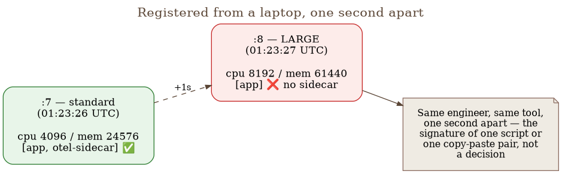
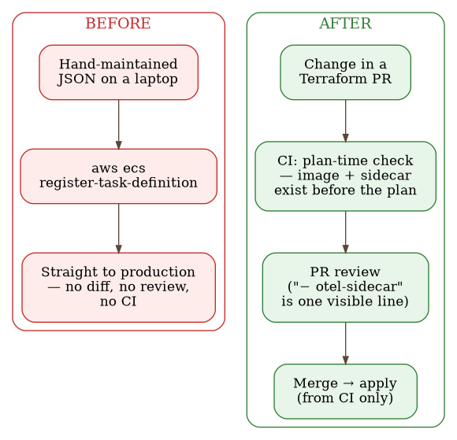

# Chapter 29 — CI/CD for infrastructure: when two revisions quietly go their separate ways

Picture a restaurant kitchen with two copies of the same recipe: one taped up by the stove,
which the head chef updates every time an ingredient changes, and a second, laminated one
hanging inside the walk-in fridge, which the night shift actually cooks from because the
stove is busy during the day. One day the head chef adds an ingredient that changes the
dish's safety, not just its flavor, and updates the card by the stove. Nobody thinks to
open the card in the fridge, because nobody even remembered it was still in use. The night
shift keeps cooking exactly to the instructions it has — the failure isn't that someone
broke the rules, it's that the rules, at some point, quietly stopped existing in one place
while still holding in the other.

## 29.1 The question this chapter answers

When two configurations that should be identical — except for one deliberate parameter —
are maintained independently, how do you catch the moment they quietly diverge? And
specifically: what do you do when that divergence hits a path that runs so rarely that no
runtime alert can tell "broken" apart from "never ran at all"? And once you finally catch
it, do you quietly patch it, or use it as the reason to change the process that produced
it?

## 29.2 How this was done — a practical walkthrough

### Two JSON files, one second apart

Chapter 6 already introduced this pattern — "a pair of sizes, standard and
enlarged, one of them missing a change the other received" — as one of three
general ways registering a revision and actually launching it silently
diverge. Here that same pattern is worked out as a full case, with the
process that produced it and the process that eventually caught it.

One scheduled data-processing job ran in two variants: a standard one, and a "LARGE"
variant for a particularly demanding model that regularly OOM'd the standard sizing. Each
variant was its own ECS task-definition revision — two separate, hand-maintained JSON files
on one engineer's laptop, outside source control, with no review and no pipeline.

When the job was onboarded to OpenTelemetry, the sidecar collector and its six accompanying
environment variables were added to the standard variant. The LARGE variant was waiting on
the same change. A few days later, both revisions were re-registered — one second apart,
from the same laptop, with the same tool:

{: width="88%" }

The one-second gap isn't a meaningless coincidence — it's the signature of a single script
or a single copy-paste pair, not a deliberate decision to leave the sidecar out. Diffing the
two revisions confirms it: the LARGE variant introduces no new application value at all —
no new environment variables, no changed values, the same image. It's the standard variant
plus a bigger size, minus the instrumentation. Nothing about the LARGE variant itself
justified dropping the sidecar — it simply came from the file that never received it.

### Why runtime monitoring couldn't have caught this

The LARGE variant runs once a day, for one specific model type only. For the next four
days, that path produced **zero** telemetry — no metric, no trace, no log via
OpenTelemetry. And nobody noticed, because it looks identical to a path that simply didn't
run. An alert built on "absence of signal" would either have to tolerate that case —
rendering it useless exactly when it's needed — or false-positive constantly on every
legitimate low-frequency job.

This is the chapter's central point, and it's worth stating without softening: **runtime
monitoring was structurally incapable of catching this class of failure.** It wasn't that
the alert wasn't sensitive enough — no alert built on observing telemetry can tell "a
system that stopped reporting" apart from "a system that never started," once the execution
frequency drops to once a day or less.

Making it worse: the job was still on the list of instrumented families, so every CRITICAL
alert about its failure kept shipping links to Grafana dashboards, Mimir, Loki, Tempo. Those
links opened empty. An engineer following them would conclude the whole telemetry plane was
broken, not that this specific revision had never been instrumented at all.

### The detector that did catch it

What actually caught the problem wasn't a Grafana query — it was a weekly check comparing
**declared** configuration (what's registered in AWS) against expectations, with zero
queries against the telemetry platform. It flagged the job family under two rules, two
lenses on the same fact:

- **Revision regression** — a newer revision lost a sidecar an older one carried.
- **Current state** — the family is on the instrumented list, but its latest ACTIVE
  revision has no sidecar.

Detection latency: four days, bounded by the check's weekly cadence — worst case, seven.
This check could do its job with zero credentials to the telemetry platform, and it's
immune to the query-window artifacts that are known to fool queries against the telemetry
itself (see Chapter 11 on cardinality and Chapter 28 on query traps).

### The decision to leave the incident open

The usual next step would be quiet: register the correct revision, flip the launcher's
pointer to it, close the ticket. Instead, the incident's status was explicitly set to "open
by decision — held as the worked example for the upcoming CI/CD process work. Do not close
it silently."

This is unusual, and it's worth naming why it's worth copying: most teams patch the one
broken revision and move on, spending the incident's one real asset — the fact that it's
fresh, concrete, and already has a willing sponsor — on nothing. An incident that's still
raw, that still has a name and a date attached to it, is a far more persuasive argument for
a process change than an abstract proposal to "add CI for infrastructure someday."

### The table: what happened → what would have prevented it

Every row of this table maps one concrete failure point to one concrete control —
deliberately built as a working document, not a postmortem afterthought:

| What happened | The control that would have prevented it |
| --- | --- |
| Two JSON files drifted apart | One source of truth — task definitions in the repo (Terraform or a generator), the LARGE variant derived from the standard one rather than maintained beside it |
| The sidecar was dropped from one variant | A CI check that fails the build if a family flagged "instrumented" produces a revision without a sidecar |
| Production config applied from a laptop | Deploy from CI only, the human role reduced to approving a diff |
| No diff to review | PR review where "− otel-sidecar" is one visible, unmissable line |
| Four-day detection latency | Event-driven detection (on task-definition registration) instead of a weekly sweep |
| A known trap recurred | Documented hazards turned into asserted tests, not paragraphs nobody re-checks |
| A deferred decision went stale silently | Deferrals that depend on current state get an expiry, not just a note |

### Six weeks later: what actually shipped

This chapter wouldn't be honest if it stopped at the proposal table. Six weeks after the
incident, part of that table became reality, not just intent:

- Infrastructure Terraform moved to a **feature-branch + pull-request** model — every change
  goes through a PR, and a bot automatically posts the `terraform plan` as a comment before
  anyone approves it.
- A **plan-time guard** was introduced: a `data` source that checks whether the image a
  change references actually exists in the registry **before** the plan is even computed.
  This directly closes the broader shape of failure behind this incident — configuration
  that points at something that doesn't exist, reports success, and leaves the old system
  quietly running until someone notices the new one never came up at all.
- The separation between the planning role and the apply role was verified
  **adversarially, not just by design**: a dedicated CI step deliberately tries to run an
  apply using the limited identity every pull request carries, and expects it to be
  rejected in exactly one way — an explicit "access denied," not any other kind of error.
  Green on that step means the pipeline's privileged boundary is still in place; red means
  it's gone, silently, with no code change that would have announced it on its own.
- CI now runs **lint, type checks, and self-tests** over the infrastructure's supporting
  code (not just `terraform plan`) — the default rule set for static code analysis, with
  two deliberately disabled; type checking invoked separately per directory, because one
  shared invocation breaks on two files that carry the same module name in different
  directories; and a set of standalone tests run as part of the same check. One trap here
  is worth naming because it isn't specific to this project: a rule meant to find
  unjustified rule exclusions gives a false picture if run in isolation, with every other
  rule disabled — every existing exception suddenly looks unused, because nothing else
  exists for it to be excluding anymore. The auto-fix for that same rule goes a step
  further and deletes the entire accompanying comment, including the reason the exception
  was written down in the first place. A tool that looks for unnecessary exceptions is,
  viewed apart from the context it was meant for, its own biggest false positive.

It's worth being honest about what hasn't shipped, too: event-driven detection (the
table's fifth row) hadn't replaced the weekly sweep as of writing. This isn't a tidy,
closed case study with a perfect ending — it's a live, ongoing process, and saying so
plainly is more honest than polishing it.

{: width="92%" }

### Nine days later: the same kind of error, one layer up

The part that makes this chapter worth a second look instead of a one-time close: nine
days after the review above, the exact same pattern repeated itself — not in the
infrastructure, but in the documentation describing it.

A routine consistency check, run right after the boundary from the previous section was
closed, compared several documents against the account, against each other, and against
the code beside them. The worst single finding: one stack's description still claimed the
deploy role "still needs to" get that exact boundary and its test — while the outputs file
in the SAME directory already exported that role's ARN and the list of allowed signers.
Both prerequisites had, by the time the description was read, already been satisfied for
days. The same document misdescribed its own mechanism in the very paragraph meant to
prevent exactly that confusion — it said identity customization "appends" a segment at the
end, when it actually replaces that entire segment.

The second finding was more serious than stale text — a real, still-open gap, masked by a
table that made it look closed. The table listed two replacements for paid security checks
the free plan doesn't include: a step supposedly catching accidentally committed secrets,
and a scheduled check that a release tag is still an ancestor of the main branch, as a
substitute for protecting that tag from being moved. Checked against the actual pipeline:
the step that catches secrets doesn't exist anywhere in it — there are eight code-quality
check steps, and none of them scans for secrets. The tag check does exist, but ships
deliberately inactive until a single command arms it — and at the time of the finding, that
command still hadn't been run. The sentence in the document read as if both were already in
place, on a repository that had, only recently, started issuing itself cloud credentials
through the very boundary described above.

The lesson is worth writing down without softening it: **a table that names what closes a
gap is not the same as a table that records whether that gap is actually closed.** The
first describes a plan; the second describes an account. When the two get mixed in the same
paragraph, the document stays technically accurate at the moment of writing and becomes
wrong the instant reality shifts — with no signal that it happened, because nothing in the
text itself distinguishes "this will close the gap" from "this has closed the gap." That's
the exact same shape of error as the two JSON task definitions from the start of this
chapter, just one layer above the code: two places describing the same system state,
maintained independently, silently diverged — except this time one of those two places was
prose, not configuration, so no `plan` would ever have thought to compare it.

### Cloning inherits identity too, not just the image base

There's a third form of this same pattern, caught by the same weekly alert-coverage check
that also caught the two-JSON-task-definitions case — but the cause this time wasn't two
places being maintained independently that were supposed to agree; it was copying that
carried over something that was never supposed to be carried over.

Several task families were created by cloning someone else's task definition, because they
needed exactly the same image starting point that other family already used — a faster
path than writing a definition from scratch. The clone also copied the environment
variable the sidecar uses to report its own service identity. Nobody updated it during the
clone, since nothing in the cloning process itself draws attention to that one variable
among dozens of others — the application container independently got its own, correct
name, but the sidecar kept reporting the identity of the family it was cloned from.

The effect: telemetry from three different families was silently flowing in under someone
else's name, while those same three families, under their own name, were completely
invisible in the observability platform — the dashboards and alerts tracking them kept
working (they track ECS itself, not telemetry), but any investigation based on a family
name had nothing to find. The concrete scale: two of the affected families were flowing
their telemetry under the exact name of the single most expensive line item in the entire
fleet — measurements show thousands of time series that, by label, belonged to that one
expensive family, while actually describing something else entirely.

What makes this case worth more than one more example of a wrong name: the weekly
coverage-check tool itself, beyond detecting the problem, also offered an automatic fix
suggestion — and that suggestion was systematically wrong in **every** case it had been
applied to so far. The suggestion read: "the sidecar knows the correct name, overwrite the
application side's name to match it." The assumption that the sidecar was the authoritative
side sounded reasonable — the sidecar is the one sending telemetry — but measurement across
all three real cases showed the opposite: in all three, the application carried the correct
name, and the sidecar carried the inherited, borrowed identity. Had the tool's suggestion
been applied without thinking, the fix would have overwritten the correct application name
to match the sidecar's wrong one — confirming the wrong link instead of breaking it, and
doing so twice on that exact same, most expensive family.

The fix to the tool wasn't "reverse the suggestion" but "measure before suggesting a
direction": the check now compares both sides against the family's **declared** name (the
one the family assigns itself, independent of both the sidecar and the application),
names exactly the side that deviates from it, and when neither side matches — which is
possible when the declaration itself is stale too — it says "fix both" instead of guessing
which one is "correct."

The rule that remains: **a tool that correctly finds that a mismatch exists doesn't
necessarily know which side is wrong.** The direction of an automatically suggested fix
deserves the same suspicion as the finding itself — especially when the finding originated
from copying, where it's easier to copy an error than to notice it.

## 29.3 Analytical section — the principle missing here already has a name

### Continuous reconciliation, not periodic comparison

What this incident actually needed — a mechanism that continuously compares declared state
against real state and reacts to the difference — isn't a new idea specific to this system.
It's exactly the principle the GitOps movement formalizes as **continuous reconciliation**:
the system continuously observes real state and converges it toward the declared one,
rather than applying a change once and assuming it stays applied. The weekly check from
this incident was a step in that direction — but a step run hourly-ish, not continuously,
with a human broker between the finding and the fix.

### Tools that already do this continuously — for other resources

Tools like Argo CD solve the identical problem for Kubernetes resources, and do it
continuously: when a cluster's real state diverges from what's declared in git, the
"self-heal" option automatically reverts the difference, without waiting for the next
manually-triggered check cycle. The difference between that and what this team had
available isn't conceptual — ECS task definitions aren't Kubernetes resources Argo CD
manages — it's tooling maturity for this specific layer of infrastructure. The point stands
regardless: the problem this incident uncovered has a name, has a product that solves it
for a neighboring ecosystem, and a team that hits it isn't inventing a solution from
scratch, just choosing how close to that model it can get with the tools it already has.

### The identical risk exists in the Kubernetes world, just via a different mechanism

It's worth naming directly what's been implicit so far: the identical shape of drift
threatens anywhere a sidecar or configuration is injected into a resource's spec
independently of the source of that spec. A Kubernetes mutating admission webhook that
injects a sidecar at pod creation is a mechanism, not a guarantee — if the webhook misses
one resource, or if the configuration it injects is itself stale, the consequence is
identical: one resource has the sidecar, its sibling doesn't, and nothing compares the two.
The OpenTelemetry Operator for Kubernetes solves exactly this problem for
auto-instrumentation — it injects the agent declaratively, via a CRD, instead of every team
hand-editing every pod spec — but there too, if the CRD defining instrumentation doesn't
cover a new workload, or an annotation opts a resource out of injection without a conscious
decision, drift is structurally possible in exactly the same way. The injection mechanism
changes — a hand-edited JSON file, a mutating webhook, an operator CRD — but the question a
system has to be able to answer stays identical: does what was actually applied match what
was supposed to be applied, and who would have noticed if it didn't?

### Counterfactual scenario

Picture a team running a Kubernetes cluster with a service mesh that automatically injects
a proxy sidecar into every pod, assuming that injection "just works" because it's
declarative. If the webhook's namespace selector changes, or a new deployment ships with
the wrong label, the identical pattern repeats: one set of pods gets the traffic
observability the mesh promises, another doesn't, and the difference is invisible until
someone notices specific metrics are missing — or, worse, until an incident's diagnosis
depends on exactly those missing metrics. A declarative injection mechanism is not the same
thing as a guarantee that injection actually happened everywhere it was supposed to. That's
the difference this incident makes concrete instead of abstract.

## 29.4 Rules collected from this chapter

- When two configurations should be identical except for one parameter, treat both as
  production from day one — the variant that changes less often isn't less critical, it's
  just less visible when it falls behind.
- Ask this of every low-frequency job: would the absence of its signal actually trip an
  alert, or would it look identical to normal? If the answer is the latter, runtime
  monitoring can't be the only line of defense for that path.
- When an automated check catches a failure runtime monitoring was structurally incapable
  of catching, that's the signal you need a declared-vs-observed-state check, not an
  attempt to make the runtime alert more sensitive.
- When you find a good, fresh, concrete incident, consider *not* closing it quietly — use
  it as a sponsored, named reason for a process change that would otherwise be hard to
  justify in the abstract.
- Turn every documented hazard into an asserted test, not a paragraph in a doc — if a trap
  is worth writing down, it's worth checking for in code.
- Fix forward, never backward — a new revision is built as the old one plus the fix, never
  by rolling back to an older revision that would silently undo every newer change.
- Deferrals that depend on the system's current state need an expiry, or an explicit
  re-check at the next relevant change — otherwise they go stale silently and stop
  describing reality.
- The same drift pattern exists with any mechanism that injects configuration
  independently of the resource it's injected into — a hand-edited JSON file, a mutating
  webhook, or an operator CRD. Look for a reconciliation check; don't trust the injection
  mechanism on its own.
- Role separation (planning versus applying, reading versus writing) is only worth as much
  as its proof — a design on paper and a test that actively tries to break it are not the
  same thing, and only the second survives the next code change with nobody paying
  attention.
- A document that names WHAT closes a gap is not proof that it's closed — before you trust
  it, check the file system or the account, not the paragraph beside it. This applies to
  documentation exactly as much as to configuration: both kinds of text can silently
  diverge from reality, except no `plan` warns you when prose falls behind.
- A tool that correctly finds a mismatch doesn't necessarily know which side needs fixing
  — check the direction of an automatically suggested fix by measurement, just as much as
  you check the finding itself, especially when the finding's cause is cloning (cloning
  carries over errors too, not just structure).

## 29.5 Exercise for the reader

Find one resource in your own system that has a "variant" — a different size, a different
region, a different version — maintained separately from the main configuration. Check,
don't assume: does that variant carry the same set of capabilities (instrumentation,
security policies, network rules) as the main one? If there's no automated check that
would catch it diverging tomorrow, that's your version of this story — just not told yet.

---

### Sources used in the analytical section

- [OpenGitOps — Principles](https://opengitops.dev/)
- [Argo CD — Automated Sync Policy (self-heal)](https://argo-cd.readthedocs.io/en/latest/user-guide/auto_sync/)
- [Kubernetes — Admission Control (mutating admission webhooks)](https://kubernetes.io/docs/reference/access-authn-authz/admission-controllers/)
- [OpenTelemetry — Injecting Auto-instrumentation (Kubernetes Operator)](https://opentelemetry.io/docs/platforms/kubernetes/operator/automatic/)
