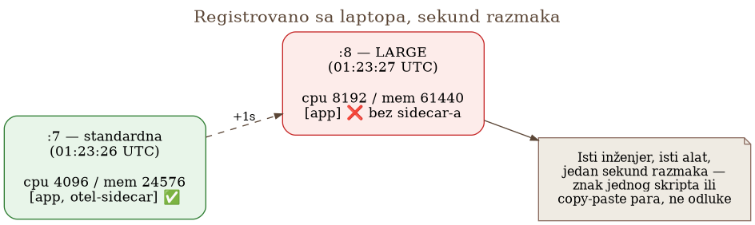
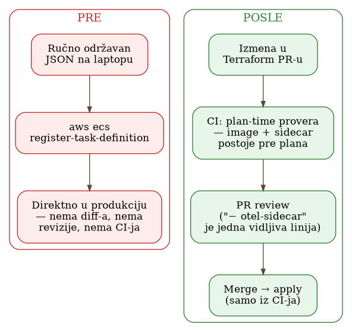

# Poglavlje 29 — CI/CD za infrastrukturu: kad dve revizije tiho krenu različitim putem

Zamislite restoran sa dva primerka istog recepta: jedan zalepljen pored šporeta, koji
glavni kuvar ažurira svaki put kad promeni sastojak, i drugi, laminiran, okačen unutar
frižidera za smrznutu robu, koji noćna smena stvarno koristi jer je šporet danju zauzet.
Kad glavni kuvar jednog dana doda sastojak koji menja bezbednost jela, ne samo ukus,
izmeni karticu pored šporeta. Karticu u frižideru niko se ne seti da otvori, jer niko nije
ni znao da je i dalje u upotrebi. Noćna smena nastavlja da kuva tačno po uputstvu koje ima
— greška nije u tome što neko nije pratio pravila, nego u tome što su pravila, u jednom
trenutku, tiho prestala da postoje na jednom mestu, a i dalje su važila na drugom.

## 29.1 Pitanje na koje ovo poglavlje odgovara

Kad dve konfiguracije koje bi trebalo da budu identične — osim po jednom namernom
parametru — održavaju nezavisno jedna od druge, kako se hvata trenutak kad tiho
divergiraju? A posebno: šta radiš kad ta divergencija pogodi putanju koja se izvršava
retko, tako retko da nijedan runtime alarm ne može da razlikuje "pokvareno" od "nije se ni
izvršilo"? I kad konačno uhvatiš problem — da li ga tiho zakrpiš, ili ga iskoristiš kao
razlog da promeniš sam proces koji ga je proizveo?

## 29.2 Kako je to urađeno — praktičan pregled

### Dva JSON fajla, jedna sekunda razmaka

Jedan zakazani posao za obradu podataka izvršavao se u dve varijante: standardnoj, i
"LARGE" varijanti za posebno zahtevan model koji je standardnu veličinu redovno gušio
memorijom (OOM). Svaka varijanta je bila sopstvena revizija ECS task definicije — dva
odvojena, ručno održavana JSON fajla na laptopu jednog inženjera, van izvorne kontrole, bez
review-a, bez pipeline-a.

Kad je posao onboardovan na OpenTelemetry, sidecar kolektor i šest pratećih promenljivih
okruženja dodati su u standardnu varijantu. LARGE varijanta je čekala na istu izmenu.
Nekoliko dana kasnije, obe revizije su ponovo registrovane — jedna sekund posle druge, sa
istog laptopa, istim alatom:

{: width="88%" }

Sekunda razmaka nije slučajnost bez značenja — to je potpis jednog skripta ili jednog
copy-paste para, ne odluke da se sidecar namerno izostavi. Diff između dve revizije to
potvrđuje: LARGE varijanta ne uvodi nijednu novu vrednost aplikacije — nema novih
promenljivih okruženja, nema promenjenih vrednosti, isti image. To je standardna varijanta
plus veća veličina, minus instrumentacija. Ništa u samoj LARGE varijanti nije opravdavalo
izostavljanje sidecar-a — jednostavno je došla iz fajla koji ga nikad nije primio.

### Zašto runtime monitoring nije mogao ovo da uhvati

LARGE varijanta se izvršava jednom dnevno, samo za jedan specifičan tip modela. Sledeća
četiri dana, ta putanja nije proizvodila **nikakvu** telemetriju — nijednu metriku,
nijedan trejs, nijedan log preko OpenTelemetry-ja. I niko to nije primetio, jer izgleda
identično putanji koja se jednostavno nije izvršila. Alarm baziran na "odsustvu signala" bi
morao ili da toleriše taj slučaj — čineći se beskorisnim upravo kad zatreba — ili da
konstantno lažno okida na svaki legitiman posao niske učestalosti.

Ovo je centralna poenta celog poglavlja, i vredi je reći bez ublažavanja: **runtime
monitoring je bio strukturno nesposoban da uhvati ovu klasu greške.** Nije da alarm nije
bio dovoljno osetljiv — nijedan alarm zasnovan na posmatranju telemetrije ne može da
razlikuje "sistem koji je prestao da javlja" od "sistem koji se nije ni pokrenuo", kad je
učestalost izvršavanja jednom dnevno ili ređe.

Pogoršavajuća okolnost: posao je i dalje bio na listi instrumentisanih porodica, pa je
svaki CRITICAL alarm o padu tog posla i dalje slao linkove ka Grafana dashboard-ima,
Mimir-u, Loki-ju, Tempo-u. Ti linkovi su se otvarali prazni. Inženjer koji bi ih pratio
zaključio bi da je čitava telemetrijska ravan pokvarena, ne da ova konkretna revizija
nikad nije bila instrumentisana.

### Detektor koji jeste uhvatio problem

Ono što je problem stvarno uhvatilo nije bio Grafana upit — bila je nedeljna provera koja
upoređuje **deklarisanu** konfiguraciju (šta je registrovano u AWS-u) sa očekivanjima, bez
ijednog upita ka telemetrijskoj platformi. Prijavila je porodicu posla pod dva pravila,
kao dve leće na istu činjenicu:

- **Regresija revizije** — novija revizija je izgubila sidecar koji je starija imala.
- **Trenutno stanje** — porodica je na listi instrumentisanih, ali njena najnovija AKTIVNA
  revizija nema sidecar.

Kašnjenje detekcije: četiri dana, ograničeno nedeljnom učestalošću provere — najgori
mogući slučaj bio bi sedam. Ova provera je mogla da radi svoj posao bez ijednog kredencijala
ka telemetrijskoj platformi, i imuna je na artefakte vremenskog prozora upita koji znaju da
zavaraju upite nad samom telemetrijom (videti Poglavlje 11 o kardinalnosti i Poglavlje 28 o
zamkama upita).

### Odluka da se incident ostavi otvoren

Uobičajen sledeći korak bio bi tih: registruj ispravnu reviziju, prebaci pokazivač
launcher-a na nju, zatvori tiket. Umesto toga, status incidenta je eksplicitno postavljen
na "otvoreno, po odluci — držano kao radni primer za predstojeći CI/CD rad. Ne zatvarati
tiho."

Ovo je neuobičajeno, i vredi imenovati zašto je vredno kopiranja: većina timova zakrpi tu
jednu pokvarenu reviziju i ide dalje, trošeći jedinu stvarnu vrednost incidenta — činjenicu
da je svež, konkretan, i da već ima sponzora voljnog da ga rešava — ni na šta. Incident koji
je i dalje bolan, i dalje ima ime i datum, mnogo je ubedljiviji argument za promenu procesa
od apstraktnog predloga "trebalo bi da uvedemo CI za infrastrukturu."

### Tabela: šta se desilo → šta bi to sprečilo

Svaki red ove tabele preslikava jednu konkretnu tačku kvara u jednu konkretnu kontrolu —
namerno napravljeno kao radni dokument, ne kao naknadna analiza:

| Šta se desilo | Kontrola koja bi to sprečila |
| --- | --- |
| Dva JSON fajla su divergirala | Jedan izvor istine — task definicije u repou (Terraform ili generator), LARGE varijanta izvedena iz standardne, ne održavana pored nje |
| Sidecar izostavljen iz jedne varijante | CI provera koja ruši build ako porodica sa oznakom "instrumentisano" proizvede reviziju bez sidecar-a |
| Produkcijska konfiguracija primenjena sa laptopa | Deploy samo iz CI-ja, uloga čoveka svedena na odobravanje diff-a |
| Nema diff-a za pregled | PR review gde je "− otel-sidecar" jedna vidljiva, neprevidiva linija |
| Kašnjenje detekcije četiri dana | Detekcija vođena događajem (na registraciju nove task definicije), umesto nedeljnog sweep-a |
| Poznata zamka se ponovila | Dokumentovane opasnosti pretvorene u asertovane testove, ne u pasuse koje niko ne proverava |
| Odložena odluka je tiho zastarela | Odlaganja koja zavise od trenutnog stanja dobijaju rok trajanja, ne samo belešku |

### Šest nedelja kasnije: šta je zaista sprovedeno

Ovo poglavlje ne bi bilo pošteno da stane na tabeli predloga. Šest nedelja posle incidenta,
deo te tabele je zaista postao stvarnost, ne samo namera:

- Terraform za infrastrukturu prešao je na režim **feature-branch + pull request** — svaka
  izmena ide kroz PR, a bot automatski postavlja `terraform plan` kao komentar pre nego što
  iko odobri.
- Uveden je **plan-time guard**: `data` izvor koji proverava da li image na koji se izmena
  poziva zaista postoji u registru **pre** nego što se plan uopšte izračuna. Ovo direktno
  zatvara oblik greške iz ovog incidenta u širem smislu — konfiguracija koja se poziva na
  nešto što ne postoji, prijavljuje uspeh, i ostavlja stari sistem da tiho radi dalje dok
  neko ne primeti da novi nikad nije ni krenuo.
- Razdvajanje uloga za planiranje i za primenu je provereno **suprotstavljeno, ne samo
  dizajnom**: poseban korak u CI-ju namerno pokušava da izvrši primenu sa ograničenim
  identitetom koji nosi svaki pull request, i očekuje da to bude odbijeno tačno na jedan
  način — eksplicitnim "pristup odbijen", ne bilo kojom drugom greškom. Zeleno na tom
  koraku znači da je privilegovana granica cele cevi i dalje na mestu; crveno znači da je
  nestala, tiho, bez ijedne izmene koda koja bi to sama od sebe najavila.
- CI sada pokreće **lint, tipske provere i self-testove** nad pratećim kodom infrastrukture
  (ne samo `terraform plan`) — podrazumevani skup pravila za statičku analizu koda, sa dva
  namerno isključena; provera tipova pozvana posebno po svakom direktorijumu, jer jedan
  zajednički poziv puca na dva fajla koja u različitim direktorijumima nose isto ime
  modula; i skup samostalnih testova koji se pokreću kao deo iste provere. Jedna zamka
  ovde je vredna imenovanja jer nije specifična za ovaj projekat: pravilo koje treba da
  nađe isključenja pravila bez razloga daje netačnu sliku ako se pokrene izolovano, sa
  svim ostalim pravilima isključenim — svako postojeće izuzeće odjednom izgleda
  neiskorišćeno, jer ništa više ne postoji da bi ga ono izuzimalo. Automatska ispravka
  istog pravila ide korak dalje i briše ceo prateći komentar, uključujući razlog zbog kog
  je izuzeće uopšte tu upisano. Alat koji traži nepotrebna izuzeća je, gledan izolovano od
  konteksta u kom je zamišljen, sam sebi najveći lažni pozitivan.

Vredi biti iskren i o onome što još nije sprovedeno: detekcija vođena događajem (peti red
tabele) u trenutku pisanja još uvek nije zamenila nedeljni sweep. Ovo nije uredna,
zatvorena studija slučaja sa savršenim krajem — to je živ, tekući proces, i to je poštenije
reći direktno nego uglancati.

{: width="92%" }

### Devet dana kasnije: ista vrsta greške, jedan sloj iznad

Deo koji ovo poglavlje čini vrednim ponovnog pogleda umesto jednokratnog zatvaranja:
devet dana posle pregleda iznad, potpuno isti obrazac se ponovio — ne u infrastrukturi,
nego u dokumentaciji koja je opisuje.

Rutinska provera konzistentnosti, pokrenuta odmah posle zatvaranja granice iz prethodnog
pasusa, uporedila je nekoliko dokumenata sa nalogom, jedan sa drugim, i sa kodom pored
njih. Najgori pojedinačan nalaz: opis jednog stack-a je i dalje tvrdio da uloga za primenu
"tek treba" da dobije baš tu granicu i njen test — dok je fajl sa izlaznim vrednostima u
ISTOM direktorijumu već izvozio ARN te uloge i listu dozvoljenih potpisnika. Oba
preduslova su, u trenutku čitanja opisa, već bila ispunjena danima ranije. Isti dokument je
pogrešno opisivao sopstveni mehanizam u istom pasusu koji je trebalo da spreči baš tu
zabunu — govorio je da prilagođavanje identiteta "dodaje" deo na kraj, kad ono zapravo
zamenjuje ceo taj deo.

Drugi nalaz je bio ozbiljniji od zastarelog teksta — pravi, i dalje otvoren propust,
maskiran tabelom koja je delovala kao da je zatvoren. Tabela je navodila dve zamene za
plaćene bezbednosne provere koje besplatan plan nema: korak koji navodno hvata slučajno
komitovane tajne, i zakazanu proveru da je oznaka izdanja i dalje predak glavne grane, kao
zamenu za zaštitu te oznake od premeštanja. Provera na terenu: koraka koji hvata tajne
nema nigde u cevi — postoji osam koraka provere kvaliteta koda, i nijedan od njih ne
skenira tajne. Provera oznake postoji, ali je isporučena namerno neaktivna, dok se ne
izvrši jedna komanda koja je naoruži — ta komanda u trenutku nalaza još nije bila
izvršena. Rečenica u dokumentu je zvučala kao da je oboje već na mestu, na repozitorijumu
koji od nedavno sam sebi izdaje kredencijale u oblaku preko iste granice opisane iznad.

Pouka vredi zapisati bez ublažavanja: **tabela koja imenuje čime se neki propust zatvara
nije isto što i tabela koja beleži da li je taj propust zaista zatvoren.** Prva opisuje
plan; druga opisuje nalog. Kad se te dve pomešaju u istom pasusu, dokument ostaje tehnički
tačan u trenutku pisanja i postaje pogrešan onog trenutka kad se stvarnost pomeri — bez
ijednog signala da se to dogodilo, jer ništa u samom tekstu ne razlikuje "ovo će zatvoriti
prazninu" od "ovo je zatvorilo prazninu". To je tačno isti oblik greške kao dve JSON task
definicije s početka poglavlja, samo jedan sloj iznad koda: dva mesta koja opisuju isto
stanje sistema, održavana nezavisno, tiho su divergirala — samo što je ovog puta jedno od
ta dva mesta proza, ne konfiguracija, pa ga nijedan `plan` ne bi ni pokušao da uporedi.

## 29.3 Analitički deo — princip koji je ovde nedostajao već ima ime

### Kontinuirana rekoncilijacija, ne periodično poređenje

Ono što je ovaj incident stvarno tražio — mehanizam koji neprekidno poredi deklarisano
stanje sa stvarnim i reaguje na razliku — nije nova ideja specifična za ovaj sistem. To je
tačno princip koji GitOps pokret formalizuje kao **kontinuiranu rekoncilijaciju**: sistem
kontinuirano posmatra stvarno stanje i konvergira ga ka deklarisanom, umesto da promenu
primeni jednom i pretpostavi da će ostati primenjena. Nedeljna provera iz ovog incidenta je
bila korak u tom pravcu — ali korak izvršen na sat, ne kontinuirano, i sa ljudskim
posrednikom između nalaza i ispravke.

### Alati koji ovo već rade neprekidno — za druge resurse

Alati poput Argo CD-a rešavaju identičan problem za Kubernetes resurse, i to neprekidno:
kad se stvarno stanje klastera razlikuje od onoga što je deklarisano u git-u, opcija
"self-heal" automatski vraća razliku, bez čekanja na sledeći ručno pokrenut ciklus provere.
Razlika između toga i onoga što je ovaj tim imao na raspolaganju nije konceptualna — ECS
task definicije nisu Kubernetes resursi kojima Argo CD upravlja — nego zrelosti alata za
ovaj konkretan sloj infrastrukture. Poenta ostaje ista: problem koji je ovaj incident
otkrio ima ime, ima proizvod koji ga rešava za susedni ekosistem, i tim koji ga pogodi ne
izmišlja rešenje od nule, nego bira koliko blizu tom modelu može doći sa alatima koje već
ima.

### Identičan rizik postoji u Kubernetes svetu, samo drugim mehanizmom

Vredi imenovati direktno ono što je do sada bilo implicitno: identičan oblik drifta preti
svuda gde se sidecar ili konfiguracija ubacuju u specifikaciju resursa nezavisno od izvora
te specifikacije. Kubernetes mutating admission webhook koji ubacuje sidecar u pod pri
kreiranju je mehanizam, ne garancija — ako webhook promaši jedan resurs, ili ako je
konfiguracija koju ubacuje sama zastarela, posledica je identična: jedan resurs ima
sidecar, njegov brat nema ga, i ništa to ne upoređuje. OpenTelemetry Operator za Kubernetes
rešava tačno ovaj problem za auto-instrumentaciju — injektuje agenta deklarativno, preko
CRD-a, umesto da svaki tim ručno uređuje svaku specifikaciju poda — ali i tu, ako CRD koji
definiše instrumentaciju ne pokriva novi workload, ili ako se doda anotacija koja isključuje
injekciju bez svesne odluke, drift je strukturno moguć na potpuno isti način. Mehanizam
injekcije se menja — ručno održavan JSON, mutating webhook, operator CRD — ali pitanje koje
sistem mora da ume da odgovori ostaje identično: da li ono što je stvarno primenjeno
odgovara onome što je trebalo da bude primenjeno, i ko bi to primetio da nije?

### Kontrafaktički scenario

Zamislite tim koji vodi Kubernetes klaster sa service mesh-om koji automatski ubacuje
proxy sidecar u svaki pod, i koji pretpostavlja da to injektovanje "prosto radi" jer je
deklarativno. Ako se namespace selector webhook-a promeni, ili ako se doda nov deployment
sa pogrešnom labelom, isti obrazac se ponavlja: jedan skup pod-ova dobija posmatranje
saobraćaja koje mesh obećava, drugi ga nema, i razlika je nevidljiva dok neko ne primeti da
određene metrike nedostaju — ili, gore, dok se ne dogodi incident čija dijagnoza zavisi
tačno od tih metrika. Deklarativnost mehanizma injekcije nije isto što i garancija da je
injekcija stvarno izvršena svuda gde je trebalo. To je razlika koju ovaj incident čini
opipljivom, umesto apstraktnom.

## 29.4 Skupljena pravila iz ovog poglavlja

- Kad postoje dve konfiguracije koje bi trebalo da budu identične osim po jednom
  parametru, tretiraj obe kao produkciju od prvog dana — varijanta koja se ređe menja nije
  manje kritična, samo je manje vidljiva kad zaostane.
- Postavi sebi pitanje za svaki posao niske učestalosti: da li bi odsustvo njegovog signala
  zaista okinulo alarm, ili bi izgledalo identično normalnom stanju? Ako je odgovor drugo,
  runtime monitoring ne može biti jedina linija odbrane za tu putanju.
- Kad automatizovana provera uhvati grešku koju runtime monitoring strukturno nije mogao —
  to je znak da ti treba provera deklarisanog stanja naspram stvarnog, ne pokušaj da
  runtime alarm postane osetljiviji.
- Kad nađeš dobar, svež, konkretan incident, razmisli da ga *ne* zatvoriš tiho — iskoristi
  ga kao sponzorisan, imenovan razlog za promenu procesa koju bi inače bilo teško opravdati
  apstraktno.
- Pretvori svaku dokumentovanu opasnost u asertovan test, ne u pasus u dokumentaciji — ako
  je zamka vredna zapisivanja, vredna je i provere u kodu.
- Fiksiraj napred, nikad unazad — nova revizija se pravi kao stara plus ispravka, nikad
  vraćanjem na stariju reviziju koja bi tiho poništila sve novije izmene.
- Odlaganja koja zavise od trenutnog stanja sistema treba da imaju rok trajanja ili
  eksplicitnu proveru pri sledećoj relevantnoj promeni — inače tiho zastarevaju i prestaju
  da opisuju stvarnost.
- Isti obrazac drifta postoji kod svakog mehanizma koji ubacuje konfiguraciju nezavisno od
  resursa u koji je ubacuje — bilo da je to ručan JSON, mutating webhook, ili operator CRD.
  Traži proveru rekoncilijacije, ne veruj mehanizmu injekcije samom po sebi.
- Razdvajanje uloga (planiranje naspram primene, čitanje naspram pisanja) vredi onoliko
  koliko vredi njegov dokaz — dizajn na papiru i test koji ga aktivno pokušava da probije
  nisu isto, i samo drugo preživljava sledeću izmenu koda bez ičije pažnje.
- Dokument koji imenuje ČIME se neki propust zatvara nije dokaz da je zatvoren — pre nego
  što mu poveruješ, proveri fajl sistem ili nalog, ne pasus pored njega. Ovo važi
  podjednako za dokumentaciju kao i za konfiguraciju: obe vrste teksta mogu tiho da
  divergiraju od stvarnosti, samo što nijedan `plan` ne upozorava kad proza zaostane.

## 29.5 Vežba za čitaoca

Pronađi u svom sistemu jedan resurs koji ima "varijantu" — drugu veličinu, drugi region,
drugu verziju — održavanu odvojeno od glavne konfiguracije. Proveri, ne pretpostavi: da li
ta varijanta ima isti skup mogućnosti (instrumentaciju, bezbednosna pravila, mrežne
politike) kao glavna? Ako ne postoji automatizovana provera koja bi to uhvatila da
divergira sutra, to je tvoja verzija ove priče, samo još neispričana.

---

### Izvori korišćeni u analitičkom delu

- [OpenGitOps — Principles](https://opengitops.dev/)
- [Argo CD — Automated Sync Policy (self-heal)](https://argo-cd.readthedocs.io/en/latest/user-guide/auto_sync/)
- [Kubernetes — Admission Control (mutating admission webhooks)](https://kubernetes.io/docs/reference/access-authn-authz/admission-controllers/)
- [OpenTelemetry — Injecting Auto-instrumentation (Kubernetes Operator)](https://opentelemetry.io/docs/platforms/kubernetes/operator/automatic/)
