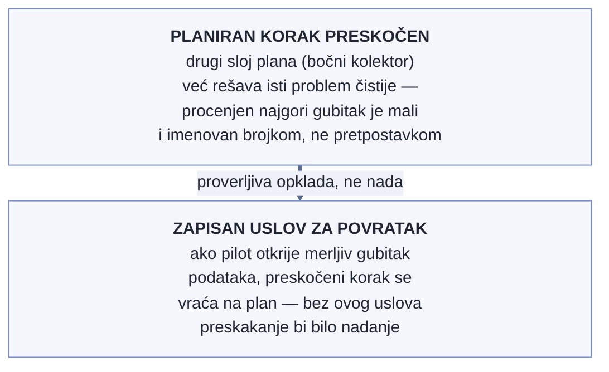

# Chapter 29 — What a phased rollout looks like in real time

When an old house is renovated, the first plan always assumes the wall is a
flat, known surface — new wiring goes here, a new water line there, a
partition comes down over there. That plan survives exactly until the first
wall is opened. Behind the plaster, old wiring nobody had mapped turns up,
moisture that has been silently eating away at a beam for years, a pipe
running through a wall that was supposed to come down on day one. An
experienced contractor doesn't treat this as a failure of the plan — they
know in advance that the plan will change the moment the first wall opens,
and they schedule the work so that the highest-risk room (the one that
carries the roof, or the one without which the household can't function for
even a day) comes last, by which point the contractor has already seen
enough behind neighboring walls to know what to expect.

The same is true of a phased rollout of observability across a fleet of
services that have never been under watch before. A plan written before the
first step is the best possible estimate — but it's an estimate, not a
contract. The question that decides whether such a program is well run
isn't "did the plan change," but "were the changes a response to real
evidence, at the right moment, documented so that someone arriving later
understands why."

## 29.1 The question this chapter answers

What does it look like, from the inside, when a program rolls out
observability across dozens of services at once — not as a finished
architecture described in hindsight, but as a series of decisions made
under real-time pressure, with incomplete information? And how do you tell
a deviation from plan that signals bad planning apart from a deviation that
signals the plan correctly responding to what has just been discovered?

## 29.2 How it was done — a practical walkthrough

### A four-layer plan, with the order published in advance

The program started from a clear architecture: every task carries an
application container with auto-instrumentation and custom spans for
business context; alongside it, a sidecar collector that catches the last
spans at task shutdown and adds container metrics the application itself
can't see; all of it flows to a central gateway that handles sampling,
authentication, and batching before forwarding to the storage system. Each
layer exists because it solves a failure mode the other three can't —
without the sidecar collector, the last spans are lost when a task exits;
without the central gateway, every sender carries its own credentials and
there's no centralized sampling; without auto-instrumentation, every
HTTP/DB call had to be instrumented by hand.

The rollout order was published from the start as a numbered list of steps,
where each step unlocks the next — not a loose wish list, but a locked
sequence with an explicit condition for moving on. That made deviations
visible: when something changed, the change was measured against the
original order, not quietly rewritten as if it had always been meant to
happen that way.

### The moment reality filed the first bug report

The first scheduled production check of the pilot task family turned up a
problem the plan hadn't foreseen: five out of six tasks were silently
crashing on a race for the same database rows — two separate write paths
(the regular one and a follow-up, "cache-only" one) tried to write the same
data at the same time; the first succeeded, the rest crashed on a
uniqueness error. What made this moment especially instructive wasn't the
bug itself — bugs in code are expected — but that **the alert built
specifically to catch this kind of failure stayed silent**. The "finished
successfully, but empty" alert checked whether zero rows had been produced;
since the crashing tasks managed to write part of the data before they
died, the "zero rows" condition was never true, so the alert stayed green
while most of the fleet quietly died.

The response wasn't "wait for the next phase of the plan to deal with it."
Within two hours of the discovery, two new steps went into the plan that
the original schedule hadn't contained: a coarse alert on a non-zero exit
code, closing the visible gap until the real cause was fixed, and the fix
for the race itself in the application code. Both had to be finished before
moving on to the next planned step — because working on the next step
against a fleet that kept crashing would have mixed new bugs in with the
old ones.

### The decision to reorder the plan — and why it was the right call

A few days later, a second, more direct change was made to the plan: the
sidecar collector pilot, originally scheduled to wait for the race fix from
the previous step, was moved AHEAD of that fix — and expanded to cover two
task families at once instead of one. This was a deliberate decision, not
impatience, and the reasoning is worth repeating: the write race is a bug
in the application code, while the sidecar collector pilot tests a
completely different layer (the container, the collector, routing through
the gateway) that never touches that bug — new container metric series,
the path over the local OTLP port, and shutdown behavior all show up in the
first thirty-odd seconds of a task's life, well before the application even
gets to the rows that are competing. The risk had been checked and was
accepted: the only new failure mode the sidecar collector introduces is
"the collector fails to start," and the collector is marked as an optional
part of the task, so that failure doesn't bring down the whole task — it
would only quietly impoverish the telemetry.

### When the whole mechanism turns out wrong, not just poorly tuned

The third change to the plan went deepest. The original alerting design for
task failure used coarse alerts per task family: whenever any task in a
family exited with an error, a single alert fired for the whole family.
After the first real production message that alert produced, it became
clear the problem wasn't threshold or sensitivity — the message literally
said "something in this family exited with an error in the last five
minutes," with no identity of the specific task, no error detail, no link
to investigate further. To even start investigating, someone had to
manually open the logs, find the exact task within the time window, read
the error, and only then manually carry that time window over into the
observability system.

Instead of tuning the threshold, the whole mechanism was replaced: an
event-driven pipeline that reads the full task state-change object (task
identifier, exit code, shutdown reason, image revision) and sends a
per-task message, with links pre-set to that exact task. On top of that, a
three-tier urgency level was introduced — critical (every failure is
reported, with no grouping into a single record), standard (grouping
repeated failures from the same family within a short window), and quiet
(no notification, for dev/test variants) — where changing the tier for one
family became a single line of configuration instead of manually tuning a
threshold per alert. This is a distinction worth naming: sometimes a plan
doesn't need fine-tuning, but the recognition that the chosen mechanism is
structurally wrong for the goal it's trying to achieve.

### Who comes last, and why that's a rule, not an exception

One quiet rule held throughout the program: the most production-critical
task — the one whose failure users feel immediately — was deliberately
onboarded **last**, only after every adjacent risk had been removed on less
critical tasks first. This wasn't a case-by-case exception, but a published
policy, written down before it was needed — which meant that when someone
later asked "why doesn't this task have instrumentation yet," the answer
wasn't improvised, but a pointer to a rule that already existed.

### An audit before deleting the old system

The last step of the phased program was shutting down the old, coarse
alerting system once the new one had fully replaced it. Instead of
deleting it outright, an audit came first: how many of the existing alerts
were actually still receiving data? The result was sobering — of about
twenty old per-family alerts, most hadn't received a single data point in
over a year (the data source feeding them had quietly stopped working, and
a "no data = normal state" setting had kept them permanently "green"), a
few hadn't changed state in several years, and only a small handful
genuinely represented live coverage. That audit changed the nature of the
shutdown — it wasn't deleting active protection, it was removing a facade
that had looked like protection for years after it had long stopped being
one.

{: width="95%" }

{: width="95%" }

### Why a planned step is deliberately skipped, not added

Not every change to a plan is adding a step. The original plan called for
a dedicated mechanism inside the application itself that would, on process
shutdown, manually capture and send the last data before the process
actually died. When it came time for that step, the implementation
deliberately **skipped** it — not forgot it, but explicitly decided not to
do it, with the reason written down: the sidecar collector from the
plan's other layer already solves the same problem more cleanly, because
it holds spans while the process exits and is guaranteed a fixed time
window before being forcibly killed. The manual mechanism inside the
application would only have covered a narrow subset of the situations the
sidecar collector already covers in full.

What makes this decision discipline, not laziness, is that the exact
condition under which the skipped step would still have to go back onto
the plan was written down: if the sidecar collector's pilot finds that
final data is still being lost in a measurable amount, the step comes
back. The estimated worst case of loss without that step was small and
named with a number, not "should be negligible." Skipping the step
without this condition would be a hope; skipping it with this condition
is a verifiable bet that automatically reverses the moment evidence says
otherwise.

{: width="80%" }

### When one bug turns into a systematic search for the same class

While fixing one specific defect in one family of jobs — a format
mismatch on row writes that caused silent failures — the implementation
went a step further than the usual "fix and move on." Instead of limiting
the fix to the spot where the bug was first noticed, someone checked
whether the **same shape of bug** appeared anywhere else in the shared
library used by the entire fleet. The search found the same bug at ten
additional call sites, in completely different parts of the code, that
nobody had reported because they hadn't manifested in the same visible
way until then.

This finding was folded into the plan as a precondition, not an
afterthought: none of those ten sites is allowed to enter production
instrumentation or be relied on under load until the fix is applied to
all of them. The departure from the standard "report the bug, fix it,
close it" flow is deliberate: when one concrete case is just a symptom of
a broader pattern in shared code, treating that one case as isolated
leaves the remaining ten waiting for their own incident before they get
discovered.

## 29.3 Analytical section — when deviation from the plan is a sign of maturity, not weakness

Industry practice around phased rollouts is, fortunately, well developed,
and nearly every recommendation confirms the intuition of the contractor
renovating the house: sequence by risk, not by convenience.

Martin Fowler's description of the "canary release" pattern — rolling a
change out gradually to an ever-smaller, then ever-larger, slice of
traffic — and Google's SRE Workbook go a step further and quantify why: a
bug that hits 20% of users on only 5% of traffic burns just 1% of the error
budget, not 20%. Microsoft's Azure Well-Architected Framework turns this
into a concrete rule for ordering — internal testing → pilot → early
adopters → general availability — with "bake time" between each round
measured in hours or days, not minutes, precisely because different usage
patterns only surface given enough time. Sequencing by risk, not by what's
technically easiest to do next, is exactly the principle that determined
the most critical part of the fleet would come last in this program — not
an exception to recommended practice, but its direct application.

For the question itself — "is it legitimate to change the plan
mid-execution" — a useful framework is Cynefin (Snowden and Boone): when a
system is "complicated," expert analysis done in advance yields a reliable
plan; when a system is "complex" — and a fleet of heterogeneous tasks with
different failure domains is exactly that — the correct discipline is
"probe → sense → respond," not "analyze, then respond." That means acting
on partial information, observing what the system reveals, and adapting
the plan — treated in that literature as **rigorous practice**, not as an
admission of bad planning. Google's error-budget model does the same thing
from the other side: the reliability target is fixed, but the pace and
order of shipping changes is a variable that gets continuously adjusted
against actual budget consumption — which is exactly the mechanism that
justified inserting two new steps immediately after the first real bug
report, instead of waiting for the original plan to reach that point.

The Google SRE Book chapter on postmortem culture formalizes the channel
through which new findings feed back into an existing plan: a postmortem
isn't just a record of what happened, but a formal entry point for new plan
items, with an explicit assessment of whether the proposed action plan is
adequate. That's exactly what happened after the first bug report — it
wasn't just the application that got fixed, but the plan itself was
revised to include lasting visibility into that failure.

A concrete precedent for auditing before shutting down an old system exists
outside this implementation too: LogicMonitor's case study of a large
migration project describes the same pattern — auditing every old alerting
rule before migration, asking "how often does this actually fire, and is
the system it refers to even still alive" before the rule gets carried over
or deleted — uncovering dead rules tied to systems shut down long ago,
exactly the class of problem that showed up here as well. Their
recommendation: migrating alerting is an opportunity to clean up, not just
to carry things over, because carrying over unaudited alerting quietly
accumulates debt that nobody sees until it's needed.

### A counterfactual — if the plan had been followed to the letter

If the original order had been followed to the letter — the sidecar
collector waiting for the race fix, old alerts carried over "as is" with no
audit, every ordering decision made once at the start and held to until the
end — the outcome would have been worse in two ways. First, verification of
the sidecar collector would have been delayed for days waiting on a fix it
has no technical connection to, with no safety benefit from that wait.
Second, and more seriously: the new alerting system would have gone into
production carrying about twenty "active" alerts, most of which had already
been dead for years — every future coverage audit would have counted that
dead facade as real protection, and a genuine coverage gap would have gone
unnoticed for far longer than it actually did.

Back to the contractor renovating the house. The one who stubbornly sticks
to the original schedule of work, no matter what turns up behind the first
wall, doesn't finish the job any faster — they just find out later that
they walled up a problem that needed fixing on the spot. A plan that never
changes under pressure from reality isn't a sign of discipline. It's more
likely a sign that nobody actually looked at what was behind the wall.

## 29.4 Rules collected from this chapter

- Publish the order in advance as a numbered, conditioned list — that makes
  every future deviation visible and explainable, instead of quietly
  rewritten.
- When new evidence from production reveals a gap the plan didn't foresee,
  insert a new step IMMEDIATELY, not at the next planned cycle — but
  document why it was inserted.
- Sequence the work by failure domain and blast radius, not by technical
  convenience — the most critical part of the system last, as standing
  policy, not an ad hoc exception.
- When the first real message from a new alerting mechanism shows the
  mechanism is structurally unusable (not just poorly calibrated), replace
  the whole mechanism — not just the threshold.
- Before shutting down an old system, audit it — how much of its "active"
  protection is actually a silent facade that hasn't received a single data
  point in years.
- When you skip a planned step because another part of the plan already
  covers it, write down the exact condition under which the step would
  have to come back — skipping without that condition is a hope, skipping
  with it is a verifiable bet.
- When you fix a specific defect in shared code, check whether the same
  bug class appears at other call sites before any of them enters
  production under load — one reported case is often just the first
  visible symptom of a broader pattern.

## 29.5 Exercise for the reader

Find one case in your own team's history where the plan changed
mid-execution. Was that change written down somewhere with a reason, or did
it just quietly become the new reality? If you had to explain that change
to someone arriving six months later, do you have anything to show besides
your own memory?

---

*Sources used in the analytical section:*

- *Google SRE Workbook — "Canarying Releases"*
- *Martin Fowler — "CanaryRelease" (martinfowler.com)*
- *Microsoft Azure Well-Architected Framework — "Safe deployment practices"*
- *Google SRE Book — "Postmortem Culture: Learning from Failure"*
- *Cynefin Framework (Snowden i Boone) — pregledi primene na odlučivanje*
- *LogicMonitor — studija slučaja revizije alarma pre migracije*
