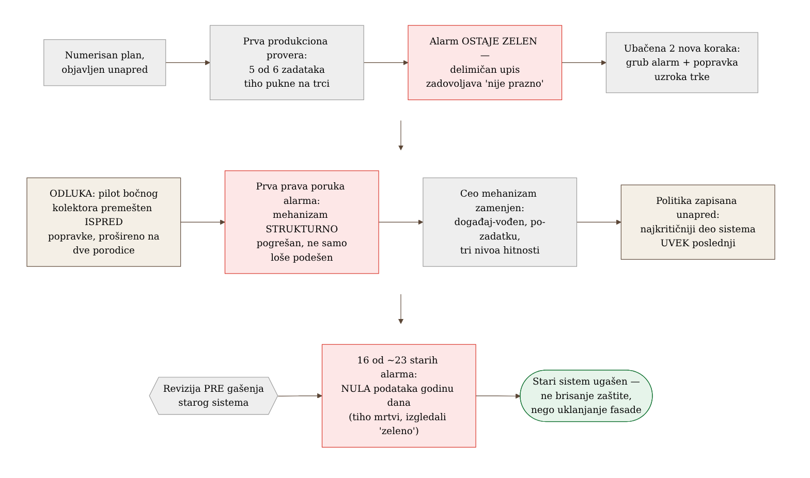
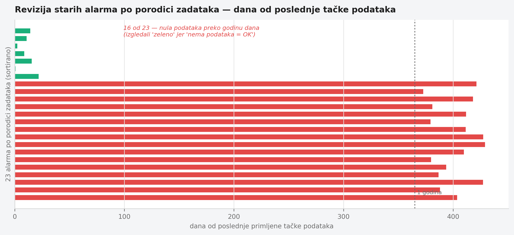

# Poglavlje 29 — Kako izgleda fazni rollout u realnom vremenu

Kad se stara kuća renovira, prvi plan uvek pretpostavlja zid kao ravnu,
poznatu površinu — ovde ide nov razvod struje, tu novi vod za vodu, ovamo
se ruši pregrada. Taj plan traje tačno do trenutka kad se otvori prvi zid.
Iza gipsanih ploča se pojavi stara instalacija koju niko nije ucrtao,
vlaga koja je godinama nevidljivo nagrizala gredu, cev koja ide kroz zid
koji je trebalo srušiti prvog dana. Iskusan izvođač ne doživljava ovo kao
neuspeh plana — on unapred zna da će se plan menjati čim se otvori prvi
zid, i pravi raspored radova tako da najrizičnija prostorija (ona koja
nosi krov, ili ona bez koje domaćinstvo ne može da funkcioniše ni jedan
dan) dolazi na red poslednja, kad je izvođač već video dovoljno iza
susednih zidova da zna na šta da se navikne.

Isto važi za fazni rollout observability-ja preko flote servisa koji
nikad nisu bili pod nadzorom. Plan napisan pre prvog koraka je najbolja
moguća procena — ali je procena, ne ugovor. Pitanje koje odlučuje da li
je takav program dobro vođen nije "da li se plan promenio", nego "da li
su promene bile odgovor na stvarne dokaze, u pravom trenutku, dokumentovane
tako da neko ko dođe kasnije razume zašto".

## 29.1 Pitanje na koje ovo poglavlje odgovara

Kako izgleda, iznutra, program koji uvodi observability preko desetina
servisa istovremeno — ne kao gotova arhitektura opisana unazad, nego kao
niz odluka donetih pod pritiskom stvarnog vremena, sa nepotpunim
informacijama? I kako se razlikuje odstupanje od plana koje je znak lošeg
planiranja od odstupanja koje je znak da plan ispravno reaguje na ono što
je upravo otkriveno?

## 29.2 Kako je to urađeno — praktičan pregled

### Plan sa četiri sloja i redosledom koji se objavljuje unapred

Program je krenuo od jasne arhitekture: svaki zadatak nosi aplikacioni
kontejner sa automatskom instrumentacijom i prilagođenim rasponima
(spans) za poslovni kontekst; pored njega, bočni kolektor (sidecar) koji
hvata poslednje raspone pri gašenju zadatka i dodaje metrike kontejnera
koje aplikacija sama ne vidi; sve to ide ka centralnom prolazu (gateway)
koji radi uzorkovanje, autentikaciju i grupisanje pre slanja dalje ka
sistemu za skladištenje. Svaki sloj postoji zato što rešava kvar koji
ostala tri ne mogu — bez bočnog kolektora gube se poslednji rasponi pri
izlasku zadatka; bez centralnog prolaza svaki pošiljalac nosi sopstvene
kredencijale i nema centralizovanog uzorkovanja; bez automatske
instrumentacije svaki HTTP/DB poziv se ručno opremio.

Redosled uvođenja je od početka objavljen kao numerisan spisak koraka,
gde svaki korak otvara sledeći — ne slobodna lista želja, nego zaključana
sekvenca sa jasnim uslovom prelaska. To je učinilo odstupanja vidljivim:
kad se nešto promeni, promena se meri prema originalnom redosledu, ne
tiho preformuliše kao da je oduvek tako trebalo da bude.

### Trenutak kad je stvarnost prva prijavila grešku

Prva zakazana produkciona provera pilot-porodice zadataka otkrila je
problem koji plan nije predvideo: pet od šest zadataka je tiho puklo na
trci za istim redovima u bazi — dva odvojena puta pisanja (redovan i
naknadni, "samo keš") su pokušala da upišu iste podatke istovremeno, prvi
je uspeo, ostali su pukli na grešci jedinstvenosti. Ono što je ovaj
trenutak učinilo posebno poučnim nije sama greška — greške u kodu su
očekivane — nego to što je **alarm izgrađen tačno da uhvati ovakav kvar
ostao tih**. Alarm "uspešno završeno, ali prazno" je proveravao da li je
proizvedeno nula redova; pošto su puknuti zadaci uspeli da upišu deo
podataka pre nego što su pali, uslov "nula redova" nikad nije bio tačan,
pa je alarm ostao zelen dok je većina flote tiho umirala.

Odgovor nije bio "sačekaj sledeću fazu plana da se to reši". U roku od
dva sata nakon otkrića, u plan su ubačena dva nova koraka koja originalni
raspored nije sadržao: grub alarm na izlazni kod različit od nule, koji
zatvara vidljivi propust dok se ne popravi pravi uzrok, i sam popravak
trke u aplikativnom kodu. Oba su morala da se završe pre nastavka na
sledeći planirani korak — jer bi rad na sledećem koraku protiv flote koja
konstantno puca pomešao nove greške sa starim.

### Odluka da se redosled promeni — i zašto je to bila prava odluka

Nekoliko dana kasnije doneta je druga, direktnija promena plana: pilot
bočnog kolektora, koji je originalno bio zakazan da čeka popravku trke iz
prethodnog koraka, premešten je ISPRED te popravke — i proširen da odmah
pokrije dve porodice zadataka umesto jedne. Ovo je bila svesna odluka, ne
nestrpljenje, i obrazloženje je vredno ponavljanja: trka u pisanju je
greška u aplikativnom kodu, dok pilot bočnog kolektora testira potpuno
drugačiji sloj (kontejner, kolektor, rutiranje kroz prolaz) koji se sa
tom greškom nikad ne dodiruje — nove serije metrika kontejnera, put preko
lokalnog OTLP porta, i ponašanje pri gašenju sve se pojavljuju u prvih
tridesetak sekundi života zadatka, mnogo pre nego što aplikacija uopšte
stigne do redova koji se takmiče. Rizik je bio proveren i prihvaćen:
jedini novi način kvara koji bočni kolektor uvodi je "kolektor ne
uspe da se pokrene", a kolektor je markiran kao neobavezan deo zadatka,
pa taj kvar ne obara ceo zadatak — samo bi tiho osiromašio telemetriju.

### Kad se ceo mehanizam pokaže pogrešnim, ne samo loše podešenim

Treća promena plana bila je najdublja. Prvobitni dizajn alarmiranja na
neuspeh zadatka koristio je grube alarme po porodici zadataka: kad bilo
koji zadatak u porodici izađe sa greškom, jedan alarm se pali za celu
porodicu. Posle prve stvarne produkcione poruke koju je taj alarm
proizveo, postalo je jasno da problem nije prag ili osetljivost — poruka
je doslovno govorila "nešto u ovoj porodici je izašlo sa greškom u
poslednjih pet minuta", bez identiteta konkretnog zadatka, bez detalja
greške, bez linka za dalju istragu. Da bi se istraga uopšte pokrenula,
trebalo je ručno otvoriti logove, pronaći tačan zadatak u vremenskom
prozoru, pročitati grešku, pa tek onda ručno preneti taj vremenski
prozor u sistem za posmatranje.

Umesto podešavanja praga, ceo mehanizam je zamenjen: događaj-vođen
cevovod koji čita pun objekat promene stanja zadatka (identifikator
zadatka, izlazni kod, razlog gašenja, revizija slike) i šalje poruku po
zadatku, sa linkovima unapred podešenim na taj tačan zadatak. Uz to,
uveden je nivo hitnosti u tri stepena — kritičan (svaki neuspeh se
prijavljuje, bez grupisanja u jedan zapis), standardan (grupisanje
ponovljenih neuspeha iste porodice u kratkom prozoru) i tih (bez
obaveštenja, za razvojne/testne varijante) — gde je promena nivoa za
jednu porodicu postala jedna linija konfiguracije umesto ručnog
podešavanja praga po alarmu. Ovo je razlika vredna imenovanja: nekad
plan ne treba fino podešavanje, nego priznanje da je izabrani mehanizam
strukturno pogrešan za cilj koji se pokušava postići.

### Ko dolazi poslednji, i zašto je to pravilo, ne izuzetak

Kroz ceo program važilo je jedno tiho pravilo: proizvodno najkritičniji
zadatak — onaj čiji ispad korisnici odmah osete — namerno je onboardovan
**poslednji**, tek pošto je svaki susedni rizik uklonjen na manje
kritičnim zadacima prvo. Ovo nije bio slučaj po slučaj izuzetak, nego
objavljena politika, zapisana pre nego što je bila potrebna — što znači
da kad je neko kasnije pitao "zašto ovaj zadatak još nema instrumentaciju",
odgovor nije bio improvizovan, nego pokazivanje na već postojeće pravilo.

### Revizija pre brisanja starog sistema

Poslednji korak faznog programa bio je gašenje starog, grubog sistema
alarmiranja pošto ga je novi u potpunosti zamenio. Umesto direktnog
brisanja, prvo je urađena revizija: koliko od postojećih alarma zaista
još uvek prima podatke? Rezultat je bio otrežnjujuć — od dvadesetak
starih alarma po porodici, većina nije primila nijednu tačku podataka
godinu dana unazad (izvor podataka koji ih je hranio je tiho prestao da
radi, a podešavanje "nedostatak podataka = normalno stanje" ih je držalo
večno "zelenim"), nekoliko nije promenilo stanje od pre nekoliko godina, i
samo mala šačica je zaista predstavljala živu pokrivenost. Ta revizija
je promenila prirodu gašenja — nije bilo brisanje aktivne zaštite, nego
uklanjanje fasade koja je godinama izgledala kao zaštita dok to odavno
nije bila.

{: width="95%" }

{: width="95%" }

## 29.3 Analitički deo — kad je odstupanje od plana znak zrelosti, ne slabosti

Industrijska praksa oko faznih rollout-a je, na sreću, dobro razrađena, i
gotovo svaka preporuka potvrđuje intuiciju izvođača koji renovira kuću:
sekvenca po riziku, ne po pogodnosti.

Martin Fowler-ov opis "canary release" obrasca — postepenog uvođenja
promene na sve manjem, pa sve većem delu saobraćaja — i Google-ov SRE
Workbook idu korak dalje i kvantifikuju zašto: kvar koji pogodi 20% korisnika
na samo 5% saobraćaja troši samo 1% budžeta greške, ne 20%. Microsoft-ov
Azure Well-Architected Framework ovo pretvara u konkretno pravilo za
redosled — interno testiranje → pilot → rani usvojioci → puna dostupnost,
sa vremenom "odležavanja" između svakog kruga mereno u satima ili danima,
ne minutima, upravo zato što različiti obrasci korišćenja isplivaju samo
uz dovoljno vremena. Redosled po riziku, ne po tome šta je tehnički lakše
uraditi sledeće, jeste tačno princip koji je odredio da najkritičniji deo
flote dolazi poslednji u ovom programu — ne izuzetak od preporučene
prakse, nego njena direktna primena.

Za sâmo pitanje "da li je legitimno menjati plan usred izvršenja",
koristan okvir je Cynefin (Snowden i Boone): kad je sistem "komplikovan",
stručna analiza unapred daje pouzdan plan; kad je sistem "kompleksan" —
a flota heterogenih zadataka sa različitim domenima kvara upravo to jeste
— ispravna disciplina je "probaj → oseti → odgovori", ne "analiziraj pa
odgovori". To znači da se deluje na osnovu delimične informacije, posmatra
šta sistem otkriva, i plan se prilagođava — ovo se u toj literaturi tretira
kao **rigorozna praksa**, ne kao priznanje lošeg planiranja. Google-ov
model budžeta greške radi isto sa druge strane: cilj pouzdanosti je
nepromenljiv, ali tempo i redosled isporuke promena je promenljiva koja se
kontinuirano prilagođava prema stvarnoj potrošnji budžeta — što je tačno
mehanizam koji je opravdao ubacivanje dva nova koraka odmah posle prve
prijave stvarnog kvara, umesto čekanja da originalni plan dođe na red.

Google-ov SRE Book poglavlje o postmortem kulturi formalizuje kanal kroz
koji nova saznanja ulaze u postojeći plan: postmortem nije samo zapis
šta se desilo, nego formalni ulaz za nove stavke plana, sa eksplicitnom
ocenom da li je predloženi akcioni plan primeren. To je tačno ono što se
desilo posle prve prijave — nije samo popravljena aplikacija, nego je
sâm plan revidovan da uključi trajnu vidljivost tog kvara.

Konkretan presedan za reviziju pre gašenja starog sistema postoji i van
ove implementacije: LogicMonitor-ova studija slučaja jednog velikog
migracionog projekta opisuje isti obrazac — revizija svakog starog
pravila alarmiranja pre migracije, pitanjem "koliko često se ovo zaista
okine, i da li je sistem na koji se odnosi uopšte još živ" pre nego što
se pravilo prenese ili obriše — otkrivajući mrtva pravila vezana za
odavno ugašene sisteme, tačno klasu problema koja se pojavila i ovde.
Njihova preporuka: migracija alarmiranja je prilika za čišćenje, ne
prosto prenošenje, jer prenošenje neproverenog alarmiranja tiho gomila
dug koji niko ne vidi dok ne zatreba.

### Kontrafaktički scenario — da je plan sproveden bukvalno

Da je originalni redosled ispoštovan bukvalno — bočni kolektor čeka
popravku trke, stari alarmi se prenose "kako jesu" bez revizije, svaka
odluka o redosledu se donosi jednom na početku i drži se do kraja — ishod
bi bio dvostruko lošiji. Prvo, verifikacija bočnog kolektora bi kasnila
danima čekajući popravku koja s njom nema tehničke veze, bez ikakve
koristi za bezbednost tog čekanja. Drugo, i ozbiljnije: novi sistem
alarmiranja bi krenuo u produkciju noseći dvadesetak "aktivnih" alarma
od kojih je najveći deo već godinama mrtav — svaka buduća revizija
pokrivenosti bi računala tu mrtvu fasadu kao stvarnu zaštitu, i istinski
propust u pokrivenosti bi ostao neprimećen mnogo duže nego što je bio.

Vratimo se izvođaču koji renovira kuću. Onaj koji uporno drži prvobitni
raspored radova, bez obzira šta pronađe iza prvog zida, ne dovršava
posao brže — samo kasnije otkriva da je zazidao problem koji je trebalo
rešiti na licu mesta. Plan koji se nikad ne menja pod pritiskom
stvarnosti nije znak discipline. Verovatnije je znak da niko nije zaista
gledao šta je iza zida.

## 29.4 Skupljena pravila iz ovog poglavlja

- Objavi redosled unapred kao numerisan, uslovljen spisak — to čini svako
  buduće odstupanje vidljivim i objašnjivim, umesto tiho preformulisanim.
- Kad novi dokaz iz produkcije otkrije rupu koju plan nije predvideo,
  ubaci novi korak ODMAH, ne na sledećem planiranom ciklusu — ali
  dokumentuj zašto je ubačen.
- Redosled radova sekvencioniraj po domenu kvara i radijusu dejstva, ne
  po tehničkoj pogodnosti — najkritičniji deo sistema poslednji, kao
  standing politika, ne ad hoc izuzetak.
- Kad prva stvarna poruka iz novog mehanizma alarmiranja pokaže da je
  mehanizam strukturno neupotrebljiv (ne samo loše kalibrisan), zameni
  ceo mehanizam — ne samo prag.
- Pre gašenja starog sistema, revidiraj ga — koliko od "aktivne" zaštite
  je zapravo tiha fasada koja godinama nije primila nijedan podatak.

## 29.5 Vežba za čitaoca

Pronađi u istoriji sopstvenog tima jedan slučaj gde je plan promenjen
usred izvršenja. Da li je ta promena bila zapisana negde sa razlogom, ili
je samo tiho postala nova stvarnost? Da si morao da objasniš tu promenu
nekome ko dolazi šest meseci kasnije, imaš li šta da pokažeš osim
sopstvenog sećanja?

---

*Izvori korišćeni u analitičkom delu:*

- *Google SRE Workbook — "Canarying Releases"*
- *Martin Fowler — "CanaryRelease" (martinfowler.com)*
- *Microsoft Azure Well-Architected Framework — "Safe deployment practices"*
- *Google SRE Book — "Postmortem Culture: Learning from Failure"*
- *Cynefin Framework (Snowden i Boone) — pregledi primene na odlučivanje*
- *LogicMonitor — studija slučaja revizije alarma pre migracije*
