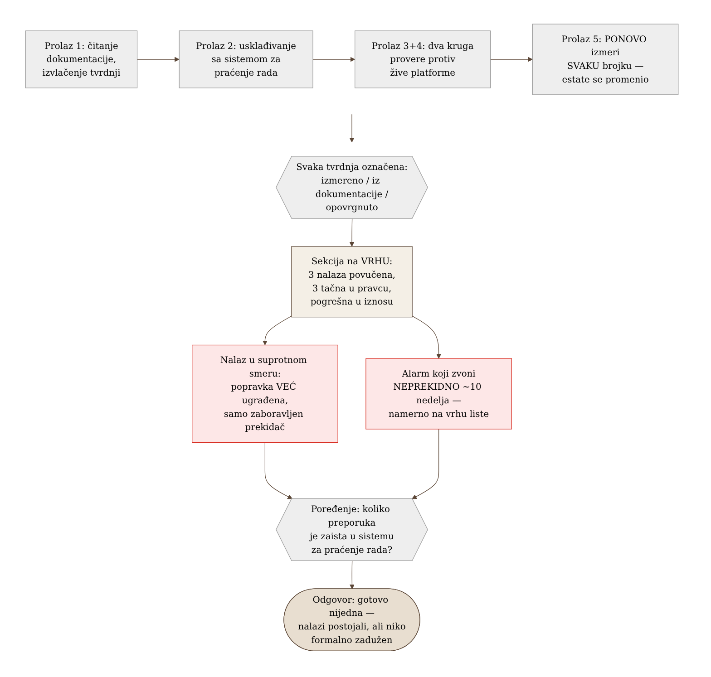

# Chapter 30 — Measuring the maturity of your own program

A pilot doesn't fly for years on the strength of one passed exam. Every few
months, no matter how many hours they've logged or how confident they feel,
they go back for a checkride — not because something went wrong, but because
a periodic check is the only reliable way to know whether their own
assessment of their skill is still accurate. The check doesn't ask "do you
remember once knowing this," it asks "do this now, in front of someone who
is measuring, and show the correct result." If a pilot has lost the habit of
night landings because they've spent months flying only by day, the check
will discover that before the pilot does — in the air, when it's too late to
learn it.

The same discipline applies to an observability program that has already
been built and is running. Does it actually work the way the documentation
claims it works? That can't be known by reading the documentation —
documentation is a record of what someone believed to be true at the moment
of writing. The only way to know is periodic, disciplined measurement
against living reality — and, harder to accept, a willingness to admit when
a past measurement was wrong.

## 30.1 The question this chapter answers

How do you periodically measure the maturity of your own observability
program, rather than simply trusting the last written record of how it
works? And what do you do when a measurement reveals that a previous
measurement was wrong — do you quietly correct the error, or do you
publicly acknowledge it, along with the reason it happened?

## 30.2 How it was done — a practical overview

### A review done in passes, not in one reading

The periodic review of the whole program was not done as a single reading
of the documentation followed by a conclusion. Instead, it was carried out
in five separate passes: first, reading the existing documentation to
extract claims; then reconciling those claims against the live state of the
work-tracking system (how many of the previously reported items were
actually closed); then two separate rounds of direct verification against
the live observability platform (alerts, data series, cost); and finally,
since only a few days had passed since the previous review, a complete
re-measurement of **every** number from the previous round, instead of
assuming it still held.

That last step turned out to be decisive. In just a few days, two entire
observability subsystems had been shipped and rolled into production —
which meant that a review relying on the previous pass would have missed a
significant part of the current state. The conclusion was clear: the rate
at which the estate was changing was faster than the rate at which the
review could keep up with it, so the only honest approach was to re-measure
everything, not merely append what was new.

### A confidence label on every claim

Every number in the final document carries an explicit label of provenance:
whether it was just measured directly against the live platform, whether it
was taken from documentation without independent verification, or whether
it was previously claimed and has since been disproven by a live
measurement. This simple but consistently applied convention solves a
problem that otherwise quietly creeps into every long-running report: a
reader without those labels cannot tell "I know this because I just
checked" apart from "I believe this because someone else wrote it down a
week ago" — and the gap in reliability between those two claims is enormous,
even when they look identical on the page.

### A section that openly admits what was wrong last time

At the very top of the document, before any new finding, sits a section
devoted exclusively to what the previous review claimed that turned out to
be incorrect — with a named cause for each error, not just a corrected
number. Three findings were retracted entirely: one claim of a complete
absence of coverage turned out to be false because the measurement had
looked at only one of two existing rule groups and generalized from it; one
claim about the number of alerts lacking a severity label was an artifact
of the wrong denominator (it had counted rules that write a data series as
well, for which a severity label makes no sense); one claim of data loss
was true at the moment it was measured, but the problem resolved itself in
a different way than the one proposed, before the recommendation was even
read.

On top of that, three further findings were **directionally correct but
wrong in magnitude** — the underlying issue was real, but the arithmetic
was off by a factor of three or more, because a cumulative counter had been
read as a monthly rate, or a point-in-time value had been cited as if it
were stable over time. The section explicitly names each of these causes
and closes with a sentence worth repeating: the very error this review
criticizes in someone else's documentation — a number carried forward as
fact without being re-measured — also showed up in its own previous pass.
Admitting one's own mistake with the same rigor used to judge someone
else's documentation is what makes this discipline credible.

### The case where the fix had already been shipped, and nobody checked

One finding deserves special mention because it runs in the opposite
direction from what you'd expect. An earlier review had recommended
rewriting the primary availability signal to draw from a source resistant
to common noise. The new review discovered that this rewrite had **already
been done**, weeks earlier — but a configuration switch that temporarily
disabled the rewrite had been left unchanged, and the comment next to it in
the code still described the old, pre-rewrite state as if it were current.
Nobody had gone back to check whether the work, once "done," was actually
turned on. The fix was a one-line configuration change — but only because
someone finally went and checked, instead of trusting that "done" and
"turned on and verified" are the same thing.

### An alert that has been ringing for ten weeks and nobody fixes it

The review flagged, as one of its ten most important items, an alert that
at the time of writing had been continuously in a firing state for **about
ten weeks**. The cause was well known and had been diagnosed several times
over: a change introducing a progress metric for one job lived only on an
unmerged branch, so every subsequent build from the main branch quietly
undid that change — the problem would get fixed, then come back, over and
over, in cycles. This is the oldest unresolved finding in the entire
review, and it was deliberately placed at the top of the list, not because
it's the most technically complex, but because ten weeks of continuous
ringing with no resolution says something about the team's discipline, not
about the difficulty of the problem.

### Measuring documentation decay as a number, not an impression

The review didn't merely claim that the documentation was becoming
unwieldy — it measured it. The two largest internal documents had grown by
roughly a third and by nearly half of their size, respectively, in just
four days. That number was used as a direct signal of a structural problem
(documents growing without bound instead of branching into smaller,
focused pieces), not as a passing remark.

### Comparing last pass's recommendations against actual tracking

The final maturity check was the simplest and the most sobering: how many
of the concrete action items from the previous review had actually been
completed as a tracked item in the work-tracking system? The answer: almost
none. The list of open and closed items was identical to the one from the
previous pass, number for number. The findings had existed — but they had
existed only inside a document that no one was formally responsible for
acting on. That's a different kind of failure from "we didn't know" — it's
"we knew, we wrote it down, and the writing didn't obligate anyone to do
anything."

### What the review praised

The review wasn't just a list of shortcomings. One pattern was singled out
as the most mature habit found across the whole estate: a team had earlier,
for one part of the system, written its own justification for why a
particular check was **not** needed — and then, months later, tested that
same self-written justification against an external best-practice
benchmark, found that it did not hold up, and added exactly the check it
had previously argued against. This willingness to revisit one's own
earlier decision against the evidence, voluntarily, without external
pressure, was rated the single most valuable finding in the whole
review — precisely because it was voluntary and recent.

{: width="92%" }

{: width="92%" }

## 30.3 Analytical section — why measuring maturity has to be a repeatable discipline

Google's SRE Book frames monitoring measurement around four golden signals
(latency, traffic, errors, saturation), but the key point of that chapter
isn't the list of signals — it's the position that an observability system
should be judged by whether it supports fast detection and diagnosis, not
by how much data it collects. Commercial maturity models (Grafana Labs and
similar) turn this into measurable dimensions — coverage, the
alert-to-incident ratio, time to detection, and time to recovery — and DORA
metrics (Google Cloud) go further and treat recovery time and change
failure rate as a direct proxy for how well the observability system
actually works, not how much telemetry exists. The point that recurs
across all of these models: maturity isn't measured by the volume of
tooling, but by whether signals reliably translate into fast, accurate
action.

For the question "is an alert that never rings a good sign," the most
influential text is Rob Ewaschuk's internal Google document, "My
Philosophy on Alerting" — the rule is explicit: "track your on-call, and
all other alerts. If an alert fires and people just say 'I looked, nothing
was wrong,' that's a strong signal to remove that alerting rule." The same
document sets a quantitative threshold too: an alert that is correct less
than 50% of the time is broken. This directly confirms a pattern from
earlier chapters in this book — an alert that never rings deserves
suspicion, not praise, until it's verified to ring correctly when it
should. The same principle, applied in reverse to an alert that rings for
ten weeks without resolution, reveals a complementary truth: continuous
ringing with no response is just as much a sign of a problem in team
discipline as a silently dead alert — only in the opposite direction.

The formal distinction between "consciously declined, with a reason" and
"not yet done" was already introduced in Chapter 27 through a risk
management framework (ISO/IEC 27005 risk acceptance as a documented act,
not silence). Here the same distinction shows up in a different form — not
as the disposition of an individual finding, but as the question of
whether the whole program is tracked at all through a system that compels
action, or merely lives in a document that gets read but not followed up
on. NIST's Plan of Action and Milestones (POA&M) model makes exactly this
distinction explicit — an item is either a formally accepted risk (which
closes the question) or an actively tracked obligation (a POA&M), never an
informal note in the text with neither of those two fates.

For the discipline of correcting one's own earlier claims, the ACM piece on
why SRE documentation has value at all emphasizes a visible owner's name
and a last-verified date on every operational document — without that,
processes fragment over time as the team grows. The same principle was
applied here to the review document itself: instead of quietly overwriting
earlier numbers, the errors were left visible, with a date and an
explanation of what corrected them — the same pattern of transparent
correction that exists in scientific publishing (COPE guidelines on
retracting claims), applied here to engineering documentation.

### Counterfactual scenario — had the review not re-measured everything

Had the new review simply appended new findings to the old list instead of
re-measuring every earlier claim, the document would still be claiming
that the primary availability signal was broken — even though it had been
fixed weeks earlier, merely switched off by one forgotten toggle. The team
would spend time solving a problem that no longer existed, while a real,
active problem (ten weeks of a continuously firing alert) would remain
buried somewhere further down the list, because a falsely "open" old
finding would still be occupying attention at the top. More precisely: the
review would be **honest about what used to be true**, but useless for
deciding what to do today — and the sole purpose of a document like this is
to be a guide for action today, not an archive of history.

Back to the pilot returning for a periodic check. A pilot who, instead of
an actual check in the air, simply read their report from the last flight
and concluded "I landed well then, so I still land well now" would in fact
know nothing about their current state. The check exists precisely because
it's the only honest answer to the question "is my own assessment of my
skill still accurate" — measuring now, not trusting a record from before.

## 30.4 Rules collected from this chapter

- Run periodic reviews in passes that include direct verification against
  the live platform, not just reading existing documentation.
- If enough time has passed since the previous review that the estate has
  changed, re-measure EVERY number — don't assume it still holds.
- Label every claim with its provenance (just measured / from
  documentation, unverified / previously claimed, now disproven) — the
  reader must know how much to trust each individual claim.
- When a previous finding is wrong, show that openly with the cause of the
  error, don't quietly overwrite the number.
- An alert that never rings deserves suspicion; an alert that rings for
  weeks with no response deserves the same suspicion in the opposite
  direction — both go at the top of the list, not in a footnote.
- Check whether last time's recommendations actually entered a system that
  compels action, or merely live in a document nobody tracks.

## 30.5 Exercise for the reader

Take the last internal report, review, or audit your team wrote more than a
month ago. Pick three concrete numbers from it and verify them right now,
against living reality. Do they still hold? If not, would anyone have
noticed had you not just checked?

---

*Sources used in the analytical section:*

- *Google SRE Book — "Monitoring Distributed Systems" (četiri zlatna signala)*
- *Grafana Labs — model zrelosti observability strategije*
- *Google Cloud — DORA / Four Keys metrike*
- *Rob Ewaschuk — "My Philosophy on Alerting"*
- *NIST okvir za upravljanje rizikom — POA&M i formalno prihvatanje rizika*
- *ACM — "Why SRE Documents Matter"*
