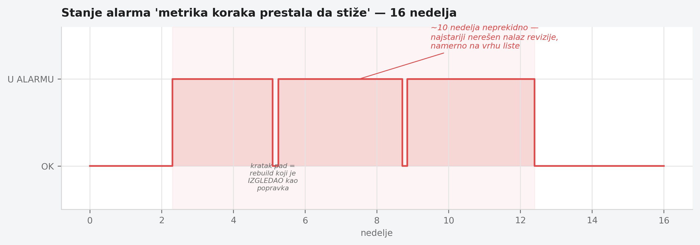

# Poglavlje 30 — Merenje zrelosti sopstvenog programa

Pilot ne leti godinama na osnovu jednog položenog ispita. Svakih nekoliko
meseci, bez obzira na to koliko sati je uleteo i koliko se oseća sigurno,
vraća se na proveru — ne zato što je nešto pošlo po zlu, nego zato što je
periodična provera jedini pouzdan način da sazna da li je njegova
procena sopstvene veštine i dalje tačna. Provera ne pita "da li se
sećaš da si nekad znao ovo", nego "uradi ovo sada, pred nekim ko meri, i
pokaži tačan rezultat". Ako je pilot izgubio naviku noćnog sletanja jer
je mesecima leteo samo danju, provera će to otkriti pre nego što otkrije
sam pilot, u vazduhu, kad je prekasno da se to nauči.

Ista disciplina važi za observability program koji je već izgrađen i
radi. Da li on zapravo radi onako kako dokumentacija tvrdi da radi? Ne
može se to znati čitanjem dokumentacije — dokumentacija je zapis onoga
što je neko verovao da je tačno u trenutku pisanja. Jedini način da se
sazna je periodično, disciplinovano merenje protiv žive stvarnosti — i,
što je teže prihvatiti, spremnost da se prizna kad je prošlo merenje bilo
pogrešno.

## 30.1 Pitanje na koje ovo poglavlje odgovara

Kako periodično meriti zrelost sopstvenog observability programa, a ne
samo verovati poslednjem zapisu o tome kako on radi? I šta raditi kad
merenje otkrije da je prethodno merenje bilo pogrešno — da li se ta
greška tiho ispravi, ili se javno prizna, sa razlogom zašto je nastala?

## 30.2 Kako je to urađeno — praktičan pregled

### Revizija u prolazima, ne u jednom čitanju

Periodična revizija celog programa nije urađena kao jedno čitanje
dokumentacije praćeno zaključkom. Umesto toga, urađena je u pet odvojenih
prolaza: prvo čitanje postojeće dokumentacije radi izvlačenja tvrdnji;
zatim usklađivanje tih tvrdnji sa živim stanjem sistema za praćenje
zadataka (koliko je od ranije prijavljenih stavki zaista zatvoreno);
zatim dva odvojena kruga direktne provere protiv žive platforme za
posmatranje (alarmi, serije podataka, trošak); i na kraju, pošto je
prošlo samo nekoliko dana od prethodne revizije, potpuno ponovno merenje
**svakog** broja iz prethodnog kruga, umesto pretpostavke da još uvek
važi.

Taj poslednji korak se pokazao presudnim. U samo nekoliko dana, dva čitava
podsistema posmatranja su isporučena i uključena u produkciju — što znači
da je revizija koja bi se oslonila na prethodni prolaz propustila
značajan deo trenutnog stanja. Procena je bila jasna: brzina kojom se
estate menja bila je veća od brzine kojom je revizija mogla da je prati,
pa je jedini pošten pristup bio ponovo izmeriti sve, ne samo dodati novo.

### Oznaka pouzdanosti uz svaku tvrdnju

Svaka brojka u finalnom dokumentu nosi eksplicitnu oznaku porekla: da li
je upravo direktno izmerena protiv žive platforme, da li je preuzeta iz
dokumentacije bez nezavisne provere, ili je prethodno tvrđena a potom
opovrgnuta živim merenjem. Ova jednostavna, ali dosledno primenjena
konvencija rešava problem koji se inače tiho uvlači u svaki dugotrajan
izveštaj: čitalac bez tih oznaka ne može da razlikuje "ovo znam jer sam
upravo proverio" od "ovo verujem jer je neko drugi tako napisao pre
nedelju dana" — a razlika u pouzdanosti između te dve tvrdnje je ogromna,
čak i kad izgledaju identično na strani.

### Sekcija koja otvoreno priznaje šta je prošli put bilo pogrešno

Na samom vrhu dokumenta, pre bilo kog novog nalaza, nalazi se sekcija
posvećena isključivo onome što je prethodna revizija tvrdila, a što se
pokazalo netačnim — sa imenovanim uzrokom svake greške, ne samo
ispravljenom brojkom. Tri nalaza su povučena u potpunosti: jedna tvrdnja
o potpunom odsustvu pokrivenosti se pokazala netačnom jer je merenje
gledalo samo jednu od dve postojeće grupe pravila i uopštilo; jedna
tvrdnja o broju alarma bez oznake ozbiljnosti bila je artefakt pogrešnog
imenioca (računala je i pravila koja upisuju seriju podataka, kojima
oznaka ozbiljnosti nema smisla); jedna tvrdnja o gubitku podataka bila je
tačna u trenutku merenja, ali se problem sam rešio na drugačiji način od
predloženog pre nego što je preporuka uopšte pročitana.

Uz to, tri dodatna nalaza su bila **u pravcu tačna, ali u iznosu
pogrešna** — trag stvaran, ali aritmetika za faktor tri ili više
promašena, jer je akumulirajući brojač pročitan kao mesečna stopa, ili je
tačkasta vrednost citirana kao da je stabilna kroz vreme. Sekcija
eksplicitno imenuje svaki od ovih uzroka i zaključuje jednom rečenicom
koja je vredna ponavljanja: greška koju ova revizija kritikuje u tuđoj
dokumentaciji — brojka prenesena kao činjenica bez ponovnog merenja —
pojavila se i u sopstvenom prethodnom prolazu. Priznanje sopstvene
greške istom strogošću kojom se sudi tuđa dokumentacija je ono što ovu
disciplinu čini verodostojnom.

### Slučaj kad je popravka već bila ugrađena, a niko nije proverio

Jedan nalaz zaslužuje poseban pomen jer ide u suprotnom smeru od
očekivanog. Ranija revizija je preporučila da se osnovni signal
dostupnosti prepravi na izvor otporan na uobičajen šum. Nova revizija je
otkrila da je ta prepravka **već bila urađena**, nedeljama ranije — ali je
jedan konfiguracioni prekidač koji je prepravku privremeno isključivao
ostao neizmenjen, i komentar pored njega u kodu i dalje je opisivao
staro, pre-prepravkino stanje kao da je trenutno. Niko se nije vratio da
proveri da li je posao, jednom "urađen", zaista i uključen. Popravka je
bila jedna linija konfiguracije — ali samo zato što je neko konačno
otišao da proveri, umesto da veruje da je "gotovo" isto što i "uključeno
i verifikovano".

### Alarm koji zvoni deset nedelja i niko to ne rešava

Revizija je istakla, kao jednu od deset najvažnijih stavki, alarm koji je
u trenutku pisanja neprekidno bio u stanju uzbune **oko deset nedelja**.
Uzrok je bio dobro poznat i nekoliko puta dijagnostikovan: promena koja
je uvodila metriku napretka za jedan zadatak živela je samo na
neusaglašenoj grani koda, pa je svaki naknadni build iz glavne grane tiho
poništavao tu promenu — problem se rešavao, pa se vraćao, iznova, u
ciklusima. Ovo je najstariji nerešen nalaz u čitavoj reviziji, i
istaknut je namerno na vrh liste, ne zato što je tehnički najsloženiji,
nego zato što deset nedelja neprekidnog zvonjenja bez rešenja govori
nešto o disciplini tima, ne o težini problema.

### Merenje raspadanja dokumentacije kao broja, ne utiska

Revizija nije samo tvrdila da dokumentacija postaje neuredna — izmerila
je to. Dva najveća interna dokumenta su porasla za otprilike trećinu,
odnosno gotovo polovinu svoje veličine u samo četiri dana. Ta brojka je
korišćena kao direktan signal strukturnog problema (dokumenti koji
rastu nekontrolisano umesto da se granaju u manje, fokusirane celine), a
ne kao uzgredna primedba.

### Kad se preporuke iz prošlog prolaza uporede sa stvarnim praćenjem

Poslednja provera zrelosti bila je najjednostavnija i najotrežnjujuća:
koliko od konkretnih akcionih stavki iz prethodne revizije je zaista
završeno kao praćena stavka u sistemu za praćenje rada? Odgovor: gotovo
nijedna. Spisak otvorenih i zatvorenih stavki bio je identičan onome iz
prethodnog prolaza, brojka po brojka. Nalazi su postojali — ali su
postojali samo unutar dokumenta za koji niko nije bio formalno
odgovoran da po njemu deluje. To je različita vrsta kvara od "nismo
znali" — to je "znali smo, zapisali smo, i zapis nije nikoga obavezao na
ništa".

### Ono što je revizija pohvalila

Revizija nije bila samo lista propusta. Jedan obrazac je izdvojen kao
najzreliji naviknuti pronađen kroz ceo estate: tim je ranije, za jedan
deo sistema, sam napisao obrazloženje zašto određena provera NIJE
potrebna — a zatim je, mesecima kasnije, to sopstveno pisano obrazloženje
testirao protiv spoljnog merila najbolje prakse, otkrio da ne izdrži
proveru, i dodao tačno onu proveru protiv koje je ranije argumentovao.
Ova spremnost da se sopstvena ranija odluka preispita protiv dokaza,
dobrovoljno, bez spoljnog pritiska, ocenjena je kao najvredniji nalaz u
čitavoj reviziji — upravo zato što je dobrovoljna i nedavna.

{: width="92%" }

{: width="92%" }

## 30.3 Analitički deo — zašto merenje zrelosti mora biti ponovljiva disciplina

Google-ov SRE Book uvodi merenje monitoringa oko četiri zlatna signala
(kašnjenje, saobraćaj, greške, zasićenje), ali ključna poenta tog
poglavlja nije lista signala — nego stav da se sistem posmatranja
ocenjuje po tome da li podržava brzo otkrivanje i dijagnozu, ne po tome
koliko podataka prikuplja. Komercijalni modeli zrelosti (Grafana Labs i
slični) ovo pretvaraju u merljive dimenzije — pokrivenost, odnos
alarm-prema-incidentu, vreme do otkrivanja i vreme do oporavka — a DORA
metrike (Google Cloud) idu dalje i tretiraju vreme oporavka i stopu
neuspešnih promena kao direktan zamenski pokazatelj za to koliko dobro
sistem posmatranja zaista radi, ne koliko telemetrije postoji. Poenta
koja se ponavlja kroz sve ove modele: zrelost se ne meri obimom alata,
nego time da li signali pouzdano prevode u brzu, tačnu akciju.

Za pitanje "da li je alarm koji nikad ne zvoni dobar znak", najuticajniji
tekst je interni Google dokument Roba Ewaschuka, "My Philosophy on
Alerting" — pravilo je eksplicitno: "prati svoje pozive na dužnost, i sve
ostale alarme. Ako se alarm oglasi i ljudi samo kažu 'pogledao sam, ništa
nije bilo u redu', to je jak signal da treba ukloniti to pravilo
alarmiranja." Isti dokument postavlja i kvantitativan prag: alarm koji je
tačan manje od 50% vremena je pokvaren. Ovo direktno potvrđuje obrazac iz
prethodnih poglavlja ove knjige — alarm koji nikad ne zvoni zaslužuje
sumnju, ne pohvalu, dok se ne proveri da li zvoni ispravno kad treba. Isti
princip, primenjen unazad na alarm koji zvoni deset nedelja bez
rešavanja, otkriva komplementarnu istinu: neprekidno zvonjenje bez
odgovora je isto toliko znak problema u disciplini tima koliko i tiho
mrtav alarm — samo u suprotnom smeru.

Formalna razlika između "svesno odbijeno sa razlogom" i "još nije
urađeno" već je uvedena u Poglavlju 27 kroz okvir upravljanja rizikom
(ISO 31000 prihvatanje rizika kao dokumentovan čin, ne tišina). Ovde se
ista razlika pojavljuje u drugom obliku — ne kao dispozicija pojedinačnog
nalaza, nego kao pitanje da li je čitav program uopšte praćen kroz
sistem koji obavezuje na akciju, ili samo živi u dokumentu koji se čita, a
ne prati. NIST-ov model plana akcija i prekretnica (POA&M) upravo pravi tu
razliku eksplicitnom — stavka je ili formalno prihvaćen rizik (zatvara
pitanje) ili aktivno praćena obaveza (POA&M), nikad neformalna napomena u
tekstu bez ijedne od te dve sudbine.

Za disciplinu ispravljanja sopstvenih ranijih tvrdnji, ACM-ov tekst o
tome zašto SRE dokumentacija uopšte ima vrednost naglašava vidljivo ime
vlasnika i datum poslednje provere na svakom operativnom dokumentu —
bez toga, procesi se vremenom fragmentiraju dok tim raste. Isti princip
se ovde primenio na sâm dokument revizije: umesto tihog prepisivanja
ranijih brojki, greške su ostavljene vidljive, sa datumom i objašnjenjem
šta ih je ispravilo — isti obrazac transparentne korekcije koji postoji u
naučnom izdavaštvu (COPE smernice za povlačenje tvrdnji), primenjen na
inženjersku dokumentaciju.

### Kontrafaktički scenario — da revizija nije ponovo merila sve

Da je nova revizija samo dodala nove nalaze na stari spisak, umesto da
ponovo izmeri svaku raniju tvrdnju, dokument bi i dalje tvrdio da je
osnovni signal dostupnosti pokvaren — iako je popravljen nedeljama
ranije, samo isključen jednim zaboravljenim prekidačem. Tim bi trošio
vreme rešavajući problem koji više ne postoji, dok bi stvaran, aktivan
problem (deset nedelja neprekidnog alarma) ostao zakopan negde niže na
listi, jer bi lažno "otvoren" stari nalaz i dalje zauzimao pažnju na vrhu.
Preciznije: revizija bi bila **iskrena o tome šta je nekad bilo tačno**,
ali beskorisna za odlučivanje o tome šta raditi danas — a jedina svrha
ovakvog dokumenta jeste da bude vodič za akciju danas, ne arhiva
istorije.

Vratimo se pilotu koji se vraća na periodičnu proveru. Pilot koji bi,
umesto stvarne provere u vazduhu, samo pročitao svoj izveštaj sa prošlog
leta i zaključio "tada sam dobro sletao, znači i dalje dobro sletam" ne bi
zapravo znao ništa o svom trenutnom stanju. Provera postoji upravo zato
što je jedini pošten odgovor na pitanje "da li je moja procena sopstvene
veštine i dalje tačna" — merenje sada, ne verovanje u zapis od ranije.

## 30.4 Skupljena pravila iz ovog poglavlja

- Radi periodičnu reviziju u prolazima koji uključuju direktnu proveru
  protiv žive platforme, ne samo čitanje postojeće dokumentacije.
- Ako je od prethodne revizije prošlo dovoljno vremena da se estate
  promenio, ponovo izmeri SVAKU brojku — ne pretpostavljaj da još važi.
- Označi svaku tvrdnju oznakom porekla (upravo izmereno / iz
  dokumentacije, neprovereno / ranije tvrđeno, sada opovrgnuto) — čitalac
  mora znati koliko da veruje svakoj pojedinačnoj tvrdnji.
- Kad je prethodni nalaz pogrešan, prikaži to otvoreno sa uzrokom greške,
  ne tiho prepiši brojku.
- Alarm koji nikad ne zvoni zaslužuje sumnju; alarm koji zvoni nedeljama
  bez odgovora zaslužuje istu sumnju u suprotnom smeru — oba idu na vrh
  liste, ne u fusnotu.
- Proveri da li su preporuke iz prošlog puta zaista ušle u sistem koji
  obavezuje na akciju, ili samo žive u dokumentu koji niko ne prati.

## 30.5 Vežba za čitaoca

Uzmi poslednji interni izveštaj, reviziju ili audit koji je tvoj tim
napisao pre više od mesec dana. Izaberi tri konkretne brojke iz njega i
proveri ih upravo sada, protiv žive stvarnosti. Da li se i dalje slažu?
Ako ne, da li bi to neko primetio da nisi upravo proverio?

---

*Izvori korišćeni u analitičkom delu:*

- *Google SRE Book — "Monitoring Distributed Systems" (četiri zlatna signala)*
- *Grafana Labs — model zrelosti observability strategije*
- *Google Cloud — DORA / Four Keys metrike*
- *Rob Ewaschuk — "My Philosophy on Alerting"*
- *NIST okvir za upravljanje rizikom — POA&M i formalno prihvatanje rizika*
- *ACM — "Why SRE Documents Matter"*
